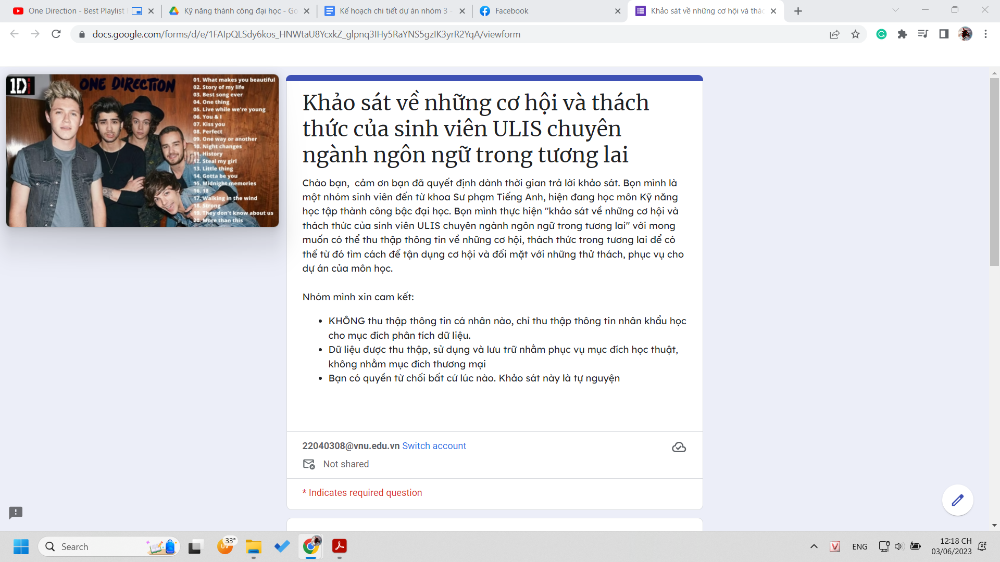
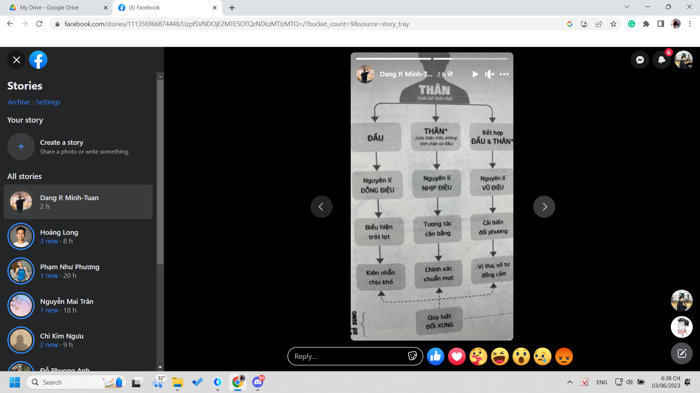

- Khảo sát
	- 
	- Nghĩ lại về những gì cần nói và nói như nào (văn phong, sắp xếp cấu trúc) và cả câu hỏi và các phần khác, nó sx là khoa học của survey và nghệ thuật hỏi nữa rùi :))
	- Và toàn bộ những cái cần nói là gì, khảo sát kiểu gì cần lấy cái nào xếp ra sao, đôi lúc nếu cần thì đổi mới thay đổi như nào
	- Chán quá thì làm nghệ thuật bằng khảo sát ra sao:))) trick người ta, gây ấn tượng bằng câu hỏi, đưa vào matrix bị hỏi, khảo vấn, nghĩ suy phản sư, tạo một vòng lặp hỏi luẩn quẩn hay gì à, hay tạo hình thức như triển lãm tranh, chiếm tâm trí người ta bằng hình ảnh
	- Rồi từ đó làm rank các khảo sát hay và sự phân tích khảo sát hiệu quả, tiêu chí chấm
	- Cách điều khiển người ta điền đúng với những gì mình muốn khai thác từ người ta nhất
	- Cái này mình modify từ cái mẫu đã cap của chị Diệp... không biết chị có ý đồ thao tác sắp đặt gì mà mình đã không thấu khi sửa lại, làm khác đi cho bớt đạo và hợp với cái của mình hơn không
- 