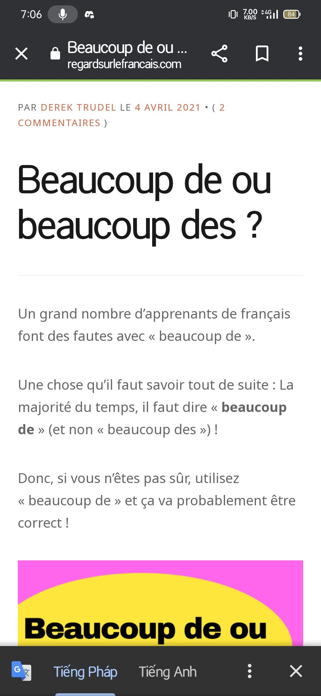

- Ngồi chẳng biết ôn gì, coi như mở vở ra xem nốt lại phần mình chưa xem là phần viết. Mọi người cứ giở sách giở vở. Chẳng hiểu giở gì. Hình như MTHien học lại từ mới. Châu Anh xem sách.
- Tôi bắt gặp mình dình beaucoup de loisirs nên mới tự hỏi. Sao không des. Thầy không sửa, nhưng mình cứ quen thói dùng collocation kiểu nhiều việc, theo cách hiểu của người gốc Pháp họ sẽ hiểu cái đó là lí, họ sẽ luận ra lí do như kiểu cái thì đi với bàn, vv còn con thì đi với sông,... Ê mà con với cái có thể coi là đực cái được không ta :)) la table et le fleuve
- Anyway tra ra được cách dùng khá hay. Cảm giác dùng ngôn ngữ bây giờ chưa quen thạo buột miệng ra thì đã thành một trò chơi ngôn ngữ: sửa lỗi ngữ pháp và cấu tạo cấu trúc, như vẽ vòng phép thật ý. Chơi với từ
- 
-
- Cách học của Phong đúng là nhớ quan sát phản tư lỗi người ta, suy ra và học cho mình
- Học vì người ta, cùng người ta vì người ta thấy có gì đó chưa hiểu cần học. Mình nhìn vào mình không thấy cần gì
- Cách người ta nghĩ sai cũng hay, tìm hiểu từ đâu, tại sao để chữa lại gốc sát đó, họ tự nối nốt hoặc mình tìm đúng chỗ hổng
- Mà mày nói thế tức mày chấp nhận cách học này? Tùy, mày có lí do động lực ngồi vào hơn người nhưng không ngồi được lâu một mình mà phải với người. Mày có thể sống với chức sắc đó
-