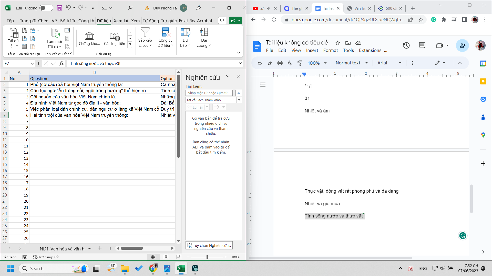

- Chụp văn bản từ google lens từ ảnh rồi chuyển lên docs, docs chuyển qua excel thế này cũng tạo cơ hội cho mình học tủ thuộc luôn và thấy kiến thức dễ vãi
	- 
- người thông minh sẽ nghĩ cách nghĩ nhanh nhưng khó, phải set up khá nhiều, của mỗi giai đoạn chứ cũng chẳng ít. Tại sự tương thích không có, phần mềm làm sẵn cũng không (chụp chữ từ ảnh dài, biết zoom ra), nhận biết, sửa chữ và sắp chữ vào đúng ô rồi tra nếu câu đó sai.