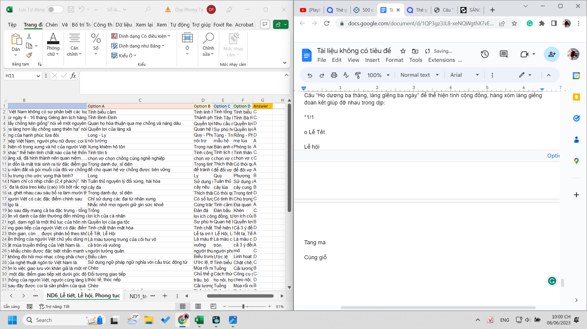

- 21:39 Mình hi sinh 2 ngày T4, T5, không phải cả ngày nhưng cũng mấy tiếng đồng hồ vì các công việc: sửa hình thức, tìm đáp án, nhập dữ liệu. Nhập dữ liệu tốn trung bình 1 phút 1 câu, chưa tính thời gian du di mỗi động tác là 1 phút. Hồi trước làm được tí đã mệt nghỉ 30 phút nên cũng tốn kha khá thời gian. Tưởng nhanh như làm 1 bài trắc nghiệm nhưng làm trắc nghiệm mà phải nghĩ thì cũng đâu có nhanh lắm đâu.
	- 21:44 mình vừa mới phát âm thành tiếng, nhận ra là ồ mình hoàn toàn có thể động tất cả các giác quan chức năng của cơ thể dù cơ thể này không quen lối học kiểu đó, nhưng dù đó không phải learning style mình hay dùng (-> rồi có khi sẽ quyết định working style, answering style, thinking style,... mỗi người) thì có khi nó cũng bổ gì đó chứ, đâu phải không thấy giá trị là nó không có giá trị (đâu xác định đơn giản vậy?)
- 
	- làm mấy cái này nên có matrix, khi nào thì chỉ có chép, rồi nên đan xen tra câu sai cho đỡ chán không, rồi khi cuối mới điền nhanh các đáp án
	- sai ít thì tiện không phải tra, nhưng không học nhớ được, mà phải nghĩ xem nên học kiểu nhớ để thi đó không
	- nhưng một lần nhớ còn đỡ hơn không?, cảm giác vào đầu, có thể ta nghĩ và liên hệ phát triển, nhưng cũng có thể chỉ là sự tự huyễn hoặc ta đã tiếp thu gì đó, vì ai biết nó có ích thật sự không
		- ít ra thì sai ta mới tra mới hiểu bản chất mới kiểm chứng lại tư duy lúc chọn
			- ghi lại được cái đó hoặc tự tra, để ta đồng nhất tư duy ta với tư duy/bản chất cái sinh ra đáp án đó (do người làm đáp án, viết sách hoặc do thực tế) để sau này không cần học mà dùng vốn cũ cũng sinh ra được?
	- rồi về khâu xuất file sang form hay bất cứ cái gì hay làm sao cóp cho nhanh, không phải cứ làm nhiều là nhanh, ta sẽ chỉ tối ưu được nó trong khoảng công cụ lao động nào đó mà thôi, muốn tối ưu hơn nữa ta chỉ làm có khi 10%, 10 lần, 90 lần khác đan xen hoặc để sau cùng nhưng chắc đan xen kiểu thử sai thử sai, ta nghĩ cách phát triển, dành cực nhiều và tất nhiên nó cực tốn thời gian vào tìm tòi ra thứ công cụ mới tiện lợi hơn.