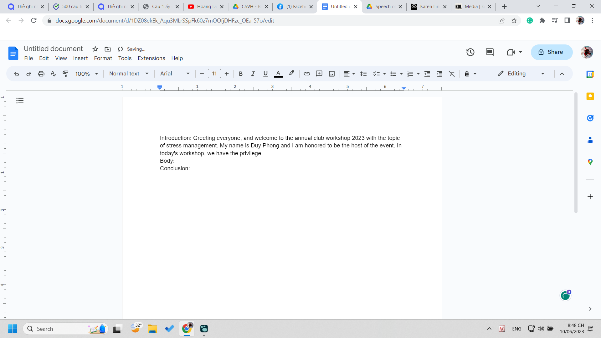

- 
	- thật stupid, introduction speech mà chỉ để introduce khách? nó chỉ là một phần của việc giới thiệu sự kiện thôi ý. Cái quan trọng vẫn nên là sự kiện chứ không phải chỉ đến để nghe mọt người. Và để làm tốt nên có case, content tốt, từ đó profile khách dù ta chế hay không mới tốt được
	- nhưng môn này mà, cái ta học chỉ là kỹ năng speech chứ không phải organise và đóng vai trò làm MC
	- và mình phải cố viết dài cho đủ thời lượng nói chứ chẳng phải thông tin nào cũng sẽ bù đắp tổng hợp thành một cái bức tranh để thuyết phục người ta, phần nào cover cái gì tác động cái gì, còn thực tế nó tác động ra sao thì cũng khó nắm rõ lúc này