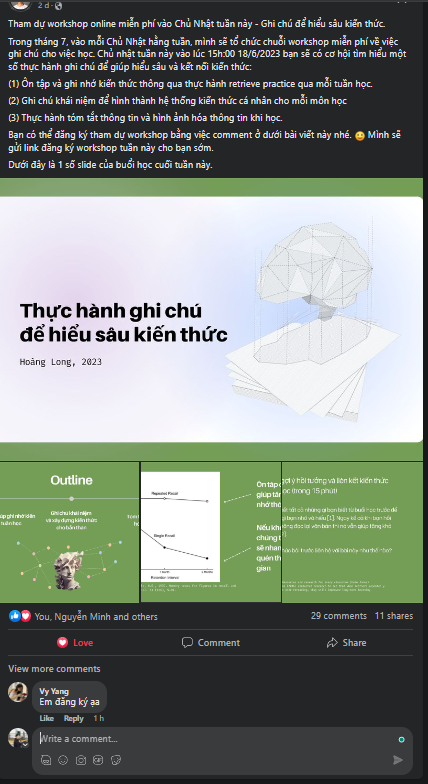

- 18:00 note về cách phân thứ tự, mình chợt để ý có những mảng to không thể lồng vào nhau như ULISS và Le Français. Tất cả là tại nội tại của nó lớn, không hoàn toàn bị bao phủ bởi cái kia và dù có liên quan một chút, nếu đưa vào để định nghĩa phân loại thì sẽ bị lẫn mất. Rốt cuộc chẳng có cách nào thể hiện cả, chẳng hạn [[Le Nouveau Taxi 1]] dù có được dạy trong [[Le Français/madame Thu]] thì cũng chỉ là mượn sách chứ chẳng hoàn toàn làm sách chữa sách. Nếu mình muốn viết đáp án sách, những gì mình nghĩ về sách ở từng chương từng bài thì nên cho vào các phần trong page Le Nouveau. Chứ một bài giảng sẽ rộng hơn, có nhiều thứ ngoài sách nữa, đặc biệt là với cô Thu. Nhưng nếu chia ra hai mảng đó, bằng việc để Le Nouveau Taxi 1 sau cùng thì thực ra cũng được, nó cũng có khác gì phần giảng ngoài và phần sách đâu, nhưng tách thế ra cũng chẳng để làm gì. Và để thế đôi khi có hơi sợ lặp nhưng nghĩ lại không sao đâu. Lặp ý tôi là tôi không muốn có sự phân chia tách biệt đối với những mảng lớn như ULISS, CVAS chẳng hạn, nếu có thì nó là phạm trù hoàn toàn khác, chứ mấy cái phần nhỏ, page con thì tách nhau là bình thường, chẳng hạn trong một buổi học sẽ có bài giảng lý thuyết, chuyện cô kể, lời mình nghĩ hoàn toàn có thể tách riêng dù không cần. Nhưng mình chợt để ý là page con cũng chỉ dài tên thôi chứ đâu có vấn đề gì. Nó đâu phải là mày để le nouveau ở cuối là cái page le nouveau nó không to được nữa đâu, như khi mày tra presentation nó sẽ hiện tất cả đường dẫn rồi mới đến presentation của public speaking chứ đâu phải tự nhiên nó ra cái page presentation của nợ nào đó chứa mọi link present như thể hashtag. Còn nếu mày thích lập page đó cũng được, nó sẽ thành master study on presentation. Ừ, mình ngáo chứ mọi thứ vẫn khoa học mà, nhưng phải ghi lại, không phải sự ngu mà sự tính toán của mình để biết còn tra lại chứ nếu nghĩ rồi quên, dùng quen không chê than gì thì lần sau không biết tiếp tục từ đâu, thấy lỗi, lỗ hổng, mâu thuẫn mới sửa? mày hoàn toàn nhìn trước được mâu thuẫn mà. còn cái vấn đề khác đáng sợ hơn là đôi khi nó hệ thống quá mà mày quên, không có cách nhìn cả hệ thống thì đấy rồi chỉ mù tịt mà dùng, quên một số lí do mình cài đặt thế này thế kia, dùng chỉ một tí mà trầm trồ là nhiều, đôi khi dùng sai cả mục đích như các kênh ở MỞ hồi xưa? các kênh đó sai mục đích cũng được vì nó hiện lên theo nhu cầu chứ không phải sự đủ đầy như hệ thống kiến thức này (vì với kiến thức thông tin, tôi tin cái gì cũng sẽ bị lấp bởi data - mấy mảng được chia cực logic, chỉ là sớm hay muộn thôi)
- 21:58 cách quảng cáo của anh Long có vẻ phát triển, chứ tôi mở workshop nội bộ lớp thì ai tham gia?
	- 