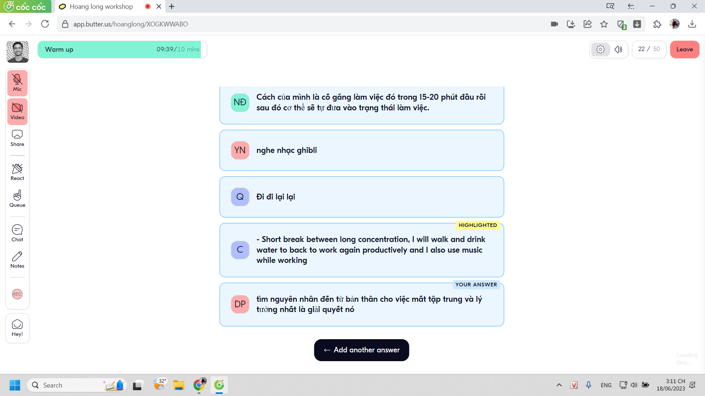
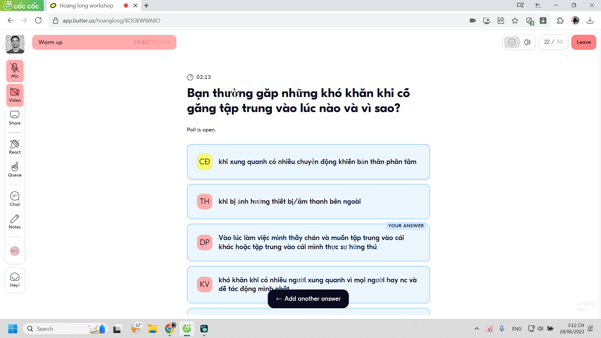
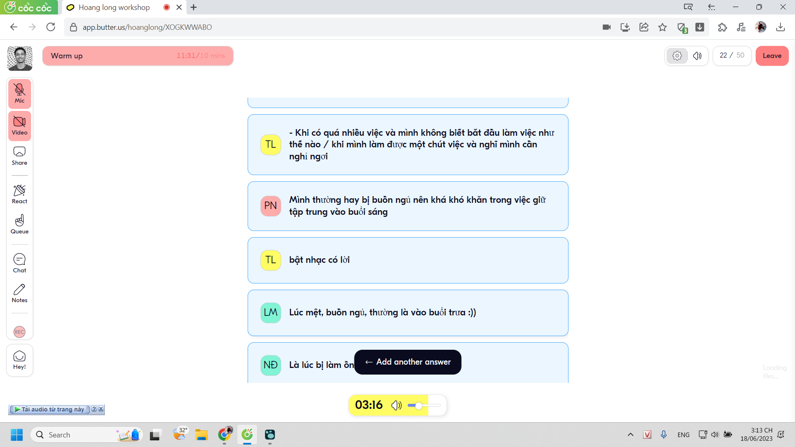

- mình thực ra muốn nói chuyện bình thường hơn là kiểu học nói một chiều một mình như dùng app
	- 
- học như kiểu có cô Thu AI ý
-
- workshop anh Long
	- {:height 429, :width 748}
	- đây là bạn làm gì để không mất tập trung
	- {:height 2, :width 778}
	- 
	- tuy mình thích stand out nhưng đúng là mình stand out thật, mình có thể tập trung cực kì bất cứ đâu bất cứ trường hợp nào nếu có động lực. Sự mất tập trung của mình đồng nhất với việc mất tập trung của cảm xúc (cảm xúc có thể bị ảnh hưởng bởi yếu tố vật chất như thể trạng)