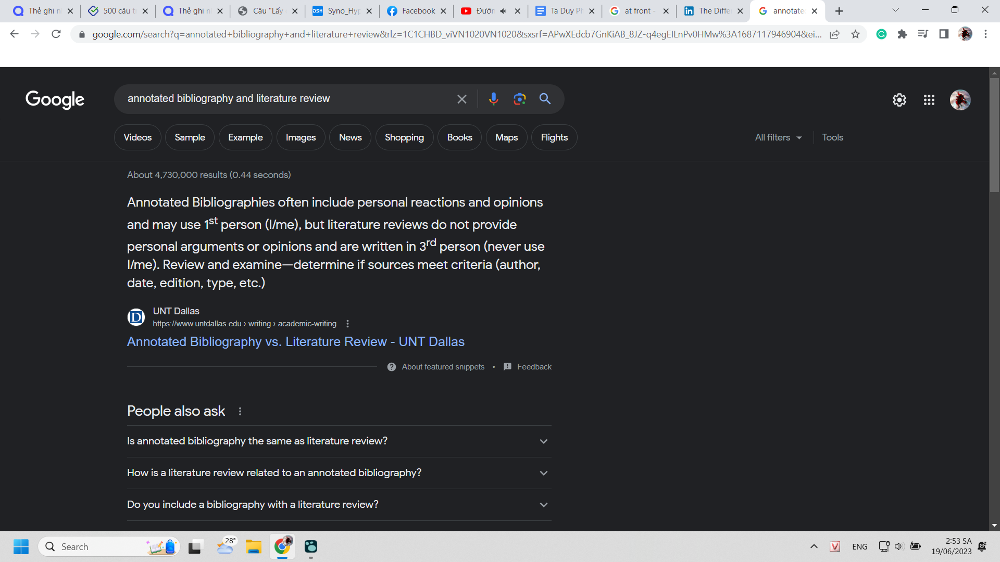
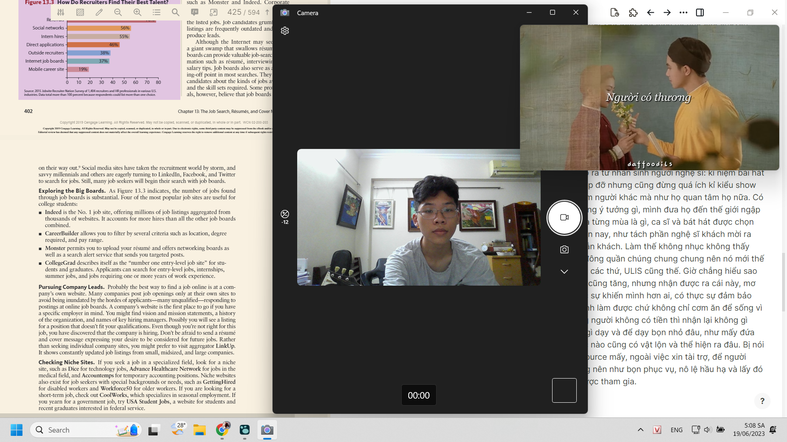

- 3:00 Tổng hợp lại tiến trình xử lý và truy cập data phòng khi mình quên hoặc chưa hình dung được đủ vào lần trước (không thì thêm data để đối chiếu nếu lần nghĩ này có thông minh hay ngu hơn, ta maybe biết ta thiếu gì trong việc để ý nên mới không suy ra được? thực ra cũng khó, thôi dù sao chỉ tốn có tí thời gian)
	- mình nhận ra phải viết vì khi mình copy full đoạn rồi dần phân tách data ra (đôi khi là đọc, chọn lọc để copy vào và modify - ừ cách làm cũng quan trọng vì cách làm bị định đoạt bởi đích hoặc tùy, cái nào dễ thì làm kiểu cảm giác ngu ngu như copy cả đoạn rồi xử lí một thể cũng được, đỡ tốn time copy từng cái nhưng cũng ngần đó time đọc và có lẽ còn khó chịu hơn về cảm xúc) thì thấy cái cách viết để dẫn cảm xúc, chứ chẳng có tí giá trị thông tin gì ngoài là "một ví dụ về dẫn dắt" - ừ data còn được xử lí ở dạng tiềm ẩn kiểu đó, tức là hình thức (không nên hiểu hình thức ở đây là mấy cái hình thức trình bày,... vì nó như xương sống của data, là cách trình bày data, không phải chữ hiện ra, chữ hiện ra hóa ra là data còn cái trừu tượng đằng sau quyết định tâm lý, cách tiếp nhận cũng chính là hình thức và là hình thức quan trọng nhất) và cơ chế của hình thức (cách mấy cái hình thức ở dạng cơ chế kia hoạt động)
		- ((648f5a63-2790-4db1-bc52-03bbdd8f2957))
		- thì mình phải trình bày lại, bỏ một số từ thừa (cách bỏ có khác mấy kiểu chọn lọc từ trong news?) nhưng nói chung mình viết để tổng hợp thông tin chứ không phải
			- nhưng vẫn chưa có cách để nhớ sau khi tổng hợp hợp lí. đọc lại chắc chắn sẽ nhớ một vài liên kết trong đầu, vẫn hiểu nhưng để người ta nói một ý, mình biết nó ở đâu, nhớ ra cái mô hình như kiểu graph logseq thì chưa
			- mình chưa áp được cái não thứ hai vào việc ứng dụng thực tế ngoài việc tra thử xem có thông tin nào tồn tại không
				- nhưng những gì mình đọc và lưu còn ít quá nên chưa dùng được tốt, phải dùng đúng ngành chứ không tra đại, tra kiểu muốn trả lời câu hỏi liên ngành, câu hỏi cực mở, cực vĩ mô mơ hồ như của trẻ con vẫn khó
	- Full text: raw data
		- à khi nói đến raw data còn một loại raw nữa là raw information
			- thôi thống nhất khái niệm với thế giới đi cho chuẩn, thế tức có data được chuyển hóa nên từ dữ liệu thực tế. Tức ta phá tan thực tế để đào sâu vào nó, bóc tách dần nó
				- 
		- sau khi được chọn lọc nó thành information và được chuyển hóa thành kiến thức của một người, một hệ thống. Tức ta đưa nó về thực tiễn, áp cho nó một cái cơ chế, sự biến tấu để sử dụng cho hoàn cảnh khác
		- điều ấy tương tự khi xử lý data mà data là những dữ liệu đã được xử lý thành thông tin, nó chỉ thiếu sự tự động hóa theo từng hoàn cảnh từng người từng nơi nữa thôi. (ừ nhưng mình cảm giác knowledge nó không chỉ là thế mà vẫn nằm mơ hồ - chứ không nằm kiểu chia đôi, ở khoảng thông tin hóa thành bài giảng trong mô hình: thông tin - thông tin hóa thành bài giảng - bài giảng hóa thành hành động thực tiễn, vì ở đoạn thông tin hóa thành bài giảng, thành sách nào đó là nó đã mang định hướng để người ta làm này làm kia rồi (như cuốn business communication) chứ chẳng phải còn sắp xếp kiểu con người làm thế này để kiếm việc, họ sinh hoạt thế kia,.... với raw data sẽ là bức ảnh hay bất cứ công cụ gì miêu tả một cách vô ngôn, hoặc bị đóng ở cái khung hiện thực chứ không phải khuôn con người, vì cho cùng data, infor hay knowlegde cũng đều là phạm trù của con người, cho con người và chỉ con người sử dụng được)
		- tất nhiên infor người này có thể là data người kia (xét về mức độ sắp xếp, khái quát hóa) hoặc theo mục đích hóa thì knowledge một người để làm gì đó cũng chỉ như data với người khác
	- với mình ở logseq, văn bản gốc để đọc đầy đủ và hiểu ý là pdf
	- annotated là đã highlight ghi chú, chất vấn các thứ
		- sẽ có một giai đoạn tất cả câu hỏi băn khoăn, thông tin bổ sung được trả lời, được ép phẳng vào mặt note và hóa thành information
	- information này cho máy access dễ, cũng có thể áp dụng kiểu annotation cho con người có thể đọc và giao tiếp với máy, bằng ngôn ngữ máy chứ ngôn ngữ đó có kiểu chữ đâu mà toàn số liệu gì đó, mình chỉ cần một số thông tin để biết dòng này dòng kia nói gì (nếu lệnh và dữ liệu đúng) và tìm cái số liệu mình cần, mà rất thường cái số liệu đó là cái con người cần chứ không phải mấy cái dữ liệu khác: link pdf, date,...
	- và cuối cùng từ infor đấy có thể sinh ra 1000 bản knowledge với các cách sắp xếp khác nhau, nhưng infor cũng chỉ có thế, cách sắp xếp tức hệ thống, cấu trúc cũng có thể được khái quát lại thành một số lượng nhất định, data cũng tương tự là một dạng knowlegde thực tiễn của tự nhiên nên có thể hiểu là một bức tranh hiện thực, hoặc vô vàn các dữ liệu đan nhau, chỉ có infor là ít nhất và cố định ở (dạng tách rời, không phải ở dạng tách/không tách đồng thời ở hiện thực - như con mèo Schrödinger nhỉ :))) )
	- thì logseq vẫn trữ infor
	- synology trữ data raw với sự liên kết với logseq vì để xem annotated
		- ồ check lại từ vì mình viết thiếu chữ a: annoted
		  collapsed:: true
			- thì ra cái này hay
			- 
			- cũng là một gợi dẫn cho những gì mình làm, mình sẽ viết mấy cái đấy sau khi tiếp cận, sở hữu data của thế giới
			- 
	- notion hoặc obsidian (theo anh Long bảo để viết bài dài) sẽ dành cho knowlegde, viết sách,...
		- nhưng đôi khi có một số dạng data đặc biệt mình chưa biết tách hay xử lí kiểu gì, chuyển thành lời kiểu gì nên cứ vứt lên notion lộn xộn và tổng hợp sau (về phim, về Chu, về nghệ thuật - một loại thông tin phức tạp bởi cảm nhận người xem và sự vặn xoắn hiện thực - tức sáng tạo, của nó)
	- còn một dạng nữa là chatpdf, kiểu vậy, thực ra nó cũng nằm đâu đó trong cái hệ thống kia của mình (mỗi tội việc nó xử lí data đến độ trả lời được câu hỏi vừa giống AI và search engine, hình như còn tự bổ sung thông tin từ đâu đó để giải thích, nhưng mình không tin nó hiểu được gì mới như kiểu vỡ lẽ bằng việc tiếp nhận được thông tin mới, hay thông minh ra, xử lí được nhiều vấn đề và áp được kiến thức hardcore từ nơi này ra nơi kia - à ừ vì ngôn ngữ con người đôi khi con người đọc còn thấy khó hiểu, mơ hồ không biết đề cập miêu tả theo dạng nào, nên hình dung như nào), hệ thống mình vừa kiểu chatpdf nhưng đa nguồn, nhưng không chỉ search như search engine google mà là siêu máy tính, cũng chẳng phải kiểu AI generate cái gì đó mới hay trả lời mấy cái cũ một cách thiếu sót
		- tự nó trả lời và có khả năng khảo sát, phân tích và test thực tại - tức thí nghiệm hoặc bất kì phương pháp nào cần làm của khoa học để đưa ra giải pháp, để tự lấp đầy thông tin để đưa được cho người đọc thì chính nó sẽ biết sáng tạo đúng cách luôn chứ chẳng phải chỉ sản sinh ra cái mới đâu
		- ồ một cái máy biết làm khoa học :))
- tất nhiên còn một thứ quan trọng nữa là mức độ khó hiểu của kiến thức, đòi liên kết thật nhiều kiến thức để con người đọc bình thường như mình, hoặc trình mình với max khả năng hiểu nhưng 0 background knowledge có thể tự liên kết và hiểu, và được máy xử lí thì nó sẽ thành một hệ thống tri thức càng chắc chắn chính xác chứ không phải đầy mâu thuẫn và có các thông tin bị vỡ vụn tách rời không liên kết được (nên chỉ là chưa liên kết được thôi)
-
- 03:59 sau khi đánh xong game undecember, lười học quá dù có bao thứ phải làm, mà có phải 6 giờ dậy đâu. 9 giờ mới phải đi mà, ừ đấy, 5 tiếng, nhưng thực bao tiếng học, dù cũng thử học xong hết rồi chơi hay chơi xong hết rồi học thì mọi thứ đều chỉ vỏn vẹn một sự trống rỗng đang tìm kiếm thứ nào đó ý nghĩa mặn mà để lấp đầy
- nghe lại bài chuyến xe của andiez vẫn thấy lại nhớ Mthao, với kiểu nếu sau này con mình hỏi mình về cuộc tình đó, thì mình sẽ kể nó đã mong manh, trong sự mong manh đó có mộng mơ mơ hồ nhưng nó mảnh mai tựa màn sương vậy, vừa đáng yêu kiểu nhẹ nhàng, vừa đẹp, vừa đau. nó như câu chuyện một, hai người đã lỡ chứ cũng chẳng quá đắng cay xót xa như truyện makoto, dù có thêm tí lãng mạn hóa để những cảm xúc thật mãnh liệt. vì dù sao cũng đẹp, và cũng từng rất mãnh liệt, chỉ là nhìn lại như thể mình nhìn vào cánh cửa thiên đàng, thấy một đám thiên không giữa rừng xanh khiến ta muốn nâng niu bao bọc
- và mình nhận ra mình đã biết cách nhớ tên một số người hát và đặc trưng của họ nhiều hơn, mình vẫn giữ ý tưởng làm công ty giải trí. Mình muốn tổ chức show cho chính người hát show, cho cả chính người làm show, cho người thân bạn bè một nhóm nhỏ, dù là khách mời, tạo sự gắn kết như thể không chỉ thuê mà thực sự là mời, hay tự chúng ta lên biểu diễn. Ngày nay show, đúng là có mùi có vị có chủ đề phong phú phức tạp hơn xưa, song nghệ thuật vẫn vị nhân sinh. Là một người thưởng nghệ thuật, tôi thấy thế cũng được nhưng không phải cái mình ưa. Đúng là của mình nói là vị nghệ thuật thì không hẳn đúng, vì nó vẫn vị nhân sinh, quan trọng nhân sinh nào. Nhân sinh - nghệ thuật của người nghệ sĩ, của kẻ thưởng nghệ thuật thưởng thức cái nghệ thuật tạo ra từ nhân sinh người nghệ sĩ: kỉ niệm bài hát của vũ cát tường, kỉ niệm bao tuổi, do ai tổ chức hoặc giúp đỡ nhưng cũng đừng quá ích kỉ kiểu show riêng, tự tôi muốn tạo show tôi. Mình muốn được quan tâm người khác mà như họ quan tâm họ nữa. Có phải không được đâu, đặc biệt với những người đang không ý tưởng gì, mình đưa họ đến thế giới ngập tràn sự ý nghĩa. Hoặc show, như kiểu sparkling thì ý nghĩa từng mùa là gì, ca sĩ và bát hát được chọn cũng tương tự, đan xen chứ không kiểu mô hình show hiện nay, như tách phần nghệ sĩ khách mời ra riêng, đôi khi như thể một thứ sản phẩm, hàng hóa câu dẫn khách. Làm thế không nhục không thấy nhược tiểu à. Phục vụ một lớp người, hoặc phục vụ đám đông quần chúng chung chung nên nó mới thế đấy? Chu nên ra phong cách Chu ở cách đạo diễn bài hát các thứ, ULIS cũng thế. Giờ chẳng hiểu sao tư duy bọn nó cũng cải thiện, vật chất để làm nghệ thuật cũng tăng, nhưng nhận được ra cái này, mơ được cái này, định làm cái này và dù làm được thì có thực sự khiến mình hơn ai, có thực sự đảm bảo mình cơm ăn cho cảm xúc - sự tự hão mình là số 1 chỉ mình làm được chứ không chỉ cơm ăn để sống vì nếu được thì tốt, không thì mình cũng biết phục vụ những người không có tiền thì nhận lại không gì ngoài tình cảm mà. Cũng chẳng biết, cảm giác chẳng có gì dạy và để dạy bọn nhỏ đâu, như mấy đứa Cteam có bao giờ than về tổ chức, hay bất kì ban tổ chức nào cũng có vật lộn và thể hiện ra đâu. Bị nói thì nhận, cùng lắm cãi chứ chưa bao giờ có tính mở, outsource mấy, ngoài việc xin tài trợ, để người tham gia, khách mời cũng là đồng tổ chức. Tổ chức không nên như bọn phục vụ, nô lệ hầu hạ và lấy đó làm sang ở thế kỉ 21 mà nó nên là một bữa tiệc ai cũng được tham gia.
- 05:08 nghe mấy bài hát đến mòn cả tai đủ mọi loại giọng, cũng hát theo cả rồi (tức nghe cả lời, tưởng tượng) song trong lúc nghỉ giãn giờ theo giờ cảm xúc, mình muốn làm gì đó đổi gió, có hai việc là chơi với xem phim tính ra cũng nhạt nhòa, chán và tốn thời gian
	- nên mình lấy đàn ra chơi, vì mình chợt chú ý đến nhịp, và đó là nhịp đàn
	- 
	- trước đấy cũng phải dành chục phút lau phủi bụi, định đánh xong rồi hẵng dọn dẹp nhưng thôi không làm thì bao giờ làm, thương nó đi, mua mới dễ thôi nhưng tiền đâu ra mà mua mới nếu để hỏng
		- mà cách đây mấy tháng mày thích lau dọn lắm mà, ừ làm mấy việc lao động, đồng áng chỉ vui dễ và thích khi lòng bận ít việc và ta làm thế giải trí. để đôi khi ta bị cuốn theo quá, tư duy dọn dẹp luôn chứ không chỉ làm chân tay thì cũng không sao, chứ không thì cái mình cần và vẫn luôn dọn là cái cảm xúc hỗn độn và tâm trí bộn bề những thứ tiêu cực, không, đúng hơn là chán cần phải thải bỏ. chứ tiêu cực của cảm xúc cũng viết được thành văn thì ta đóng hộp kiểu này lưu lại
	- mà giờ này cũng ngày mới với mọi người, hợp để đàn hát vui nhộn tí, còn nhịp giờ của cảm xúc thì có thể là lúc phiêu nhất, chán làm và chán chơi nhất. Có thể là 12 giờ đêm sau khi chơi cả ngày, dậy làm một tí hoặc nhiều
	- sau này dù ít chơi, đi du học cũng phải mang cái này
- 05:30 chán đàn rồi nhảy hoặc xem nhảy
	- 