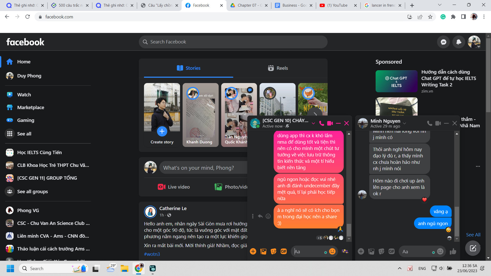

- 2 điều rất đáng quý ngày hôm nay được chụp lại ở chat này
	- 
	- về vấn đề chơi undecember bằng tiếng Pháp. Tuy đã không dành thời gian tìm hiểu bằng tiếng Anh rồi thì đọc chiêu không hiểu gì cũng sẽ chỉ khiến mọi thứ tệ hơn chút thôi
	- ngược lại quen mặt chữ và có thói quen thái độ nói tiếng Pháp, đọc phát âm luôn. Tiếp xúc nhiều hơn, mọi đường, dù không thể coi đây là đường chính
	- vì tính ra vẫn là chơi? và đọc lướt qua từ mới như thế, kể cả có nghe thoại bằng tiếng anh, băn khoăn và tra vài từ, may ra nhớ được, không chủ động utiliser nữa (dù chán, không chán thì là thấy luôn example của người ta) thì liệu có đáng tự hào coi là một cách học tiếng Pháp như xưa mày chơi genshin học tiếng Anh?
- 19:49 nghe bài này bản Việt hóa phát, tra gốc ở tiếng Việt, thấy không nổi lắm. Lạ, bài thế này mà không nổi, xong nó phèn. Dù nó chuyển thể dịch. Xong mới để ý thấy có bản tiếng Trung, ồ nó là bài hát bên trung, xong nghe điệp khúc nhận ta ngay. Đấy, cái khiến tôi tò mò là điều gì tạo nên cái hay trong một bài hát hay, sao con người ta biết đó là bài hát hay, ai cũng thích, nó hay khách quan hay chỉ hay với con người (do tâm trí ta nhận định). Và bài hát đó hợp với tiếng trung với cái kiểu từng âm tiết của nó đứt vỡ hơn tiếng việt có âm đuôi tròn âm lắm.