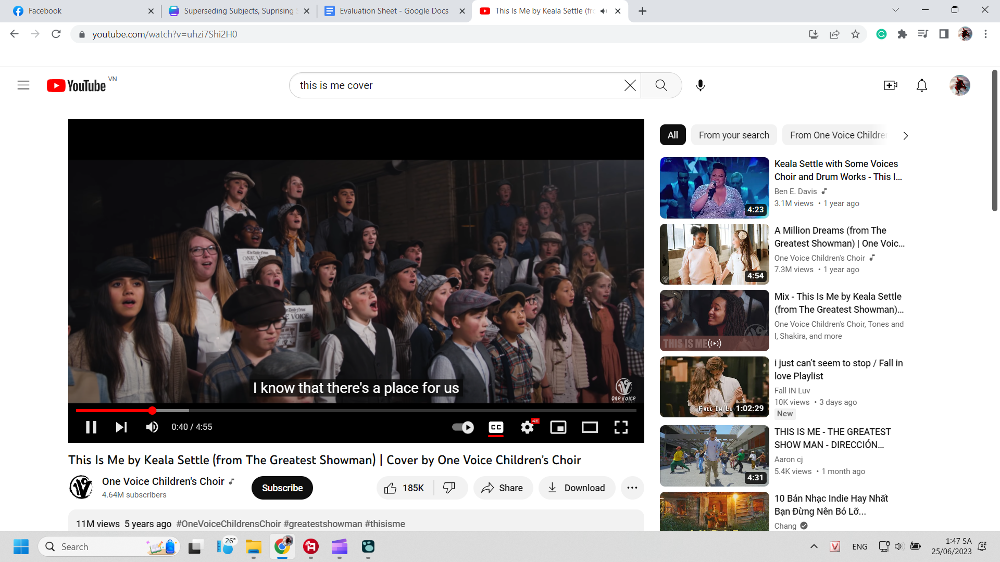
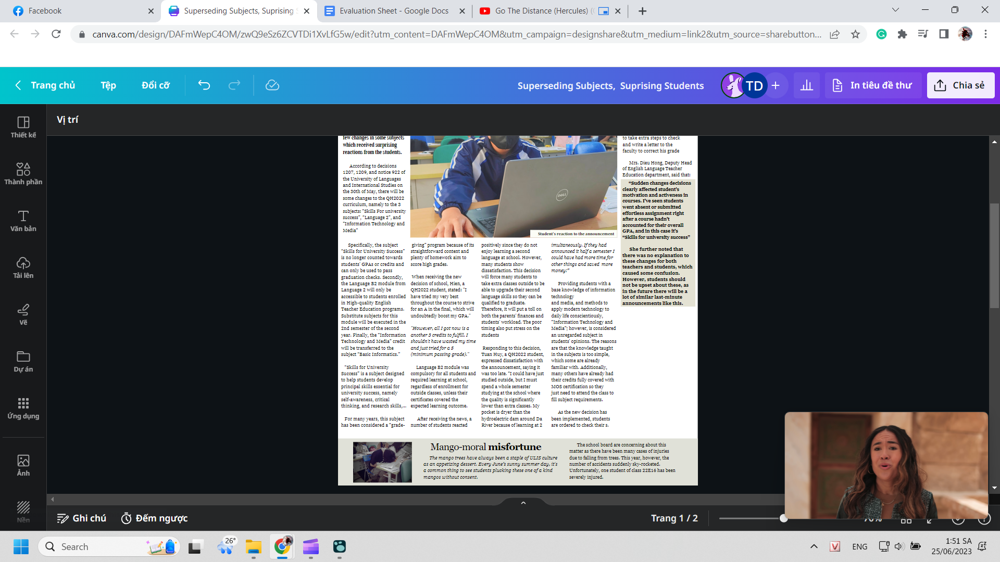
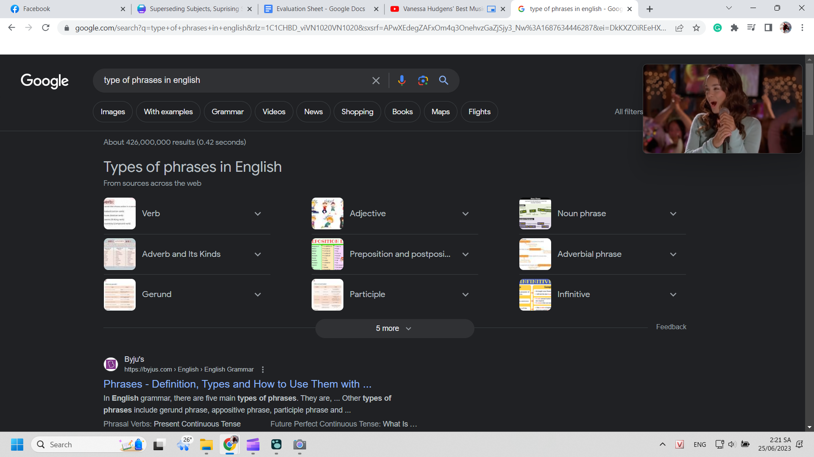
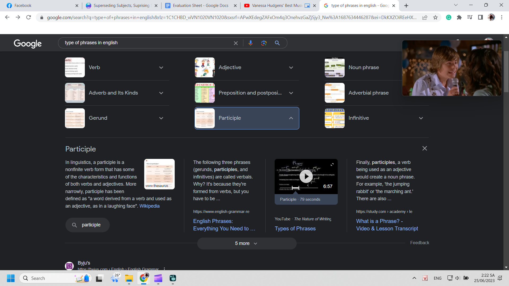
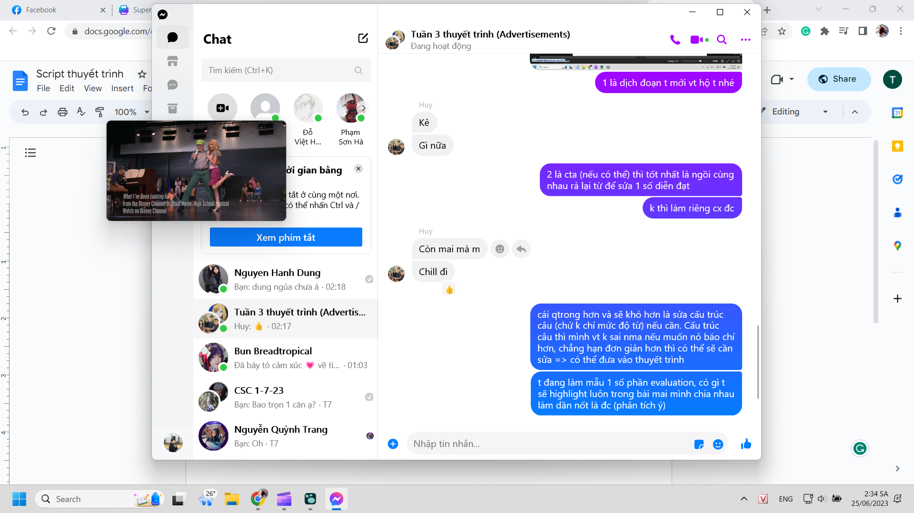
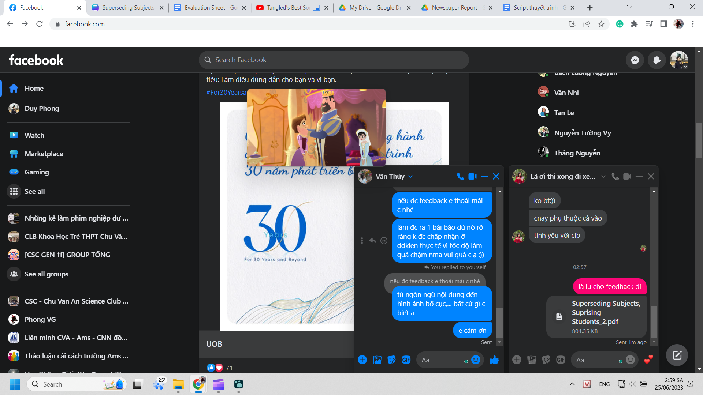

- làm việc ca 2. Mai còn phải tập trung ôn Public Speaking. Bỏ vẽ tuần nữa vậy. Rồi mình sẽ dồn hết sức cho vẽ và điện ảnh. Xem composition, think about it, bình và có khi sáng tạo về ý tưởng cho nó rồi tìm xem áp vào phim của mình như nào
	- 
	- chán xem choreo rồi, xem nhiều thì nghe cũng là một cái hay, giá trị của video có rất nhiều thứ. từ nhạc, hình, tốc độ, lời,...
- video này cũng đa giọng và cũng đầu tư hình ảnh, diễn, thợ quay
- Mình lại đam mê làm ra một sản phẩm đỉnh và thúc bọn nó như tư bản rồi.
- nhưng học được mới cũng nhiều, tuy chưa đủ gì, và cái đáng nên học nhất là quy trình cơ bản, rồi quy trình một người thì mình sẽ làm sao, quy trình outsource thì mình sẽ làm sao. (chứ bọn mình mãi mới đẻ ra một bài chậm vl)
	- 5 W và 6 H cũng không phải phương pháp logic hay chrono lắm, mình cũng đang nghĩ xem còn gì để khai thác, mở rộng, không thì xử lí trường hợp này như nào
		- 
		- Nên viết thêm vì nó cũng hơi chưa đủ lắng kết, có lẽ cần có summary, tìm cách nhấn lời học sinh vì nó chủ đề chính
- còn về bài của mình... còn việc sửa từ sửa câu, có thể đọc evaluation làm hướng dẫn rồi từ đó sửa hoặc cứ sửa với khả năng tư duy giỏi gần như 100% giống và thậm chí có cái còn hơn evaluation nữa thì nói làm gì, carry bọn nó ở cả hai vẫn đề đó mới khổ.
- mình có thể link mẫu cái yếu tố nào phần nào tương ứng cái nào trong evaluation sheet, hiện giờ có phiên bản tệ hơn chỉ là từ chưa academic đủ chẳng hạn, thì sửa từ thôi, nhưng nhỡ may sửa cả câu nữa hay nó sinh thêm vấn đề gì nữa thì nó phá cấu trúc bài evaluation mất.
- => có những thứ phải kiểm soát ở ngoài, tư duy riêng rồi đưa chỉ thị, có những thứ cần điều phối, hai công việc đạo diễn khác hẳn nhau đấy.
- bố cục hay vl
	- 
		- tuy ấn vào thì thông tin không giá trị lắm để dễ nhận dạng phân biệt
		- 
- Mình nhận ra một cách thuyết trình rất hay và rất chuẩn là có thể không đi theo mạch evaluation tức bổ ngang ra thành các yếu tố mà bổ dọc theo chiều đọc, chiều phân tích của mọi người. Nghe thuyết trình họ sẽ hiểu tốt hơn và nắm được những yếu tố khá chính, xong cuối cùng mình summary tổng hợp lại và quan trọng là đặt nó liên kết lại với nhau là được (các yếu tố đó cùng xuất hiện ở tiêu đề chẳng hạn, thực chất đã giúp tiêu đề gây chú ý như nào, và khi nó là nhiều yếu tố nằm trong một sản phẩm, thì các yếu tố và các phần đó tương tự cũng phụ nhau làm nên một bài viết đỉnh cấp)
	- và mình không phải đi lặp đi lặp lại, đọc đi đọc lại từ đầu sau mỗi lần qua một mảng phân tích mới để cho chắc không bỏ thiếu gì, cái đó nhiều người mới làm được, còn việc mình đang làm một mình lúc này thì làm thế không thể, mình làm tốt nhất và chỉ nên làm là kiểu hơi brainstorming các ý để viết vào và vứt cho bọn nó viết vào hoặc từ đó nghĩ thêm thôi
		- 
		- hạn chế là bọn nó lười nghĩ nhưng nếu lười nghĩ sẵn rồi thì mình lo hộ phần nghĩ cho
		- và tất nhiên chỉ có thể làm được thế nếu: các yếu tố không xuất hiện đều ở tất cả các phần mình định phân tích, mà kể cả thế thì phân tích thế nào cũng là không khôn ngoan.
	- Ừ thật sự cái bài final này nó gấp đôi lần việc so với việc chỉ phân tích chay
		- mà dù thuyết trình kiểu gì mình cũng chẳng cần đọc lại nhiệm vụ vì mình aim như presenter promote cho việc cho trang báo này lên trang nhất, hoặc ít nhất trang hai vì trang nhất nó không nên để nhiều thông tin thế này, hình thức cũng chưa đủ bắt mắt
		- kiểu gì thì kiểu không off topic được
		- haha mình sẽ hơn tất cả, mặc kệ mình có làm tốt hay không vì nền tảng, điểm xuất phát tốt hơn hẳn rồi, chẳng hiểu sao nghĩ ra được
			- chắc vì đang nghĩ cách làm sao cho hiệu quả, đỡ khổ, thì ta nghĩ ra cách đỡ khổ, nhưng đỡ khổ nhất (và nó lại là cách gần gũi nhất, tốt nhất) khi dùng nó cho một mục đích khác
	- thấy hay quá, tự tin quá, muốn khoe bạn bè và lấy lí do xin feedback, mà đó cũng là cách hay, chứ đừng như Hiển cứ bảo gửi sớm cho cô dù chưa ra cơm ra cháo gì, trừ khi nó hứng như tôi thì tôi thông cảm
		- vì ai cũng thích thì sao cô không thích được?
			- 
- đi ị nghĩ đc script tự tán thưởng: ở từng phần thay vì nói về bài mình, phân tích mà phong còn làm rõ được từng cái phân tích, chạm đến cái bản chất và chia sẻ về nó. quá đẳng cấp
	- điểm của Phong ở trường có thể không quá cao nhưng điểm sáng tạo thì
	- unmeasurable, vậy nên những gì Phong có có thể không giúp nó ở đại học nhưng ở nơi nào đó nhưng kinh đô của sự sáng tạo, nó sẽ thống trị nơi đó
		- góc nhìn từ một nhà giáo, cảm giác mình sẽ mãi ở lại còn học sinh mình sẽ bay thật xa
- Đáng bỏ ra thời gian nhưng vẫn đáng trách vì hôm thứ 7 không ôn dần public speaking đi. lùi 1 tuần mà mình không quá đam mê, cũng hơi tự tin sẽ làm ổn, chẳng tham làm tốt hơn thì nó vẫn chẳng khác gì, chỉ là bớt có thể tệ hơn vì điều kiện thể chất tốt hơn tuần trước
- Sáng dậy tầm 10 giờ, làm một tí đến 12 giờ hơn rồi nằm chơi nằm ăn, rồi chiều ngủ từ 2 đến 5 giờ, giờ tắm xong, quay tay xong bằng rarefure rồi dậy làm tiếp, thi thoảng có đọc một số đoạn thoại public speaking, sus chưa đọc gì nhưng thôi nếu xong tất cả mọi thứ tối nay thì sáng mai đọc. Thế đó, có những ngày không có việc thực thụ, mình ngồi vẽ viết nên những ý tưởng mà đã mất nửa ngày. Mình cũng có chơi undecember nữa, không cho bản thân chơi nữa, nếu có thì chỉ là một loại hình giải trí không đòi ganh đua mạnh lên, mình không có thời gian để lãng phí. Thà vào đó đi nghiên cứu đống thứ còn hơn. Mày bắt đầu sống với mỗi bài tập nên nhẹ nhàng ha.
- Giờ làm tiếp, đọc sách rồi làm cho kĩ, còn cái việc sửa bài nó chướng vl, làm mình cứ e dè mỗi lúc làm nhưng thôi kệ làm được gì thì làm.