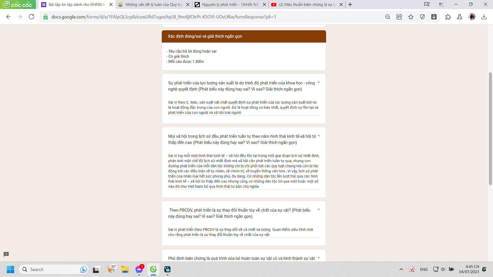

- xem về số người đạt niveau c1, c2 dalf. pas beaucoup mais il m'inquiète. Je n'inquiète pas pour les personnes qui sont meilleurs mais les personnes qui apprennent plus vite. Parce que ils me font me sentir inférieur.
- Like with that efficiency, theoretically saying, they could achieve maybe everything? (avec 2 heures par jour seulement) or not? because I hope they can only do things that is designed, not being able to create anything news. Else I do not understand the meaning of my life anymore. Niveau C1 en un an existe vraiment.
  id:: 64a3138d-c2fd-4829-b1b6-eb946e10ae43
	- et je ne peux même pas former une phrase complètement après un an. J'emmerde ma vie, tellement gêné d'apprendre avec Madame Thu. Je gaspille les ressources familiales
- en fait, je ne sais rien de leur vie, peut-être je peut faire tout les affaires dans un an aussi, ou pas, car cela dépend du nombre des affaires (créatives ou non) que je veux terminer
- or at the same time, you are not really and know that will not be happy if you dont try, but also if you try because the way you have been longing for clearly seems useless. I dont want to admit, to abandon it. Dear my poorself. I feel pity for you that you are hated, no one care about you and all the posibility or some kind of quality of an empty vase you are having. i dont know if it makes sense or not, just dont think it is too great to be great.
- Chép mạng cho nhanh vì đi học về muộn, ngồi chơi, không có tâm thế làm, chưa ôn gì mấy để viết chính xác từ,
	- 
	- 
	- 
- cách hỏi cũng làm mình khó hình dung kiểu bập chộp hỏi kiểu phải thuộc vl. người ta cũng chẳng thèm diễn giải. trước giờ cái mình hiểu và nhớ là diễn giải chứ không phải sự lắp ghép khái niệm, thế thì nó chẳng ra cái của nợ gì cả.