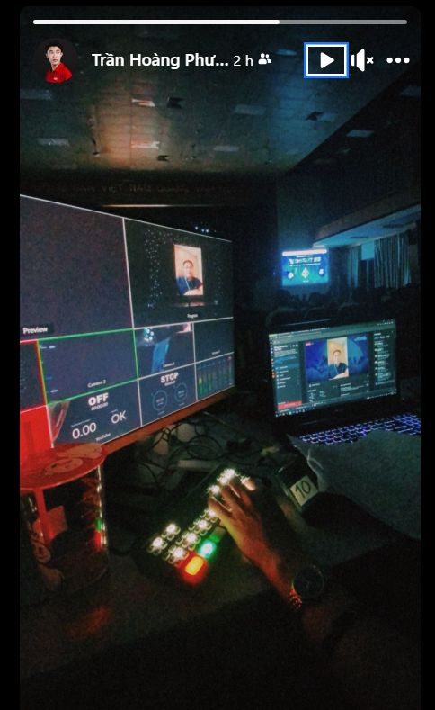

- 
- Thế là lại tối t5 mới học chính thức được tiếng Pháp, chiều tối t6 mới sang vẽ nhà cô Đào. Tại những môn như triết kéo mình về nhà làm mất hơn tiếng. Tại tối t3 mệt quá ngủ dậy quá đêm, nằm đọc học về điện ảnh. Cả ngày t4 cày truyện, đêm chữa bài cho em ánh. Sáng t5 chữa nốt cho em, phần còn lại đến 2 giờ chiều ngồi học ,nghe tiếng Pháp, ngủ đến 19:30 rồi dậy thanh toán tiền CSC, rồi ăn. Rồi sắp tới hi vọng cày được 5 tiếng tiếng Pháp, không thì chia đôi ra, rồi chia cho sáng sớm mai. Ta bù vào đó bằng đọc sách về giáo dục. Mấy kế hoạch dự án, chưa tăng tiến độ nào. Học là cần nhưng phải làm thì tiến độ mới tăng. Làm gì đó xuống.
- Nghe câu từ bài này khá đơn giản, mà họ có biến tấu cho nó Pháp đi chứ nghe thuần bìa hát tiếng Pháp có thể chưa hợp
	- ngôn từ khó
	- mà đây toàn từ quen mà cũng thành lạ, khó dịch hiểu bằng Anh và khó nhìn mà cảm giác quen hiểu như ngôn ngữ bản xứ mình là tiếng Pháp. Tiếng Anh đang dần đến độ quen này, bắt đầu thấy ngôn ngữ chỉ là ngôn ngữ chứ không phải rào cản hay thứ cần học cần tra. (trừ từ mới, ở tiếng Việt thì sao nhỉ, có nhiều từ mới nhưng chắc mình ít gặp chứ khó tin 18 năm mình đã nắm được mọi từ trừ Hán Việt. Tiếng Việt ít từ thế à)
	- nghe Anh nhìn Pháp thì dễ và quen hơn.
-