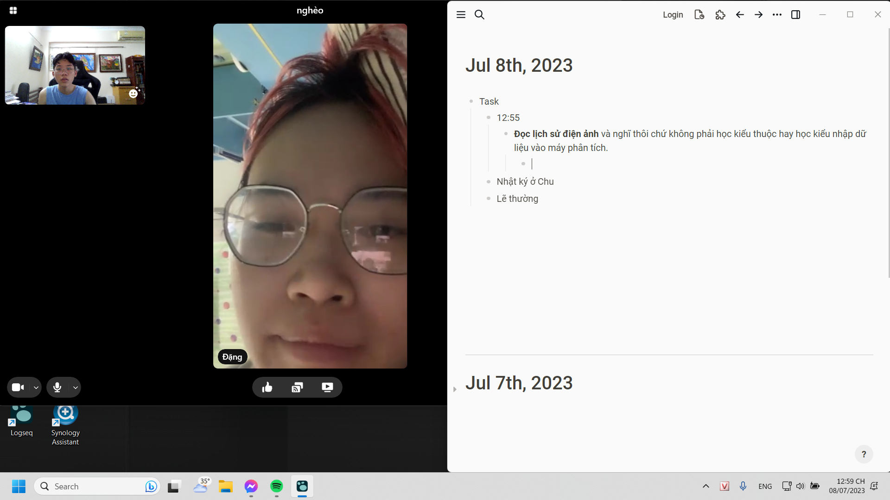

- Task
	- 12:55
		- **Đọc lịch sử điện ảnh** và nghĩ thôi chứ không phải học kiểu thuộc hay học kiểu nhập dữ liệu vào máy phân tích.
			- 
			- và nói chuyện tình cảm với Mai dù hôm qua đã nói đủ với Phúc và nói đủ ở khía cạnh khoa học nữa rồi
			- làm mấy việc này cho đến khi cảm thấy có hứng đủ để làm 2 cái to ở dưới. Phúc bảo không nên, chắc nên lao đầu vào luôn nhưng đây coi như bước dạo đầu.
	- Nhật ký ở Chu
	- Lẽ thường