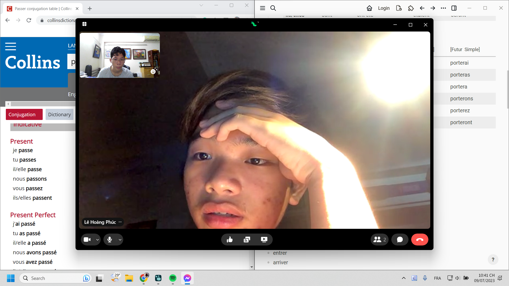

- 01:26 tự dưng Phúc với Vy đến an ủi tôi sau bài đăng. Nay thì giúp bố mẹ đút cái núm quạt thành công
	- ngại ghê đang chill sau khi đánh game xong MVP, thôi nghỉ ca 2 sau khi tiếp đáp hai bọn nó
	- hệ lụy của cảm xúc mãnh liệt nó thế, nhưng mà thôi, họ nói một thôi một hồi cũng hết rồi thì ngoài lo mình, khuyên mình, an ủi, họ còn là nói cho hết lòng họ ra nữa. Dù đối tượng được nói đến vẫn là mình, mình phải tập lại việc nhìn đối tượng được nói đến chỉ là đối tượng và nhìn thấy hình ảnh phản chiếu của người ta qua đối tượng
		- nhận ra điều đấy qua manga 100 điều muốn làm trước khi biến thành zombie, qua lời tự bạch của shizuka chapter 13 và đối sánh nó với Phúc và Vy. họ thú thật lòng mình lúc trước nhưng quên thú nhận lòng mình lúc này
	- Làm lẽ thường thì thoi mai? tức mấy tiếng nữa, mai tập thuyết trình với ôn tiếng Pháp
- 21:13 Ngồi vào bàn học tiếng Pháp. Mình không theo ponodoro, vậy mình đã làm gì? mình không sợ lâu, mình chỉ sợ không bổ gì, tức sức đổ sông đổ bể. Làm sao đo đếm được, làm sao biết cách người ta hiệu quả bao nhiêu, thôi ta cứ làm những thứ ta thấy cần (cần cho ta, học một cách hăng say? vui thích chinh chiến, thích thú tìm hiểu đường dài, ta thích chính nó chứ không chỉ là đạt được gì hay chinh phục nó mà sáng tạo nó và chinh phục những đỉnh chưa ai đi)và thực sự cần một cách thực tế (thứ ngăn cản ta tốt hơn)
- Mọi thứ mình đã làm đã nghĩ ra, những deadline tư duy dựa trên tài liệu sẵn có chứ không phải bài kiểm tra trí nhớ đã đạt đến giới hạn hay chỉ là một phần, và người khác liệu có làm được thế? mình cần một sự so sánh sát nhất có thể để tìm ra những điểm yếu, khả thể, sự phù hợp của các cách với các loại con người
- Và người khác có thể tận dụng, tranh thủ học như nào
- Họ xem các loại hình giải trí ra sao, họ thư giãn và suy nghĩ trong lúc đó, về nso thế nào
- Đây là cả một chuyên đề nghiên cứu đối sánh con người để thực sự hiểu đối phương một cách rõ nhất có thể đây. Xem ta và nhân loại đã sống như nào chứ không chỉ học như nào nữa. Một bước để ta hoàn toàn vượt qua một cách thực tế, không chỉ ở tư tưởng mà ở quá trình thi hành rồi thay đổi hẳn kết quả luôn.
- Mày có bao nhiêu cơ hội để nói chuyện lại với những người cũ đấy, và hỏi sao cho nó như tâm sự mà cũng có nội dung là để phục vụ nghiên cứu sâu. Bằng sự ngưỡng vọng và tò mò là cần thiết vì có nhiều điều đơn giản mình không biết sẽ được dấy lên lắm đây
- 22:42 bình thường sau khi gắn bó với ai quá tôi sẽ thường dè chừng và nói thẳng ra ngán họ
	- 
	- như tôi ngán Phúc hiện giờ
	- cũng một phần do cách tôi học thì nhìn là học nhưng bản thân tôi biết không quá hiệu quả, đáng tự hào, dù bổ mình thì có bổ nhưng chậm tiến với thế giới thì có gì hay? ám ảnh tâm lý nè, sợ nó mắng tiếp, mà mình lại sẽ chỉ biết nhận mắng không cãi được vì thực sự mình cũng chẳng thực sự thử mà đã chối từ những cách người ta hay học từ tận tâm can và chỉ tham khảo nội dung hình thức riêng lẻ của nó để áp vào nếu mình nhìn thấy qua việc học đó mình đồng thời có thể làm được việc nữa đồng thời
	- đó là lí do tôi thích học với Lã, vì được giúp là một phần là bên lã học, mình không thấy pressure, nhưng pressure cũng tốt, nó ép mình trong lúc học, dù là học thứ chán, thứ mình coi chẳng ích gì, chẳng vĩ đại, khó như của người ta và cách học mình cũng chẳng quá tuyệt vời (không so với người ta mà so với tiêu chuẩn chung cả hai cùng có thể hướng tới) thì mình sẽ cố ép sức, ép tốc độ hoặc việc nghĩ tư tưởng để bình đẳng hóa mọi giá trị của vạn vật trên đời
		- vì một xã hội mà mình tin tưởng hướng đến:
			- nơi mọi con người và mọi việc con người làm đều có giá trị