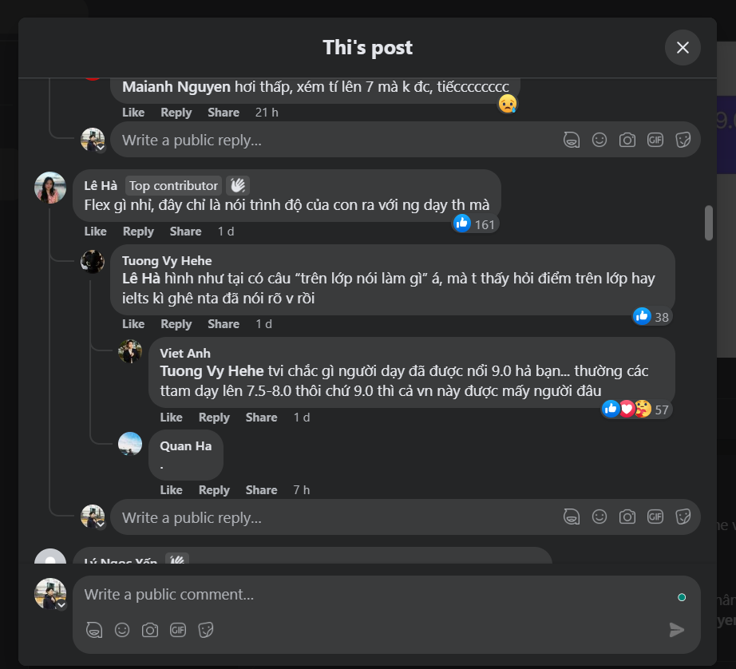

- 07:06 Dạo gần đây nổi lên một phong trào, một khuynh hướng của giới trẻ là Flex. Mà thú vị trào lưu này chỉ có ở VN thôi, có lẽ các nước khác cũng có chứ không phát triển thành một cộng đồng, thống nhất với nhau như một hệ tư tưởng lớn được như này
  collapsed:: true
	- thực ra xét kĩ thì trên mạng nó cũng xuất hiện rồi, điển hình là từ tiktok (mình suýt quên mất vì không hay theo dõi tình hình thế giới trên app này, nói thực mấy cái mạng kiểu này tính toàn cầu hóa cao cực kì)
	- 
		- 
		- lâu lâu mới được ý tạm được
			- {:height 650, :width 688}
- Nhìn lại lịch sử tính cách người dân Việt Nam thì ta thấy đây đúng là chuyện lạ, mà cũng chẳng lạ lắm. Vì từ lâu giới trẻ đã dần lên ngôi, thay thế những ông to bà lớn, thay thế cả những con người nhược tiểu, thấy ai khoe vàng khoe bạc là phê phán mất thuần phong mĩ tục.
- Tự dưng tôi cảm thấy cách người ta flex một cách vô học bừa bãi, dần dần không chỉ flex để người khác trầm trồ với thứ mình có mà mạnh mẽ hơn xâm lấn, đồng hóa các giá trị. Một cái hố gom hết mọi hình thái của việc sở hữu cái gì đó, từ thượng vàng đến hạ cám. Cảm giác rất giống Xuân tóc đỏ.
	- Bạn bè tôi không như thế nhưng họ còn làm tôi pressure hơn vì tôi được biết sức học và lý tưởng của họ là gì
- Kì thực mấy hành động trong group này cực kì phản giáo dục. Mà giáo dục nào (khai sáng) chứ có phải giáo dục công nghiệp đầy gà nòi kiểu Việt Nam đâu. Trước khi nói cái gì đó làm gì đó ta nên thử cho não chống đẩy trước 7 lần trước khi nói, sau khi cân nhắc đến ảnh hưởng của nó đến thế giới. Ừ chứ không chỉ người xung quanh đâu. Kiểu như bên nước nào vượt đèn đỏ là không nên dù đường có vắng vì biết đâu đang dạy hư một đứa trẻ nào
	- khả năng liên kết kiến thức thế này mới đáng quý
- Và đồng thời cũng chẳng biết gì về giáo dục
	- nghĩ kĩ mới để ý: từ khi nào mà học kiểu sao chép, bắt chước để phát triển vậy. trong giáo dục từ cổ chí kim thực sự có ai bắt giáo viên, người hướng dẫn phải đi trước, phải làm được rồi thì mới được dạy đâu?
		- người trong giáo dục đồng ý ý kiến này, chỉ bọn phụ huynh thừa tiền thiếu kiến thức mới nghĩ ra và áp cái ảo tưởng của mình vào và cứ thế tin tưởng người dạy. Tin là tốt nhưng tốt hơn thì nên tin đúng giá trị
	- lúc này mấy cái bằng cấp thành tích mới đáng đem ra để xét xử
- Ngoài những cái mặt tốt về việc đọc những post vô bổ này để biết núi này còn có núi cao hơn, tạo động lực có thể hơi toxic tí thì nhìn mặt giá trị khả thể lớn nhất, tôi không nhìn ra nổi
- Người ở đây so sánh thì khập khiễng, chơi cái kiểu hơn nhau nửa vời, đơn cử như danh hiệu danh giá nhất trong học thuật là tiến sĩ cũng chẳng thể nói được rằng mình hơn bất cứ ai, chẳng định xếp rank để tạo network, chẳng chia sẻ cụ thể kinh nghiệm
- Còn thích chơi trò đỉnh cao mọi nghề thì để tôi chia sẻ tí kinh nghiệm của con người dị hợm dành cả đời chống lại, cố thống trị và đi tận cùng sự so đo
- Chỗ này còn chẳng sinh ra một ai chí lớn muốn bóc cái bọn này
- Và cái đéo cũng khoe được, để vài người với cái bằng không dùng tới quá 10 lần nên lên khoe cho vui, thế thì không sao nhưng sẽ sao nếu họ tự đắc quá đấy, bởi đỉnh cao của flex không phải làm người ta khó chịu mà để hạ sát tinh thần người kia tuyệt đối. Và nên tự biết rèn cái tính nghĩ thử xem có bao người ở trên mình, làm sao để vượt qua cả những cây cổ thụ gạo cội đã mất kia kìa.
	- cái đỉnh cao là khiến ai cũng nhục được kể cả bọn bất cần đời mới gọi là flex chứ không chỉ khoe ra và khiến người ta sắt đá hơn trước những sự khoe
		- thực ra rèn tinh thần kiểu này cũng được
- Tính tôi cũng thích khoe và chống đối thế giới lắm, kiểu làm nghiên cứu không cần ai hướng dẫn, đăng công khai, nhận phản biện từ mọi nơi mọi nguồn nhưng bất cập nếu ai ăn cắp lắm. Trừ khi trong giới học thuật đã quá quen phong cách làm nghiên cứu của mình. Có thể là cách chứng minh, sự cẩn thận chứng minh, cố đá, chứng minh bằng liên ngành hoặc ở đề tài.
	- Và bằng cấp? bằng cấp chỉ là một thang đo, theo kiểu đo thi cử. Kì thực bạn có thể tự bù bằng dự án, bằng phân tích tâm lý, tổng hợp sàng lọc phân tích, phủ định kiến thức ở toàn những sách giá trị.
- Để tôi dạy bạn tiếp một cách đòi nhau flex đẳng cấp nhé: luận chiến văn chương. Flex cái quá trình ra chứ đừng chỉ đem cái sản phẩm lên như kiểu so công nghiệp. Nên cái tôi muốn khoe, sẽ là tôi có viết sách. Nhưng hàm lượng kiến thức hay bất cứ giá trị gì so với người viết 10 cuốn, thử so xem thế nào. Ta viết bài phủ định phản biện nhau nào
- Một điều cuối, những thứ người ta khoe, tôi nhìn cũng thấy ghê chứ chẳng quá ghen tị. Vì nếu có, thứ duy nhất tôi ghen là một hình dung tưởng tượng về bản thân tôi có những giá trị của người ta chứ không phải người ta. Tôi hằng kiếm tìm cái gọi là chân lý, cái hạnh phúc hơn, cái hạnh phúc tuyệt đối. Không biết đời nhiều người thế nào chứ tôi như Hộ, chỉ mê những cuộc đời trong văn chứ chẳng đoái hoài quá cả cuộc đời ai ở ngoài đời hơn đời mình để mà ghen tị cả. Nên hỏi tôi ghen tị không, không, bởi kể cả có được tôi cũng chẳng muốn đổi đời, chạy theo đúng những gì họ có để đạt được tương tự họ
- Nhưng cái thú của việc flex cũng là để biết ai hơn và cụ thể hơn mình như nào chứ không phải hơn cái gì ở thành tích (như là cách quan tâm bạn bè, quan tâm cộng đồng mình, mình vẫn luôn muốn tìm những tấm gương ghê hơn, có tiền hơn thì dễ có ý tưởng hay hơn hay thậm chí có chí hơn Như Amser Pass?)
- Nên tổng hợp thành bài có một cái mạch để xem có nhỡ thiếu ý nào
- 20:04
	- well thấy cái này
	- 
	- 
		- well good for her, mình cũng hiểu tính nó và tính nhiều người không nông cạn đến mức tự thủ với đống thành tích, nhưng flex thì vẫn phải flex
	- và thấy cái này
		- 
	- rồi đọc cái này
		- 
		- nhìn thì vui đấy nhưng mà để làm gì đâu, có một thứ lý do khiến mình mất động lực hứng thú là ở sự vĩ đại của thứ mình làm.
			- đó là lí do mình không thấy phí sức vì sức được trả bằng tiền hoặc cái gì đó, nhưng mình thấy phí thời gian, một thứ vốn không trả được nếu không hoàn bằng sự viên mãn và cái giá trị được làm những thứ thật tương xứng.
				- là sống chứ không vô hồn như nô lệ
			- mà mấy cuộc thi của multi media kia, không kể ban nhận xét hay tổ chức như nào cái gì
				- đích cuối cũng là để làm nơi cho các con vợ bán mình
				- để các nhà đầu tư đến ngỏ lời đấu giá
				- và đương nhiên họ chấp nhận, đâu ai như mày sẽ thích đá sang làm đỉnh lĩnh vực khác để rồi người khác soán ngôi rồi mình tự tin soán lại vì biết mánh của người ta và cũng biết cách để lên đỉnh
			- nhưng cái tầm trình business lớn là ghê gớm nhất rồi, cái mức độ quy mô công nghiệp cực thực tiễn của nó khiến mình không đùa được
			- rồi học thức cũng chẳng là gì trong giới học thuật
			- nhưng có một giới không giới hạn không màng tiền bạc vật chất và mang những giá trị cố định phải gắn với cái đời nhàm chán, với cái đời khuôn khổ, là nghệ thuật.
				- mày không cứu được bạn mày, xây được một thế giới từ kinh tế với cái nền khoa học thì ít nhất có thể mời gọi họ tham gia một giây đến thế giới đỉnh cao của nghệ thuật và tư tưởng...
			- bớt sợ rồi vì thấy cái mình phân tích ra cũng hay, nhưng làm sao để chê mấy kì thi đó được nữa ngoài độ chưa chịu chơi hẳn hay cực căng của nó để thúc đẩy người làm
				- và mình coi họ như bình rỗng để mình đổ kiến thức, là đá quý để mình khắc mài, là tượng để chạm trổ
				- hoặc họ sẽ được làm, được phục vụ cho một thứ lớn lao hơn đời họ.
			- mình có thể phát triển cái
	- xem mấy cái này cũng hay
		- 
		- hôm qua đọc zom 100 đến đoạn gaika, chợt tra mạng và nhớ đến khuôn mặt nét người chị Phương Uyên, chỉ có chị với cách trang điểm trên khuôn mặt bằng bằng đó thì mới cực hợp. Còn hồi trước chị trông không hợp để kiểu, nếu có phim tôi sẽ mời chị diễn.
			- diễn nó là một cái gì đó nằm giữa  tính cách sống với nghề. Tính cách bạn hợp, bạn nhớ cái characteristic là đủ
	- Haiz bị nghe chửi vì gửi muộn dù điểm cũng đã trừ thật khó chịu, làm mình khó có tâm trạng học
		- đúng là có thể mình hơi có lỗi khi không insert link được cũng không mượn máy
			- vì kì thực mọi thứ vẫn ổn, mình cũng không muốn mọi người phải làm quá nhiều việc
			- cho đến khi mình nhận ra mình missed file
				- rõ ràng mình insert đủ rồi chẳng hiểu sao lại sót.
		- nên cách đổ lỗi của Manh chứng tỏ nó rất cao ngạo và không tốt lắm
		- và nên nhớ với bọn nó thời gian đấy có thể ổn nhưng mình tuy cũng không nói đang ở đâu làm gì, thì lúc đấy cũng còn khoảng 30 phút trước deadlines mới gửi là rất không nên.
		- Hmm cũng nên rèn thói double check, hôm đó mình lại hơi bê tha với rượu và chơi bời. Ít nhất lag đầu thì gửi lên cho bọn nó check
- Cái kiểu marketing này rất độc hại
	- 
	- tôi sẽ thích kiểu market là em vào được đúng trường mình thích hơn là phải top cao. Cuối cùng có để làm gì đâu, đam mê mình, tình yêu mình tự dưng bị gắn vào 1 giá trị biến rồi đem ra so sánh (cái rank sẽ đổi và thậm chí nó còn k nói được gì về ngành các thứ, rồi stereotype phải đẹp và giỏi giang mới làm được? người kém hơn thì có sao hay chỉ ca ngợi cho có thôi ấy mà nhưng vẫn éo chấp nhận được)
- Nói chung lúc lo và chờ đến giờ tử thần mày có thể đọc sách chill. Vừa thêm kiến thức, đánh lạc hướng mà cũng đồng thời hêm kiến thức
- không thì reply bạn bè, mày nhiều chuyện để lo mà :)) chỉ tiếc nay chưa học tí nào tiếng Pháp và hai môn thi cuối kì. Thôi thì sự cố khách quan ngoài ý muốn tác động: thiên tai, thực ra là nhân tai. Mắng nhân viên nó tai hại và có thể gây ảnh hưởng thế đấy, ta phải nghĩ kĩ mắng làm gì và kiểu gì.