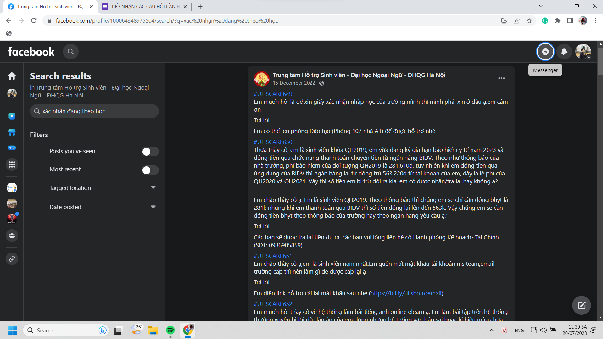

- 
- Nên tự biết tra ntn trước khi inbox page, hoặc không thì nên có thư viện để search, chẳng hạn thay vì hỏi ở phần tiếp nhận các câu hỏi cần (vì trường mình cũng không có page support chuẩn để tự mò và người ta ngại nhắn đến cskh hơn như một số trang thiết bị)
- Nay tìm đọc lại mới nhớ Đinh Nguyễn khá nổi hồi xưa với anh Người Kể Chuyện,... giờ lặn mất tiêu vì phốt. khá tiếc những sáng tạo anh ấy viết. mình sẽ không kịp sao lưu và không có công cụ sao lưu nhanh tất cả của một người nhưng đành thôi kệ vậy. Dù nhiều thứ data quý không được nói ra, thì những data đã được đăng lên và bảo vệ không bị mất đi cũng không kém giá trị. Cứ xử lí hết đống đó đã. Cái khó chịu hơn của mọi search engine và google là tính cập nhật của nó, rất khó tra cứu lịch sử. ChatGPT không có khả năng đó nhưng vốn kiến thức nó ghê thật, không phải tự tư duy được nhưng cũng biện luận tranh luận được đến một mức độ nào đó, còn một số hành vi thực hành nghị luận như người thường thì có lẽ chưa bằng hoàn toàn. Những lúc như này mình thấy data trở nên rất quan trọng, phải mất mới thấy quý.... không thì thực sự khá vô cảm
- Dù biết là những kẻ xấu nên tự động ẩn đi nhưng không phải tất cả người ta đều xấu, không dùng được, và dù xấu cũng nên lưu lại như một dữ kiện đã có trường hợp như thế. Một thế giới lúc nào cũng đẹp và nhạt nhòa như ý muốn thì còn cần gì những sự tưởng tượng từ nghệ thuật, phim?
- 03:47 nhiều khi trầm cảm đéo muốn học gì
- thua hai trận liên tiếp rank, biết là mình đang phí thời gian nhưng phí thời gian mà lại chẳng được gì nữa thì còn gì tệ hơn
	- kinh nghiệm cũng không
	- kĩ thuật cũng không
	- niềm vui cũng không
	- tất cả tại vì team ngu chỉ biết tự sát
	- làm tao cũng muốn tự sát theo
- học tiếng Pháp một cách chủ động giờ tính ra là quá muộn để giỏi, dù biết chẳng bao giờ là muộn để giỏi với bản thân
	- nhưng sống trên đời ai sống một mình một thân
	- nếu thế đã chẳng phải học hoặc khổ hạnh vì bất cứ thứ gì
	- học là để phát triển, xã hội bắt phải có ước mơ và phải cố bước tiếp, một kiểu lao động bắt ép
		- người ta chối bỏ trách nhiệm, bảo có ai bắt đâu, ừ tôi quên, để tồn tại thì bạn không cần làm gì cả ngoài đợi đến lúc chết và làm gánh nặng cho kẻ khác
		- nhưng mà thôi, miễn là bằng bất cứ giá nào mày đạt được cái đích mày muốn hiện giờ, dù trong suốt hành trình đấy mày phải cạnh tranh leo rank liên tục chứ chẳng phải thi đạt đủ là qua đâu mà nó còn cạnh tranh kẻ này kẻ kia ở những vòng xét tuyển
			- đó, đời mà
	- những lúc kể than về các sự nhu nhược tự ti của mình, tôi không cảm giác là những người kiểu chị Trân, nhưng bằng cái giọng của chị hoặc mấy trí thức mạng như Tornard sẽ chửi thẳng mặt và đánh giá tôi
		- nhưng sao với nhân vật truyện, họ mạnh mẽ mặc kệ lời bình luận của độc giả, well ta nên học cách dung thứ hơn và không bình luận nhiều vào thẳng một kẻ nào đó, chưa bao giờ tôi làm thế, tôi chỉ cùng lắm là cảm và tôn trọng hành động của người ta, quan sát
			- bình thường không sao vì tôi còn theo đuổi tri thức hoặc sự phát triển, giờ chỉ theo đuổi sự tầm thường bế tắc của cuộc đời và không vùng thoát được ra vì nó như bạn cố leo rank trong game, trừ khi người ta bỏ, không nếu bạn đã đen hoặc không có điều kiện hơn, mãi mãi kém hơn (kể cả điều kiện tinh thần lẫn bất cứ cái gì khiến ai đó trong đà chăm chỉ liên tục)
			- chứ nếu là một con người bình thường, dù cái mức độ quan sát dõi theo cùng lắm cũng chỉ mấy tiếng một ngày, cũng cảm giác bị đối xử chửi bới nặng nề hơn như thể sinh vật sống bị ngược đãi đặc biệt như nô lệ còn khổ hơn vật?
			- mà cũng có thể do mình đọc mấy thứ phốt tiêu cực nhiều quá nghĩ có ngày mình cũng bị phốt vì kém cỏi :)))
	- tôi duy nhất bây giờ thấy vẫn may vì còn nhiều người giỏi nhưng số đen như mình
	- thôi kệ đi, mình tự ám thị bản thân cày hết quyển sách là được, mặc kệ cái kiểu học quy củ tuần tự phát triển đều, bố mày đột biến, cạnh tranh thế mới vui chứ chứ cứ đi theo con đường đua bình thường chạy sức dài thấy vừa chán vừa không phải mình, vừa vô nghĩa với mình như thể bị mất đi tự do
		- lấy lại ngụ ngôn rùa và thỏ, ta nói, tôi cả đời vẫn sẽ là thỏ và oke với việc là thỏ. người xưa đúng là thiển cận và điều đó tiếp diễn đến tận nay, biết trong cuộc đua là chỉ quan trọng thắng thua, nhưng cuộc đua nằm trong cuộc sống, và cuộc sống không phải thứ tạo tác của con người, kì thực, ta làm gì ở đó cũng được, chẳng sao, ta sống đời ta. Tôi nghĩ nếu hỏi thỏ có đau đớn dằn vặt hối hận không, có lẽ nó bảo, haiz quả đấy hơi ngáo với chơi hơi ngu rồi. Nhưng không, sống là chân ái, miễn mình không chết thì có thất bại, kém cỏi, không ai biết đến cũng không sao. Mấy cái sĩ diện với thiên hạ kì thực tự động viên cho vui chứ dù mình tự tung hô hay người ta tung hô (không bao giờ quá lâu, liên tục một ai đó, nếu thế có khi thành sùng đạo) thì nó chẳng có ích gì với mình cả (trừ việc ai đó sẽ liên hệ muốn làm này làm kia hoặc không, kệ đi, mày cần gì, mày tự giao đủ việc cho bản thân rồi mà)Yeah
		- chứ nếu để tuyển dụng rùa và thỏ như kiểu làm ở đời thì, tôi vẫn sẽ chọn thỏ và rèn nó vì mỗi con có chức năng khác nhau
		- việc đặt hai con cạnh nhau để thi đã là ngu vãi chưởng rồi, chẳng hiểu thi cái mẹ gì ở đây?
	- học còn khổ hơn làm vì bản chất học là tiếp thu mới giỏi lên, nếu làm bạn chỉ việc hoàn thành tốt cái này cái kia thì học cũng là hoàn thành tốt, nhưng từ mỗi sự tốt đó phải thu nạp được gì đó mới cho mình, phải nâng cao cái khả năng khả thể mà trước giờ không phải không thể (dễ dàng) mà không phải không thể (biết thôi chứ thực hành khó lắm) hoặc trước giờ chưa bao giờ có cơ hội làm được
		- mà thế nào là giỏi lên nữa, bằng việc sử dụng cái mình tích lũy, là một hố sâu vô tận của cố gắng
- Trầm cảm mặc cảm về giá trị tầm vóc mà mẹ cứ bắt quét nhà, quét cái đéo gì, giờ mình như máy đứa mất hết tiền bạc chỉ muốn đánh sao thắng thật nhanh, mà đánh ở mặt trận nào cũng thấy thua, đéo có cơ hội thắng 09:56
	- và với mẹ thế là Phong không làm gì
	- well cái kết cho bất kì kẻ nào muốn không phải chiều lòng thiên hạ nhưng cũng một dạng ai cũng quý cũng chú ý là giỏi hơn tất cả, dù ẩn tàng
- sometime i wish i have a reset button không phải bởi vì đang bị chèn ép hay khổ gì mà vì không có gì ở hiện tại và tương lai nên mới khổ, chứ sức sống của Phong, có đè thì có cả triệu năm mới giết được Phong, ngược lại càng cho nó mục đích sống. có thể reset my life hoặc reset ra một lĩnh vực khác, không phải lĩnh vực mới đâu chứ ở đây, với những gì mình đã có, một phần là thế giới đã quá bộn bề, một phần là toàn những thứ quá khứ đeo bám quá lâu rồi
- nếu chỉ học ở trường và tập trung ở trường hoàn toàn thì đã cực dễ với Phong
- mà đấy, mày biết dù sống một hay nhiều người thì có một số chuyện mày phải làm
	- bất cứ khi nào mày tức giận từ chối bất cứ việc gì tức mày đã rối loạn về việc làm, lụt hoàn toàn thời gian và cũng bởi mày đã chơi quá nhiều, lười. Nếu chăm 100% vào việc và chỉ là thôi thì dù không có chút cảm xúc gì vẫn giá trị hơn là không, vì nó không khiến mày khổ, cũng chẳng khiến mày quá vui mà vì cái này khiến mày khổ nên mày mới tạm lánh sang những thứ bớt khổ hơn là truyện, phim ảnh, game
- nhưng không dám chết vì nó phiền phức tới những người từng quen mình lắm
- mà mình không muốn cầu cứu làm ảnh hưởng họ lắm, ẩn thân và tự rèn luyện (thành công hay thất bại thì cũng nhìn thấy bạn mình có cuộc đời không như ý mình đã tưởng tượng, có gì đó nó không theo đà phát triển mà mình đã thấy, vậy trước đó họ được gánh? hay nó không như chuyện time skip đến độ tài năng vì thực tế có lẽ không có nhiều lợi thế tài năng,...) hoặc tan biến một mình trong thất bại: chết dù vẫn sống nhưng không gây bất cứ tin tức chấn động gì, chết từ từ để không ai hay, một cách biến mất ha
- 11:02 giây phút bố mượn máy, mình lăn ra giường cầm quyển bài tập tiếng Pháp lánh nạn, không ngồi trước chiếc máy tính quyền uy mà chỉ có trong tay một quyển sách kiến thức, mình lại ra bàn lấy bút, ngả mình lần nữa, mình ngã vào sự bình thường, ngã vào việc nhận ra điều đấy ở thầy Trung hay bất cứ con người nào như em Phương trước đây, những người anh người chị lớn hơn, trên thế giới này dù giàu dù nghèo cũng khó tránh khỏi cái việc học một cách tầm thường, một con người tầm thường ở cái nhà bé tầm thường cầm quyển sách bình thường và học, như người thường, để rồi sau này họ sẽ đi lập gia đình sinh con đẻ cái và đi làm sinh hoạt như người thường
- mà thường có sao, bất thường một tí như bố, không biết sử dụng máy tính, được người ta phụ thuộc một số thứ trong nghề, không mang khả năng truyền tải lại kiến thức hay vai trò ngôi vị, cũng sinh hoạt bình thường trước những thứ họ không biết, đôi khi cần
- họ ngồi trên cái ghế bong toác không chê, họ không biết thao tác, không khó chịu
- họ chấp nhận
- còn mình thì không bao giờ với bất cứ thứ gì dù khó đến dễ, sự bất tiện phải ra đi, và tri thức phải cùng lúc đến
- mình chẳng biết làm được không so với vô vàn kẻ đặt mục đích làm cho bố mẹ cái nhà,... mà nhà đó cũng có tự thiết kế hay tính toán gì giỏi lắm đâu, chỉ là một cái nhà tốn tiền chút
	- mình hi vọng mình đủ giỏi và không kiêu để có thể giúp bạn bè từng chút một dù to dù nhỏ, mà giờ chắc phải học code thật vì mọi thứ đều thao tác trên điện tử thì code là không thể tránh khỏi
	- và từ cái chút một đó họ tìm ra lối thoát lớn hơn, tìm ra đáp án, phương pháp cho ước mơ của họ
- 14:16 xem xong garden of words, một bộ phim nhanh khiến người ta sảng khoái, mình được ít nhiều quên hết mọi thứ xung quanh và chú tâm vào phim
	- và mình xem wiki để xem các cách tóm tắt, đọc thêm được ý nghĩa hay nữa về ẩn dụ văn hóa, thậm chí trên đó có sự modify của manga và light novel, mỗi cái kết tạo một cảm giác khác nhau, mà mỗi cách tóm tắt và lược hoặc không lược những câu mang tính chỉ sự tiếp diễn của thời gian sẽ tạo cảm giác khác nhau cho người đọc, có thể là lí hoặc cảm xúc - nghiên cứu cái đó có thể nghiên cứu scripts để so sánh ảnh hưởng khi lược một cách không khách quan lắm hoặc thích khách quan thì ta đi phân tích
	- và trước đó tò mò sao họa sĩ vẽ đẹp thế, cũng muốn vẽ, mình có vẽ được đẹp thế không, vẽ thế nào
	- và trước đó nữa mình chú ý đến việc đoạn nào họ dùng lời để kể, dùng hình ảnh, dùng câu chuyện (liên hệ đến cái ý về flex ở cuối, chuyện như này, rất hay, nhưng flex thì có gì mà flex để khoe -> đủ để thấy mấy cái khoe nó không nói lên tất cả và đôi khi rất ấu trĩ trẻ con như bọn cấp hai so đo, mà nó cũng giống ý nghĩa trong phim là người lớn đôi khi cũng chẳng lớn lắm)
		- rồi chú ý đến cái nhạc, âm thanh tinh tế - khi nào chọn âm thanh nào làm mọi thứ hay hơn hẳn, mình tự sáng tác âm thanh được không ta
- chưa muốn ngủ, tự dưng có hứng đi thu lượm tiếp tài liệu về Chu hơnchr, nếu là lên ý tưởng thì phải giữ mạch nghĩ tốt hơn nhưng mạch cảm xúc động lực thế này cũng tạm được