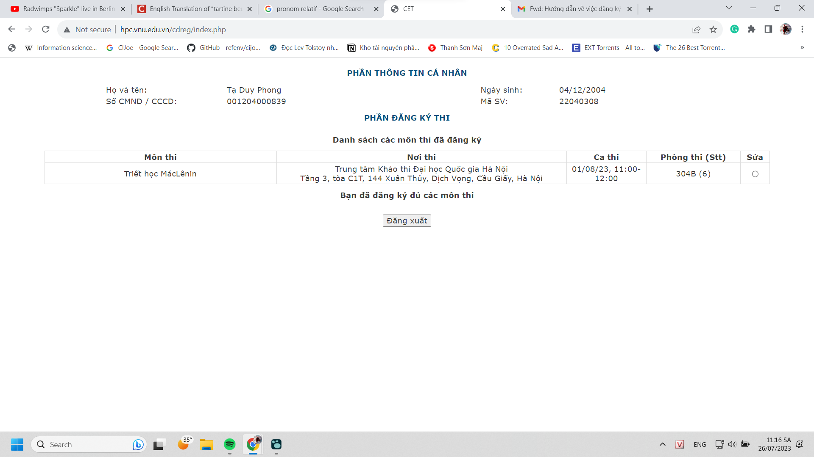
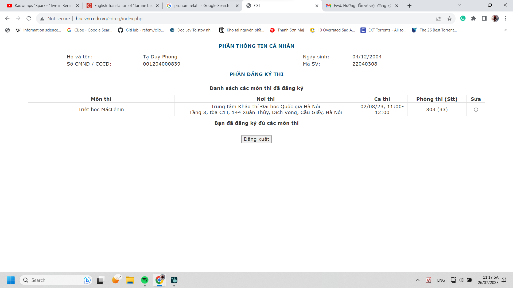

- 
	- định thi sớm cho xong nhưng á đù
		- thế thì sớm quá, bình thường mùng 5 thi thì có thời gian ôn hơn
		- {:height 412, :width 719}
		- định rủ chị Nhật nhưng thôi chẳng có lí do gì, hên xui 1/7 ca thi và 1/ 1 tỉ khả năng để xem có thấy mặt được không, nhưng chắc không ai thích thi giờ trưa kiểu mình, mình thích save time để còn làm việc khác
		- triết chưa ôn tí gì đây nè :)))
	- Dạo này bê tha vãi, triết thì ngắn không nói nhưng cứ học khoảng bao nhiêu là lại phải nghỉ bấy nhiêu, dù chưa thấy căng hết sức ngã gục ra sau khi học xong
		- để tận dụng thời gian mình tranh thủ giải trí bằng phim và vốn lý luận ít ỏi chưa đâu vào đâu (hiểu được bản chất, lịch sử, theo dòng thời gian,...) của mình
		- hoặc đánh game cho nhanh
		- nó như thể não đang rất chán mệt, dần dần nếu không nghỉ thì khoảng thời gian học hiệu quả và thời gian ngồi tập trung được giảm càng giảm đến khi thời gian chơi nhiều hơn, chán chơi lại thành ngủ nhiều, chẳng biết tính ra ích được không, lợi về sức khỏe thì không nhưng kiến thức và sự đóng góp vì mình bám lấy tri thức nhiều hơn bình thường?
		- thứ duy nhất mình làm được bây giờ là ngủ đúng giờ để không bệ rạc quá
		- mình cũng chẳng muốn thi xong để kết thúc vì ình vẫn thấy tội lỗi vì chưa số hóa được hết, đọc được hết và áp dụng được hết, và điểm cũng không cao...