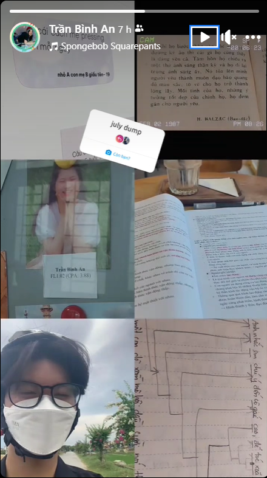
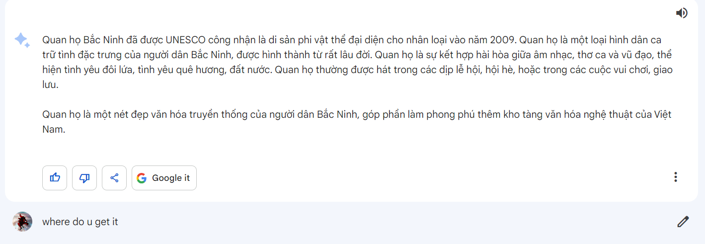
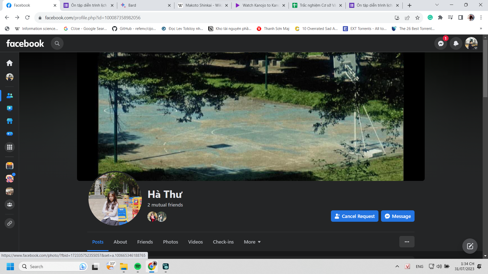
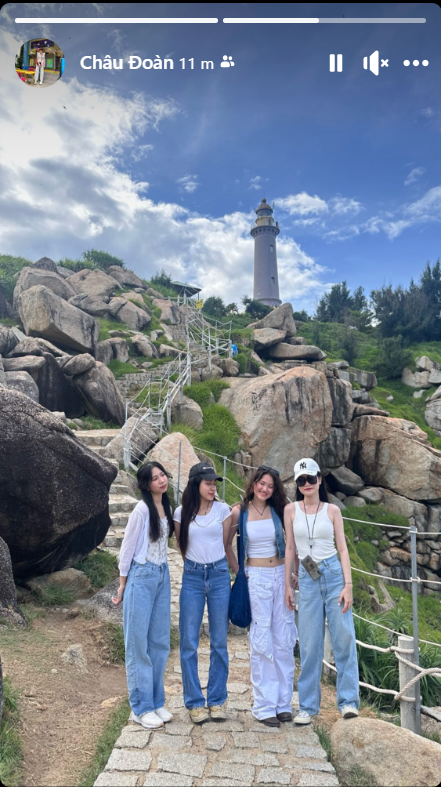

- 
- 12:59 dạo này thế giới đáng sợ phết
	- có nhiều trung tâm dạy nhiều thứ ở Việt Nam hơn và từ lâu trên thế giới cũng có những người học skill mới rất nhiều
	- tuy đa số chẳng kết hợp được thành cái gì đó và chắc gì học đã thành tài, nhưng mình sợ những khả thể như họ tìm ra thứ họ thích
	- mình chưa kịp thông thạo thứ họ thích
- còn những người đã có kĩ năng từ trước và đang mài giũa, có cả những người giỏi thứ họ giỏi, một thứ thôi nhưng đủ chết người rồi, dù là trong học tập hay tài cá nhân
- mình thì không học vì nghề, dù tiếp cận từ hướng nghề cũng cần để nắm một số thứ thực tiễn và biết người thường tầm thường thế nào trong làm việc
- mình hướng tới đỉnh cao, sự khác lạ, thành chuyên gia, không chỉ của một ngành một lúc mà thông thạo cả lịch sử của nó và chọn một nơi một thời đại một phong cách để làm nếu cần
-
- 
- nghịch mấy cái này cũng hay, nó trả lời không đúng ý mình lắm nhưng nó làm nhanh nên không ai nói gì, nhưng nếu là mình mình sẽ identifty các đối tượng, nếu do unesco đưa thì tra nhanh là báo, tra chính xác là văn bản thuộc unesco luôn, theo kiểu khoa học nó phải thế, dù thế khá lâu và nên có cách sắp xếp các di sản phi vật thể theo các năm riêng (nhưng vẫn lâu hơn search google second source)
-
- cái low quality này diễn tả chuẩn cái sự đời thường hằng ngày ở Chu vãi, nó sống động đậm màu, đôi khi nặng nề như thế mấy năm đầu. Mọi thứ đều tuyệt nhưng mình bình thường trong sự tuyệt đó, đôi khi ghé, nó là những thế giới riêng mà mình có thể nhưng không dùng nhiều quá
	- nó giống mấy bộ phim nhật cũ nữa
	- 
	- thích quá phải add friend ngay, vì mình thấy góc này làm góc quay những con người với những bộ quần áo thể dục được, cận cảnh với cái sân như này cũng được\
- Thực ra việc quan trọng hơn trong cái theo đuổi gì đó, hơn ai đó không hẳn là giỏi hơn mà làm họ chạnh lòng bằng việc thích, nhìn ra những giá trị, đam mê và tự do với nó hơn họ
- Tôi có nhiều thứ mình thích nhưng dạo này cứ mỗi khi muốn làm gì đó là lại không có sức, lại lấy lí do như mưa không đi vẽ đâu, đi có chết ai đâu, công chuẩn bị tí có mất gì, quan trọng là tận tâm khảm mình mình cạn sạch chất gì đó rồi, một thứ gì đó ngoài cảm xúc và suy nghĩ, hai cái đấy không bao giờ hết hẳn, không bao giờ là không đủ để mình làm gì đó
- Mình nghĩ có lã ngồi đây chắc mình sẽ back lại với những việc cần làm, dù là sắp xếp data, dù là biên tập, học các khóa học, đọc sách giáo dục, nghiên cứu thì chắc chắn phải làm vì nó là trách nhiệm rồi, còn văn, haiz nó như  cuốn kỉ yếu ấy, giờ không ai đọc đâu, chưa phải lúc mở ra, nhưng làm sớm được thì tốt và phòng trường hợp sau này không còn trẻ, sống quá xa để hiểu ngày xưa mình nghĩ viết gì
	- Yêu cầu thời đại luôn là tổng hợp quá khứ mà :)))
- thứ duy nhất mình quen làm và cứ thế làm không quá thích quá mê gì cả, dù vẫn rất nhiều cảm xúc rạo rực lúc làm, nhưng để bắt đầu hay hùng hổ làm cực căng thì không là xem phim và gần cuối phim mình đúc mình take note lại
	- nhưng sẽ lâu nếu không đọc những kiến thức của con người để giúp cảm giác của mình thành tri thức và sử dụng được đó
- well để có động lực chắc thi xong phải về xả hơi bằng việc note lại tất cả những gì cần làm rồi.
	- mày thấy gấp, khẩn thiết thì sẽ tự biết mà làm thôi, như xưa
- chơi game cũng chỉ là một sự giết thời gian
- mình không bình thường hay bị chìm vào cái chán, cái vô nghĩa, vô dụng, vô năng đời thường nữa nhưng cũng chẳng quá năng suất mà chỉ như cái máy rỗng. Xưa cảm thấy sự rỗng nặng nề, ta còn là người, ta thấy trầm cảm, ta còn cảm, nay ta không thấy gì, bình thường, healthy về vật lý nhưng mentally không thể làm gì, cũng chẳng có lí do gì (dù có lí do có lẽ không phải vấn đề cần có, chỉ là một thứ giải pháp, thật khó biết vấn đề là gì, có lẽ chẳng có vấn đề gì nếu xét dưới góc độ tâm lý, chỉ là ta đang ở đâu đó, một trạng thái nào đó, làm sao xác định được ta đang sao như khám tổng quan thì tốt ha. chứ đâu phải tâm lý học là phải có bệnh mới chữa, mới có ích, mọi cái còn lại chưa thành bệnh thì là bình thường?)
- dạo này mình đang đi về cái ý hình tượng không gian trong anime thời nay, qua việc tiếp cận, khảo makoto shinkai từ những tác phẩm ban đầu đã, nói thế cũng chẳng chuẩn lắm, đúng phải là cảm thức không gian, bởi nó đặc biệt được dựng nên từ con người, tùy từng cá nhân và mình muốn nhấn mạnh vào đó, nó cũng gây cảm giác nhiều hơn là sống động đầy đủ các phần như một nhân vật
	- cái đó gợi mình nhiều suy niệm về Chu lắm, Chu đặc biệt, là chỗ lún kéo người ta vào, giết chết người ta bằng kỉ niệm ở đó. Một thiên đường tươi đẹp nhưng chết chóc. Không chỉ là ngôi trường, di tích, mà là một nơi nương lại chẳng vì gì, chẳng kiểu ở hoàn toàn như nhà trần tục hay kho tàng của những kí ức như bảo tàng, ở cũng được, nhưng ta thấy mọi thứ cứng đờ, mang vẻ đẹp nhưng bị ghim lên tường, ở đó cô quạnh lắm, ở nhà thì mọi thứ bão hòa quá, ở Chu mình ở nhưng như được tách ra, như thiền, ở nhưng mà không ở, được làm mọi vai ta muốn, tạm thời là thế. Và cảm giác của ta là gì, ta bị sao mà vấn vương mãi thế, vì ta vẫn đến đó được?
- 22:18 vui nhỉ
	- 