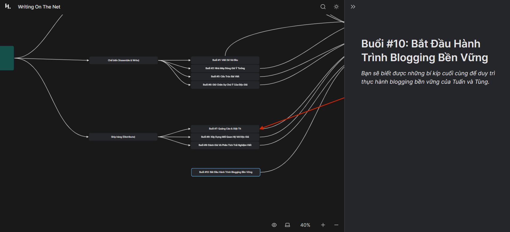
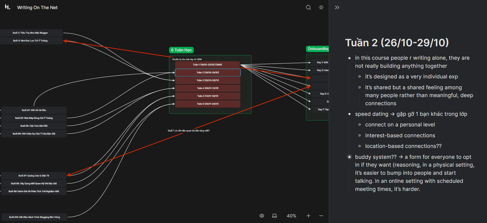
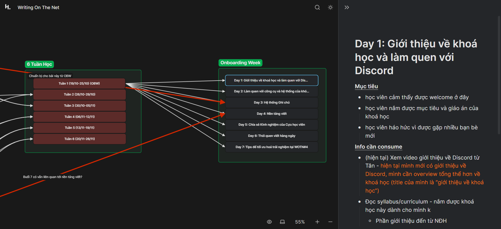
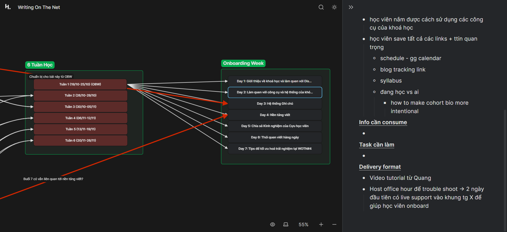

- 17:47 đã về sau khi 9h bắt đầu đi đến và cắm ở đó với mấy em, tiếp xúc và không phán xét đánh giá các em hay mem mới nữa mà trăn trở những vấn đề xưa. Qua chat với Hà Chuu và group bô lão
- 21:48 bây giờ mới tải gần xong...
- ăn cắp của anh tung hepta
	- 
	- 
	- 
	- 
	- 
	- 
	- 
	- 
	- 
	- 
	- 
	- 
	- 
	- 
	- 
	- 
	- 
	- 
	- 
	- 
	- 
	- 
	- 
	- 
	- 
	- 
	- 
	- 
	- 
	- 
	- 
	- 
	- 
	- 
	- 
	- 
	- 
	- 
	- 
	- 
	- 
	- 
	- 
	- 
	- 
	- 
	- 
	- 
	- 
	- 
	- 
	- 
	- 
	- 
	- 
	- 
- Quang → (3 bạn?)
  collapsed:: true
	- Thiết kế tổng đài SSL booking
	- Thiết kế sync office hour
	- Thiết kế WOTN FAQ
	- Thiết kế course calendar
	- Thiết kế communication channel phục vụ mục tiêu thông báo, tổng hợp ttin quan trọng đến từ BTC
	- Thiết kế policy + payment (Fuong đang làm)
	- Thiết kế không gian để tổng hợp tất cả ttin quan trọng cho học viên
		- content recap (Quang thiết kế space, Fuong thiết kế layout)
		- FAQ (Quang thiết kế space, coordinate vs Tân và Fuong về content + workflow)
		  bổ não (Quang thiết kế space, coordinate vs Tân về content + workflow)
			- cả material từ NĐH và material từ community
		- SSL contact
		- Course schedule + links
	- Thiết kế không gian để giúp học viên dễ dàng track blog
	- Thiết kế onboarding process và exit process
- Tân (2 bạn)
  collapsed:: true
	- Thiết kế các channel trên Discord phục vụ mục tiêu community building + peer interaction
		- bonding: giới thiệu, living room, humor, kudos
		- learning: bổ não, ý kiến/suy nghĩ về khoá học
		- bonding + learning: share ur wins, share ur struggles, writing gym, prompt of the day
		- → designed for peer interaction nhưng NĐH có thể tham gia trả lời
	- Thiết kế các channel trên Discord phục vụ mục tiêu thông báo, tổng hợp ttin quan trọng đến từ BTC
	- Manage workflow của Discord khi khoá học diễn ra
	- Train đội ngũ SSL tương tác vs support học viên trên Discord
	- Spotlight wins + milestones + honorable behaviors trên Discord
	- Thiết kế community weekly newsletter
- Fuong (2 bạn)
	- Coordinate vs NĐH về content + delivery của live class
	- Coordinate vs NĐH về learning materials generated bởi NĐH
	- Coordinate vs NĐH về learning content cần thiết cho OBW
	- Thiết kế structured peer learning sessions (learning gym và feedback gym)
	- Thiết kế prompt mà prompt học viên về live class content
	- Thiết kế recap của live class, build knowledge database để học viên dễ dàng xem lại và áp dụng trong khoá học cũng như xem lại sau khoá học
	- Đảm bảo các câu hỏi trên padlet được trả lời và đưa những câu hỏi hay được hỏi vào FAQ
	- Thiết kế các buổi community building online và offline
		- bonding & learning: speed dating, reflection, offline meet up, vv.
	- Thiết kế system for course assessments
- Khuê
	- Hứng thú Discord
	- Mục tiêu:
		- Mình muốn tiếp tục nuôi dưỡng sở thích viết blog cùng với một cồng đồng đáng iu
		- Trau dồi và kết nối thêm với những người cùng đam mê
	- Lí do:
		- Mình muốn lan toả và hỗ trợ những người thích viết giống mình cải thiện kĩ năng và vượt qua nỗi sợ viết cùng team Mở
		- Mình muốn học hỏi kinh nghiệm, style làm việc và sự hướng dẫn của các anh chị team Mở nhiệt tình
	- Mình muốn ứng tuyển vị trí Discord Coordinator vì:
		- Mình muốn mang tới sự tích cực, zui zẻ thông qua việc giúp đỡ, hỗ trợ mn trên Discord, cũng như mang lại tiếng cườ thông qua memes và khiếu hài hước
		- Mình xài Discord quen và khá nhạy với các tính năng ở trển
- Thái Hà
  collapsed:: true
	- Mong muốn quay lại cho vị trí community learning
	- → Fuong rất muốn train Hà thiết kế online community building events lâu dài
- Trâm
  collapsed:: true
	- hứng thú student success
	- Trở thành SSL tại Mở sẽ tạo động lực cho em viết bài đều đặn và học Tiếng Anh.
	- Em có cơ hội tiếp xúc với những con người "mới", thế giới "mới".
	- → good attitude + Trâm viết rất đều kể cả sau khi khoá học kết thúc
	- Môi trường ở Mở rất "mới" so với môi trường doanh nghiệp văn phòng tại Việt Nam. Mong muốn của các doanh nghiệp Việt Nam có thể gói gọn trong tầm nhìn của JOHNHUNT như sau:
	- "JOHNHUNT giúp cho nhiều người có việc, có nhân sự, thấu hiểu giá trị của đi làm và phát triển nhân lực, để trở thành nhân sự hiệu suất cao (từ hiệu suất cao được in đậm) mà công ty nào cũng khao khát."
	- Em vốn không đồng tình với tầm nhìn này. Từ "hiệu suất" vốn được dùng cho máy móc, cho đồ vật. Con người vốn không có hiệu suất. Con người có trí tuệ, sức khoẻ thể chất và có đam mê. Cái động lực làm việc của con người không chỉ đơn thuần là miếng cơm manh áo nữa.
	- Song, trong "thế giới nhỏ bé mà em biết", phần lớn các nhà tuyển dụng đều mong muốn tìm được người "hiệu suất cao" chứ không phải người chung tầm nhìn.
	- Còn Mở giống như cánh cửa kết nối với thế giới mà em chưa biết vậy. Một nơi muốn tìm người chung tầm nhìn, chứ không phải chỉ  đơn thuần chăm chăm vào việc "khai thác được bao nhiêu từ sức của người này", còn tâm tư của người ta ra sao thì mặc kệ.
	- Đó là lý do chính mà em muốn đồng hành cùng Mở.
	- Trở thành người có chiều sâu: Em muốn trở thành người nhạy cảm hơn, có chiều sâu hơn. Em không chỉ muốn nghe những lời người khác nói, mà cả những tiếng lòng mà đối phương không thể chuyển thành lời.
	- Nâng cao trình độ Tiếng Anh của bản thân: Trình độ của em có 550 TOEIC thôi (kết quả từ 3 năm trước), em vẫn đang học tiếng Anh. Em thấy mọi người tại Mở hay xài tiếng Anh xen tiếng Việt, điều này giúp em học được nhiều từ mới hơn, cả cách dùng từ đó nữa =)))
	- Thành thạo các công cụ quản lý làm việc online, hiểu được những mấu chốt trong làm việc online: Thời còn ở clb, vì dịch Covid, bọn em hoạt động online, nhưng nó không hiệu quả lắm. Nguyên nhân là do bọn em chưa biết "key" để làm việc online hiệu quả.
	- → chưa quá aligned vs student success role specifically tuy nhiên e ý có attitude tốt và tinh thần align
- Vân
  collapsed:: true
	- app community learning, hứng thú student success also
	- red flag: múi giờ Châu Âu và có conflict vs thời gian training + run khoá (sẽ hỏi lại cụ thể ở buổi call) → Trong khoảng thời gian làm việc của WOTN#4, mình sẽ đi thực tập full-time 9-5, và mình đang ở múi giờ GMT+2. Nếu đây sẽ là vướng mắc về thời gian, mình rất sẵn lòng thảo luận với MỞ nha :D
	- GMT+2 mà làm vào buổi tối tầm 8/9 thì Vân có host được k?
	- overall khá fit chỉ hơi lo availability
	- Mình đã nhận được rất nhiều giá trị từ WOTN#3, nên mình muốn đóng góp để MỞ có thể lan tỏa những giá trị này tới nhiều người hơn nữa. Trong WOTN #3, mình đã học được rất nhiều từ các hoạt động community, như speed dating, peer learning, và peer editing sau khóa. Vậy nên mình muốn góp sức để thiết kế các hoạt động học tập và kết nối có ý nghĩa cho các bạn blogger khóa WOTN #4.
	- Mình muốn được trải nghiệm và học về cách thiết kế các hoạt động cộng đồng. Đây là 1 mảng mình khá hứng thú nhưng chưa có nhiều kiến thức và kinh nghiệm. Mình đang tự học một chút về mảng này, nên mình mong có thể đối chiếu những thứ mình học được với trải nghiệm thực tế trong quá trình làm việc với MỞ và tích lũy thêm. Điều thứ hai mình muốn đạt được là, mình muốn học hỏi văn hóa làm việc của MỞ. Trong khi tham gia khóa WOTN#3, mình khá tò mò, vì sao team MỞ remote 100% mà lại giao tiếp hiệu quả với nhau như vậy. Mình ấn tượng với việc hoạt động nào team MỞ đưa ra cũng có nhiều ý định (intention) đằng sau đó. Các môi trường làm việc remote là những môi trường mình muốn tìm hiểu cho định hướng nghề nghiệp của bản thân sau khi tốt nghiệp, và từ những gì mình thấy trong WOTN#3, MỞ có vẻ là một môi trường remote tốt để mình học hỏi từ.
	- Mình muốn đóng góp cho WOTN#4 ở vị trí Community Learning Coordinator vì 2 lý do:
	  collapsed:: true
		- 1. Mình bắt đầu với mục tiêu (start with why):
			- Nghe có vẻ hơi mông lung ha :D Mình xin phép giải thích nè. Trong khi làm việc, mình hay tự hỏi: "Mình làm cái này để làm gì?" Mình nghĩ đây có thể là khuynh hướng suy nghĩ mình áp dụng được vào quá trình thiết kế community learning cho WOTN#4. Vì các hoạt động quan trọng đều được tổ chức online (Learning Gym, Feedback Gym, Community Reflection, v.v.) và trong thời gian có hạn, nên mình nghĩ mọi hoạt động nhỏ trong những buổi này đều nên được thiết kế và sắp xếp 1 cách có chủ ý. Ví dụ như là, chúng mình cho các bạn học viên vào phòng chia sẻ riêng để làm gì? Chúng mình đưa ra câu hỏi này để làm gì? Vì sao chúng mình chia nhóm 4 người thay vì nhóm 2 người? Mình nghĩ những câu hỏi này sẽ dẫn dắt mình đi tìm kiếm nhu cầu và pain point (Vietsub là nỗi đau?!) của học viên, để định nghĩa như thế nào là hoạt động học tập cộng đồng hiệu quả, rồi từ đó thiết kế các hoạt động có ý nghĩa cho cohort.
		- 2. Mình yêu thích việc học và mong muốn mọi người yêu thích nó:
			- Dù từng là một học sinh rất dốt từ lớp 1 đến lớp 10, ở thời điểm hiện tại, mình rất yêu thích việc học. Từ 1 người rất sợ việc học, để trở thành 1 người yêu thích nó, mình cảm thấy sự thay đổi này như 1 lần tái sinh trong cuộc đời mình. Một trong những điều dẫn tới sự thay đổi trong thái độ của mình với việc học, là sự thay đổi trong cách mình được hướng dẫn để học (learning methodology). Từ lớp 1 đến lớp 10, mình được dạy cách học thuộc lòng, cách học đều các môn và cách đạt được điểm cao trong các bài thi. Sau lớp 10, mình chuyển qua môi trường học tập khác. Ở đó, mình được dạy cách chọn chủ đề mình yêu thích, tìm tư liệu cho nó, làm việc nhóm, học hỏi qua trải nghiệm, cách chiêm nghiệm, v.v. Qua sự thay đổi về cách học này, mình cảm thấy kết nối và yêu thích việc học hơn. Mình cảm thấy kết nối hơn với sự học. Qua việc học, mình được chạm tới bản thân mình, và chạm tới người khác. Thi thoảng mình tự hỏi, nếu năm lớp 11, mình không được tiếp cận tới những cách học đó, thì bây giờ mình là ai? Có vô vàn đáp án cho câu hỏi này. Nhưng quan trọng nhất, mình hạnh phúc với con người mình đã trở thành. Con người này được làm từ nhiều lần va vấp, nhiều lần mày mò dò đường đi, nhiều lần learn và léarn. Vậy nên, mình muốn đóng góp cho WOTN#4 qua việc thiết kế các hoạt động học tập để giúp các bạn học viên cảm thấy kết nối hơn với sự học và gần hơn với bản thân.
- An
  collapsed:: true
	- hứng thú community learning coordinator, bạn khá tích cực tham gia các events Hà host ở khoá trước
	- SSL là những "touch points" gần gũi với học viên nhất, ngang ngửa với hai Người đồng hành. Thời gian mình là học viên của WOTN3, mình đã nhận được trải nghiệm học tập tuyệt vời - không thể không kể đến công sức của phần lớn các SSL. Nhờ list POTD và các bài recap siêu chỉnh chu của Thảo, nhờ những buổi virtual date ngọt ngào của Hà, nhờ meme của anh Hoàng, nhờ những lần có Tân vào đọc bài rồi comment khen, nhờ những buổi học được vận hành mượt mà bởi rất nhiều SSL tuy không trực tiếp lộ diện nhưng vẫn luôn đứng đằng sau âm thầm support bọn mình như Phương, như Quang,...đã làm cho việc học WOTN3 là quyết định khiến mình muốn cảm ơn bản thân nhiều nhất vì đã làm trong năm 2023. Vì MỞ, và vì WOTN là một khoá học mà mình rất yêu - từ cái cách Mở xây dựng nội dung buổi học, chú trọng đến trải nghiệm của học viên, luôn luôn khuyến khích mọi người feedback và đưa ra giải pháp sớm nhất có thể. Có lần mình bị lost trong đống tài liệu cả lớp gửi vào Bổ não, chỉ mới nói với Thảo đêm khuya hôm trước mà sáng hôm sau Mở đã có danh sách tổng hợp cho bọn mình dễ follow hơn. Và còn nhiều điều hơn thế nữa. Vậy nên, mình muốn trở thành SSL, để góp một phần nho nhỏ cộng hưởng và lan toả một lớp học viết mà mình rất yêu, để các bạn WOTN4 cũng cảm nhận được những gì mà SSL của WOTN3 đã làm cho bọn mình, và còn hơn thế nữa :D
	- Khi tham gia làm SSL của Mở, mình hi vọng sẽ giúp được các bạn học viên:
	  collapsed:: true
		- (1) Reflect và ứng dụng được lượng kiến thức dồi dào được tiếp cận mỗi tuần.
		- (2) Vượt qua nỗi sợ hãi khi đăng bài lên Internet hay cảm giác thiếu động lực khi lỡ skip viết hơi lâu.
		- (3) Kết nối và làm quen được với nhiều bạn bè cùng tần số trong lớp (như cách mà các buổi Speed Dating đã đưa mình gặp Vân, Thu Anh, Chi, chị Hương Đỗ,... vậy đó) :D (
		- (4) Tổ chức các buổi offline cho cộng đồng MỞ Sài Gòn: ăn phở, đạp xe, thả diều, đi triển lãm, đi xem kịch IDECAF, đi workdate,...
		- (5) Và còn nhiều hơn thế nữa.
	- Mình muốn ứng tuyển vào vị trí Community Learning Coordinator. Bên dưới là lí do khiến mình nghĩ bản thân phù hợp với vị trí này:
	  collapsed:: true
		- (1) Mình quan tâm và hứng thú tới việc thiết kế các hoạt động cộng đồng để kết nối các học viên với nhau. Hơn ai hết, mình hiểu được rằng sự thành công của WOTN3 trong lòng tụi mình ngoài nhờ những kiến thức được Tùng và anh Tuấn chia sẻ, đó còn là nhờ tụi mình được ở trong một cộng đồng gắn kết và luôn hỗ trợ nhau hết mực. Thú thật là ngày đầu onboard, một phần do chưa quen dùng Discord, phần nữa do từ trước đến giờ chỉ tiếp xúc chủ yếu với việc xây dựng cộng đồng trên Facebook, mình đã tự đặt ra câu hỏi, rằng liệu mọi người sẽ kết nối với nhau như thế nào? Và MỞ đã thực sự làm mình ấn tượng. Có được sự quan sát và trải nghiệm thực tế trong thời gian qua sẽ giúp mình đưa ra thêm nhiều insight từ góc nhìn của học viên - tụi mình đã từng có ngần ngại hay vấn đề gì khi tham gia các hoạt động, để mỗi hoạt động cộng đồng tại WOTN4 sẽ lại được trau chuốt và gọt dũa để trở thành trải nghiệm đáng nhớ trong lòng các bạn WOTN-ers tương lai.
		- (2) Mình nghĩ bản thân có thể "break the ice" mượt mà để làm quen với các bạn mới. Trong nhiều room được Mở chia random, rớt vào một phòng toàn các bạn hướng nội ít nói, mình đã nhiều lần tung hứng dẫn dắt cho buổi nói chuyện được trơn tru, tự nhiên và bớt ngượng ngùng hơn. Mình nghĩ đây sẽ là điểm cộng nho nhỏ cho những buổi gặp gỡ nơi các học viên mới còn ngại ngùng chưa mở lòng chia sẻ với nhau nhiều. Mình có thể là người tạo ra không khí thoải mái cho các bạn yên tâm chia sẻ, là người take care cho những bạn ít nói, giúp các bạn dễ dàng kết nối hơn.
		- (3) Mình yêu MỞ và WOTN.
		- (4) Bonus point: Mình ở quận 7! :D =)
		- Dù mình còn nhiều thiếu sót cần học hỏi, nhưng mình mong, mình có thể trở thành 1 mảnh ghép để cùng Team thiết kế nên những buổi Community Speed Dating, Learning Gym, Feedback Gym, Community Reflection, Ăn Phở, Workdate,...thật đáng nhớ cho WOTN4! :D
- Hương
  collapsed:: true
	- app vào student success, rất hợp host office hour
	- Mình có 2 mục tiêu:
		- (1) Học và hiểu một cách cụ thể về việc xây dựng và kinh doanh khóa học
		- (2) Niềm vui được làm việc mình thích, quen thêm bạn bè mới, được đồng hành cùng Mở và học viên
	- Mình sẽ tập trung vào 2 điều:
		- (1) Học viên được chăm sóc về mặt tinh thần và khám phá bản thân mình qua việc viết.
		- (2) Học viên hài lòng với hành trình của bản thân tại WOTN dù có hoàn thành 30 bài viết hay không.
	- Trong podcast: https://www.youtube.com/watch?v=YrO5X4k0XF0
		- mình đã từng làm công việc ntn 2 năm nay r, coach học viên ở 1 khoá học offline
		- có khả năng lắng nghe và toả ra năng lượng positive (reference: Minh Hoàng)
		- quan tâm tới sự phát triển của học viên
		- culture fit
- Hải Anh
  collapsed:: true
	- hứng thú với community learning coordinator
	- https://concrete-boron-0f6.notion.site/Community-Learning-Coordinator-84596e8fae2043478fe373505e556140
	- Trước đó em là học viên khoá 2, trải nghiệm học viết của em rất tuyệt vời và kể từ đó em đã sẵn sàng đăng những bài viết công khai, tin rằng bài viết của mình xứng đáng được biết đến nhiều hơn nữa. Để có sự tự tin như vậy thì bên cạnh những bài giảng hữu ích từ 2 NĐH thì còn có các SSL luôn bên cạnh cổ vũ tinh thần giúp mọi người đạt được mục tiêu viết 30 ngày. Rất may mắn khi có 1 SSL luôn đọc hết những bài viết của em và thấy được sự trưởng thành của chính em trong quá trình đó, vì vậy lần tuyển sinh mới này em mong muốn tham gia như 1 SSL không chỉ trợ giúp các bạn trong trải nghiệm viết mà còn kết bạn được những cây viết tiềm năng.
	- Em mong muốn sẽ học được cách giao tiếp hiệu quả khi kết nối với nhiều học viên với nền tảng và thế mạnh khác nhau. Giao tiếp hiệu quả biết được học viên đang gặp khó khăn gì, chẩn đoán đúng bệnh và đưa ra một số giải pháp phù hợp để giúp học viên đó. Hay từ nội dung mà họ hướng đến là một SSL em có thể đưa lời khuyên cách các bạn có thể phát triển nội dung theo hướng như thế nào.
	- Làm SSL sẽ là cơ hội tốt để học hỏi được nhiều kiến thức khác nhau từ các bạn học viên từ việc tham khảo từ các trang blog của mọi người. Em biết đến trang blog của các bạn và các bạn cũng sẽ biết đến trang blog của em ^^. Làm SSL cũng là cơ hội tăng traffic cho chính kênh blog của em và lan toả những nội dung em muốn truyền tải.\
	-
	- Ưu tiên đầu chính là các bạn phải vượt qua nỗi sợ viết công khai. Để vượt qua được nỗi sợ này thì sự cổ vũ và động viên đến từ cộng đồng là rất quan trọng. Các bạn không chỉ được hỗ trợ từ classmates mà còn từ các SSLs, và nhiệm vu của họ chính là xây dựng hoạt động như thế nào để các bạn mở lòng và gắn kết hơn.
	- Sau khi vượt qua được nỗi sợ đăng bài công khai, em mong các học viên sẽ thực sự tin và hiểu vào những gì mình truyền tải trên Internet. Sự tự tin ở đây rất quan trọng, bởi nó sẽ là (1) câu trả lời vì sao mình lại tham gia khoá học, (2) giúp các bạn vượt qua những lúc bài đăng của mình chưa nhận được lượng tương tác như mong muốn và (3) giúp các bạn ít bị ảnh hưởng khi có nhận xét/ ý kiến tiêu cực.
	- Bên cạnh việc tự tin vào những gì mình viết, với những ai mong muốn phát triển trang blog của mình thì việc biết chọn lọc và lắng nghe những ý kiến đóng góp, hay trái chiều với mình để rút kinh nghiệm, thay đổi format sao cho phù hợp với độc giả mục tiêu hay hấp dẫn được những độc giả khác trong tương lai cũng rất cần thiết. Bởi độc giả hiện tại bây giờ chưa chắc sẽ gắn liền mãi với nội dung mình viết, vì vậy các bạn học viên nên có tâm thế sẵn sàng học hỏi thay đổi , kết bạn thêm với những độc giả mới trong tương lai
- Bình Minh
  collapsed:: true
	- https://drive.google.com/file/d/1xIVjEj9e1A8GjcT1J2rgjSHe81aj3xb8/view
	- hứng thú Discord và SS
	- Cả hai vị trí nghe đều rất exciting and challenging. Tuy nhiên em mong muốn được làm ở một vị trí thôi để đảm bảo được chất lượng công việc. Về khả năng và xu hướng làm việc, em nghiêng về Discord Coordinator. Em cũng đã từng làm việc ở những vị trí tương tự. Về mong muốn cá nhân, em đang hứng thú về những công việc của Student Success Coordinator và rất háo hức nếu có cơ hội thử sức ở những tasks miêu tả.
	- Em chuẩn bị du học đến Pháp nên sẽ occupied mất một tuần đầu để settle down. E bay ngày 19 nên sẽ occupied đến ngày 26/9. Sau đó lịch học của em sẽ còn flexible còn tùy vào nhà trường thông báo ạ, nhưng em sẽ cố prioritize this. → again múi giờ Châu Âu nhưng có nhiều availability
	- thói quen cá nhân của MB hay check tin nhắn và speed respond cao khá fit vs role Discord
	- Về SS thì có thể hơi trẻ 1 chút (em ý aware). Nhưng về mặt tool và system thì e ý có thể fit hơn
	- 1. Em muốn học được nhiều nhất có thể từ những Leaders, (Future) Colleagues ở MỞ. I'd be more than honored to work among one of the greatest minds I've ever met. Học từ những cái đơn giản như mindset, work ethic đến những cái sâu hơn là cách vận hành một community - đây cũng là cái em rất muốn được học thêm nhiều.
	- 2. Ngoài ra, đây cũng là cơ hội tốt để 'dấn thân' sâu trở lại với viêc Viết - bằng cách đọc bài của mọi người và viết cùng mọi người.
- Gia Hân
	- hứng thú vs community learning coordinator
	- có vde về thời gian
	- Em vừa hoàn thành việc nhập học vào trường đại học và từ giờ đến cuối năm 2023 sẽ là học kì đầu tiên của em tại trường nên em nghĩ sẽ có những khó khăn nhất định về việc thích nghi với một môi trường mới. Dù vậy, với em, MỞ cũng như một ngôi trường thứ nhất (không phải thứ hai :>). MỞ vừa là nơi em được học, nơi có một cộng đồng tuyệt vời. Trở thành một phần trong ban tổ chức của MỞ đã luôn là khao khát, là mục tiêu của em và bây giờ em đang có cơ hội thực hiện khát khao ấy.
	- Lí do em muốn đăng ký tham gia làm SSL là vì em rất thích văn hóa làm việc ở MỞ. Những thành viên của ban tổ chức MỞ luôn mang trong mình "ngọn lửa", em thấy mình luôn học hỏi được một điều gì đó khi quan sát ban tổ chức MỞ làm việc. Và thật tuyệt vời khi được làm việc cùng những con người mà em đã và đang được truyền lửa từ họ. Em thấy mình đồng lòng và có cùng mong muốn với Writing On The Net. Cùng với đam mê của mình với việc viết (và blogging), em mong có thể đồng hành, hỗ trợ, giúp đỡ những người khác trong cộng đồng trên hành trình này.
	- Nếu có cơ hội được tham gia làm SSL tại MỞ, em mong được giúp học viên:
	- Cảm thấy được kết nối với cộng đồng, cảm thấy an toàn khi trao đổi, tương tác với mọi người trong cộng đồng qua những buổi Speed Dating và hoạt động gắn kết cộng đồng (như ăn phở).
	- Được thảo luận, phản biện, đào sâu và trao đổi cùng nhau về bài học hay những chủ đề khác thông qua những buổi Learning Gym
	- Có không gian và thời gian được thiết kế để góp ý bài cho nhau Peer Editing, Feedback Gym,...
	- Nắm được những điều đang diễn ra trong cộng đồng (dù có bận rộn) nhờ những email recap
	- -> Giúp học viên có thể học từ nhau và học từ cựu học viên, hiệu quả.
- Đọc mấy cái này xong đ muốn làm gì ở MỞ nữa và dù vào mình vui mình cười như bị chuốc thuốc, vẫn có gì đó không có chỗ cho buồn, một nửa mình vẫn có lúc buồn thấy không hợp khi không ở trong đó, kì ha, mình nhớ lớp, nơi mọi cảm xúc đều khít vừa. Mình viết hơi mang tính trả bài, không được viết thứ mình thích dù cái thích thì hiếm khi dành thời gian cho mà viết. Đó là lí do mình nếu được vẫn muốn nhận bản thân là nhà văn hơn là blogger (tông giọng họ luôn là gì đó để chia sẻ, cho nhiều hơn là chia sẻ, mong để nhận lại dù biết chẳng có đâu), dù blog ở dạng thức bản chất nhất là những tiếng nói như thường, như lời tâm sự. Người ta dường như luôn ngây thơ trước khi biết sĩ diện, ngại ngùng (mà không đăng thế nữa)
- Nhưng phải hiếm lắm mới có chỗ khiến mình buồn trong lúc nhận thức, thường như ở trường mình kệ chẳng đáng buồn nổi.
- Mà, đúng là dù ở Chu mình không viết hết, nhưng chỉ ở Chu mới viết hăng đến vậy. Ra khỏi Chu chẳng tha thiết viết gì. Mình không muốn tìm lãnh vực trong văn của mình nữa. Tôi không cần vùng đất mới vì tôi là người kẹt lại, thật tệ nhiều khi tôi lo và buồn, xấu hổ với nó. Ở lại với kí ức và cảm xúc có gì sai? Và từ đó mình nghĩ ra ý tưởng #cvatrongtoi: mắc kẹt ở Chu. một cô bé mắc kẹt ở Chu, có thể là mãi mãi ở nhà B? cô nhìn ra, cô tưởng tượng thế giới trôi, nửa an nhiên, nửa buồn bồn chồn xót xa cay đắng như thể không làm không được, không chạy đua với thời thế không được, dù lúc không được cũng chẳng tệ mà lại vui... day dứt.
- Chà, một thời mình đã chống thứ văn phải viết như thế đó, giống cái mình sắp, bảo sao mình không giải cao :P. Thôi thì tìm cách yêu thôi, cái gì chẳng yêu được. 30 ngày viết không phải vượt qua nỗi sợ, mà yêu nổi sự viết, đặc biệt là cái viết tầm thường, cái phải viết như nghề như nghiệp?
-