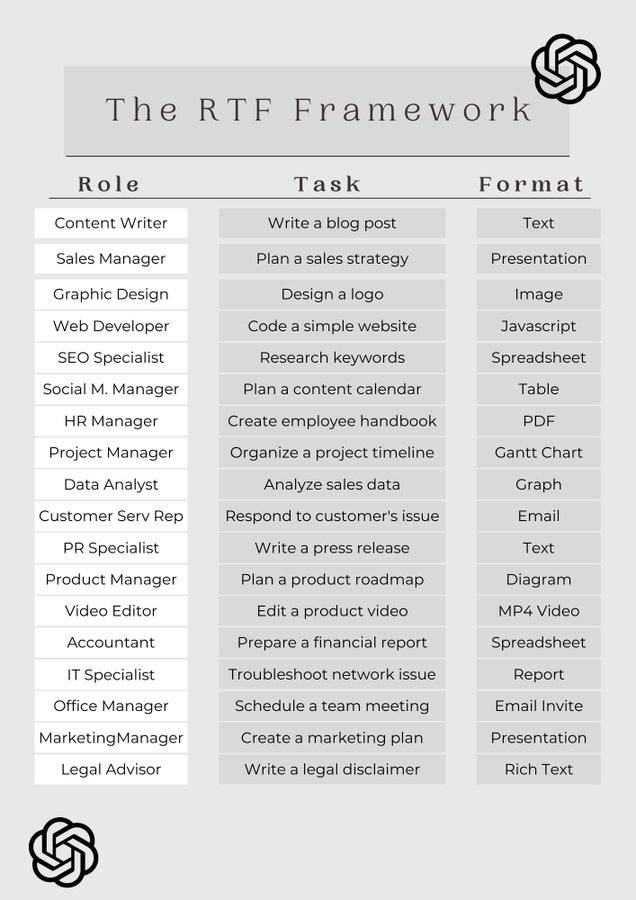
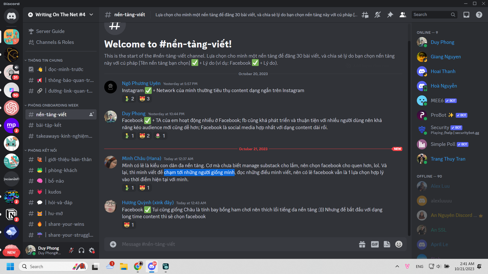

- WOTN có nói đến hai phạm trù người viết và độc giả, thế còn bản thân tác phẩm? nếu content trên mạng nhìn dưới đặc trưng lí luận văn học ta có gì? ta sẽ thấy sự khác biệt tạo nên tác phẩm văn học và một bài content ra sao? điều gì tạo nên cái đó tư duy quy trình lúc viết trong văn không nói tới nhiều, wotn có nói đến thu lượm data để đọc và tiêu thụ? không gian viết nữa, thời gian viết thì sao? có ai nghiên cứu góc độ sinh học, vật lý của các hoạt động đó không?
- Mình muốn làm một hệ thống mà, ở đó hệ thống hóa đánh giá mọi thứ, dù thích tìm hiểu một cái cụ thể hay nhìn toàn bộ đều có AI trợ giúp nhìn nhanh, nhìn ra pattern theo lệnh mình đặt, theo câu hỏi mình nghĩ được, nó nghĩ hộ cũng được mà cho ta thấy câu gì đã được hỏi cũng có, trả lời như mình nói chuyện với mọi người luôn
- #AI Và nó được thiết kế để lên lộ trình gần đời (tức tiêu thụ những thứ sát thời đại), hoặc xa thời đại là lịch sử, tùy người, tùy khả năng và sở thích để dù thế nào thì bạn sẽ không bao giờ thua ai về kiến thức
- Làm sao để đọc gì, đọc như nào mà không kẻ nào biết đọc có thể giỏi hơn bạn là một cách. Làm sao đọc 1 nghĩ được 10, hiểu 10,... tất cả có lẽ đến từ câu hỏi được nảy ra thêm rằng nếu thế này thế kia thì thế nào, câu hỏi để đào sâu tại sao
- AI giúp mình đánh giá (phân tích các đặc điểm của tác phẩm đó, phạm vi, phản biện, phân loại,... mình chưa rõ, nó không nên chỉ là chia type mà để xếp được rank chẳng hạn hay so sánh đáng ra bạn nên đọc này thì hơn nếu ở phần này, cả về kiến thức lẫn cách viết - kể, thì phải nhìn được tổng cục đã... một cách logic có hệ thống chứ không phải đọc bừa đọc hết là được gọi là tổng cục đâu mà là tả phí lù) và tổng hợp thông tin, về sách chẳng hạn, review sách để xem qua đôi khi cũng có thể cần, nhưng nên là loại review để người ta thấy chắc chắn hợp mà không ẳnh hưởng trải nghiệm đọc nếu người ta đọc kể cả kiểu giải trí (không spoil) nhưng tác phẩm hay thì không bao giờ spoil được, có spoil cũng không ai đủ giỏi để nói được cái cốt của phim mà khiến người ta hình dung ra được cả bộ phim đến mức không cần đi xem nữa. Cũng chẳng nhớ lúc quan sát một thứ gì đó to lớn đến thế đâu
- Từ phim 12A và 4H, mình nhận ra bố mẹ hay nói việc học là trên hết nghe ngu vl, họ nên tính cái trên kĩ vào này.
- 
-
- xem xong 12A và 4H, thôi xong một ngày làm việc và chơi, mai cày cuốc học thôi
- có lẽ phải đọc trong tâm thế khác thì mới thấy được cái hay chứ tâm thế thu lượm cái hay nhất của người ta để gom vào, tổng hợp, phân loại, sắp xếp, đánh giá, tận dụng thì idk, khô khan quá, thực dụng quá
	- 
- Có một điều nghe phũ nhưng phải chấp nhận là Đôi khi ta phải chấp nhận ta không dạy được ai đó (cụ thể là cái gì đó), để từ đó nhà giáo không bỏ cuộc thì họ sẽ nghĩ cách. Họ sẽ không dạy lại cho ai cái gì họ biết rồi, cũng không chỉ dạy cái họ biết mà người kia cũng nắm được nhưng nó ở nhánh khác, trường phái khác mà design theo cách học của họ, major của họ trong một ngành - cái gì trong Tourism chẳng hạn, hoặc liên ngành, tourism tech sẽ khác tech và tourism truyền thống, chỉ họ cái nhánh đó của thứ họ học có gì: kiểu English For Tourism aid họ cái mới, tùy theo nhu cầu của họ ví dụ (IELTS để giao tiếp và mình định hướng speaking nhiều hơn, no not enough)
-