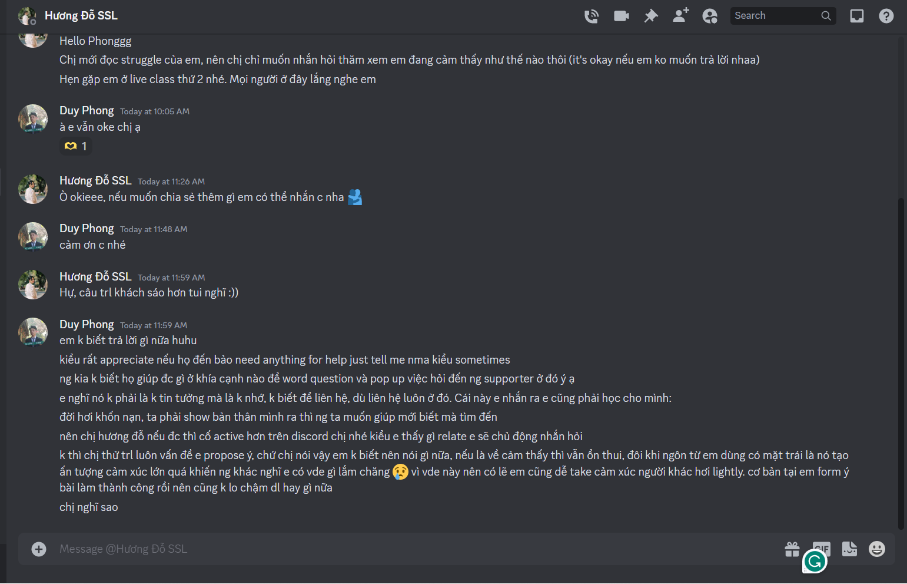
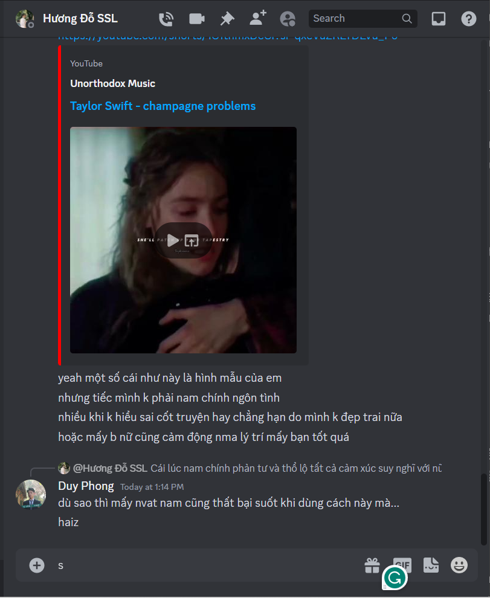

- Giá trị môn English For Tourism
	- 
- 10:34 prompt viết gì cho mình 2 năm trước hay phết, nó giúp ta dễ nhận và tìm được trong kho trí nhớ những nhu cầu, mà nhiều người sau này cũng sẽ như mình
- 11:17 mà anh Tùng trong live class giảng tại sao cần này tại sao cần như nào nhỉ, không có vẻ là chỉ rõ ra logic của cái cần như mình: để làm gì, điều đó cover hiệu quả ra sao, hoặc mình không để ý đến thế, có thể nó tốt vì trơn hoặc không vì người ta có thể quên cách suy luận
- 
- {:height 631, :width 511}
- 
- 14:10 vùng lan, thay vì nói về mỗi buổi chị có thể chơi khó nữa là nói tưởng tượng và giá trị chị muốn giao, tại sao lại chọn những cái này để cho vào?
	- 14:22 mình không muốn nghĩ nhiều vì đã nghĩ cực kì nhiều rồi, quan trọng nghĩ sâu nghĩ nhiều để làm gì, định làm gì? khám phá hết về sự chơi à
	- bọn văn hơi dễ bay xa xôi ha.
	- cái sự thoải mái của chị nó khiến mình không chút phòng vệ luôn, kiểu như chúng ta quen nhau và gì cũng sẻ chia được chứ không như ở chat. dễ gần bởi rất hoạt bát
	- lịch sử vấn đề, ồ nghĩ ra cách giải quyết này cũng hay, nhưng mình vẫn nghĩ trước tiên nên xét từ thực tại, vì nghiên cứu nào cũng bắt nguồn từ thực tại màu mỡ trước khi nó bị mất đi, và dù tổng hợp được lịch sử vấn đề, nó cũng không đa dạng bằng chiều ngang hiện tại. Chỉ là lịch sử sâu và vì nó nhiều nên nó cũng sâu.
	- và cũng chỉ cần lịch sử vấn đề trong trường hợp lịch sử trải nghiệm của mình chưa đủ lí giải để nói ra, một số cái chân lý nếu trước giờ không bị phủ nhận hoặc phủ nhận đúng rồi thì lấy luôn cũng được, nói lại tư tưởng cũ làm gì trừ khi định miêu tả bước tư duy và hoàn cảnh tư duy của nhân loại
	- 14:30 cái hoạt bát đó có cái tốt là nó khiến người ta somehow dễ follow, và nhấn nhá, và đảo liên tục qua lại không buồn ngủ, nhưng mình rất khó break ra để nghĩ và phản biện hoặc multitask, chị đi nhanh quá :'( dù chỉ nói ví dụ để ? giúp người ta hình dung hay gợi mở gợi suy nghĩ bằng cách đặt vấn đề qua ví dụ?
	- 14:35 đặt vấn đề Tây hay Đông ở câu hỏi khá thú vị, nó là một yếu tố thuộc về việc có hợp hay không để mà xét. Xét rồi xem cũng được
	- cái nguyên nhân của sự chơi có lẽ tự đọc là tự hiểu chứ cũng chẳng cần chứng minh thuyết trình, cái giảng mà chị đang làm đâu, nó buồn ngủ. Có gì mới ở chị thì nói em thôi
	- 14:43 chơi có giá trị hồi phục như ngủ, ngủ cũng vô dụng bỏ mẹ nếu bỏ được
		- và ta có thể bật mode học trong lúc chơi mà
	- 14:47 mà nói chơi chỉ là chơi cũng chưa chuẩn, những biến thể của nó, ta giỏi trong lúc chơi, chơi game nâng kĩ năng chẳng hạn? cũng có phải không nghĩ không căng đâu sao người ta giỏi làm mình nghiện thế, làm thế với học, thi đi. Hay chơi, chỉ đơn giản là tận hưởng thôi.