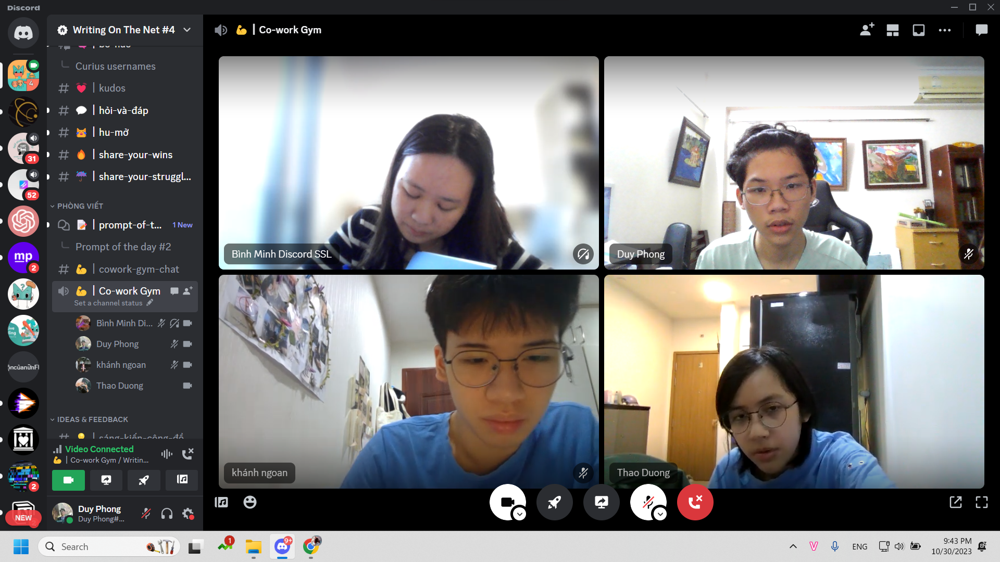
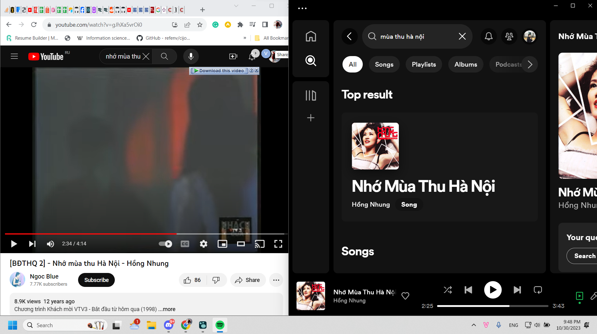

- LATER Thuyết trình Lịch sử Văn Minh vào thứ 5
- TODO Viết xong draft English for Tourism (ít nhất) vào thứ 5
- TODO Mỗi ngày mất 1 buổi để viết WOTN
- TODO Họp English for Tourism vào T3
- TODO Dạy tối T3
- TODO Hoàn thành nội dung thuyết trình English for Tourism vào T3
- TODO đọc nốt cho hiểu ra tại sao mình hiểu sai, tổng hợp thông tin và làm BTVN Kinh Tế Chính Trị. Cố sáng mai xong
- TODO Cuối tuần trước CN làm BTVN Vùng Lan đi
- Tối nay cố làm tiếp essay English for Tourism và viết nội dung thuyết trình
- Không nhắc bọn nó à, thôi bọn nó làm xong rồi thì peer pressure lắm
- Họp tư duy sáng tạo vào tối t6
- Đéo có thời gian học tiếng Pháp luôn, à không hình như mình vẫn học sáng được mà, có còn hơn không, thế phải học tiếng Pháp mỗi tối lại rồi, cố lên.
- Sau vụ này nên thay vì chơi game hay làm việc khác thì học tiếng Pháp đi, kệ Chu Văn An trong tôi ở đó, sắp xếp dữ liệu muộn hơn chút cũng được
- **Đọc Course Guide xem đi, phần marking chắc nó sẽ gợi ý thế nào là đúng để chấm. Trước Doanh chê điểm kém do không đọc, nhưng thế tức tư duy mình có thể chưa đủ tốt hoặc tốt rồi nhưng các cô cứ thích kiếm thừa chuyện hoặc tư duy các yếu tố điểm trọng yếu khác. Cái không cần làm thì làm không được gì**
- Nói về cấu trúc một bài viết, đôi khi nên dựa theo cái gì thú vị với mình, mà tính được sở thích người đọc luôn thì tốt. Chứ cứ theo cấu trúc quá đôi khi lại rõ là khuôn khổ.
- Mà có gì không thể viết trên mạng vì khó viết, nhiều người không có khả năng khắc hoạ, nhiều người không dám nói dám kể vì tính cách, tâm lý và có gì chưa ai làm, chẳng hạn ở mức độ chi tiết nào đó? Đối tượng nào đó? Kiến thức sách giáo khoa trình bày đủ lên mạng có được không, rõ rạch ròi đủ là như nào. Không phải cứ 5W là đủ chứ? Mỗi W cũng phải có tiêu chuẩn riêng chứ? Nhưng thôi cứ tổng hợp thông tin ở Notion trước đi. Giáo trình ở notion rồi tìn cách chia nhỏ, hoặc đổi hình thức phổ cập khi lên mạng.
-
- Cái cần nghiên cứu đó có thể là Team Leader tốt: học từ quản trị kinh doanh? Vì cái tính thực tế liên quan đến tiền? Event Manager đầu óc tư duy được hết? Hỏi aki xem có gì phức tạp sao mà chị chưa lên rank cao hơn được trong ngành event? Rồi risk management thuộc lĩnh vực nào. Production của film học từ đâu
- 
	- góc mặt cúi gần xuống kia hình như là góc nam thần học đường Trung Quốc
- Hạn chế lớn nhất của Spotify là nó không có đa dạng
	- 
	- thời kì và người hát như Youtube, riêng đoạn này một bài mà mỗi người một âm sắc lại làm sống động tác phẩm nghệ thuật nhiều hơn.