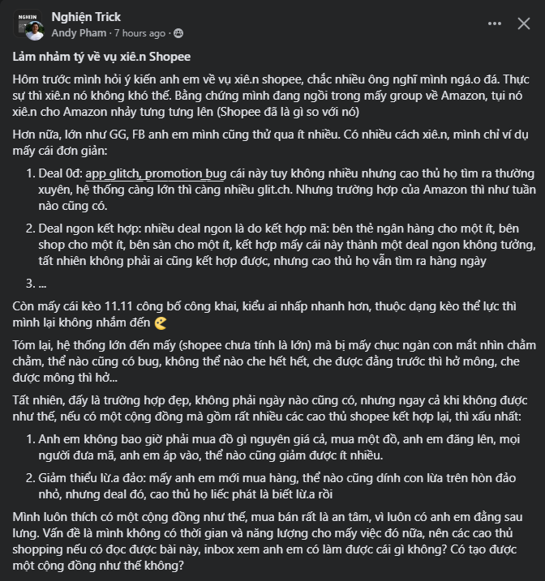

- 07:28
	- 
- tí nữa đi học tiếng Pháp, chiều có meeting với Quả Cầu, tối dạy, rồi họp Tư duy sáng tạo và khởi nghiệp, mà chiều nên note ra một số ý tưởng để buổi họp tối nhanh hơn
- đêm t3 sau khi họp lớp xong về viết, đã đăng bài, tối ngồi call với lã dù không làm gì mấy
- tối thứ t4 sau khi đi học về có MỞ Mang đồng thời với test snapgit fail với tọa đàm về du lịch, hơi tiếc đống kiến thức không thu lại được dù có cũng rất ít khi mở ra xem, cũng chỉ tua nhanh, may có thằng bạn gà ngồi chép hết hộ - u can record mà.
- đêm qua ngồi viết thêm bài WOTN lúc tối để nay đăng, định là bài qua nhưng qua kiệt sức qua sau 1 ngày làm việc ở trường, về phát ngủ luôn rồi dậy chỉ học, ngồi đọc manga, chơi và viết
- thứ 2 đến trường rồi lại về, đi cắt tóc đến trưa về.
- thứ 7 sáng đến trường, chiều đi với lã, tối có lẽ đi vẽ, rồi phải tranh thủ tùy lúc làm luận đi
- còn phải ôn thuyết trình tiếng Anh du lịch, rồi đọc chuẩn bị thuyết trình kinh tế chính trị vào thứ 3
- chủ nhật sáng đi sự kiện nhà xuất bản khác, bỏ học WOTN chiều đi sự kiện hương mi lê ở the outpost, tối học vùng lan
- còn một số hoạt động khác như sáng t4 tìm thêm thông tin viết luận để t5 consult rồi qua Chu rồi mới đi
- Khánh có gọi rủ đi ra quán hưng nhưng bận vl tối t4
- và các buổi họp đột xuất môn phương pháp luận đầu tuần vào t2, tối đó cũng call anh Hoàng Long thì phải, lần lượt và dai dẳng vì mãi chưa xong do tính sai thời gian lao động, cũng có thể do trình kém chứ không phải lười và không hiệu quả