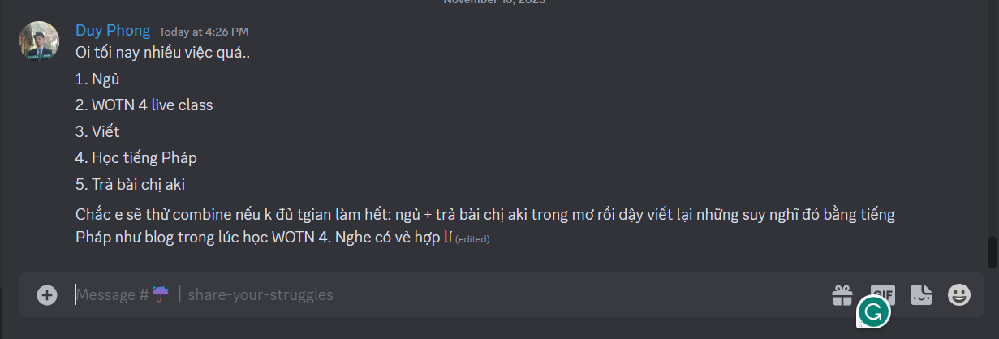
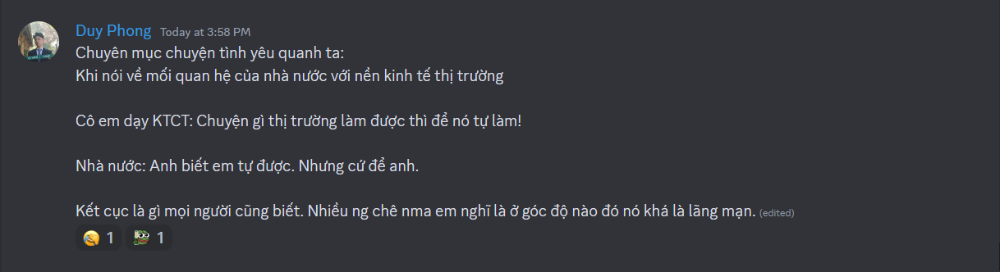

- 00:19 mới xong bài viết của MỞ, giờ mới thâu đêm hoàn thành luận văn.
- 
- mà khoan mệt quá quay tay đã, nãy ai nhắn cái đéo gì nộp nộp làm hoảng vl tưởng đóng drive. sang mai môn lịch sử được nghỉ, có nên bùng mẹ cả một buổi phương pháp luận không nhỉ, đằng nào cũng chẳng được 10 với team kém và không chủ động đâu, dù cũng phần nhiều là lỗi mình, đã không nhắc và sắp xếp xúc tiến team làm, đẩy lịch. Mình làm cũng chẳng quá tròn trách nhiệm một người làm thành viên. Để đỡ khổ thì thay nhau nhắc, làm lead đi chứ tao làm lead là tao không làm tròn trách nhiệm thành viên được, cống hiến hết mình như một supporter ý
- Giờ cũng chỉ cần viết lại thôi vì data, citation đủ hết rồi, mất hai ngày tìm kĩ từng từ, sát từng ý để minh họa cho lập luận. Thế là 5 tuần rồi không học nổi tiếng Pháp nhiều hơn một buổi dm, và cũng tầm đó mình đã không vào điền, không làm cách task mà mình đề ra đều được.
- 16:57 tắm xong sau khi 4 giờ hơn về vì nay tan muộn
- đi trên đường nghĩ được hai cái này hay phết
  id:: 6555e796-f098-4258-a619-ff938d86b464
	- 
		- Đây là phương pháp học multitask dồn làm một. Nó có cái lý ở chỗ ta học qua thực hành, học qua khía cạnh khác nhau của vấn đề, và ghép các cái đấy vào để thành một việc thôi. Thời gian có thể tiết kiệm kha khá mà vẫn gọi là có học. Còn muốn học cái gì cụ thể thì sẽ phải tùy, vốn ban đầu là 5 cái khác nhau. Nhưng đời người có lẽ chỉ làm 3 là max
		- cái lý của nó nằm ở chỗ học từ viết cũng là một cách học từ mới.
			- lí do mình ghi vào đây vì cái liên data base đó tự dưng có lúc thấy làm thì sẽ rối lắm, nó chưa hoàn chỉnh được đâu, mà đây cũng mới chỉ là học, có những thứ không phải học thì tính sao, đời người có những công việc chung gì? tiếp thu là học? nghỉ ngơi là chơi?
				- và phải có nghiên cứu chứng minh được liên kết ở trong page khía cạnh đó, rằng trong trường hợp nào nó vẫn được đảm bảo hiệu quả, và hiệu quả là hiệu quả ở cái gì, bổ cái gì
		- cái aim của phương pháp này là học 1 hiểu mười, làm 1 nắm mười, nhưng chú tâm dành cho những người có nhiều việc phải làm, làm từng cái thì không bao giờ xuể
		- sau này có kho những cách học, sẽ tùy trường hợp mà chọn ôn lại từ mới hay học cả mới cũ qua viết (đây thiên về phương pháp hơn, tức là muốn học cái gì, như nào, chẳng hạn space repetition, hoặc qua việc nghe, còn nghe là nghe ở cái gì thì sẽ là thao tác)
			- tưởng tượng mở Notion ra: lướt lướt cái data base oke hôm nay chúng ta sẽ học cái này theo cách này đi, vì ta... có nhiều thời gian chẳng hạn
				- kiểu bạn muốn học hybrid? oke, hôm nay bạn phải làm những gì? oke, rồi show toàn bộ các data base của các việc mình chọn, tùy cái mặt mình chọn rồi, những cái kia option không tích được như trên portal VNU, mà cần gì, sort sang những mặt khác là được, hơi thủ công tí, chắc cũng làm được ha, chỉ là tự dưng sao nãy nghĩ không được cái gì, có lẽ cũng bởi chưa có những phương pháp và thao tác khác cụ thể rõ ràng mà bù vào
		- và khi có một đống việc thì tùy việc nào đã chiếm mất hành vi nào (mặt ngôn ngữ của việc? mặt tư duy của việc? mặt thao tác ghi chép tổng hợp?) và ta chọn thao tác học (khác phương pháp, tức là làm cái gì )cho từng môn phù hợp thôi
	- Humor trong học cũng thú vị
		- 
		- không chỉ là một cách học, cách truyền đạt hề, có khi nó là phương pháp được rồi ý nếu mở rộng hơn, cách sẽ là chi tiết hơn, chẳng hạn nạn nhân hóa bản thân, thao tác là có thể đặt câu hỏi, nói này kia, nhấn này kia
		- nhưng cái hề đến từ đâu? từ sự gợi điển tích, mà tùy, có cái là gợi, có cái như mình cũng là ẩn dụ nhưng tạo ra nghĩa mới: sự lãng mạn. Còn người ta bình thường chỉ link nó với cái gì tương tự, tương đồng.
			- 
		- người ta là biểu hiện, mình là sáng tác
- Tí dậy nhớ điền nhiệm vụ mới cuối kì vào notion sprint: đặc biệt là hoàn thành nốt những bài giữa kì như KTCT.