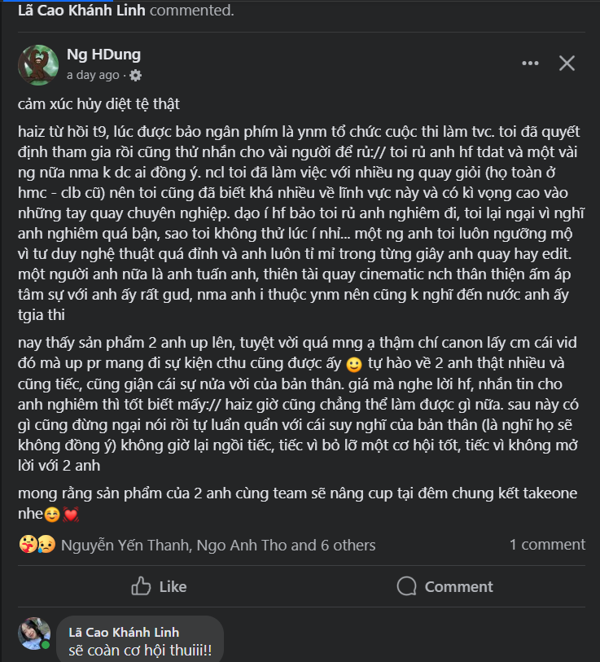
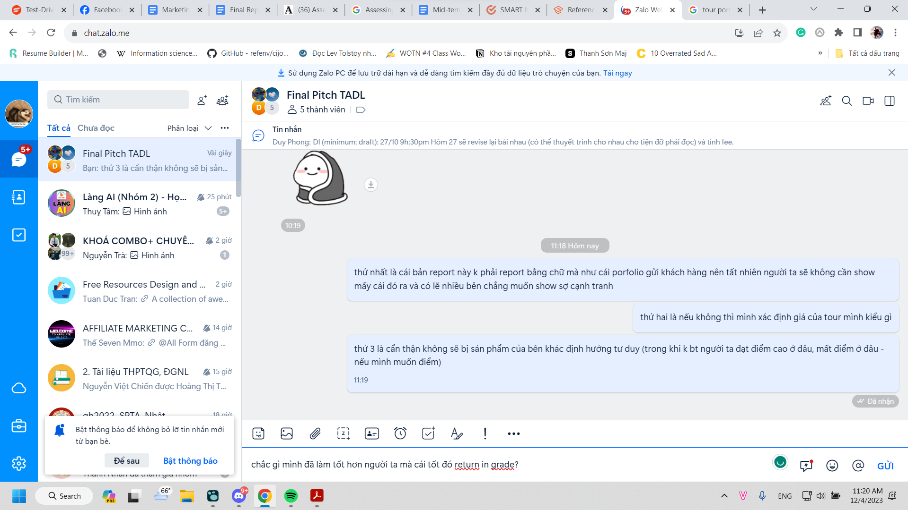

- 10:36 chưa bao giờ mày được ai khen vì tư duy nghệ thuật đâu
	- 
	- đừng để đến lúc có phim để quay xong nó không khác gì cục cứt. 2000 năm Thăng Long có luồng nghệ thuật nào chảy vào Chu đều phải được tái diễn hoàn toàn lại, và dùng nghệ thuật mới để biểu hiện tốt hơn
	- miễn sao nó xác lập một trường vực để giam người ta ở đó, nơi đó ta là chúa tể.
		- tất nhiên mấy anh kia vẫn sẽ còn gà lắm với những người chuyên nghiệp bên Tây, nhưng họ giàu và từ nghề của họ họ cứ kiếm thêm, mình thì càng đi xa càng chết mòn, được cái đi nhanh không ràng buộc và rất có chí tiến lên, thế nào là tư duy nghệ thuật, thế nào là tư duy đỉnh hơn, để không ai hiểu được nhưng phải câm lặng? thế nào là chỉ ra lệnh được và không ai thay thế được mày, rồi mày cho phép người ta thay thế bằng việc viết tất cả ra, cố hết sức tái tạo lại bản thân cũng không ai làm được?
		- mày không có môi trường nuôi cấy tốt, bị quật vào thế giới hỗn mang các tài năng được lấp trọn và liên kết bằng ảo tưởng của mày về những thứ mày không biết, tưởng tượng chưa chắc đã đúng, nhưng vượt qua được tưởng tượng thì sẽ luôn tốt hơn hiện thực Phong ạ.
		- sao để bọn bách khoa, bọn neu đã có thế mạnh về chuyên môn không ai đọ được, lại chiếm lĩnh được nghệ thuật từ công nghệ được
		- mày có gì? cơ hội tiếp xúc văn hóa nước ngoài và làm chuyên nghiệp? vì rảnh? chứ vì học tiếng Anh tiếng em gì thì ai chả học được? giờ còn ai kém? nó cũng chỉ là công cụ
			- cái mày thích chẳng phải là đem tất cả cái tinh túy nhất, nhưng người được cho là giỏi và nổi chưa chắc đã đáng ngưỡng mộ đến thế, mang về đây, và tìm cách cho chúng kết hợp được với nhau
			- và làm sao người ta không thoát khỏi lời chào mời của mình được, chứ bận, lúc đéo nào cũng bận
		- bên nhân văn thì có các triển lãm nghệ thuật, còn mảng nào của nghệ thuật chưa ai đi, không ai đi nổi? nghệ thuật truyền thống mà mày hay theo đuổi? thế không đọ nổi các trường dạy nghệ thuật ở Việt Nam đâu, chưa chắc họ dạy giỏi nhưng họ có môi trường để cái gì đó liên tục phủ định nó mà phát triển
		- Nghệ thuật của cái chưa có, một trường phái mới phải ra đời và thành trào lưu chi phối tất cả, không chỉ cái được biểu hiện mà ở cả mức độ thực hành cũng phải thật điên rồ, là chúa tể của nghệ thuật.
		- con đường theo đuổi tri thức vẫn luôn là cách cứu mình, để mình khinh lũ chỉ biết làm rồi để ai đó nâng tầm giá trị của họ - độc giả qua lời phân tích mến mộ bàn tán
			- mình ta sẽ đứng trên đỉnh tất cả, ta cho tất cả mọi sự chỉ dẫn, nhưng không ai kết nối và lí giải, theo nó được hết, nó là một sự mã hóa máy cũng mất nghìn năm để giải ra, nhưng giải ra sẽ nhận được tất cả thứ mình muốn?
				- nhân loại 1000 năm sau cũng nằm trong tính toán của ta, không ai lí giải hết được cái hay trừ chính ta.
				- để chống lại lũ thợ hạn hẹp tư duy, ta phải vực dậy vai trò của tác giả tối thượng, không thì cả đời này về sau rác thải lẫn bạch kim đều được đặt trên bệ riêng, dù có không đặt cạnh mà chia khu, thì vẫn chẳng có sự phân cấp triệt để, chẳng có bất kì sự phân biệt đối xử khách quan tuyệt đối nào cả
				- 
				- nhìn ví dụ cái chữ we can đi, ngoài ý tưởng, thì có cái gì họ không làm được nếu được đặt ra trong một hoàn cảnh nhất định không? chứ danh tiếng chưa chắc đã giúp được tương lai thành thực, chứ gọi là biết cũng chưa chắc đã thấu đúng cách hiệu quả nhất ở tương lai, vậy làm sao biết ai, vậy làm sao để kẻ làm được được tìm ra và hóa thành kẻ mạnh, kẻ thống trị, tùy thích chà đáp kẻ yếu nếu muốn?
		- nhiều lúc chẳng muốn làm cùng với bọn nó là vì thế, vì nghĩ mình kém hơn, làm cùng người giỏi hơn cũng vui nhưng cảm giác bọn nó khinh, và thật sự mình kém nên không làm được nổi... phải đủ giỏi hoặc có lẽ ai đó động viên chứng minh cho mình thấy, hoặc mình tự thao túng là mình đủ sức làm khi dự án chính thức được đưa vào hoạt động, tiên đề tư tưởng chính thức được xác lập và mọi thứ chúng ta làm bàn sẽ xoay đi quanh cái đó, lấy đó làm chân lý, ít nhất là thế, thế thì mọi tranh cãi mới có thang đo chung dù ai đó vẫn có thể ích kỉ cố làm chệch hướng theo ý họ theo cách nào đó hoặc chôm giá trị cho những nhu cầu ích kỉ
			- nó khác nhiều lúc mình nghe những con người với những sự thể hiện trên người họ: khuyên mũi, tóc nhuộm, xăm bảo họ cũng chỉ thử thôi, tất nhiên cũng có những kẻ tử vì đạo chứ, cũng ghê, nhưng tầm vóc đến đâu?
		- mặc dù cáu vì mình vẫn chưa có tác dụng gì, chưa được mời gọi, chưa có vị thế ở những nơi mình tham gia hoặc giá trị sử dụng thực tế, dù cho những mục đích phi thực tế, thì cũng không được quá ghét mà tách đường riêng đâu, không thì mày cô độc cũng được nhưng cô độc hoàn toàn thì không đủ khả năng về sức lao động, thời gian để làm ra những công trình to như tập thể, cũng như giả sử mời được bọn nó mà thấy trình bọn nó kém quá, vì chẳng có cái gì nổi trội ở riêng, muốn biến nó thành một vị trí mang tên Hạnh Dung chẳng hạn chứ không phải chức này chức kia cũng khó, khả năng liên kết những gì bọn nó biết mà thành sức mạnh còn quá là nhạt nhòa thì dở (còn trong cuộc đời nó lúc đó nó làm gì khác thì cũng ghi vào để ghi nhận mọi sự đóng góp, track như nào?)
			- rồi phải làm thứ liên quan giáo dục trước, để khai thông cách thu thập mọi thông tin chủ quan của thế giới này mà hình thành lên được cái khách quan: tự phân tích data hay chôm data từ phía facebook, cách nhìn đánh giá, những nơi để thu thập để biết con người dậm chân tại đâu mà mình tiến bước hơn nữa.
- 
-