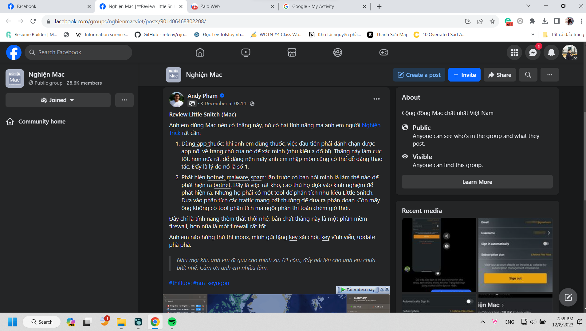

- 19:41 Vừa về nhà sau khi đến trường nghe và nhờ cô chữa bài cuối kì phương pháp luận, rời nhà từ 2 giờ
- 
- 21:42 Nay không phải dạy, nên thôi chơi Wild Rift và quay tay đủ rồi, giờ thì soạn dữ liệu, viết nhật ký bù, và lập thời khóa biểu, tí họp, rồi sắp xếp ngày thi, ngày đăng ký thi thôi.
- Nay 8h30 mới dậy, đến muộn lớp cô Thu 15 phút. Xong về trường ăn đến tận 12 giờ mới rời đi. 12:30 về đến nhà, ngủ luôn, 13:30 dậy, ngủ thêm đến 14:00, 14:45 đến trường. 18:30 mới rời trường
- Qua thì ngủ liền tù tì từ lúc về, đến nửa đêm dậy đọc truyện và cày Soul Knight Prequel đến 3 giờ hơn rồi định 4, 6 giờ dậy mà không nổi
- Từ sáng đến chiều qua ở trường, chiều có bài thuyết trình hay, tại cả sáng, 3 tiết đầu ngủ, 3 tiết sau vừa chơi Soul Knight Prequel vừa nghe bọn nó thuyết trình, chưa bao giờ bị cô gọi nhận xét
- Tối thứ 4 thì 3 giờ sáng mình mới được ngủ, sau khi ngồi đánh Wild Rift hồi sức. 1 giờ hơn thì mới họp xong, họp từ 10 giờ hơn, lúc mình còn đang học dở Product Management, giờ chả hiểu sao mọi thứ càng học, dù từ tech, truyền thông, rồi sang product, đều liên quan về điện ảnh, giáo dục chắc tại mình rời xa khía cạnh sáng tạo rồi, làm việc với khách hàng nhiều hơn.
- Chiều ở trường học xong, quay cho Doanh xong thì về nghỉ tí học Product Management luôn.
- Sáng thì mưa, ngồi lưu lại đống record mới ở MỞ, xong gần trưa thì hẹn chú bạn của mẹ ra cà phê nói chuyện, lúc về nhà thì chỉ kịp đứng ăn chút quýt rồi lại đi.
- 30/11 20:00 họp với Doanh Tiếng Anh Khoa học Công nghệ
- 1/12 21:00 họp với Doanh
- 2/12 21:00 họp với Doanh
- 3/12 8:00 hẹn nhưng 8:30 mới vào họp với Doanh và Ngọc Tiếng Anh Khoa học Công nghệ 11:30 mới xong
- 5/12 14:30 vào họp với Doanh và Ngọc