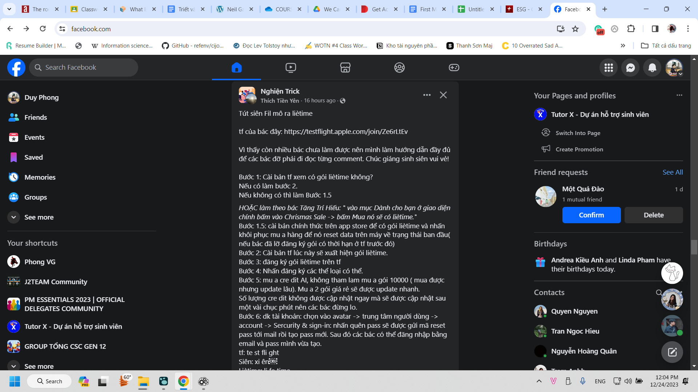

- mấy lớp masterclass thú vị ghê, độ dễ hiểu và tách biệt của các bài/các thông tin phải gọi là cực kì chứ không ứ ự thông tin như một buổi học ở Việt Nam. Cảm giác nghe rất vào, ở bất cứ đâu cũng được, nhưng vì thế sợ không sâu, không đa trường hợp?
- Dậy lúc 8 giờ, qua đọc truyện tới 3 giờ, cố thức tìm cách thoát buồn ngủ mà không được, 11 giờ tối qua mới về nhà, 10:03 cut chữ là 1 phần quan trọng, nó sẽ dễ hơn nếu ta có một dàn ý ở bên cạnh liệt kê đủ ý lớn nhất, từ đó ta xem từng ý lớn đó tách ra thành từng câu như nào với cái suy nghĩ, liên kết đằng sau ra sao, kết hợp được gì lại với nhau để tiết kiệm chữ không, xóa được gì, dựa trên tiêu chí gì mà giữ lại.
- Nên có cái mạch lớn như thế, thiết kế tổng, aim cuối cùng, để rồi còn lại ta cut đi chứ không phải nghĩ về phần cut như 1 thứ hoàn toàn mới rồi lại dễ bị conflict với bản thân rằng nên cut không. Để cut không thương tiếc ta cần học bọn Nhật xây máy bay xưa
- 