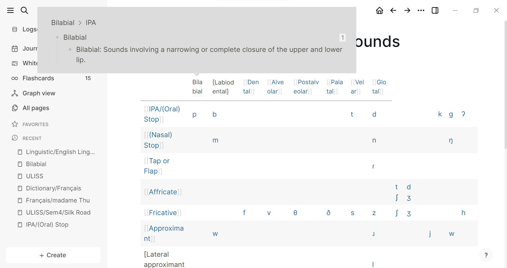

- 02:30 dậy sau khi đi ngủ lúc 10h vì rời nhà đi đón Trang đi chơi với DC từ 10h kém. Dậy lúc 8h cùng bố mẹ, định học gì đó nhưng cuối cùng lại lướt, thu thập tài nguyên và đặt hàng Shopee, bảo chú Long chuyển nốt tiền học.
- ăn bát bánh đa cua cái rồi cố hoàn thành việc ôn Linguistic, cái test lỡ hẹn do mình nghĩ cô để hạn là thứ 4 sau Tết. Cô cũng chả quan trọng điểm, thì thôi lỡ rồi, không phải mình cố vớt vát mà kiếm tài nguyên ôn cho mình thôi. Chả nhớ hôm deadline mình bận gì mà không check không làm. Rút kinh nghiệm với đống deadline thiếu quy luật, chằng chịt ở đại học, một là set notification cần thẩn, hai là làm hết mẹ luôn ngay khi được gia, rồi ôn sau, lúc nào tiện thì lấy ra ôn. Và viết bài collab với Doanh.
-
- Tranh thủ đọc WOTN discord 5 khi ăn và sau khi đã phơi quần áo tối. Mẹ mình thường giặt thôi. Còn vứt đó mình dậy phơi, trừ khi mẹ lại dậy trước và thấy việc chưa xong.
- 06:38 mình mất khá nhiều thời gian để làm cái này
	- 
	- vì tự dưng copy từ bên https://www.cambridge.org/features/IPAchart/ sang, nó nhảy luôn là link. nhưng link đó chẳng đi đến đâu, vì nó không phải pop-up link mà là javascript... logseq không chạy được, nhưng mình vẫn muốn nó hiện như javascript. Thế là mình tìm cách link
		- nếu chỉ link bằng page thì dễ, nhưng thế sẽ không narrow down được như mình vừa làm (vì sau này page bilabial sẽ đầy thông tin về nó từ nhiều nguồn, lúc muốn xem một ý nhỏ thì sẽ phải tua nhiều và mình phải chia nó ra là IPA hay không vì có lẽ có thể cách khác? mà đó là writing system chứ nhỉ, còn bilabial thì cả đời là bilabial trong tiếng anh mà...) nếu cần chỉ hiện mỗi cái đó thì mình để thêm page ở trên: For ... page hoặc thôi định nghĩa kia chuẩn rồi, cùng lắm đổi thành definition ở chỗ bilabial: thôi, hoặc lần sau cho nó pop up thế thì liệu có cài sẵn cái nào đóng cái nào mở không hay tự click tay?
		- còn cách khác để link là page reference thì nó dài vãi... mà vấn đề này cũng lớn, có cách nào làm ngắn lại như mình modify được name hoặc chỉ reference một phần ý thôi?
	-