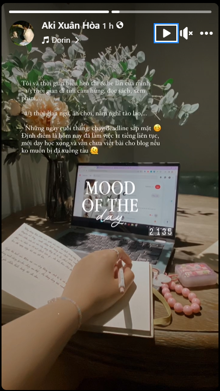
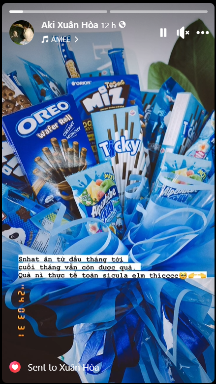

- 22:24 đang ăn, chắc dành 30 phút xem ling rồi nghĩ sao làm được bài trước deadlines thì làm? Chắc làm mất cả tiếng lận...
- nay bỏ cái của Diệp từ 2-4h chiều vì đi đánh cầu xong còn ngồi ở quán ăn với chị Hà Phương và chị Hương Quỳnh 1 giờ mới xong, lâu và nắng mệt
- Tối đi học Lớp học hành lang từ 6-8h. 9h về đến đây vì còn chụp ảnh ở kia tắm rửa rep tin các kiểu, phơi quần áo
- sáng dậy lúc 7h30, 8h30 mới ra chỗ công viên thống nhất đánh cầu lông. 30 phút sau 8h là do buộc dây 15 phút, đánh đến 12h ngồi nghỉ rồi đi bộ ra lấy xe, đi ăn, chào tạm biệt chị Dii (Phương Anh)
- 
- 