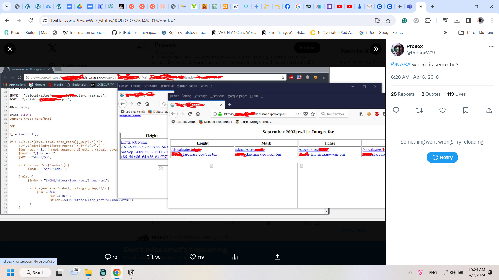

- qua trưa đi về mệt, là 1h hơn, ăn và seeding đến 2 giờ chiều đi ngủ đến 5, dậy seeding đến hơn 6, từ 7-8h là chơi tốc chiến 2 trận, còn lại là chat, học ling, rồi call với Lã, rồi xem EdX, rồi xem Business
- Nay dậy từ 7h hơn, đi tắm rồi ngồi cố học Ling nốt, thôi phải căng thật rồi, đêm qua hứa rồi, không không kịp, thì bị UNC2024 đăng post, mình nhớ mình đọc rồi nhưng mất mail đi đâu luôn, thế đăng kí lại, mà ổ Drive sắp đầy, xóa bớt, cân nhắc xem có xóa ở Gmail không, ngồi xem lại, định down về máy nhưng tất nhiên nó sẽ lưu ngày là ngày modified, not created, dù may là tên file vẫn còn ghi chính xác. 09:08
- 
- 18:38 5 giờ dậy sau 3 tiếng đi ngủ, do 1h mới ăn, và vừa ăn vừa xem business, trưa thì đi giúp Lã Vân đăng ký mạng, còn phải viết hướng dẫn riêng cho em ấy nữa.
- 1h30 phút mình ngồi lướt tìm một thứ trước khi đi ngủ mình đã nghĩ: chuvanan.org trên facebook thì mình cho là nó ra đời trước cái confession bị mất và có lẽ trước cả đó nữa, hồi xưa mọi người tiếp nhận confession là của ai, như nào, chả rõ. nhưng thời nay thông tin phân tán, không có tag hay tập trung vào đâu nữa cả.