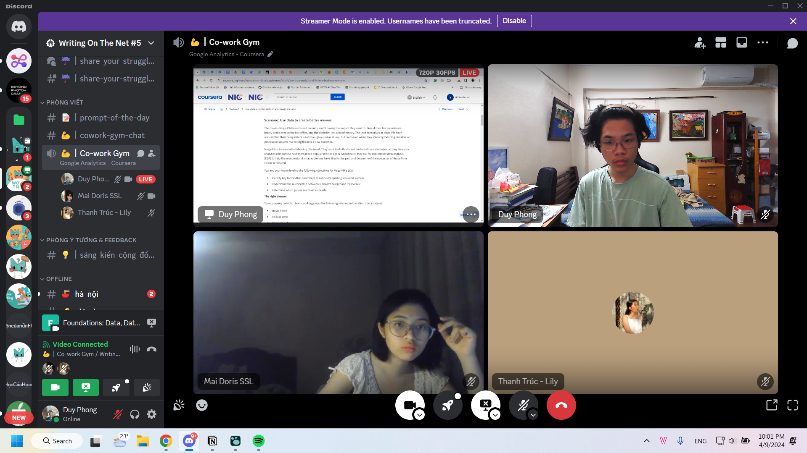

- 00:21 thật là hai ngày vô bổ, mai 5 giờ dậy may ra cứu được mày. Viết luận tiếng Pháp chưa viết, ôn lịch sử đảng, làm bài chưa làm. Cả bài thầy Trung chưa đọc, một ngày toàn ngồi nạp kiến thức máy móc, ngủ, rồi làm mãi đéo xong và cứ lo bài test cỏn con về US. Thôi xem nốt business đi, mai mày sẽ viết Lịch sử Đảng vào tối sau khi học xong, mày sẽ đọc và nghiên cứu bài thầy Trung trong lúc đợi đến giờ học. Về nhà lấy máy không?
- 18:00 Học thầy Trung
	- Mình mới nghĩ về việc học thực sự chẳng nhẹ nhàng hơn việc đi dạy tí nào. Gì cũng cần chuẩn bị. Và có lẽ để tracking và cân đối tốt thì mình có thể thay vì hỏi mức năng lượng trước buổi học, theo dõi trong buổi học thì có thể hỏi cả về việc bạn đã làm gì trước buổi học và bạn nghĩ sao, cảm thấy sao về điều đó. #[[Education/Pedagogy/Lesson Plan]]
	- Nghĩ thêm một chút về việc viết một cách rất đơn giản, rằng viết thơ hay văn với viết post khác gì nhau. Đọc thơ văn post khác gì nhau ngoài kiểu người, hoàn cảnh đọc, nền tảng đọc. Có lẽ ở sự kể, rằng thay vì chỉ kể cảm xúc suy nghĩ, việc đưa được người đọc nhập vào nhân vật tức là nắm được tính cách, cảm nhận được gánh nặng đặt trên vai và cũng đồng thời nhớ được hoàn cảnh, cảm xúc của họ suốt quãng truyện. Cái đấy so với một post, chỉ là một tuyên ngôn, mà trong đó một chuỗi tuyên ngôn chưa chắc đã kể được gì.
- 22:01 đã về được tiếng rồi à, vừa download tí tài liệu của thầy và bên CSC, bên tin nhắn riêng thì chưa, vừa cởi quần áo, ăn thạch, rủ chị Mai Doris vào học Coursera tí
	- 