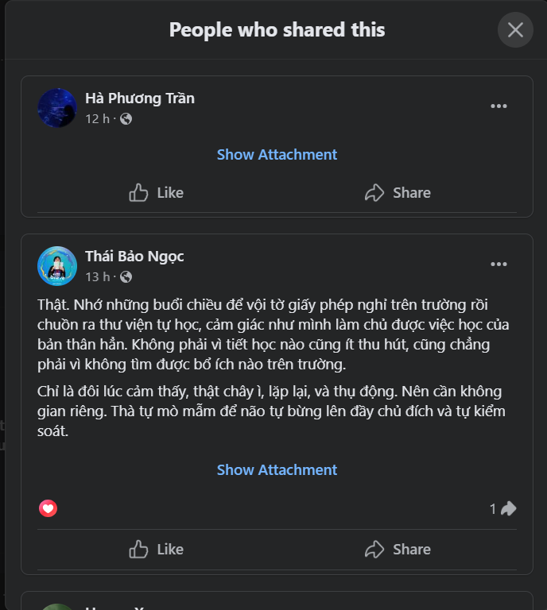

- 08:56 dậy từ 7h40, chơi 1 trận game, đáng lẽ nên chơi sớm hơn để tỉnh, chưa ăn nên đói quá, ngồi lướt watch facebook tới giờ, chả có tâm trạng về Chu nữa dù tí nữa làm việc liên tục cũng đâm ra oải mà xem, hôm nay phải cố cày, phải xong được Lịch sử Đảng nào!!!!
- 
- 17:02 chơi 3 trận game toàn thua, nhảm vãi cứt, team như cặc, phí thời gian. Thôi giờ mới chính thức nhảy vào làm sau khi đi in và đi ăn xong. Một ngày đáng lẽ cứ bình thường, ta không bao giờ được phép nghỉ chỉ vì mấy chuyện ở trường ULIS nữa, không thì không gọi là ta chống ULIS triệt để. Đổi ưu tiên hoàn toàn đi. Mày tối giản, cố cân bằng cuộc sống và ưu tiên học đường chứ không phải tương lai của mày. Không được nghỉ vẽ, không được nghỉ tiếng Pháp, không được nghỉ về Chu. Hết năm 2 rồi đổi lại đi.