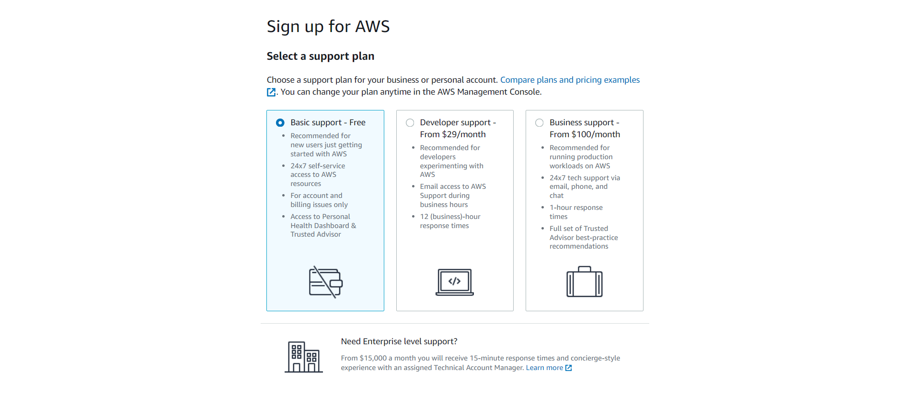

- 16:42 
-
-
- 21:52 Meeting VN PolyEd REU - cách tiếp cận mà thầy nói, chị Giang hỏi đúng cái mình mới nghĩ nhưng thế nó vô nghĩa, vậy mình đoán là đề tài, bản chất nó là một hướng tiếp cận. Dù sao thì thầy trả lời không hoàn toàn giống mình nghĩ nhưng vẫn là thế mà nhỉ?
- Đúng là mình không quá tập trung nhưng nếu chỉ giảng về lý thuyết thì nó là vấn đề lý thuyết, hỏi gì được nữa ngoài đọc. Vấn đề, sự mơ hồ cần bổ sung luôn nằm ở thực tế là nhiều. Lúc đó mới là vấn đề mà một câu hỏi làm rõ, một câu hỏi cần đáp án để dùng hay để tham khảo, không bao giờ là đủ. Ôi nhanh quá đang đánh game quên mẹ nó copy chat... Thế là đi tong quả đùa với chị Hà ghẹo là duyên, bảo bật cam cho ngắm và câu hỏi của chị Giang trường mình về việc hướng tiếp cận là loại tài liệu kiểu báo hay gì à...