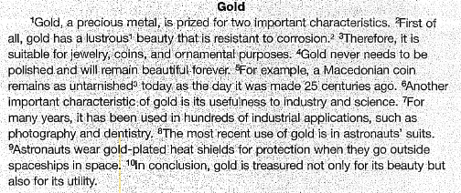
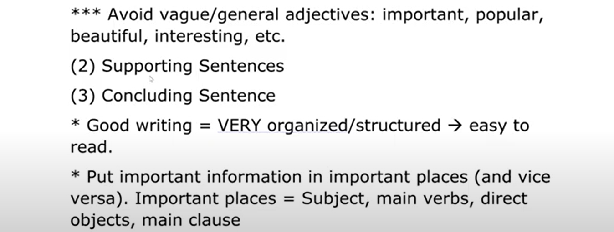
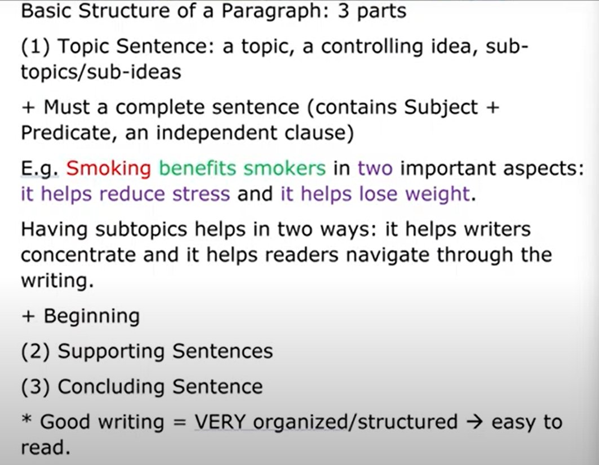
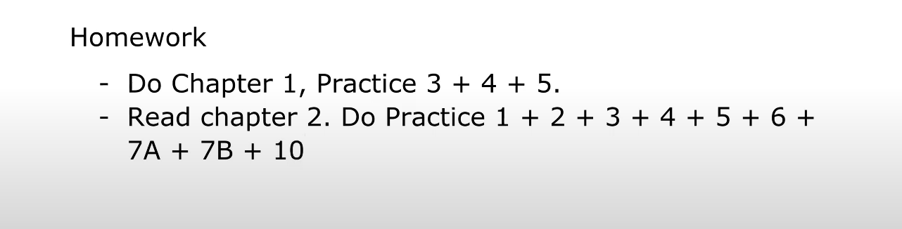

booknote:: [[hls__Writing_Academic_English_1663153984736_0]] 
source:: ((6321b724-2b4f-43d5-a52f-2d3ba44923e1))

- {{video https://www.youtube.com/watch?v=FF64Iq8fvSw}}
- Houseskeeping rule #DOING
	- 1. turned on all the way
	  on or get kicked
		- camera angle
	- 2. Lighting
		- not to bright, not to dark
	- 3. Background
- Chia thành beauty purpose thay vì chọn từ lustruos and not corrosion vs science purpose
- Good writing: easy to read, very organised (structure)
- Note
  collapsed:: true
	- note về giảng dạy
	  collapsed:: true
		- dễ xao nhãng quá, chắc buổi đầu mới thế, hoặc tôi chưa quen
	- note về hệ thống cấu trúc (mấy cái tiểu tiết này tính sau cũng được, mày cứ có mô hình lớn, rồi sẽ add thêm được cái này thôi, mô hình của mày mở mà. phải chấp nhận vừa học vừa làm chứ không không có chỗ chứa, nhưng vẫn nên có 1 ngày nhfin lại sắp xếp hoặc tốt nhất là rèn trí tưởng tượng nghĩ đến, nhớ lại mọi loại đoạn văn và phân chia sắp xếp nó cho tốt)
	  collapsed:: true
		- mấy bài kiểu này có thông tin chưa được kiểm chứng, nhưng bóc tách kiểu gì nhỉ, đi kiểm chứng thông tin, để gia tăng hiểu biết về thời đại? rồi vứt quách cái bài đó đi, kì thực ngta đọc thôi để nhớ hoặc hông nhớ thì nó cũng bị vứt quách đi mà
		- nma thế sẽ có ngàn page phân tích, mỗi page 1 bài như này, ít nhất mình nên cite source thì mình lưu ở đâu, show ở đâu thành list, thực ra ở đâu k quan trọng mà là như nào, show và ghép lại với cái nào nào
- note về cách áp dụng prep work note với note và học tập
  collapsed:: true
	- bình thường ở chỗ chị Fuong là nhớ prep work mà dùng, đọc trước để hiểu chứ cũng chỉ để hiểu rồi thì nghĩ sang cái khác, đặt câu hỏi đào sâu chứ không phục vụ cái não ở note hay thực sự nghiên cứu sâu hơn vào cái gì được...
	- chắc cứ take note đã rồi add sau, mà tra lại cái cũ để trả lời thầy cũng khó
- that's new 21:13
	- làm thế này cho sau này dễ tìm lại và tiện thêm vào bài chép
- subtopic helps the writer focus and the reader navigate through the writing
- hay cứ đơn thuần nghe nhỉ, lại miss hiểu về topic sentence in English Wrting, hay cứ nghe không ghi chép, nghĩ lan man rồi note cũng được chứ không tập trung note được như xưa nữa, hay do cách dạy đã thay đổi, thiên về giảng nhiều hơn đọc chép, nó sẽ có cách summerise kiểu khác để dễ hiểu hoặc dễ viết vào vở
- còn đằng nào về nhà cũng nên, đặc biệt nên xem lại
- nma chết mẹ kém sync như này thì dùng giấy cũng được, không nhất thiết phải dùng note luôn đâu, đằng nào m cũng dùng both mà thì cứ dùng both đi. Luyện, luyện, luyện!
- 21:21 good, kì thực chỉ có tôi k có thôi
- peerlearning 21:22 good
- 21:23 sợ quá easy nhỉ, làm về đọc và nghĩ thì ok chứ khả năng vận dụng từ của tôi không tốt lắm (allocate work?)
- 21:23 đéo nghe rõ nên để ai làm trước vậy, à tôi cho là thế bởi nãy cũng có ng confused, chắc do thầy nói sai
- à không được send spam: seperate messenges
- 21:55 mày phải tư duy tốt hơn, đừng chỉ tìm từ mà hãy nêu tính chất từ cho thầy
- nma dạy như thầy tôi k nhìn ra pattern của 1 bài giảng cố định dù có căn theo sashc, đây là kiến thức mở rộng thêm ở mảng kiến thức về dùng từ
	- nhưng thế mới liên kết sang writing được
- k chỉ chữa, giải thích mà còn bình và sửa và dạy cách viết
-
- ## Note lớp học
	- Where is your webcam? {{youtube-timestamp 000}}
	  collapsed:: true
		- thầy Trung ở nhà mới
		- tôi chưa hoàn thành bài tập về nhà
	- Houseskeeping rules {{youtube-timestamp 750}}
	  collapsed:: true
		- Webcam {{youtube-timestamp 760}}
		  collapsed:: true
			- Must be turned on all the time
			  collapsed:: true
				- If you don't
				- and i don't see any reasons, any explainations, i'm gonna ask
				- if i ask and you don't have proper webcam on with a proper reason
				- i'll have to keep you out of the class
				- so please have your webcam turned on all the way
			- If you are interested in movie you can apply this one
			  collapsed:: true
				- the webcam should be on shoulder level
				- not too high, not too low
				- we don't want low angle camera position
					- it feels like he is looking down on us
					- we don't want to look down on people
						- {{cloze this can be use as a kind of communitcation online}}
				- high angle position
					- it feels like you are small
				- No weird screen colour
					- like in horror movie
					- black and white
				- or weird camera position
		- Lighting
		  collapsed:: true
			- shouldn't be too bright
				- it blurs you
			- or too dark
				- it looks scary
			- if you want good lighting you can put a lamp in front of you
				- in film it called e-light
			- don't show the ight directly to your face
				- too bright
		- Background
			- background should be clean
			- and don't show people what you don't want them to see when they come into your house
				- underwear
				- bed
				- distracting photograph of idol
			- you can blur it if you want
			- don't want to see/ no interesting in awkwardness
		- Clothing
			- casual cloth is fine as far as you are comfortable
		- Learn from a picture to prevent it in the future {{youtube-timestamp 1630}}
			- *your compliment example needs more than what you just said to be considered movie aspects*
			- close-up shot
	- try to be unmuted all the time, if not it is fine
		- but if i call you, you must answer
		- if i call you three times and you don't response, i will kick you out of the class
	- Introducing {{youtube-timestamp 1850}}
		- basic writing
			- not equivalent to easy
		- write paragraph and writing
			- Book 1: [[hls__Writing_Academic_English_1663153984736_0]]
				- a classic standard one
				- 1,2,3,4, 10, 11
					- cause those are the basic, the rest are more advance. Define it #DOING
						- *lên mức độ viết luận văn mới cần hay bởi nó khó, ít dùng? cảm giác có thể chia thành các mảng cấu trúc như tiền viết và hậu viết*
			- Book 2: The Writer Harbrace Handbook (international version)
				- *i thought the author hate the US :))*
				- after mastering writing an essay
				- Chapters 28 to 41
	- Reading {{youtube-timestamp 2220}}
	  collapsed:: true
		- *a way of teaching: viết thử khi chưa biết gì, viết khi biết cấu trúc và cần thêm gì, nên làm gì với mấy cái topic sentence chẳng hạn*
	- Talk {{youtube-timestamp 2916}}
	  collapsed:: true
		- Basic Structure
		  collapsed:: true
			- Three Parts
			  collapsed:: true
				- {{cloze when answering the structure question, you must summerize how many part/ that's nhìn tổng thể}}
				- Topic Sentence
				- Supporting Sentence
				- Concluding Sentence
		- Gold Paragraph
		  collapsed:: true
			- 
			- Topic sentence: The first one
			- Concluding sentence: The last one
			- 2 points
				- Good for beauty purposes
				- Good for industry and science purposes
		- ^^`Good essay, paragraph or writing in general is very organised/well structured, which means it should be easy to read`^^
		  collapsed:: true
			- if something is too difficult because the writing is so bad, it is not something good
			- you follow the structure of the paragraph so that people can find something in common be with you
			- they also know that and you also know that you need a topic sentence and both of you write a topic sentence so you can understand each other
			- so you follow the structure, you helps people follow you more easily
				-
				-
				-
				-
		- Topic sentence
		  collapsed:: true
			- A topic sentence must be a completed sentence
			  collapsed:: true
				- A completed sentence must contains a subject and a predicate. It must be an independent clause
			- It contains topic, controlling idea, subtopics, sub-ideas
			- E.g. Smoking benefits smokers in two important aspects: it helps reduce stress and it helps reduce weight
			  collapsed:: true
				- If you can identify the object but having problem to identify the controlling idea, you can think like this
					- what is a topic: smoking
						- big and too big like every big topic
					- so we have a controlling idea to narrow it down
						- it's in the name: control
						- {{cloze but don't ask me why it is control}}
					- sub-ideas
					  collapsed:: true
						- should list it out
						- having sub-topics help
							- writers stay focus, easily navigate through the writing
							- readers understand you easily
						-
			- Where is the topic sentence?
				- Technically it can be anywhere
				- In Vietnamese writing we have Tổng - phân - hợp
				- In English Academic Writing. It **must** be at the begging
				- not at the end, in the middle or hidden so that readers have to find it... {{cloze cool}}
			-
	- Practice 1 {{youtube-timestamp 4892}}
	  id:: 63294226-dea1-4f80-8b30-edb60c6d8b5f
		- Way i do
		  collapsed:: true
			- *căn theo ví dụ hình thức group 1, như ngữ nghĩa, độ dài vì không có giải thích cụ thể thế nào là thế nào - tôi đã quên phân tích nội dung là ngữ pháp*
			  collapsed:: true
				- khi làm bài tôi cũng bị áp lực sợ sai trước thầy và bạn bè hơn là lúc ở với thầy.
			- Too general: topic chung chung
			- Too specific: quá cụ thể, thường là dài và nhiều ví dụ, giải thích
			- Incomplete: ngắn và không đầy đủ, tối nghĩa
			- Best TS: TS tốt nhất chứ không hẳn là phải đủ các thành phần và hay
			- Group 2
				- a khá vô nghĩa, chẳng thể nào thành một topic sentence được mà chỉ là cảm thán thôi ý nhưng khá chung chung nên là general, tôi chọn là incomplete vì cho là nó thiếu phần bổ sung thêm như controlling idea
					- dù ở tiếng anh vẫn có thể làm câu chủ đề, ở tiếng việt thì nó là câu không có chức năng mấy, nếu có thì chỉ là dẫn dắt mở bài hoặc tôi đã không bao giờ chịu coi nó là một kiểu câu chủ đề
				- b too specific vì tôi cho là nó không có cái độ gây mơ hồ để về sau giải thích mà cái này hơi sát quá đến một vấn đề gì đó, mấy câu sau sẽ biết về người ta làm nó như nào thôi à hay đặc trưng scratches. Cái này giống tiêu đề bài báo thì hơn, hoặc nghiên cứu khoa học. và tôi chọn d nên b không thể
				- c too specific vì là example
				- d là best vì nó đủ topic và controlling idea cũng đủ gợi mở, nếu thiếu chỉ có thiếu sub-idea
			- Group 3
				- a đây là một nhận định rất chung chung
				- b best vì nó súc tích dễ hiểu
				- c là giải thích hay sao ý
					- nhưng mà khiếp trước khi biết mấy sentences này như nào, chúng dùng để làm gì và viết chúng ra sao thì nên xác định rõ viết là gì, đề làm gì không thì ít nhất là viết luận để làm gì
				- d chắc chắn là incomplete, chẳng mang nghĩa gì cả
				- e quá chung chung, nhưng tôi chọn chưa hoàn thành vì nó đã có controlling hay sub-idea đâu
			- Group 4
				- a cũng không hẳn không đủ trực quan nhưng chắc không đủ rõ bằng d nên để là...
					- too general đi chứ incomplete thì ảo quá nhưng một phần sẽ đủ 4 cái nên mình chọn đại.
				- b chung chung quá
					- từ popular ấy
				- c quá dài và là giải thích rồi
				- d đầy đủ chút topic kèm giải thích khoanh vùng ý lại đó
			- Group 5
				- a dài nên là specific
				- b ừm cũng khá đủ nhưng nếu so với c chẳng hạn thì specific hơn, có lẽ hơi quá và gây khó viết
					- về sự khó viết, nếu mày được giao một topic thì mày sẽ viết những gì, xưa mày tự nhận là cái gì cũng viết được mà? viết về trải nghiệm và suy nghĩ của mình về cái đó, hoặc nó gợi mình đến cái gì, hoặc viết trả treo, bố láo là so sánh móc mỉa này nọ, hoặc viết cấu tạo, kể chuyện cuộc đời nó...? liệt kê ra những cách để writers có hướng để viết, nhưng để nâng tầm nó khác mấy cái web củ lìn đăng thông tin như cho nghiệp dư thì có thể tìm cả những trường hợp đặc biệt và trích dẫn chứng thật chuẩn cho chính cái ý đó như trang văn, báo khoa học, đoạn nghị luận chiêm nghiệm,...
				- c hơi chung chung nhưng cũng đủ để gợi vì nó có controlling idea là ...ways
				- d chắc cũng cần một cái gì đó chưa đầy đủ, dù sao d là thế
				- e đoạn này kể ví dụ à? nhưng quá là cụ thể như một câu chuyện có đủ chi tiết
					- topic đề cập đến rainbow's end và the belief là specific rồi, mà dù nó cứ kì kì...
		- Way i should have done {{youtube-timestamp 6050}}
		  collapsed:: true
			- Group 2
			  collapsed:: true
				- a too general
				- b too specific
				- c too specific and incomplete
					- make it complete
						- add something
							- was used to track
								- add verb
						- or add was to built
							- was built
					- we need verb with a tense cause built doesn't have a tense
					- d best TS
			- Group 3
			  collapsed:: true
				- a best TS
				- b too specific
				- c too specific
				- d incomplete
				- e too general
			- Group 4
			  collapsed:: true
				- a incomplete vì thiếu verb and a liitle bit too specific
					- khiếp tôi cứ chú ý đến topic và controlling mà bỏ quên verb, não cũng tự fix như là có verb rồi
				- b too general
				- c too specific
				- d best topic
			- Group 5
			  collapsed:: true
				- a too specific
				- b too specific
					- it's the fact
				- c best TS
				- d too general
				- e incomplete
	- Conclusion {{youtube-timestamp 6728}}
		- Some conclusion to draw from all of this
			- Too general
				- kind of word it usually have
				- are and is
					- somewhat right
				- vague adjective
					- {{cloze tại sao lại sinh ra mấy từ này để mà bị coi là vague, hay tại sau này mọi thứ phát triển, đa dạng lên người ta mới coi là vague hoặc nó sinh ra để đi cùng từ khác? hoặc vì thế nhưng tư duy người nào hạn hẹp nên họ chỉ dùng được cái bề mặt, cái phần đầu của tính từ chuẩn? }}
					- popular
					- beautiful
					- interesting
				- hard to continue because it's too general
			- Too specific
				- doesn't help continue aswell
				- {{cloze or it could but people are loser, of course you can manage or incredibly find out the next supporting sentence. But it may change the genre of that paragraph}}
			- Incomplete
				- Không đủ S + Predicate (conjugated verb)
			- Best TS
				- tells you how to write the next sentence
	- Fixing topic sentence {{youtube-timestamp 6982}}
		- Looking at the differences
		- Sub-topic save you even you have a bad adjective
			- Group 4 b and d
		- Make the topic sentence better
			- different ways: name the way or include the number in
			- talk about the causes or the consequences
				- add a logic development
				- group 3 a
	- Practice 3 - Paragraph 2 {{youtube-timestamp 7390}}
	  id:: 63294226-e52e-402c-9b5c-2f4a69d896f8
	  collapsed:: true
		- Những comment về bài câu topic của thầy Trung cũng có nhiều gợi mở
		- Example being picked is not because it bad but because it can be a good example for problems that people usually make
		- Must be specific
			- have sub-topic
	- Structure problems:
		- 2 clause are not equally important
			- {{cloze so we can make it become equal}}
			- or simply show that relationship clearly
				- compound sentence 2 idea are equally important
				- but the controlling idea mustn't be as important as the topic
		- we can change the conjuction and or do not give the unimportant a full sentence
		- ^^``Put important information in important places``^^
			- never do the opposite unless you can control it
			- important places are subject, main verb - conjucated verb, main clause, direct objects
			- Watch clip to better understand {{youtube-timestamp 8864}}
		- when use and, verb go with verb and noun go with noun
		- weak and general verb
			- is are -> differ
		- Words-choosing problem
			- choose the right words in the right context
				- attendence policies and accessment
		-
- ## Important Takeaway
	- A perfect topic sentence {{youtube-timestamp 9913}} - {{youtube-timestamp 9937}}
	- 
- 
- Homework
	- 