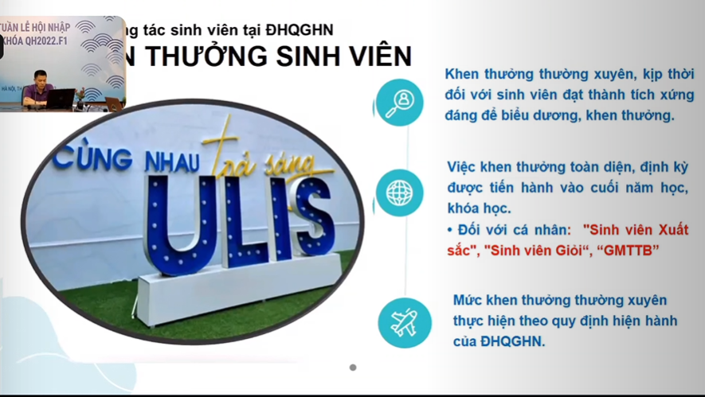
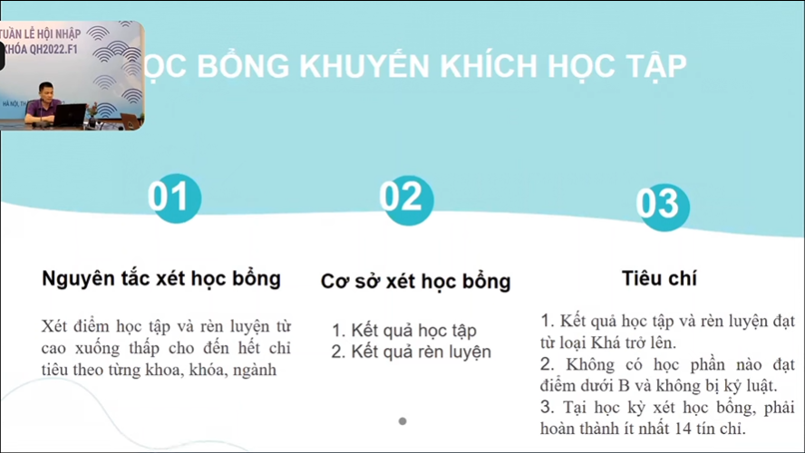

related:: [[Sổ tay sinh viên]]

- {{video https://www.youtube.com/watch?v=bjANskzVJdc}}
- {{video https://youtu.be/Q4-nhVPUr7o}}
- {{video https://youtu.be/deTGITgPzb4}}
- ### Giao lưu đầu giờ
  collapsed:: true
	- Quảng cáo {{youtube-timestamp 0}} - {{youtube-timestamp 600}} (video 1)
		- Triết lí cá thể hóa trong giáo dục, lấy người học làm trung tâm
		- Thư viện số ĐHQG nằm top 100 trên tổng 3000 trên Wmetrix
		- Danh tiếng gắn liền các chương trình ảnh hưởng xã hội như
			- Đề án chiến lược xã hội số
			- Hạ tầng số
			- Tri thức số
	- Note (video 1)
	  collapsed:: true
		- Nhìn quảng cáo như vậy, đéo hiểu gì và người ta làm gì lại càng sợ rằng mình đã quá ngạo mạn khi nghĩ có thể thay người ta cai trị, vượt hơn người ta trong cách làm việc
			- thứ duy nhất mình thấy là portal không đạt chất lượng. Thế thôi
			- cũng không ngụy biện rằng không portal nào không bị thế đâu, vì rõ ràng các chỗ nhỏ thì không, nhưng to như facebook thì chẳng sao cả, có hàng tỉ người đăng nhập một lúc và thao tác vài thao tác đơn giản.
		- Nhưng nhìn các phòng ban,mọi thứ bắt đầu rõ ràng hơn là nó thực hiện bởi những ai, tai tiếng nó như nào thì mới dẽ vượt, chứ không cảm giac như một cá thể toàn năng nằm ngoài tầm hiểu biết
			- có kẻ đó thì thua, trình đây chưa đủ sức
	- Note (video 2)
	  collapsed:: true
		- tôi thường được nghe những suy nghĩ hơi nói xấu như lùa gà, lùa học sinh vào trường.
		- nhưng dù thế nào nó cũng là từ góc độ học sinh, còn các cô thì sao, các cô coi bọn học sinh là gì và mừng cho chúng con thật không {{youtube-timestamp 154}} video 2
			- đã được thầy cô và anh chị lên ý tưởng một tháng trời
		- {{youtube-timestamp 300}} cũng không đáng nhớ lắm và chẳng nhớ nó ngày nào luôn
		- {{youtube-timestamp 370}} cô so với các cô như cô Mai Anh thì ai nói hay hơn nhỉ
		- tôi không thích cách mới vào trường bị gọi là nhà một cách chắc chắn miễn cưỡng như thế
			- và gắn nó với thanh xuân như vậy
			- đáng ra nên có một ai đó nhẹ nhàng nói - trong khung cảnh đau buồn của chiến tranh, dù sao thì đây cũng sẽ là nhà của các em sau này nên chúng ta hãy cùng... nhé
	- [[Sơ đồ cơ cấu tổ chức ULIS]] (liên quan sinh viên thì viết Italic)
	  id:: 63336d63-0d63-44a8-8191-d5c5b098b2ae
		- Đơn vị đào tạo
			- Khoa Sư phạm Tiếng Anh
			- Khoa Tiếng Anh
			- Khoa NN&VH các nước nói tiếng Anh
			- Khoa NN&VH Pháp
			- Khoa NN&VH Nga
			- Khoa NN&VH Trung Quốc
			- Khoa NN&VH Nhật Bản
			- Khoa NN&VH Đức
			- Khoa NN&VH Hàn Quốc
			- Khoa Sau đại học
			- Khoa Đào tạo & Bồi dưỡng Ngoại Ngữ
			- Bộ môn Tâm lý - Giáo dục
			- Bộ môn NN&VH Việt Nam
			- Bộ môn NN&VH Ả Rập
			- Bộ môn NN&VH Đông Nam Á
			- Trường THPT Chuyên NN
			- trường THCS Ngoại ngữ
		- Phòng chức năng
			- Phòng Hành chính - Tổng hợp
			- Phỏng Tổ chức cán bộ
			- *[[Phòng Đào tạo]]*
			- Phòng Khoa học - Công nghệ
			- *[[Phòng Chính trị & Công tác HSSV]] (Trung tâm Hỗ trợ sinh viên)*
				- có cô Như Anh MC
				- thầy Phạm Đình Lượng (phó trưởng phòng)
			- Phòng Hợp tác & Phát triển (Trung tâm Hợp tác Đông Á)
			- Phòng Quản trị
			- Phòng Thanh tra & Pháp chế
			- Tạp chí Nghiên cứu nước ngoài
			- * [[Phòng Kế hoạch - Tài chính]] *
		- Trung tâm
			- Trung tâm Đảm bảo chất lượng
			- Trung tâm Khảo thí
			- Trung tâm Công nghệ thông tin, Truyền thông & Học liệu
			- Trung tâm Nghiên cứu Giáo dục Ngoại ngữ, Ngôn ngữ & Quốc tế học
			- Trung tâm Phát triển nguồn lực
			- [[Trung tâm đổi mới sáng tạo]]
				- tuổi đời trẻ
				  id:: 63337cc0-e680-480a-b27c-9bea96c9b71d
- ### Lịch trình sau khi nhập học
  collapsed:: true
	- 
	- Chuyên đề Tự hào Uliser cung cấp hiểu biết chung về trường và lịch sử trường, các nội dung cơ bản của cơ chế đào tạo
		- có quy chế đào tạo, quy chế hssv
		- tổ chức qua zoom webinar vì nhiều bạn còn đang loay hoay tìm chỗ ở
			- {{cloze nghĩ lại thì muộn thế cơ á, nếu là tôi tôi tìm từ lâu - kể cả đã đỗ hay chưa, mà thông báo đỗ sớm mà, hoặc vì gì đó liên quan tâm lý mới bỏ bê nhà cửa thôi chứ}}
	- Thi khảo sát đầu vào
	- [[Chuyên đề "Uliser năng động, tự chủ, đổi mới sáng tạo"]]
	- Sự kiện Vòng tay kết nối
		- Do GVCN tổ chức
	- 3/9 [[QH2022]] đi học
	- Ý nghĩa cô Phó hiệu trưởng đưa ra
		- tích lũy hành trang vững bước bước vào cuộc sống sau này
		- tận dụng thời gian khám phá nét đẹp cuộc sống, nét đẹp của bạn bè, thầy cô
		- phát triển bản thân
		- {{cloze tôi tự hỏi nếu không nói một cách, không hẳn giả trân nhưng màu hồng thế này mà hơi bỗ bã thực tế như tôi biết các em vào đây để làm gì: lấy bằng,... nói thế tuy dễ bị chửi là áp đặt hạn hẹp, còn như trên này thì không? nhưng họ thực sự biết và thực sự biết để mà chỉ điểm được thì hay, cũng đâu phải là điều gì khó khi đã kiểm soát hết được danh sách sinh viên. Một chút đào sâu tìm tòi để điều khiển bọn nó dễ hơn cũng đâu khó}}
- ### Timeline chương trình
	- 
	- Giới thiệu về Trường Đại học Ngoại ngữ
	  collapsed:: true
		- {{youtube-timestamp 875}}
		- {:height 395, :width 714}
		- 
		- {{embed ((63336d63-0d63-44a8-8191-d5c5b098b2ae))}}
		- 
	- Quy chế công tác sinh viên tại ĐHQGHN
	  collapsed:: true
		- Quyền
		  collapsed:: true
			- 
			- 
			- 
			  collapsed:: true
				- {{cloze quyền thì ít mà nghĩa vụ thì nhiều, chẳng biết thế là nên hay không nên xét theo cách khách quan công bằng nhất - ảo nhất thì có, một quyền đổi 1 nghĩa vụ cho mình và cho mọi người à. Nghe khá giống quyền và nghĩa vụ trong No Game No Life Zero nhỉ}}
			- 
			  collapsed:: true
				- {{cloze oke nhiều quyền và cái này đáng chú ý đấy, nhưng làm sao để nhớ hết hoặc dùng đúng giai đoạn... giai đoạn à, thế thì lâu lâu xem lại để nhắc bản thân về mọi tính năng hoặc mày lên plan sẵn dùng mọi tính năng đó đi}} #DOING
		- Nghĩa vụ
		  collapsed:: true
			- {:height 362, :width 683}
			- 
		- [[Điểm rèn luyện]]
		  collapsed:: true
			- 
			- 
			- 
		- Khen thưởng
		  collapsed:: true
			- 
		- Kỷ luật
		  collapsed:: true
			- 
	- Các chế độ chính sách đối với sinh viên
	  collapsed:: true
		- 
		- Miễn giảm học phí
		  collapsed:: true
			- 
			- 
			- 
		- Học bổng
		  collapsed:: true
			- 
			- Học bổng khuyến khích học tập
				- 
				- 
				- Học bổng ngoài ngân sách
					- 
	- Giới thiệu về phần mềm một cửa và các thủ tục hành chính đối với sinh viên
	  collapsed:: true
		- tại sao gọi là một cửa?
		- Website trường
			- https://ulis.vnu.edu.vn/
		- Cổng thông tin đào tạo (Portal sinh viên)
			- https://daotao.ulis.vnu.edu.vn/
		- Fanpage Trường
			- https://www.facebook.com/vnu.ulis
		- Fanpage Trung tâm Hỗ trợ sinh viên
		  id:: ffb5e8a6-98ef-4e90-b146-066fb6175124
			- https://www.facebook.com/ulis.SSC
			  id:: 63339136-7418-43cd-b400-6505fb9fdfc6
		- Ứng dụng Ulis Now
			- đoàn thanh niên sinh viên quản lí
		- 
		- 
		- 
	- Hệ thống thông tin dành cho sinh viên
		- Học đại học để làm gì
	- Quy chế đào tạo
	- Chương trình đào tạo và các thông tin về đăng ký học phần, Ngoại ngữ 2…
	- Truy cập các hệ thống công nghệ và khai thác học liệu
	- Hoạt động Đoàn – Hội
-