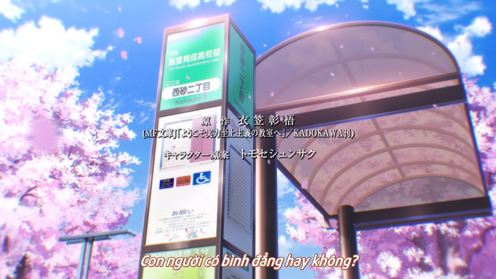

- Cách mở đoạn
	- Văn cũng được nhưng thuyết trình thì hay hơn
		- Không cần nghĩ hay nghĩ cũng được vì nó là câu đề tạo âm hưởng cho tác phẩm
			- người hiểu biết sẽ phân tích từ góc độ này
			- trừ khi thằng ngáo nào muốn lợi dụng âm hưởng này nhưng lại đánh lừa và lái sang âm hưởng khác thì sẽ hề
	- 
	- 
	- Lúc đó ta sẽ có một bài thuyết trình mang âm hưởng
		- bi tráng hào hùng,... chứ không chỉ dựa vào chủ đề được giao cho mà mới có hiệu ứng, hoạt động -như nhạc các thứ như thế
- Ý của một phút đầu cũng hay, không hề làm chán đi cái cảm hứng mở đầu qua 2 câu.
	- nhưng ý họ ở đây là gì? sự trăn trở, tính cách nhân vật chính? đây là lời ai nói, cho ai?