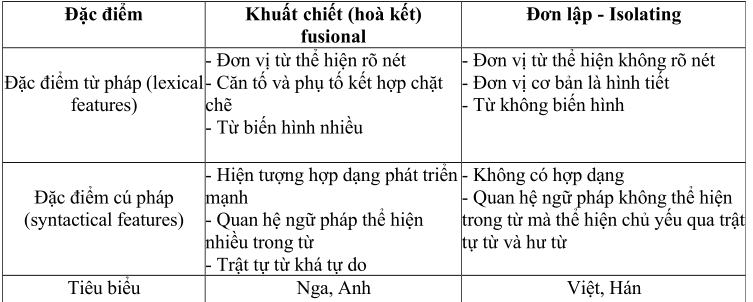
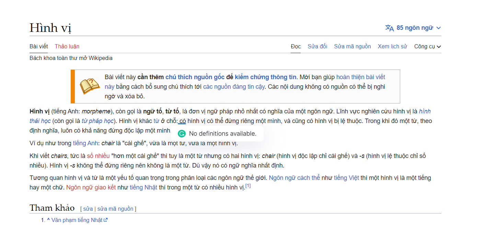
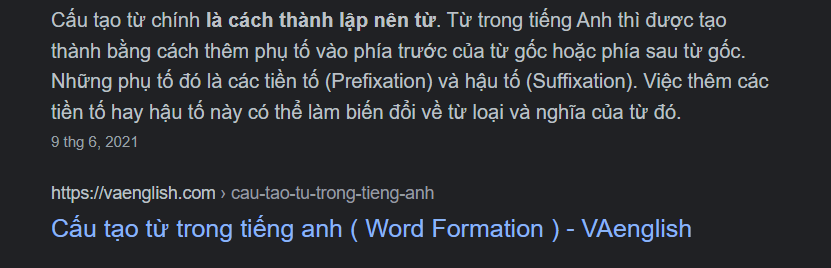
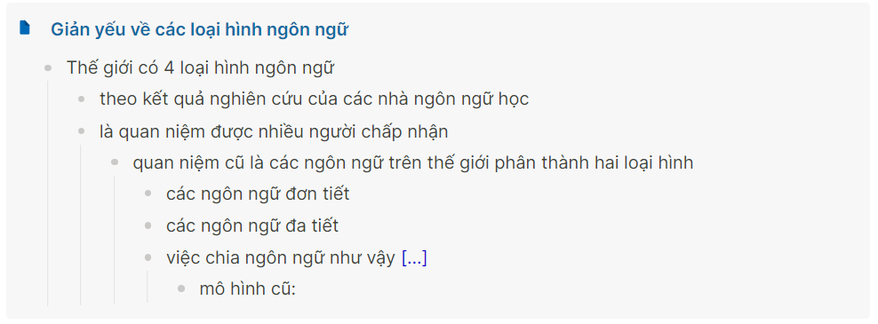

- Thế giới hiện nay có **4 loại hình ngôn ngữ** {{cloze có khi sau này cắt mịa mấy từ không in đậm đi cũng được, vì khi đã nắm được, đọc lại sẽ tự hiểu? có hay không? có chuẩn mực nào không, có ai nghiên cứu ghi chú như nào chưa, mà thế người ngoài đọc có hiểu context không, cả context là tài liệu từ bài này nữa}}
	- Phân loại:
		- {{cloze có thể làm như này nhưng đây là diễn giải lại sách và sắp thứ tự thông tin nên thôi, cái này làm ở figma cũng được}}
			- 
		- Loại hình **khuất chiết**
			- Tên khác:
			  collapsed:: true
				- ngôn ngữ hòa kết
				- ngôn ngữ biến hình
				- flexional
				- flexionnelle
			- Bao gồm:
				- chủ yếu các ngôn ngữ thuộc ngữ hệ Ấn - Âu
				- một số ngôn ngữ thuộc ngữ hệ khác
			- Đặc trưng:
			  collapsed:: true
				- trong lời nói ***từ bị biến đổi hình thái*** để thể hiện quan hệ ngữ pháp
				  collapsed:: true
					- nói cách khác, quan hệ ngữ pháp được thể hiện ngay trong bản thân từ
					- ví dụ hình thức từ ngữ sẽ thay đổi tùy theo chức năng của nó
						- kniga (tiếng Nga): sách
						- knig - a (cách 1, giống cái, số ít ): quyển sách
						- knig - i (cách 1, số nhiều): những quyển sách
						- khig - u (cách 4, số ít): (đọc) sách
						- knig- e (cách 6, số ít): (trong) sách
				- trong từ ***có sự đối lập giữa căn tố và phụ tố***
				  collapsed:: true
					- từ là một trong những đơn vị cơ bản nhất của các ngôn ngữ loại hình này
					- ví dụ
						- kniga (tiếng Nga)
							- knig là căn tố
							- a (hay i, u, e) là phụ tố
						- worked (tiếng Anh)
							- work là căn tố
							- ed là phụ tố
					- căn tố và phụ tố phải kết hợp chặt chẽ với nhau, hòa làm một khối mới hoạt động được trong lời nói
						- không bao giờ người ta dùng knig để xây dựng lời nói trong tiếng Nga và nó phải luôn luôn có a, u, e... đi kèm
				- ý nghĩa ngữ pháp có thể thể hiện bằng nhiều phụ tố và ngược lại
				  collapsed:: true
					- giữa phụ tố và các ý nghĩa mà chúng diễn đạt không có sự tương ứng đơn giản kiểu một đối một
					- ví dụ
						- kniga
							- phụ tố a thể hiện ba ý nghĩa ngữ pháp (cách 1, giống cái, số ít)
						- ý nghĩa ngữ pháp số ít có thể được thể hiện bằng phụ tố a, u hoặc e
			- Các nhóm nhỏ
			  collapsed:: true
				- ngôn ngữ khuất chiết tổng hợp
				  collapsed:: true
					- những ngôn ngữ có đầy đủ tất cả các đặc điểm nói trên
						- nhánh Xla - vơ
							- tiếng Nga, ngôn ngữ Đức, Hi Lạp, Latia, Xanskrit, Do Thái cổ
				- ngôn ngữ khuất chiết phân tích
				  collapsed:: true
					- hiện tượng biến hình của từ có giảm đi, thay vào đó phần nào dùng **trật tự từ và dùng hư từ** để biểu đạt quan hệ ngữ pháp
					  collapsed:: true
						- tiếng Anh
						- chừng mực nào đó là tiếng Pháp
					- ví dụ
						- hư từ
							- tiếng Pháp
								- La maison
								- Les maisons
							- tiếng Anh
								- will + V (động từ)
						- trật tự từ
							- tiếng Pháp
								- papier de décor
								- décor de papier
							- tiếng Anh
								- tap water
								- water tap
		- Loại hình **chắp dính**
			- tên khác
				- agghentinate
				- agglutinante
			- ngôn ngữ Thổ Nhĩ Kì là tiêu biểu
			- đặc trưng cơ bản
			  collapsed:: true
				- quan hệ ngữ pháp và ý nghĩa ngữ pháp được biểu diễn ngay trong bản thân từ bằng các phụ tố
				  collapsed:: true
					- do đó có sự đối lập giữa căn tố và phụ tố
					- giống ngôn ngữ khuất chiết (còn các đặc trưng khác thì khác)
					- ví dụ
					  collapsed:: true
						- ev: phòng
						- ev/ler: những căn phòng
						- ev/i: phfong của tôi
						- ev/ler/i: những căn phòng của tôi
				- trong ngôn ngữ chắp dính căn tố nói chung ít biến đổi
				- có thể độc lập tạo nên lời nói mà không cần phụ tố
				  collapsed:: true
					- ev có thể độc lập, không cần phụ tố khi tham gia vào hoạt động lời nói
				- phụ tố kết hợp một cách cơ giới với căn tố và mỗi phụ tố chỉ thể hiện một ý nghĩa nhất định
				  collapsed:: true
					- evleriden: từ những căn phòng của tôi (đi ra)
						- phụ tố ler - i - den kết hợp một cách cơ giới và chỉ thể hiện một nghĩa mà không có sự thay đổi như các ngôn ngữ khuất chiết
				- từ thường là một chuỗi những yếu tố "dính" vào với nhau một cách đều đặn và minh bạch trong đó gốc từ đứng trước và sau đó là các phụ tố
					- các ngôn ngữ họ Thổ (tiếng Thổ, tiếng Tuốc-mê-nia, tiếng Tác-ta)
					- họ Ugô - Phần Lan
					- tiếng Nhật Bản
					- tiếng Triều Tiên (tiếng Hàn)
		- Loại hình **đơn lập**
			- tên khác
				- phi hình thái
				- không biến hình
				- đơn tiết
				- phân tiết tính
				- isolate
				- isolante
			- đặc trưng
				- từ không có hiện tượng biến hình
				  collapsed:: true
					- khi tham gia cấu tạo lời nói từ không đòi hỏi sự biến đổi hình thái như các ngôn ngữ khuất chiết
					- ví dụ
					  collapsed:: true
						- tiếng Việt
						  collapsed:: true
							- tôi nhìn họ; họ nhìn tôi
								- tôi ở đây khi làm chủ ngữ cũng giống tôi khi làm bổ ngữ
									- điều này là không thể có trong các ngôn ngữ loại hình khác
										- Tiếng Anh
											- I - me
				- quan hệ ngữ pháp được diễn đạt bằng trật tự trước sau của từ hoặc bằng các hư từ
				  collapsed:: true
					- ví dụ
					  collapsed:: true
						- hư từ biểu thị ý nghĩa thời gian trong tiếng Việt
							- đang học
							- học rồi
						- trật tự từ để biểu thị qua hệ của từ
							- trước cửa
							- cửa trước
				- hình tiết
				  collapsed:: true
					- một đơn vị có nghĩa
						- hoặc luôn luôn có khả năng mang nghĩa
					- có vỏ ngữ âm thường trùng với âm tiết
						- âm tiết là đơn vị phát âm nhỏ nhất
					- có thể dùng như một từ
					- có thể dùng như một hình vị
						- 
						- ví dụ
							- ăn
								- đơn vị ngữ âm ăn của tiếng Việt là một âm tiết
								- vừa là một từ
								- vừa là hình vị trong từ ăn nói
				- gần như không có hiện tượng cấu tạo từ trong các ngôn ngữ đơn lập
				  collapsed:: true
					- 
				- quan hệ dạng thức của các từ tự do tới mức rời rạc
				  collapsed:: true
					- ví dụ
						- cha mẹ - mẹ cha
						- trước sau - sau trước
						- làng xóm - xóm làng
					- vậy nên có người cho rằng trong các ngôn ngữ này không có cái gọi là từ loại
						- ví dụ
							- đẽo cày
							- nó cày ngoài ruộng
							- ruộng cày rất thẳng
			- hai nhóm nhỏ
				- ngôn ngữ vừa không có biến hình của từ, vừa không có cấu tạo từ (từ chỉ căn tố)
					- tiếng Hán cổ
					- các ngôn ngữ ở Đông Nam Á
					- một vài ngôn ngữ ở châu Úc và châu Phi
				- ngôn ngữ không biến hình nhưng có cấu tạo từ (có sử dụng căn tố và phụ tố)
					- tiếng Indonexia
				- việc quy các ngôn ngữ vào nhóm đơn lập là tương đối thống nhất
		- Loại hình **lập khuôn**
			- tên khác
				- ngôn ngữ hỗn nhập
				- ngôn ngữ đa tổng hợp
				- polysynthetic
				- polysynthetique
			- Bao gồm
				- Su - cốt
				- Cam - sát
				- Sua - khi - li
				- một số ngôn ngữ ở vùng Cáp - ca - dơ
			- đặc trưng
			  collapsed:: true
				- có một đơn vị đặc biệt là từ lại có thể làm thành một câu
					- loại đơn vị này thường được xây dựng trên cơ sở một dạng động từ, trong đó bao gồm cả bổ ngữ, trạng ngữ và đôi khi cả chủ ngữ
					- ví dụ
						- tiếng Sua - khi - li
							- nitampenda: tôi sẽ yêu nó
							- atakupenda: nó sẽ yêu anh
							- động từ penda làm cơ sở
							- a: nó
							- ni: tôi
							- ku: anh
							- m: nó
							- ta: sẽ
			- có cách chắp nối liên tiếp các phụ tố lại với nhau
			  collapsed:: true
				- như các ngôn ngữ chắp dính
			- có sự biến đổi các phụ tố khi chắp nối
			  collapsed:: true
				- giống ngôn ngữ khuất chiết
					- ví dụ trên
						- a: nó (chủ ngữ) -> biến âm -> m: nó (bổ ngữ)
	- Dựa theo kết quả nghiên cứu của các nhà ngôn ngữ học
	- Là quan niệm được nhiều người chấp nhận
		- quan niệm cũ là
			- chia ngôn ngữ thành hai loại
				- các ngôn ngữ đơn tiết
				- các ngôn ngữ đa tiết
			- việc chia ngôn ngữ như vậy có hai vấn đề
				- {{cloze hay mình nên ghi là hai loại hình, mà mình nên để ý này ở đây đúng không, vì về quy mô nó to hơn cái loại hình ngôn ngữ, dù nó cũng là 1 thứ có thể nằm trong, sau việc chia thành 2 loại hình bởi nó là tính chất của việc đấy và là kết quả, nhưng nếu đọc từ trên xuống thì vẫn được. ừ chọn kiểu vậy đi... không vẫn thấy không ổn khi nhìn vào tiêu đề hai loại hình, hoàn toàn có thể nhét ý này xuống và cũng hoàn toàn có thể thêm cái định nghĩa. mà ừ quan niệm nhiều người chấp nhận là của ý trên chứ đâu phải ý này => chuyển}}
				  collapsed:: true
					- *mô hình cũ:* 
				- ít tác dụng soi sáng các đặc điểm ngôn ngữ
				- bị vướng vào những nhận định sai lầm của một số nhà ngôn ngữ học phương Tây thế kỉ trước
					- gắn sự khác biệt này với sự khác biệt về trình độ phát triển của ngôn ngữ