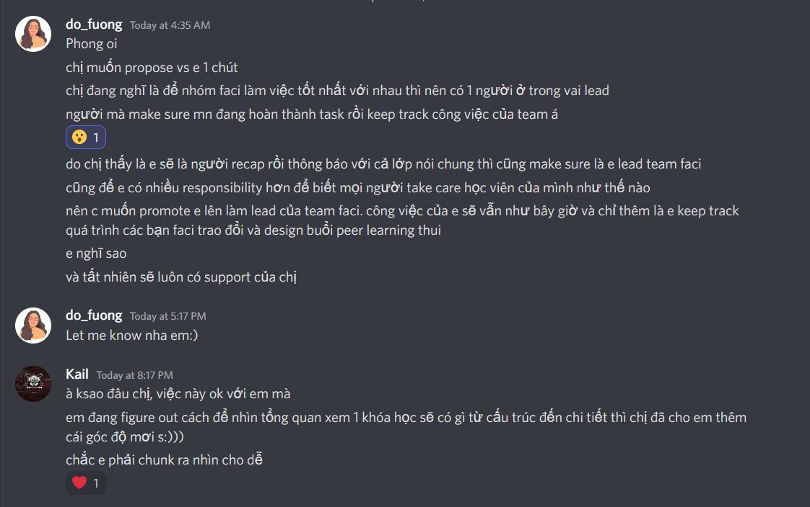

Property::  [HCH Faci Structure (notion.site)](https://fuongdo.notion.site/HCH-Faci-Structure-c7f8cedd2fa14b068af097749ccbd69b)^

- Time: Từ  10/9 - 15/9
- ## 10/9
  collapsed:: true
	- ### P1: Creative and Brain Dump
	  collapsed:: true
		- Review, đào sâu học liệu cùng học viên
		  collapsed:: true
			- Làm gì
			  collapsed:: true
				- Đọc chung?
				- Nhờ giải thích
				- Vấn đáp
			- Tần suất
			- Aim
		- Nhắc nhở học viên về những hoạt động và tasks hàng tuần
			- Làm gì
				- Nhắn lên Discord mỗi khi có hoạt động mới
				- Remind lúc sắp đến deadline
				- Nói về nó như cách nói một cuộc nói chuyện bình thường
			- Tần suất
				- Đôi khi quan trọng, có thể là sắp tới dl thì tag all
			- Aim
		- Kết nối các bạn học viên trong nhóm của mình
		  collapsed:: true
			- Làm gì
			  collapsed:: true
				- Mình thì chắc suggest 2 ng nào đó làm gì đó chung nếu thấy chung chủ đề thôi
				- Rủ ai đó lên học cùng - những ai ít lên đó (không nên đào sâu vào lí do khiến họ không?)
			- Tần suất
			  collapsed:: true
				- cũng khó để họ làm mà nếu họ làm cũng không nhanh chóng đâu nên đôi khi cứ nổi hứng nói như bình thường thôi
			- Aim
		- Quản lí Discord
			- Làm gì
				- Xây dựng những kênh discord và văn hóa phù hợp
				- Active trên đó
			- Tần suất
				- Check hàng ngày vào khung giờ nhất định
				- Nếu rảnh cứ lên chơi
				- Active: học ở trên đó ít nhất 5/7 buổi tuần
			- Aim
		- Quản lí Notion
			- Làm gì
			- Tần suất
			- Aim
		- Viết recap hàng tuần và gửi lại cho học viên
			- Làm gì
				- Nói một tuần qua đã có gì để gợi kí ức và như một cách ôn tập => aim: nó sẽ liên quan chị Fuong thích khóa học hardcore đến đâu
				- Kudos?
			- Tần suất
				- Cuối tuần
			- Aim
		- Học hỏi bọn bạn về trợ giảng, mentor - relate to trợ giảng của thầy Trung
		- Học hỏi làm quản lí nhân sự - relate to xây dựng cộng đồng?
		- Câu hỏi quan trọng: cái trăn trở và suy nghĩ này liệu có bao giờ được đọc lại như 1 định hướng, nhiệm vụ hay là sẽ bị bỏ đi như nháp?
		- Chưa biết ứng dụng nó đến đâu, còn để match với mọi người
		- Nhưng để duy trì thì có thể tiếp tục với những nhật kí và phản tư hoặc cố tổng quan hóa coi như đây là 1/3 phần đầu tiên của bài viết hoàn hảo đi (1/3 là không kiến thức nhưng tràn cảm hứng, 1/3 nữa là thực hành tổng hợp kiến thức chuyên sâu với nghiên cứu, 1/3 cuối là sáng tạo, phản tư, phủ định, chân lý)
		- Còn thiếu phần tâm thế là không được thất vọng nếu cộng đồng không nổi
		- Oke tạm đủ rồi, đánh ván game rồi check bằng discord, check trên notion những thứ anh chị làm, mình làm (chưa bao gồm cái đầu), mọi người làm nhưng nó không được tiếp nối, không ai phản hồi.
	- ### P2: Double Check + Case Study
		- Ồ check lại notion thấy anh chị có ghi rõ nhiệm vụ mình nè
		- Phong:
			- Quản lí Discord, giải thích cho mọi người cách dùng Discord để học cùng nhau và engage
			- Reminder đầu tuần sẽ có những hoạt động gì và prep work như thế nào trên Discord và gửi recap hàng tuần đã học và làm gì
			- Comment vào bài tập của các bạn
		-
		- Discord
			- Chẳng biết bắt đầu từ đâu, đọc lại toàn bộ comment, của từng kênh và truy về nơi bắt đầu? thôi thì bắt đầu từ nhìn tổng quan và nhớ những tính năng nào đã được thêm, có nên thêm sẵn nó từ đầu không? để mốc thời gian rồi dần thêm thì không hay lắm mà choáng ngợp căn nhà rộng cũng không được dùng nhiều. Từ từ add thêm có lẽ hơn? Tạo thói quen từ việc sử dụng ổn, nhẹ nhàng chứ không choáng ngợp.
			- Các kênh hiện có:
			-  
			- {{cloze ồ đang không biết 2 ảnh kề nhau như nào, may ghê là đặt next to nhau chứ không phải nghĩ cách kéo được như notion}}
			- Chức năng và cách tối ưu hơn (không hẳn là tăng dễ access về bố cục hay tính năng mà tăng reach qua sự thú vị? - chắc là cái gì cũng có cái thú vị của nó cần tìm ra thôi)
			  id:: 63225da9-528a-4e73-90df-902cf1d1d23c
			- Cấu trúc:
				- Riêng
					- là gì
					- mọi người có làm thêm gì vượt ngoài cái định nghĩa không
					- đánh giá thực tế
					- đề xuất cải thiện mô hình
					- hành động của mình
				- Chung
					- Mối liên kết của các kênh đủ để tạo ra một không gian chưa, sao cứ cảm giác thiêu thiếu gì, hoặc vài thứ đáng ra nên là khía cạnh riêng lại bị gộp chung, nhưng đừng tách nhỏ quá không sẽ rải rác -> nếu đã ít tương tác thì càng hình thành nên
			- Các kênh:
				- Thông báo chung
					- giữ nhà giữ cửa
					  collapsed:: true
						- Chào mừng bạn đến với "Học Cách Học # 1,
						  Server Discord này là nơi giao lưu và trao đổi thông tin của khóa học.
						- Kênh Thông Chung là nơi Phương và Long chia những thông báo quan trọng liên quan tới khoá.
						- Kênh Kết Nối là nơi bạn giao lưu cùng các học viên khác, Người đồng hành, và staffs của MỞ   trong đó:
						   1. thông-báo là nơi bạn chit chat, trao đổi casual với nhau.
						   2. phòng-kudos là nơi bạn thể hiện sự biết ơn với các bạn trong khoá, NĐH, hay staff của MỞ. 5 tuần học khó khăn, ai giúp mình, dù nhỏ đến đâu, mình cũng nên ghi nhận^^
						   3. phòng-thư-giãn là nơi chúng mình chia sẻ những video/ảnh/meme hề hước giúp nhau xả stress khi học, hẹn nhau đi chơi nếu cùng thành phố.
						- Kênh Kiến Tạo Kiến Thức là nơi bạn có thể xin ý kiến về dự án và trao đổi về chủ đề + hoạt động của khoá học. 
						   1. phòng-học là nơi các bạn thảo luận về những chủ đề liên quan đến lớp: bài đọc trước lớp, bài tập về nhà, nội dung bài giảng. Đọc được 1 bài viết hay, phát hiện 1 newsletter hay podcast bổ ích => Gửi ngay vô phòng-học  
						   2. deleted-channel là nơi các bạn hỏi và đáp về nội dung của khoá mà bản thân chưa rõ 
						   3. phòng-blog là nơi các bạn chia sẻ ý tưởng, cho và nhận feedback, tìm đồng đội, vv. cho dự án của mình.
						   4. phòng-qna là nơi các bạn request các nội dung chưa có ở các buổi live class và thực hành để chúng ta khám phá ở các buổi peer learning.
						- Kênh Tâm Sự là nơi bạn nhảy vào những cuộc trò chuyện, tâm sự với nhau để tìm kiếm cảm hứng, tư liệu cho dự án của mình và giúp đỡ nhau trong những khó khăn, trăn trở về việc học
					- thông báo
				- Học cùng nhau
					- faci
					- Học online
					- Tám chuyện
						- Cực ít người vào :'( đáng ra nên có event ca nhạc hay gì đó. Nghệ thuật cũng là học mà
				- Kết nối
					- chat
					- kudos
					  collapsed:: true
						- văn hóa này ổn hơn mong đợi
					- thư giãn
					  collapsed:: true
						- cực vắng bóng người, có lẽ mọi người ở đây không ai thích thư giãn
						- hoặc đáng ra thư giãn nên là hẹn nhau ra ngoài/ ngồi giải trí ở game,...
						- nhưng phòng này có nhiều tiềm năng
						  collapsed:: true
							- ném meme bình thường? hoặc meme về kiến thức {{cloze đây cũng là một cách học hay}} , ném những video tiếp năng lượng...
					- thông tin liên quan
					  collapsed:: true
						- thông tin là rất quan trọng nhưng chưa có gì nhiều, có phải bởi ít có thông tin gì kết nối được đến toàn bộ con người ở các miền khác nhau của tổ quốc?
				- Kiến tạo kiến thức
				  collapsed:: true
					- phòng học
					  collapsed:: true
						- cực nhiều thread nhưng đều bị đi vào hư vô
						  collapsed:: true
							- cũng bởi để duy trì một thread thì khó, nó không khác gì blog nhưng mang tính nhật kí hơn - vì tính năng thời gian và dòng tin nhắn của discord
							- mỗi người đảm nhận một mảng thì may ra mới duy trì nó được, điều này ở mùa 1 có thể họ quên cập nhật hoặc họ đã dừng tiếp tục...
							- nên thêm sẵn thread hay đợi ai đó raise thứ gì đó lên đủ thành chủ đề (có các yếu tố nào nhỉ) thì mới raise
							  collapsed:: true
								- raise mẫu thôi :)) chủ đề của mình
								- ê mà nếu có mô hình nhóm nhậu kiểu câu lạc bộ thì thread là nơi dành cho câu lạc bộ khá tốt
								  collapsed:: true
									- đặc biệt là nó sẽ bị deactive nếu không hoạt động nên mọi người đừng để nó chết nhé
									- còn file thì làm trên notion
								- nhưng khoản câu lạc bộ mệt nha, có đủ người mà tạo nên một nhóm không, rồi nhỡ ai tạo nhóm mà không ai vào :'(
								  collapsed:: true
									- nên có support kiểu kiểm soát + khuyến khích vài người cùng làm
					- phòng bổ não
					  collapsed:: true
						- phòng này oke
						- NDH dùng nó rất tốt, đặc biệt tốt khi họ đưa kiến thức nóng hổi kèm lời bình chứ không quẳng đại kiến thức lên
						- Một chút hơi chill mà cũng hơi bổ não: ném phim có sử dụng yếu tố này, yếu tố kia trong những phương pháp được học. Hoặc đoạn phim + kiến thức mình học được dùng ra sao -> giới thiệu về phim
					- phòng blog
					  collapsed:: true
						- chẳng nhớ phòng này để làm gì
						- đa số là blog do NDH chia sẻ, đáng lẽ ra học viên có thể tự promote blog bản thân nhưng có lẽ stick with it đã quá áp lực rồi nên promote nó có lẽ sẽ đòi hỏi một chút trách nhiệm kèm theo
					- tech-tools, gọi luôn là lab đi cho xịn
					  collapsed:: true
						- phòng này được
					- qna
					  collapsed:: true
						- ít được dùng
					- quản lí kiến thức
					  collapsed:: true
						- chẳng nhớ dùng lúc nào
						- vì nó ít thông tin liên quan đến quản lí kiến thức
				- Gặp nhau ngoài đời
				  collapsed:: true
					- hà nội
					- sài gòn
			-
			- à đôi khi thấy có vài học viên góp ý, mình cũng tò mò và muốn thử xem các anh chị đã sửa đổi bổ sung hay các bạn đã góp ý gì lắm. Có nên làm kênh góp ý, mục đích là để mọi người chú ý hơn vào việc xây dựng mô hình cùng, vào việc thử tính năng mới, vào việc chia sẻ những điều bản thân còn thấy bất tiện? Đồng thời thấy được staff giải quyết các vấn đề tận tình? Mặt trái là chính là mình sẽ expose thông tin - một lí do mà nhiều người không nhắn công khai...
			-
			- Đánh giá chung: các phòng bị dùng sai mục đích quá :)))
			- Tham khảo các kênh của các nhóm khác
		-
	- ### P3: Trao đổi người khác và thống kê tổng kết
		- Không liên quan:
		- 
		- Anh Long có board đẹp
- ## Họp
	- Chém gió
	  collapsed:: true
		- Bảo Nghi onl nhưng không bật trạng thái
		- Chị Fuong hỏi
			- học Academic Writing là gì?
			- dạy IELTS nhiều tiền không?
		- Ý tưởng chị Fuong
			- Nói với anh Tùng: Community Based IELTS Course
				- vì IELTS kiếm được nhiều tiền
				- như thế mới giàu được
			- Dạy viết luận, học viết luận theo cộng đồng
		- Chị Hà giống người miền Tây quá #BảoNghi
	- Ice Breaker
	  collapsed:: true
		- Chị Fuong
			- plan agenda công việc nhiều quá quên mảng social
		- Anh Long
			- được hỏi có câu hỏi gì không
			- anh đáp
				- mọi người ăn tối chưa, ăn gì
		- Chị Phương Anh
			- gợi ý hôm nay phải nói về Trung Thu nó mới đúng chủ đề
				- nói về sự kiện **đang diễn ra** trong Ice Breaker #icebreaker
		- Bàn về Trung Thu
			- Chị Fuong: Giờ còn ai đi chơi Trung Thu không?
				- Tôi bảo giờ chẳng mấy ai nhưng người ta vẫn nhân đây là một dịp đi chơi
					- Chị Phương Anh bảo tư bản là thế
			- Chị Fuong: Có ai biết ý nghĩa Trung Thu không?
				- Anh Long từng viết một bài dài
					- nhưng quên mất
				- [Bắt nguồn từ tích Trung Quốc](https://afamily.vn/tet-trang-trong-hem-trieu-thuong-20190910153743745.chn)
					- [[Bình về Tết trong hẻm Triều Thương]]
			- Tôi
				- thấy buồn không có ai đi chơi trung thu
					- đúng hơn là có người muốn rủ nhưng không mời được
					- chứ không phải không có người để đi cùng
			- Anh Long đọc
				- ngắc ngứ và không truyền cảm lắm
				  id:: 631e510a-b4ad-4b3e-83ae-a424f9df9c56
			- Chị Fuong thấy thú vị và muốn anh Long làm tiếp
				- tự hỏi là mỗi lần mình mention họ như này liệu mình có nên link sang profile họ?
				  id:: 631e558f-98fc-4f6e-b9d4-59d237070500
				  collapsed:: true
					- hay thôi để đầu như source, meta ý #profile
						- ý hay
					- tạm dùng tag để sau này tra lại những ý tưởng cho dễ, cũng đang đồng thời định để ở cái journals vì nó note những ý tưởng ngoài lề
						- vấn đề ở đây là loạn rồi đó, sau này có nhớ một ý nó hơi ngoài lề vậy mà tra về journal (khả năng không nhớ ngày) hay chính page này (khả năng không nhớ ra), cũng có khả năng không nhớ mình băn khoăn gì
							- vấn đề về việc chia khu vực journal làm gì, trăn trở thì viết cùng lúc ở mấy chỗ hay chỉ viết một thôi cho đỡ loãng, ảnh hưởng mạch nghĩ khi đọc lại, nhìn nhiều mỏi mắt
						- cũng có vấn đề không nhớ từ mình dùng: tự hỏi - trăn trở - băn khoăn, lúc đó thử từng cụm từ hả, không nhớ nội dung sau thì cứ tra mấy câu đầu tự nhiên nó hiện ra
						- rồi có nên tìm giải pháp cover mọi trường hợp hay là đặc trưng hóa cho bản thân, một số trường hợp bản thân không mắc phải thì không cần
							- làm sao biết bản thân không mắc trường hợp nào
								- nhìn lại bản thân, tức là đọc lại tất cả note hả, hay sao tìm được những trường hợp đó
								- đúng hơn là nhớ mỗi lúc mày tra ý, có khó khăn gì thì note vào một page và kèm ngày vào
							- mình lo thế vì sợ cố cover all nhưng một số trường hợp phải có cách xử lí riêng, chứ một khuôn áp tất thì nó không áp sát được
								- làm sao biết
									- khách quan lý thuyết là 2 trường hợp xảy ra, nhưng muốn biết phải đào sâu vào từng vấn đề à, hay mỗi trường hợp có một số dấu hiệu hoặc định nghĩa để tư duy nhanh mà chọn hướng giải quyết thì hay
						- làm sao để tìm ra hết những vấn đề này - tưởng tượng ra? để giải quyết hết luôn
							- chứ không thì mỗi lúc ra thêm vấn đề thì hơi khó sắp xếp thứ tự giải quyết
								- rồi nếu không nghĩ ra hết thì sắp xếp kiểu gì?
							- ngồi vẽ map vấn đề ra thì chỉ như chém gió thôi, phải tưởng tượng và nghe ngóng những khó khăn thực tế - tưởng tượng sát từng giây một mình đi tìm
							- hoặc test luôn
							- rồi làm sao tập trung và stick xử lí một vấn đề trọn vẹn trong một khoảng thời gian - như 1 tuần được
								- không chỉ cần sắp xếp thứ tự câu hỏi trong một vấn đề mà các vấn đề liên quan nữa
							- cứ viết thêm một ý thì lại thêm vấn đề, quan trọng là vấn đề câu hỏi trước được liệt kê trọn chưa
								- chẳng hạn như từng trường hợp quên thì tính sao
								- cách làm ra một khuôn áo all là viết hết đặc điểm, lí do của việc quên
									- có việc nào tạm chấp nhận được để tiết kiếm thời gian không nếu không đủ thời gian
									- mức độ của sự tạm chấp nhận?
								- hay cứ giải quyết từng cái một rồi thấy gì tương đồng thì gộp vào
									- chắc phải test từng cách một với từng trường hợp rồi tổng quát hóa thôi...
								- sau khi nghĩ căng thì nghỉ tí đọc lại xem hiểu không, phân tích mạch ý rồi sửa, thêm thắt - (nghĩ về cách mình làm) nay là chơi game, sau này có cách nghỉ nào nhanh và hiệu quả về mặt thời gian không - cũng cần sửa cái dấu gạch này, nó là comment theo thời gian nhưng ở đây không có comment, viết xuống thì sợ 2 ý đá nhau - nghĩ về chính sự nghĩ lại này (đây là một topic để hỏi anh Hoàng Long, giải quyết sự phản tư như nào, hơi relate to việc giải quyết vấn đề, phương pháp và hệ thống của HCH nhỉ, tự dưng có câu hỏi phản tư bao nhiêu là đủ? để không quá chìm trong việc phản tư? liên quan vấn đề đong đo hoặc có quy chuẩn cho việc nghĩ là chỉ được nghĩ 5 ý thôi thì mày nghĩ lên 7 cũng được nhưng phải bỏ 2 và viết sự phản tư xuống như nào
									- việc mình thiếu sót và gây khó hiểu có thành quy luật không?
									- vấn đề cần chính xác nhất có thể ngay lần đầu viết
									- cần review lần 3 không hay để sau review lại
										- review mới có 2 tiêu chí thôi, thiếu gì không?
									- nên quay lại để phân tích hành vi tâm lý
										- và say out loud tâm lý ra vì quay chỉ được hành vi thôi
				- vì chẳng thấy ai đi nghiên cứu về mấy sự tích đấy cả
					- có thể có một số dự án do giới trẻ hoặc nghiên cứu chuyên sâu (nhưng không được minh họa hấp dẫn thôi)
	- Start
	  collapsed:: true
		- Disclaimer
		  collapsed:: true
			- lần đầu có faci
			- nên không biết chuyện gì sẽ xảy ra và háo hức
		- Trọng trách faci lứa đầu
		  collapsed:: true
			- đặt nền móng và thiết kế nên những faci khóa sau
		- Agenda
		  collapsed:: true
			- Share về role faci cho khóa tiếp
			- Thảo luận nhóm
			  collapsed:: true
				- discuss về công việc anh chị đang nghĩ ra
				- làm việc team với nhau như thế nào
				- cái gì cần có
				- cần đồng ý với nhau cái gì
		- Lợi ích cho tương lai
		  collapsed:: true
			- faci là làm việc nhóm
			- sẽ cãi nhau, khóc lóc,...
			- học về lead team và làm việc team
			- một người team player tốt sẽ có đặc tính thế nào
	- Trao đổi nhóm
	  collapsed:: true
		- Mọi người hay quên hoặc không nghe rõ nên phải hỏi lại nhiệm vụ
			- tôi nghĩ hơi thừa nhưng có thể nó là điều cần thiết để xác lập mindset
		- Câu hỏi của em Mai
			- Peerlearning sẽ do mình hoàn toàn chủ động sắp xếp
			- lên nội dung ra sao
	- Trao đổi chung
	  collapsed:: true
		- Chị Fuong kiểm tra bài cũ, bảo tóm tắt role faci
		- Em Mai trả lời
		  collapsed:: true
			- là người đồng hành cùng học viên suốt khóa học
			- giúp các bạn đào sâu kiến thức
			- keep track công việc
			- bonding
		- Chị Fuong summerize
		  collapsed:: true
			- Đào sâu kiến thức
			- Giúp mọi người keep track phải làm gì trong khóa học
		- Bảo Nghi bổ sung vấn đề
			- do khóa 1 cũng đông và chỉ có mỗi anh Long với chị Fuong nên mọi người không làm hiệu quả mảng [[Lộ trình cá nhân - MỞ]]
				- có faci thì chuyện đó sẽ hiệu quả hơn
				- vì faci lead, keep track mọi người đang học, đang sử dụng kiến thức đó
					- {{cloze đơn giản nhỉ, cứ nghĩ phải phát triển thành cái gì đó của riêng - vì lộ trình mang hàm ý phát triển, hoặc quá trình áp dụng ngày càng tốt hoặc đạt được aim}}
					- đánh giá lúc chưa nghe kĩ: quả lộ trình này cũng khó lắm
						- phải hiểu sâu về người ta
						- đặt aim cho người ta hoặc tư vấn bao nhiêu là đủ
						- nếu chỉ đơn giản là hỗ trợ người ta tự lên và tư vấn thì sẽ dễ hơn
				- nếu chỉ học Science of Learning không thôi chỉ chưa đủ gần thực tế với mỗi người học nếu không áp dụng kiến thức mới vào cuộc sống người ta
					- à ý là cách áp dụng riêng: lộ trình cá nhân hóa
		- Chị Fuong công nhận chưa làm được dù muốn làm
			- không đủ sức người
			- thời gian
			- đó là lí do muốn build ra system này
		- Chị Phương Anh hỏi về tiêu chí **không bỏ ai lại phía sau**
			- Tiêu chí không để ai bị bỏ lại phía sau:
				- một số bạn hơi hướng nội thì faci sẽ cần kết nối với các bạn nhiều hơn để các bạn kết nối với các bạn khác trong khóa học, tương tác tốt hơn
		- Chị Fuong trả lời và chia sẻ kinh nghiệm
			- yeah, share trải nghiệm 2 năm khóa học với MỞ:
			- có những bạn năng nổ hơn những bạn khác
				- vì cá tính bạn ý như thế
				- không ngại engage in big group
				- sẽ thu hút được sự chú ý
				- ví dụ: Bảo Nghi
					- ở trong trường em vô hình đó chị #BảoNghi
			- có những bạn không giơ tay đặt câu hỏi không có nghĩa bạn ý không nghe giảng
				- vì bạn ý ngại giơ tay đặt câu hỏi trong big group
				- sẽ engage trong breakout
			- có những bạn chỉ chat, không bao giờ bật mic nói
			- có rất nhiều kiểu tương tác trong lớp
			- bản thân chị Fuong là một người thiết kế khóa học cần quan tâm rất nhiều đến matrix
				- đo lường thành công học viên ở đâu
				- cái sự tương tác của học viên cũng khá đo lường xem họ tham gia hay không
					- cần thu thập thêm data
			- cũng có những bạn đang slack of thật thì mình cần check in với bạn ý
			- quan trọng là chú ý: thường nói đến tương tác thì hay nói tới bạn hay nói ra một cách năng nổ nhưng vẫn sẽ có những loại hình tương tác khác mà mình không nên bỏ qua
				- đây là aware bias về những loại hình học tập
				- không trách được nhưng cần chú ý về các tính cách khác nhau
				- con người thường hay bị thu hút bởi những người cùng suy nghĩ, cùng tính cách
					- chú ý đến cái này thì mình biết mình nên đi chơi với cả những người khác tính cách khác suy nghĩ miễn là cùng value
						- nên được encourage thay vì xa cách
					- khác value thì khó và dễ conflict
						- như người ăn chay và không ăn chay
		- Chị Fuong nói về mong muốn và định hướng tương lai
			- Vấn đề thấy rõ là hai NĐH thì không quản lí hết được
			- Muốn phát triển cái cộng đồng, khóa học này
				- từ 20 lên 30 rồi 50
				- sẽ càng ngày càng cần có hệ thống hỗ trợ
			- Tại sao chọn mô hình này
				- vì dù lớp có 20 bạn cũng không biết hết được 20 bạn
				- mọi người chỉ biết 3-4 bạn trong lớp mà hay tương tác
					- nhưng cũng dễ mất kết nối nếu sau này không làm gì thêm với nhau
				- vậy nên dù lớp 20,30 hay 40 thì một người không thể biết hết toàn bộ mọi người trong cộng đồng
				- nhưng nếu bẻ nhỏ cộng đồng thì ta sẽ có mối quan hệ đồng hành, thân thiết với nhóm hơn là xã giao với tất cả
			- Đang test, có thể không như suy nghĩ
				- chưa bao giờ thử
			- Nói về vai trò
				- Faci (giữa học viên)
					- hỗ trợ NĐH
						- {{cloze chị Fuong đá sang NĐH rồi mới nói thêm về vai trò faci để mọi người hiểu context và lí do sinh ra}}
					- tăng trải nghiệm học
						- logistics
							- mọi người không bị mất kết nối, tìm các thứ ở đâu, biết nhau, thấy những thứ mình học áp dụng được trong cuộc sống
							- ai nghỉ học thì recap lại những gì xảy ra
						- learning
							- giúp học viên review, đào sâu kiến thức note lại những gì chưa hiểu và mang về cho NĐH (point of expert)
								- không cần lên mạng google và trả lời câu hỏi học viên
									- {{cloze tôi ghi chữ không cần nếu người ta nói thế, không cắt từ cần đi vì nghe nó khuôn ép quá dù thực tế làm thì có sao đâu, đôi khi cũng ứng biến}}
						- connection
							- không ai bị bỏ lại phía sau
							- promote peer learning
								- {{cloze ừ mà tại sao trước đây các cô không promote cái này ở trường nhỉ, dù k thông hiểu nhiều loại phương pháp học tập thì cái này cũng rất quan trọng và cơ bản, mà cũng khó chứ, ừm make sense}}
								- đang test xem faci có giúp peer learning hiệu quả hơn không
					- 1 người tương tác 4,5 người thì đỡ mệt mỏi hơn nhiều
				- NĐH
					- như anh Long sẽ nghiên cứu đẻ ra nhiều content và có nhiều tài liệu cho mọi người
					- tăng chất lượng
				- đấy là lí do mọi người tham gia khóa học
				- mình lười, có tỉ thứ ngoài kia
				- ở đây có một người đam mê và lọc thông tin cho mọi người
		- Anh Long chia sẻ reflect chuyện học ở trường
			- ở trường hồi trước hay chê thầy dạy dở ở trường
			- nhưng dạy xong khóa này nhận ra thầy chỉ lo về chuyên môn thôi, lo chuyên môn hết ngày rồi
			- một số thầy học education lên? thì sẽ có chuyên môn dạy học
				- pedagogy #Fuong
			- nhưng một số người lập trình máy tính expert, thạc sĩ tiến sĩ không có nghĩa họ giỏi dạy học
			- nếu yêu cầu phải biết tổ chức lớp, điều phối lớp online, tổ chức công việc học tập thì họ không biết, không có thời gian làm
			- nên bớt chê trách
			- và khi thấy thầy dạy hay mà điều phối dở thì có thể xung phong làm trợ giảng
			- mình biết cái này thì mình có thể giúp thầy cô
			- tạo mối quan hệ tốt thay vì comment má dạy toàn lí thuyết thôi chán ghê
				- giúp kĩ thuật, minh họa,...
			- Chị Fuong bảo
				- là lỗi của trường, bộ giáo dục
			- Anh Long nói
				- trường nên có người giáo viên và tổ chức lớp
					- ừ song hành chứ không phải trên dưới
						- tôi sợ mình không đủ mạnh mẽ để đứng song song
				- {{cloze dù sao cũng có thể đánh giá giáo viên theo thang đo về kiến thức, kĩ năng tương tác, cái họ thích, cái họ giỏi hoặc tiềm năng ẩn là sắc đẹp}}
		- Mô hình Peer Learning? #BảoNghi
		  id:: 631ea40a-db46-48c8-9e33-b9c0ff9e52cb
			- Peer Learning mới theo dạng 1 nhóm 6 người là gì?
				- Run các buổi peer learning với 6 bạn học viên mình hỗ trợ
				- Vậy là nó không run với cả lớp và optional nữa mà chuyển sang mỗi nhóm 6 người với 1 faci thì se có 1 buổi peer learning khác nhau...
			- cách đặt tiêu đề thế này dễ hiểu hơn nếu tự dưng nhìn vào, đỡ phải mở ra mà phòng trường hợp mở ra không hiểu lại phải đọc từ đầu đoạn đó + hashtag tên để sau này dễ tìm và theo dõi sự phát triển người đó? nma nếu thêm tag này vào profile thì có vấn đề gì phức tạp này sinh không, hay tag tên dành cho lời người ta nói luôn, hay là tên kiểu in hoa này thôi còn tên kiểu khác dành việc khác #DOING
		- Chị Fuong bảo sẽ giải thích sau, trước là về cấu trúc đã
			- hoặc có câu hỏi thì nói luôn
	- Cấu trúc
	  collapsed:: true
		- Bảo Nghi toàn hỏi đúng trọng tâm
		  collapsed:: true
			- {{embed ((631ea40a-db46-48c8-9e33-b9c0ff9e52cb))}}
		- 
		  collapsed:: true
			- Cái này giống lúc làm filter ig #BảoNghi
			  collapsed:: true
				- {{cloze ??? giống gì filter cơ, nhưng nghĩ lại mới để ý, làm filter. ừm tôi nhớ UX, UI họ cũng có cái app cài những cái hiệu ứng liên kết với nhau bằng các đường nối như này}}
				- {{cloze Thật là một gợi mở! Về cách làm filter và học về arrow system}}
		- Cách chị Fuong build khóa học ở MỞ:
		  collapsed:: true
			- Mang tính tâm lý học, cách thiết kế một cộng đồng học cùng nhau
				- tham gia vì có khó khăn gì đó có thể chia sẻ với nhau được
				- đó là vì sao mọi người vẫn ở đây và muốn ở đây
				- làm cho các cuộc thảo luận, tất cả những gì mình làm đến từ việc mọi người đều có khó khăn trong việc học
				- lúc chị Fuong và anh Long nói về hiểu và đào sâu kiến thức
					- process dài lằng nhằng, 4 bước trong note chứ không viết luôn cái note rồi nghĩ mình hiểu
				- chị muốn nhấn mạnh việc khóa học, cộng đồng đến từ khó khăn có thể chia sẻ được với nhau
					- như hiểu được khó khăn Phương Anh hay Ngọc Mai đang gặp phải trong việc học và Bảo Nghi hiểu khó khăn Ngọc Mai, Bảo Nghi, Mai Linh hiểu khó khăn của nhau: học IELTS khó quá trời
		- Và đối với MỞ - Học Cách Học
		  collapsed:: true
			- **Baseline chị Fuong build khóa học này là học là một việc rất là khó nhưng mình sẽ làm nó cùng với nhau**
			  collapsed:: true
				- *hơi khác tôi nhỉ*
					- *vì học rất khó nên tôi sẽ làm nó dễ hơn và chia sẻ cho mọi người*
				- *và nghĩ về lớp thì chúng tôi quá rõ còn nhiều thứ khó như nào nhưng sao không chia sẻ nó cùng với nhau...*
					- *tôi chỉ nhớ được đôi lúc muốn xa nhau vì nghĩ thế sẽ phần nào ép buộc, "thao túng" được người khác - như lúc tôi mặc kệ Phương Thảo gọi nhắc hỏi han*
				- *và nghĩ lại cái mình hướng cho lớp cũng có phần này nhưng tôi hướng đến đỉnh, chính là tạo thêm struggle cơ*
				- mọi người ở đây đang khó khăn gì đó trong việc học và có thể chia sẻ nó được với nhau
				- nếu ai master việc học rồi mà không muốn học gì mới thì sẽ không muốn ở đây
				- còn có một case là Nghiên, là một người chắc là biết hết mọi thứ về learning science mà chị Fuong chia sẻ rồi rồi nhưng vẫn ở đây
					- vẫn phù hợp vì dù biết hơn các bạn khác và học Y rất khó khăn, đòi hỏi nghiên cứu những cái này về những năm đầu học Y
					- thì Nghiên có mindset là dù biết tí nhưng quá trình học vẫn khó khăn, nói được ra cái khó khăn của mình và muốn học thêm về chunking để xem làm thế nào cho tốt hơn
						- dù chị Fuong bị gây áp lực và bảo giỏi lắm rồi sao vẫn vào đây học?
						- *làm tôi liên tưởng đến khóa phản tư, dù tôi biết mình phản tư khá tốt nhưng đây vẫn là một khóa độc đáo để học*
					- mỗi người sẽ phù hợp nếu open mind, cởi mở, có sự lấn cấn và biết rằng mình có thể học tốt hơn
					- người biết chút sẽ giải thích cho những người khác
			- Solution
			  collapsed:: true
				- kiến thức
					- goal: sử dụng áp dụng vào struggle
				- technical
					- áp dụng note taking để học tốt hơn
				- con người
					- là hoạt động làm cùng nhau
						- từ xưa xửa xừa xưa động vật cũng làm thế
					- cần social element này trong việc chứ không phải vào đây học như một cái máy, đạt điểm cao, không ai quan tâm tới ai
						- không phải một cộng đồng chị hướng tới
						- *tôi relate to việc học văn, nó thú vị vì trong tuyển tuy không mấy ai share bài mình, do ngại chứ không phải do giấu và không ghét không xa lánh, không áp lực vì ai biết học bao nhiêu là đủ, ai biết điểm bao nhiêu bài này*
							- *có lẽ đặc trưng của văn là thế, và nó cũng quá đồ sộ để đong đo hợp lí, đặc biệt là người ta không đếm ý hay ý lạ trong văn hay mấy cái yếu tố khác - trước giờ tôi không hề chú ý*
							- *giờ nghĩ lại chắc họ tính đểm trên ý triển khai và bố cục*
							- *còn tôi thì quên bớt cái tâm thế viết văn của mình hồi xưa, chỉ nhớ nó thiên về sáng tạo, độc đáo - dù không sáng tạo và chính xác trong lập luận, và "có tình cảm"?*
								- *ồ khai phá ra một tiêu chí chấm văn mới và tạo tiền đề để mình xem lại bài văn xưa mà không ngại*
								- *chẳng nhớ tại sao mình chê nó nữa dù mọi bài mình đều cố gắng khai phá ra ý lớn, vấn đề mới, cách giải quyết độc đáo thú vị, trọn vẹn rồi viết xong lại đi so sánh với mấy bài đầy học thuật hoặc được chuẩn bị, tìm hiểu kĩ lưỡng về mặt kiến thức hơn - nói thế không có nghĩa tôi phủ định hoàn toàn sự tồn tại của kiến thức trong bài tôi mà bởi mấy bài kia ý cũng không quá lạ, chỉ là chứng minh nó có thể khác nhau và thi thoảng có một vài ý hay*
					- yếu tố con người không giải quyết technical problems nhưng sẽ giải quyết các vấn đề tâm lý chẳng hạn'
						- mọi người có trách nhiệm nhiều hơn để học
			- Cách thiết kế
			  collapsed:: true
				- Chị Fuong
					- note taking là medium of thought, mình sẽ integrate hai phần này với nhau như nào
				- Anh Long
					- anh chị muốn biến tất cả bài giảng thành xem trước còn lên lớp thực hành
						- *ừ được cái lợi là đỡ phải dạy lại nhiều - dạy cái phần hơi chán mà dạy càng nhiều càng chán, sẽ có thêm thời gian thoải mái xử lí các vấn đề nảy sinh như câu hỏi*
					- cố gắng dạy note taking trước, learning science sau/cùng?
						- chưa rõ, nhưng anh Long đang định dùng viết giảm cognitive load - suy nghĩ trong đầu
							- nó sẽ thành từng blog kiến thức và các blog này sẽ liên kết với nhau
								- ví dụ nói về ghi chú điện tử
									- sẽ có cái sub catagorize là tag mọi thứ với nhau để phân loại hóa: phân loại các kiến thức với nhau
										- ví dụ là tag chunking vào để khi kiến thức phức tạp quá mình chia nó thành từng cụm
								- hoặc vì sao phải take note
									- sẽ nói đến khía cạnh cognitive science của take note và integrate lại với chuyện học (link chúng lại 1 chỗ)
						- cuối tuần, tuần sau nữa sẽ update
							- *làm khó và khổ đấy*
				- Chị Fuong tổng hợp, nói về làm sao để học tốt hơn
					- quy về 3 cái chính
						- ghi nhớ
						- hiểu
							- *hiểu gì nhỉ, hiểu kiến thức, hiểu mình*
							- *nếu tôi chắc tôi cho thêm mục động lực, hình dung tham vọng mình hướng đến sẽ là giỏi như nào, sáng tạo và mấy yếu tố như năng lượng, kiểm soát thời gian, vận dụng triệt để thành quả con người - công nghệ cũng như kiến thức người khác, review,...*
						- quản lý
							- *tôi hay dùng từ hệ thống hơn vì hệ thống cũng không hẳn để quản lí*
							- đường dài hơn, mọi người sẽ muốn quản lí những gì mình học một cách đường dài như nào
								- vì ai ở đây cũng muốn học đường dài rồi
					- sau khi dạy khóa 1 xong thấy note taking hand-ons, ai cũng làm cái đó
						- nên khóa 2 sẽ để tuần nào các bạn cũng take note luôn
						- không như khóa 1 là được giới thiệu nhưng không ai keep track
					- khóa 2 sẽ tập trung ngoại hóa suy nghĩ, tất cả những thứ liên quan đào sâu cần viết xuống và mind map, note taking đều làm được đồng thời cũng giúp visualize suy nghĩ
						- build content quanh việc note taking
						- và learning science đằng sau đó để giải thích cho mọi người
							- mọi người sẽ: ờ, tại sao mình cần tóm tắt ý chính ý phụ
						- **Problem based learning** đúng không chị #BảoNghi
							- Theo em hiểu à học, truy cứu kiến thức từ những vấn đề thực tế
							- ví dụ học hóa bắt đầu bằng discussion about air pollution chẳng hạn
							- từ đó mình sẽ học những kiến thức hóa, những chemical principles để giải quyết những vấn đề đó
							- em nghĩ nó có thể hiểu được theo kiểu tạo động lực từ bên ngoài như trong bài blog về động lực mà [chị share](https://fuongdo.notion.site/ng-l-c-h-c-t-p-bb9e101fa6ce49e99583440bf3e9373b) trên discord lớp á
							- *khó nha, mà tại sao chỉ Hóa*
							- *ừ tôi cũng hướng tới cái đó nhưng không nên làm vấn đề khách quan so với chủ quan chúng ta, xa lắc xa lơ và dửng dưng quá thiếu tác động, đe dọa, không thì phải hand-ons hoặc có người kiểm chứng, chuyên gia đứng đó*
							- *học đống hóa kia như thế nào đã để mà dùng, dùng ra sao, research các thứ như thế nào nếu chưa biết gì - có người hướng dẫn à nhưng ai đủ trình, nhiều, nhưng ai đủ tầm nhìn, thiếu, việc research trên mạng giống đọc sản phẩm, ý tưởng người ta hơn. tôi không nghĩ ra*
							- {{cloze chẳng hiểu điều gì đã khiến Nghi nghĩ ra ý tưởng này, thực ra cũng không hẳn là nghĩ ra, ở đây dùng từ relate đến thì hợp lí hơn}} {{cloze ngẫm lại thì để học hóa mà bắt đầu bằng vấn đề đó thì càng chán hơn, vì tuy problem based learning hay, curriculum design càng quan trọng - đôi khi càng hay hơn, khi bạn phải quan tâm kiến thức nào của Hóa nên dạy trước, cần phải dạy, bắt đầu từ phân tử nguyên tử chứ đi thẳng vào giữa lưng chừng những nguyên do từ hợp chất gây ô nhiễm môi trường rồi truy ngược truy xuôi thì không ổn. Nếu muốn giảm ô nhiễm môi trường và đồng thời học hóa thì còn oke chứ không học một bộ môn bằng một vấn đề như thế được, chúng không cân xứng. May ra nếu muốn thì có thể cùng lúc đó học chủ nghĩa duy vật, nó có đề cập chút đến nguyên tử phân tử hoặc bắt đầu học Hóa, được gợi dẫn vào Hóa từ cái khía cạnh này rồi đi lên những khía cạnh khác. Những problem, kiến thức khác chỉ có thể làm ví dụ được thôi chứ không đóng vai trò làm phần chính trong bộ môn Hóa được. Tạm thời suy nghĩ tôi là thế}}
							- {{cloze nhân nói về suy nghĩ, chợt thấy quen thuộc ghê, như tôi hồi trước toxic là chửi nó như chửi lớp ngay. ý tưởng sáng tạo mà non nớt ngu muội quá... dù của tôi cũng chưa chắc khá khẩm hơn gì. Cái này phải thử trình với Phúc và có thể bị nó phản đối. Tao chẳng thấy Hóa có gì chán cả (nếu nó nói thế thì có thể hiểu như bọn mày mới chán ý) nhưng tao đang cố thiết kế cho những người thấy chán - không cần bàn về chuyện nhiều thứ chán nhưng vẫn cần nhỉ, không chỉ là kiến thức mà đôi khi còn là việc làm. Nhưng nói đến chuyện thiết kế cho những người không chán, chỉ là tôi đang tìm cách làm Hóa thú vị chứ có thực sự hướng đến người không thấy hay không? nếu hướng tới họ thì sao, có thể bớt thú vị và bù lại họ học hiệu quả, hiểu bài đúng bản chất hơn là lệch lạc, hiểu biết mỗi thứ một tí và chẳng mạch lạc, có cấu trúc hay nên cái thể thống gì cả? Tốt nhất mày đừng có phản tư và phản đề bằng những kết quả giả tưởng khác. Thử chú tâm vào người mày nói mày hướng đến một lần đi xem sao}}
				- Anh Long bổ sung
					- tụi mình sẽ làm cả template cho Notion và Logseq
						- template sẽ giống cái module gồm các gạch đầu dòng, cụm nhỏ để tự design cái riêng
							- tóm tắt, concept note
							- cô đọng hóa thông tin
							- ý chính ý phụ
							- link các thông tin với nhau
						- sẽ cố trình bày trên giấy và integrate nó với chuyện học qua template bọn mình có
							- *template của anh đơn giản mà hữu dụng*
							- *còn tôi đang rối loạn lên đây, ý tưởng chưa chốt được thì sao dám sắp xếp và bắt tay vào làm*
								- #DOING ờ mà note nào trong lúc đó thì mình viết *in nghiêng* còn suy nghĩ thêm, comment thì để cloze hay comment?
								  #+BEGIN_COMMENT
								  comment?
								  #+END_COMMENT ?
				- Anh Long nói tiếp
					- có cái ý về chuyện là **mọi người tập trung hơn làm blog** (có thể làm thành page)
				- Chị Fuong nãy đang định nói, giờ nói tiếp
					- Chị nghĩ là phải cho mọi người cái bức tranh toàn cảnh của một khóa học
					- Và cái ý của anh Long về **biến liveclass thành nơi để áp dụng** (có thể làm thành page)
					  id:: 631f4e24-d469-4cf1-9c3d-e74edac3fff1
						- không phải disagree nhưng mà giờ định nghĩa áp dụng là gì
						- {{cloze tôi luôn không hiểu ý anh Long như ý chị Fuong mà hiểu rằng sẽ làm note taking hoàn chỉnh và gần gũi, để rồi mọi người comment và test được luôn. Dù ý chị Fuong bổ sung rất chuẩn}}
			- Bức tranh toàn cảnh về khóa học
			  collapsed:: true
				- {{cloze tôi cũng chưa hiểu cái cấu trúc này lắm nhưng để xem chị nghĩ gì đã, vì chị đã nghĩ gì đó và thấy nói luôn thì rối, nói luôn thì không rõ nên mới back lại và mở rộng hơn bằng phạm trù này}}
				- Problem
				  collapsed:: true
					- Tất cả mọi người đều có khó khăn trong việc học
				- Hope
				  collapsed:: true
					- Note Taking và Learning Science giúp mọi người giải quyết được vấn đề trong việc học
						- để giải quyết mọi người cần phải áp dụng vào thứ mình đang học
				- Imagine
				  collapsed:: true
					- trong một tuần cái buổi peer learning sẽ là buổi mà mọi người...
					- oke để mình đi ngược lại
						- trong một tuần và một khóa
							- 2 loại learning
								- Live Learning - Synchronous Learning
									- instant
										- có câu hỏi gì trả lời luôn được
										- get access tới nhau
										- được update mọi thứ đang xảy ra
											- thông báo nhau đây thứ quan trọng là đây
									- ngồi đây nhìn nhau nói chuyện nhau
										- không thì phải chat, email, book meeting khác
								- Asynchronous Learning
									- không nhìn thấy nhau trực tiếp
									- engage nhau offline
							- Ví dụ trong khóa 1
								- Live Learning
									- có buổi học với Fuong, anh Long, peerlearning
								- Asynchronous
									- không cùng một thời gian
									- tag nhau trên notion
									- nhắn nhau trên discord
				- Những câu hỏi là designer lớp học cần đặt câu hỏi và suy nghĩ
				  collapsed:: true
					- Live class để làm gì
						- tại sao phải gặp nhau trực tiếp
					- Không gặp nhau trực tiếp thì làm gì
					- cố biến tất cả những gì anh Long có
						- NĐH có rất nhiều content
						- thế thì dùng cái nào học live, asyn
						- thời gian nhìn thấy nhau làm gì, không thấy nhau làm gì?
					- tựu chung lại (tôi phải dùng từ này vì chị Fuong rất hay quy nạp và từ sự quy nạp này lại diễn dịch ra cái khác :) có thể là giải thích, điều quên chưa nói, còn với tôi đôi khi là ý tưởng mới) 2 cái syn là những gì cần nhớ để feedback
					- những gì anh chị design là thử nghiệm thôi
					- khi mọi người nhớ 2 cái này trong đầu thì sẽ hiểu hơn về cách anh chị muốn design peer learning như nào
					- từ hai cái đó anh chị build ra thời gian học trong một tuần
					- 1 tuần chỉ học với nhau 6 tiếng, thời gian còn lại là asyn
						- học trên lớp, đi làm,...
					- làm thế nào để **tối ưu hóa thời gian của nhau**, nghe nhau nói và không mất thời gian của nhau
						- *vấn đề sẵn có mà trước giờ cái nào cũng có, tôi cũng có*
							- {{cloze không hiểu comment này lắm, nó thuộc về lúc này chị Fuong đang nói về cảm giác thấy không hiệu quả hay tiếp dòng suy nghĩ cái chuyện của Nghi, nhưng tôi nhớ đoạn này tôi đã nghe chị, nhưng dựa vào thời gian suy ngẫm thì có thể là vài ý trước, hoặc câu chat vấn đề động lực từ bên ngoài, nhưng cái nào cũng có nghĩa là sao, hay là học ntn, hay cái nào cũng có vấn đề về sự hiệu quả? mẹ mày take note như buồi}}
							- {{cloze nó đơn giản là ý về chuyện tối ưu hóa thời gian lúc học chung, nghe giảng, bàn bạc, hay làm bất cứ cái gì với bất cứ ai hoặc giữa mình với mình}}
						- nếu cảm thấy mất thời gian là buổi đó không hiệu quả
						- nghĩ tại sao phải ngồi nghe lecture
						- đó là những thứ biến live learning không hiệu quả và mình có thể biến thành asyn hoặc buổi meeting này có thể thành email? (nghe trường hợp này rồi nhưng chưa thấy bao giờ)
					- Fuong không làm email đi
						- vì có phải ai cũng đọc đâu
						- còn ngồi đây thì ai cũng nghe
						- chắc là thế đúng không, chắc là nghe còn không thì không nghe...
						- ờ nếu mọi người không thích không thấy mấy cái Fuong nói hay chẳng hạn
						- *chị Fuong đoạn này tự biên tự diễn, điên rồi hay sao ý :)))*
					- Đó là lí do tại sao mình phải ngồi live với nhau
						- content chính
						  collapsed:: true
							- anh Long biết cái gì quan trọng trong note taking
							- cái đó phải nói trong khi mình nhìn nhau live
							- không thì không ai sẽ biết chuyện gì đang xảy ra
							- phải nắm bắt lúc mà mọi người đều đang ở đây
							- và Anh Long sẽ phải nói cái mà nó quan trọng
							- kiểu có 4 thứ trong note taking siêu quan trọng
							- tất cả cái đó phải nói trong live chứ không chỉ trong asyn vì không phải ai cũng nắm được cái đó
					- Syn là khi mọi content quan trọng cần được address giống như meeting quan trọng thì thông báo gì đó cần được nói ra
						- với lớp mình là note taking và learning science là 2 content chính cần nói ra trong live class
					- Live learning có instant access NĐH
						- Anh Long biết tất cả mọi thứ về note taking
							- cần bắt được cơ hội mọi người đang ngồi với nhau cùng anh Long để nói câu hỏi mọi người đang bế tắc trong đầu ra
							- không thì phải đợi, anh Long sẽ mất thời gian trả lời
						- Nếu có cùng 1 câu hỏi thì anh Long chỉ phải trả lời một lần và tất cả mọi người cùng được giải quyết
						- Cái thứ 3 nó phụ thuộc loại hình kiến thức
							- như nhóm khoa học xã hội, nó thường liên quan mặt nhận thức
								- mọi người sẽ muốn live class thảo luận
								  collapsed:: true
									- vì có access với nhau
									- không ai có thời gian ngồi type một thứ dài
										- trừ Duy Phong
									- vì không ai có thời gian viết những suy nghĩ mình ra trong Notion và Discord
								- vì nó là những thứ cần đào sâu suy nghĩ
									- có sự hiện diện của nhau thì muốn đào sâu về một chủ đề
									- và muốn đào sâu thì phải đọc rồi
							- còn những thứ hơi hand-ons một tí
								- như khóa này hơi hand-ons
								  collapsed:: true
									- trừ những thứ liên quan đến mindset
										- mindset về việc học
										- mindset note taking
										- kiểu discuss xem mọi người đang có những cái hardwire pathways nào
										- kiểu cái gì đang ảnh hưởng đến suy nghĩ mọi người
										- thì mình sẽ muốn sử dụng live, thời gian live để bóc tách vấn đề cùng nhau
										  id:: 631fbce5-b343-4144-a2d7-f3222aecaa6d
								- cách áp dụng
									- khá tricky để làm trong live class vì thời gian có hạn, chỉ có 2 tiếng với nhau
									- làm sao để giải quyết tất cả vấn đề mọi người về note taking trong hai tiếng đấy
									- vì thường những thứ hand-ons sẽ come up khi mọi người áp dụng
									- nên mọi người phải làm note đã, take note thì mới hấy stuck ở note taking chứ không ở buổi cùng nhau take note
									- trong một buổi live class rất khó để áp dụng note taking
									- hi vọng mọi người sẽ tự học bằng template, content để ai chưa hiểu thì xem recording và mọi người mang câu hỏi đến live class, lúc access NĐH
										- {{cloze nhưng không sợ khó quá trả lời không được thì buổi đó đi tong à, như tôi còn phải lập page câu hỏi cho anh Long chị Fuong để họ trả lời dần}}
			- Trở lại ý anh Long
			  collapsed:: true
				- ((631f4e24-d469-4cf1-9c3d-e74edac3fff1))
					- Bởi vậy nên chị Fuong thấy ý đó hơi vague và không realistic lắm vì basically anh phải đang áp dụng cho cả tuần, em phải sử dụng template note taking của anh để áp dụng suốt tuần và đến khi gặp anh sẽ có câu hỏi cho anh rồi học tiếp về note taking
						- {{cloze khiếp chị back lại nói bức tranh quá lớn rồi dùng một vài chi tiết nhỏ ở cuối cùng để đưa ý kiến về vấn đề đó khiến tôi khó xếp quá}} {{cloze dù cái sự dẫn dắt đến mức người ta quên mất chị định trả lời câu kia mà rồi ra được thế này cũng hay, tức chị đã có hình dung rất rõ?}}
	- Những ý tưởng chưa ngăn nắp
	  collapsed:: true
		- Live class là buổi học content mới
		  collapsed:: true
			- không bao giờ NĐH nên đẻ thêm content để rồi học sinh tự học
				- chị Fuong học được từ khóa đầu
			- mà lúc học sinh tự học bên ngoài live class là lúc mọi người đào sâu kiến thức đã được chia sẻ trong buổi live
			- nên trong một tuần sẽ có 1 buổi peer learning
				- get through cái ý Bảo Nghi
				- buổi này để làm việc với faci và chuẩn bị cho một tuần học
				- vào thứ 3, để mọi người xem tuần tiếp theo, tuần này học cái gì, review kiến thức tuần trước
		- Có một cái mà anh chị muốn implement
		  collapsed:: true
			- trước đây hàng tuần ai cũng phải viết một bài blog
			- không phải ai cũng làm
			- blog là nơi mọi người áp dụng kiến thức vào cuộc sống học hành của mình, chủ đề mọi người đang quan tâm
			  collapsed:: true
				- {{cloze thú vị nhỉ tự nhiên nghĩ tới kiểu phân tích cái này cái kia dưới góc nhìn giải cấu trúc, nhưng xưa học văn, làm sao đi đến được độ phân tích được dưới góc nhìn gì đó cũng khó. Trước giờ chỉ kiểu chọn chi tiết từ tác phẩm, liên kết đến hiểu biết của mình, xâu chuỗi nó lại và nói một số bổ sung về đời tác giả để bổ trợ thêm lý cho cái đó. Ừ kì thực cũng có sự tương đồng đó, tìm chi tiết trong cái mình muốn học, tìm phương pháp cần ở take note và có thể lí giải sự hợp lí bằng cognitive science đằng sau não mình và takenote - nó cũng có một sự không quá liên quan như đời tác giả với tác phẩm vậy - như tại sao tác giả viết thế, bị ảnh hưởng gì thì cũng giống tại sao mình chọn dùng take note, tempate này, phương pháp này, mình thích cái gì, thấy nó giải quyết vấn đề gì,..., chứ nói đến tính hợp lí của việc cần phải dùng take note để thành công thì nó hơi gần gũi nhưng mà cũng kì kì}} {{cloze cái này thành phương pháp implement cái gì đó vào cái gì đó được đó, mày có thể thử cô đúc hóa thành lý thuyết}}
			- bây giờ muốn là ép tất cả mọi người phải làm
			  collapsed:: true
				- không làm không được
				- vì mọi người sẽ không hiểu mình học được gì nếu chỉ học note taking sẽ bị trôi
				- Point chính của note taking không phải để lưu trữ nữa mà để học #anhLong
				- trước chị học 1 khóa của anh Trần Hữu Đại Nhật, có role là ai nộp đúng - đủ bài tập và viết bài review sau mỗi buổi học thì cuối khóa được phần thưởng là 100k #HoàngThuPhương
				- Fuong với anh Long có thể tham khảo xem như thế nào ạ, em thấy hồi đó mọi người nộp bài ghê gớm lắm #HoàngThuPhương
					- {{cloze yeah nhưng chị cũng như bao người đã đo cái thành quả sản phẩm (limit) và chất lượng bài viết (content) những yếu tố khác chưa, thực ra em cũng chưa nghĩ ra hết, ờm tham vọng của mọi người, khả năng phát triển,... nhưng nói chung đã là kiệt tác như những thứ em làm thì cần sự hoàn thành chứ không cần deadline}}
			- khóa sau sẽ ép mọi người hoàn thành bài tập tuần đó
		- Plan hoạt động
		  collapsed:: true
			- chưa figure out xong, cần nói thêm với anh Long
			- nhưng đại khái là
				- Bảo Nghi đang chuẩn bị, đang học IELTS thì sẽ đặt goal là học về viết của IELTS
					- vì em muốn viết tốt hơn,...
					- cần học abcxyz về IELTS
				- rồi Nghi sẽ report với faci của mình
					- khiếp bắt đầu gắt như học IELTS rồi đấy, chẳng biết hiệu quả không, đặc biệt là với tôi chứ với nhiều người không bận, học đơn thuần thì đơn giản
				- và faci cần make sure nhóm mình tuần đó học gì
				- và em với anh Long cần figure out được content cho việc học cái đó
					- không ví dụ như là muốn đào sâu kiến thức thì sẽ có framework chunking hay desirable difficulty
						- anh chị đã build hết rồi
					- và bạn học viên cần sử dụng cái đó và nhào nặn cái chủ đề mà bạn đã chọn và bạn làm cả tuần đấy đến khi học buổi live {{cloze vẫn focus vào buổi live nhỉ}}
					  collapsed:: true
						- {{cloze học viên làm được không hay nhờ cả faci, có case thực tế, thử chưa, anh chị làm có thể được nhưng em không biết, em không thấy em làm tốt lắm vì nhiều việc quá và mọi việc cứ đan xen, liên quan nhau}}
						- {{cloze tôi cảm giác nó càng ngày càng đổi thay, ít nhất là lệch khỏi tôi khi tôi dùng MỞ để làm những thứ này của mình nhiều hơn là học và đồng thời tôi không tin học ở MỞ là đủ kiến thức để làm nó tốt mà cần đối chiếu, học thêm, tự tìm hiểu thêm. Có lẽ chị Fuong nói cái này với based là content chị đưa đủ tốt, nhưng theo đánh giá của tôi nó chỉ là gợi mở thôi, sẽ khó áp dụng - nó kiểu đưa người ta định nghĩa và dấu hiệu cơ bản mà bắt làm thực tế - nơi có vô vàn trường hợp đặc biệt vậy - lấy so sánh trong sách tiếng nah :))) cái này cần back up bằng chính tài liệu của anh chị đấy. Không thì ít nhất nó giới hạn được rằng cái chị muốn nó bị limit, nó không reach tới cái em muốn được. Chị đang hướng tới một nhóm người, oke, chị phục vụ họ tốt và ra được outcome sớm thôi - khá giống cô Thủy, bớt giống cô Loan. đúng hơn là tạo ra nhóm người. lớp này chăm học mà nhỉ? nhưng mỗi người chăm một cách khác nhau, chị cần cá nhân hóa hơn như cách người ta engage}}
						- {{cloze tôi cần xác lập rõ hệ tư tưởng (how, nó là gì, là mô hình siêu đỉnh mày hướng đến thì mày sẽ cần dump hết ý tưởng ra nữa đấy để cho chắc chứ giờ làm cũng được nhưng sợ nó mâu thuẫn với mình khi xưa - do quên và ba phải nên không nghĩ được ý hay bằng xưa cũng là 1 dạng mâu thuẫn chứ không phải dạng mâu thuẫn phát triển, bỏ hết việc và focus đi, mày có 1 tuần) của mình để tranh luận cho dễ, có gì chị phang thẳng vào luôn, đỡ phải xử lí các vấn đề nhỏ, không có hệ tư tưởng thì dễ ba phải hoặc khiến người khác phải làm rõ hệ tư tưởng mình - thứ mà mình còn mơ hồ}}
						- Nếu không thấy hiệu quả thì sao, do ai? đặt câu này có sớm quá không
				- same thing với anh Long, anh Long sẽ build luôn template note taking chẳng hạn
				  collapsed:: true
					- {{cloze anh build kiểu gì ta}}
				- và Thái Hà sẽ take note luôn chủ đề giới em định học đi rồi em sẽ figure out em đang struggle gì với note taking
				- và chị Phương make sure các bạn làm
				- đơn giản nó thế thôi
				- Live class học kiến thức mới, trả lời câu hỏi học viên
				- để đến được đó NĐH chuẩn bị hết prepwork rồi
				  collapsed:: true
					- {{cloze cảm giác không được biên thêm kiến thức, pose thêm vấn đề bởi cái cố định không phải phương pháp, biên thêm vẫn được nhưng cái cố định là thời gian và đồng thời, có thể người ta cố tình hoặc vô tình hạn định luôn giới hạn của sản phẩm - ừ lôi mấy vấn đề cũ ra hỏi chị đi một phần vì làm prep đã chết ỉa, thời gian đâu mà dành cho tìm hiểu mở rộng, phản đề, thiết kế phương pháp riêng từ nguyên liệu là phương pháp này}}
				- và mọi người sử dụng prepwork đấy để học chủ đề cho tuần đó
				  collapsed:: true
					- chủ đề có thể lặp lại nhưng phải check in được là chủ đề này em học cái gì, em muốn áp dụng vào học cái gì (chị nên minh họa rõ hơn để tạo tiêu chuẩn cho em làm theo vì em là một đứa thích tự sát bằng tư tưởng, chẳng hiểu sao anh chị nhận em vào học)
					  collapsed:: true
						- nghe học cao siêu quá, tôi đơn thuần chỉ tìm kiếm thông tin và suy nghĩ, đến giờ nghĩ học là phải ra một bản ghi chép hoàn chỉnh như sản phẩm của việc học và thậm chí có gì đó hệ thống (như sgk), từ đa dạng ví dụ, so sánh, đến ứng dụng và áp dụng chứ không chỉ vài mẩu thông tin vu vơ?
				- lúc làm được thì các bạn sẽ nhận ra rằng khóa học này nó giúp các bạn học cái gì được, cái gì không
				  collapsed:: true
					- {{cloze đoạn này viết dễ nhỉ, không cảm giác lan man và khó quy về một lối, ý nó không tệ nhưng cứ lạc lạc đề}}
				- có thể nhận ra là không thể giúp Bảo Nghi học IELTS, lấy 6.0 IELTS
				  collapsed:: true
					- {{cloze really, tại sao? khác tôi nhỉ, như tôi là tôi tích hợp và tìm mọi kiến thức IELTS, cố tìm cách up to date và nhờ mạng lưới up to date hoặc qua nick riêng hoặc mấy cái ngàn năm không đổi hoặc có hệ thống tìm kiếm thông tin mới nhất nhanh kiểu dạng list hay trang nào đó thì easy thôi? hoặc nếu lớp tôi cần thì tôi "sống với nó 1 tuần" học IELTS kèm với sống, và làm nhiều chuyện khác luôn, dù có hơi dễ đi lệch khỏi mục tiêu chính của tôi nhưng có thể nó là trải nghiệm hay mà để sau này đứa đó dạy đứa khác, hoặc viết thành bài viết để ai đó tìm bạn tự học, hoặc thành thứ làm phim được - loại phim ý tưởng? như loại văn ý tưởng của mình? mà không được 6 thì chí ít cũng rất sát 6?}}
					- Chị nghĩ là chị không thể giúp em lấy 6.0 IELTS
					  collapsed:: true
						- {{cloze thiếu kiến thức hay gì, chị cũng giỏi tiếng anh mà}} {{cloze ielts cũng là ngôn ngữ mà nếu chị học những kiến thức chân lý, không xào nấu, đôi khi nhảm nhí và tức thời, hên xui, trending, hình thức thì sẽ mãi mãi trường tồn thôi}}
				- nhưng sẽ giúp Thái Hà hiểu thêm về giới và build được system về việc học giới
				  collapsed:: true
					- về mức độ hiểu thôi chứ không sâu được hơn à
				- hoặc giúp Phong build hệ thống học 4 năm tới ở trường đại học Ngoại Ngữ
				  collapsed:: true
					- ừm 1 mảng không quá lớn mà tôi mãi chưa động tới, mới tạm set aim thôi chứ chưa tìm hiểu phải học gì, như nào, bao nhiêu thời gian công sức,...
				- Faci sẽ dí súng vào đầu học viên kiểu mọi người phải đặt goal đi là muốn học cái chủ đề gì xong rồi sử dụng tất cả mọi thứ của Fuong và anh Long để nhào nặn và để take note về chủ đề đó
				  collapsed:: true
					- {{cloze yeah ngoài nhờ faci giúp thì có thể tự giúp mình và nhân loại bằng việc nghĩ ra cách nhào nặn}}
				- Đó thì Peer Learning thứ 3, học Fuong thứ 6, học anh Long Chủ Nhật
				- Còn Asyn là khi tự học thôi
				  collapsed:: true
					- {{cloze lại tự học, không phải tôi chê nó hay gì nhưng tôi nghe ngán lắm rồi, có cách nào giúp không tự học một mình, không phải làm gì một mình hoặc không cần tự cũng được không? học chung mà được luôn đi (ừ thì trước giờ mày vẫn làm thế mà, dù nghĩ vẫn là hành trình đơn độc. Sẽ tuyệt biết bao nếu được đồng nghĩ và chẳng nói gì cùng người khac - thần giao cách cảm à, tôi chỉ nghĩ được trường hợp duy nhất là trên giường, những cảnh thế được người ta lãng mạn hóa rằng ngôn ngữ là thừa thãi, người ta giao lưu tâm hồn qua xác thể)}}
				- Nói chung là rất khó cho mình và anh Long, let's see if we can do it
				- Mọi người có fun? Mình thấy cái job mọi người siêu fun rồi ý, mình cũng muốn làm faci
				  collapsed:: true
					- *chẳng hiểu fun ở đâu, em chỉ muốn làm thiết kế khóa học và đạt được cái thành công gì đó cho bản thân*
					- {{cloze yeah nhưng tôi hiểu cảm giác của chị qua cái điệu chị nói, qua cách chị thấy mọi thứ thú vị và những người đồng hành cùng mình sẽ được trải nghiệm cái thú vị đó ra sao. Đúng hơn là nó làm tôi nhớ lại cảm giác của tôi chứ tuy cùng tên chất hóa học, cảm giác tôi khác chị, chưa xét về mức độ tôi khó mà thực sự nếm được cái chất đó của chị. Ít nhất thì tôi vui vì chị đã làm được, người ta vẫn theo dù không ai thấy rõ cái chị đang thấy nhất}}
		- Bàn về role
		  collapsed:: true
			- again, mình sẽ có 30 người và sẽ có 5 bạn quản lí 6 bạn đó
			- nhưng mà cái này có thể thay đổi nhé, bây giờ là lúc mọi người discuss với nhau xem là mọi người có thấy role này thích không, có thể trade với ai đó khác, debate với nhau. Cái này mình đang tự đặt ra sẵn thôi chứ không biết nó thực sự thoải mái với mọi người không ý.
			  collapsed:: true
				- phải có những bạn run cái buổi Peer Learning
			- Thì trả lời câu hỏi Bảo Nghi ((631ea40a-db46-48c8-9e33-b9c0ff9e52cb)) nó sẽ như thế này
			  collapsed:: true
				- Tất cả buổi Peer Learning diễn ra vào 8 giờ tối thứ 3, tất cả mọi người sẽ vào Butter nhưng được chia ra làm nhóm, vào phòng của faci. Faci sẽ có agenda xem hôm đó làm gì. Faci bới 5,6 bạn 1 phòng
				  collapsed:: true
					- Chị Phương hỏi: Ơ chị tưởng T4 (cái này không tag vì nó không có giá trị cung cấp cá tính trong câu chat? hay vẫn có, thể hiện rằng người hay hỏi còn như tôi thì tôi... Yeah may quá, vì em bận hôm T4 à...)
					  collapsed:: true
						- anh Long: Chị Phương thứ ba chị bận gì à (ồ cũng make sense, lúc đó tôi chỉ nghĩ cho mình)
						- chị Fuong: thứ 3 chị ạ, hình như bọn em có nói là thứ 4 nhưng bọn em nghĩ nên gặp nhau đầu tuần ý để mọi người có thời gian tự học tuần đó rồi đến live class. Thứ 4 thì hơi ngắn thời gian còn thứ 2 thì chắc không ai muốn đi học nên để sang thứ 3
						  collapsed:: true
							- make sense
				- bọn mình sẽ ở đấy hết và sau 1 tiếng rưỡi, hai tiếng sẽ comeback lại với nhau as a group
				- lúc đấy sẽ có 1 bạn faci khác nói tuần này phải chuẩn bị abcxyz cho... samething 1 tuần diễn ra như nào
				- sẽ có những bạn lead buổi peer learning đấy, thì đấy là lúc các bạn cần faci
				  collapsed:: true
					- là lúc các bạn được tỏa sáng facilitation
					- khiếp tôi cứ hay nhớ tới những chị tình nguyện viên hay công tác viên, hoặc dẫn đoàn Cteam, toàn trai xinh gái đẹp nhìn mới thích... cũng chẳng cần đẹp sắc mà chỉ cần có trang điểm và ăn mặc chỉnh tề thôi cũng được
			- ờm yeah em có câu hỏi về phần này không Bảo Nghi
			  collapsed:: true
				- dạ có, em muốn hỏi kiểu là trong cái buổi Peer Learning, cái chủ đề trong mỗi break out room sẽ khác đúng không ạ, và nó sẽ thay đổi mỗi tuần và nó có động gì đến nội dung thứ 6.. #BảoNghi
				  collapsed:: true
					- uầy sao nghĩ ra câu hỏi này chỉ từ việc nghe thôi à, quan tâm vấn đề nhỉ, tôi cứ quan tâm đâu đâu và cứ mặc kệ, để những vấn đề đó sau ý
					  collapsed:: true
						- cảm giác con này vẽ map ra một buổi Peer từng có gì hoặc dump những kiến thức sẵn có để thử build lên một buổi, cái gì chưa thấy chị Fuong nói thì hỏi
			- yeah cái thinking của chị là mọi người có thể discuss với nhau, mọi người cần làm việc với nhau ý, mình đang rất promote teamwork tại mình không muốn áp đặt cái framework lên nhưng nó cần đảm bảo các yếu tối là
			  collapsed:: true
				- mọi người luôn luôn cần phải figure out được chủ đề cần học vào tuần đó
				- go through lại content với nhau
				  collapsed:: true
					- em còn nhớ có những buổi chị mà chị từng đặt câu hỏi
					  collapsed:: true
						- working memory là gì
						- WM liên quan đến note taking như thế nào
						- capacity của WM liên quan đén note taking như nào
						- {{cloze đổi mới được không ta, mà một số trò chơi gợi nhớ kiến thức thì trẻ con quá}}
					- {{cloze hừm ừ tính tôi khi làm là cứ làm như cũ nếu người ta không có bổ sung gì hoặc tự nghĩ thêm theo cách của mình vì mình lead thì kiểu gì cũng phải nghĩ, chẳng hạn thế }}
					- thì chị với anh Long sẽ có những cái ses kiểu review question về content, mọi người sẽ phải review cái đấy với nhau rồi note lại những câu hỏi về content
					- thì ai đấy cũng có tại chị thấy hầu như buổi live ngồi nghe NĐH là em hiểu đúng không
					- và có những lúc em rất confused chẳng hiểu chuyện gì đang xảy ra và thường là người, các bạn ý mà lười ý thì không reach out NĐH
					- đây là lúc mà các em phải make sure ai mà có câu hỏi gì thì note lại rồi đưa lại cho NĐH để NĐH giải quyết
				- cái thứ ba là mấy cái logistics ý là make sure là mọi người đi học
				  collapsed:: true
					- là em phải motivate mọi người làm bài tập, đi học
					  collapsed:: true
						- thì em làm cái đấy như nào là do em còn bọn chị không muốn ép việc đấy
						  collapsed:: true
							- {{cloze trước chữ còn từng là dấu , kì thực tôi thấy hai về nên cứ để thể, không nhận ra là thay bằng từ còn chị đọc chính gốc nó còn hợp lí hơn}}
					- ừ hồi xưa chị Fuong cũng nói về content như lôi kéo, khiếp đóng tiền rồi mà lôi kéo nhau khó thế à
					- nhưng ừ lỗi này tôi có mắc
			- đó thì chị đang nghĩ tất cả các buổi peer learning cần phải đảm bảo ba yếu tố này còn mọi người làm nó như thế nào thì chị không muốn add một cái framework lên mọi người.
			  collapsed:: true
				- Như em em start kiểu warm up hay là trò chơi hay whatever thì em làm ý
				- nhưng mà chị muốn là tất cả mọi người có một cái activity bank
				  collapsed:: true
					- đây là một cái sẽ giúp NĐH rất nhiều
					- ví dụ như những hoạt động nào dành cho cho review, reflection, discussion
					- mình sẽ có shared library activity ý và sau này khi plan cái gì thì cứ chọn thôi
					- và những bạn nào làm phần này với nhau thì cần làm việc với nhau
					  collapsed:: true
						- kiểu mọi người sẽ giúp nhau đưa ra 1 số plan
						- bây giờ mà làm luôn thì tháng 10 chỉ có pick 1 cái mà run thôi
						- buổi nào cứ go through schedule này là được miễn là đảm bảo các yếu tố đấy
						  collapsed:: true
							- còn làm thế nào cũng được vì đằng nào cũng phải làm rồi bọn chị feedback cho hoặc feedback cho nhau
							- *tôi nghĩ chọn không thôi thì hơi chán, nếu thêm chủ đề thì sẽ biến tấu tí. Chủ đề là gì? là cái hoạt động phù hợp peer buổi đó được chọn ra dựa trên chủ đề peer buổi đó và thêm chút liên kết với sự kiện xã hội tuần đó, như tuần này là Trung Thu, mình có thể liên kết về hình thức như design hoặc content hoặc chỉ là nói chuyện về nó thôi. Hoặc lấy một yếu tố nào đó của từng thứ - kiểu với trung thu có yếu tố sum vầy, giao lưu tương tác là ngồi ăn bánh trung thu với nhau? mà ghép vào hoặc màu hay hoạt tiết, cách mở bài như cách sự kiện này bắt đầu để mở màn cũng được - như bắt đầu kiểu máy bay đâm vào, hoặc lấy nó làm ví dụ, hoặc lấy mỗi số liệu làm ví dụ (kiểu lấy trăm nghìn thay vì ví dụ vài chục nếu ví dụ đó không quan trọng số lượng)*
							- {{cloze kết hợp vậy để làm gì, ờm thấy sáng tạo thì làm và hiện nó chưa phục vụ mục đích nào ngoài đổi mới thú vị}} {{cloze nghĩ ra và viết thêm ví dụ về cái khía cạnh mới thấy cảm hứng xưa, ừ đáng ra mình nên tặng lớp gì đó nhân dịp trung thu, kiểu mua lân cho bọn nó xem, hoặc ít nhất tặng bánh, hoặc làm bánh, hoặc liên hoan trung thu quẩy linh đình, hoặc kết hợp all... huhuhu muốn làm quá, nhớ quá}}
	- Trao đổi và thống nhất role
	  collapsed:: true
		- Còn gì nữa không nhỉ, ok dấy thì còn một thứ rất quan trọng. Bây giờ đang plan là Ngọc Mai, Bảo Nghi, Thái Hà, Quỳnh và Phương Anh là những bạn in charge cái peer learning này nghĩa là mọi người có một cái nhóm và mọi người sẽ phụ trách nhóm của mọi người. Còn chị Phương với Duy Phong mọi người sẽ manage nhìn toàn cảnh là ok 30 bạn này cái cách bạn ý học community as a whole thì đang suy nghĩ là các bạn faci mọi người sẽ incharge live learning còn Phương với Duy Phong thiết kế asyn learning nghĩa là mọi người sẽ nhìn vào Discord, Notion và viết recap hàng tuần là tuần vừa rồi học được cái gì gì gì
		  collapsed:: true
			- {{cloze nghe chưa hết câu cách học cứ tưởng là phân loại cách học rồi tạo hoạt động làm môi trường cho cách học đó sống? nhưng community as a whole là kiểu tương tác vào cái chung và tương tác với nhau à}}
				- *yeah h mới đến cái tôi đang nghĩ nên chị Fuong nói tên và nói chủ đề phát tôi chú ý tới ngay, sáng mắt luôn - tỉnh ra khỏi u mê khó hiểu mấy cái phần trước vì thấy chưa quá liên quan* {{cloze ừ lúc đó chị chưa chọn tôi là làm 1 mình rồi thành manager nên tôi thấy thế là phải, kể cả có muốn sân si sang faci thì cũng phải làm xong việc mình đã và chưa thấy sự liên kết lắm role quá nhiều - kì thực quản lí nhân viên cũng chỉ có chút liên kết trong hành chính thôi mà}}
		- thì community manager sẽ làm việc với faci nhưng không incharge một cái nhóm hay là nếu mọi người thấy một mình em manage 6 bạn hơi nhiều thì 6 bạn manage 5 nhóm và kiểu chỉ một bạn manage những cái asyn learning thôi thì ví dụ như là ờm một mình Phong đi chẳng hạn
		  collapsed:: true
			- chị nhắm vào Phong vì em rất hay engage in discord và chị muốn em mang được cái asyn learning lên discord ý
			- nghĩa là làm thế nào để em design discord thành một cái kiểu trường học chẳng hạn
			- i don't know, tùy em, em có philosophical kiểu vision về kiểu giáo dục là gì
			- thì để em thoải mái thì tóm lại là asyn learning là lúc mà
			  collapsed:: true
				- ví dụ tự dưng thứ 4 có một con bot pop up bảo các bạn đã làm bài chưa chẳng hạn
					- con bot nghe giống con chim xanh ám ảnh của duo lingo #BảoNghi
					- {{cloze ừ ý tưởng hay, để kiếm con nào ám ảnh, hoặc tạo con MỞ cũng được? Hoặc bạn Hỏi, hoặc bạn nào đó tên cũng kiểu để nhắc nhở}}
					- whatever mọi người, Phong muốn làm thì đó chỉ có một bạn incharge asyn learning thôi và collect các thứ từ các bạn faci và viết là tuần này buổi peer learning ta làm abcxyz ta, xong recap ta làm cái gì ý
		- nghĩa là bây giờ mình muốn mọi người nói chuyện thử với nhau xem là mọi người có thích cái style, cái structure bây giờ không, hay muốn thay đổi cái gì
		  collapsed:: true
			- mình muốn cho stage các bạn discuss 1 người manage 5 và 1 người manage những thứ high level hơn hay structure hiện tại ok
			- {{cloze khiếp giờ nghe lại thấy cũng nhiều việc, nhất là toàn bộ asyn... không phải liệu tôi có làm được không mà làm thế nào, dù cũng không phải nghĩ từ đầu nhưng cũng nên nếu có thời gian, dù sao cũng mệt}}
			- ờ thì mình nghĩ là để mọi người discuss với nhau xong rồi quay trở lại đây bảo mọi người muốn thế nào
		- con bot, chị kiểu totally muốn Phong làm gì đó crazy trên Discord (chị Fuong đọc comment Bảo Nghi)
		  collapsed:: true
			- tại bây giờ kiểu mọi người lên Discord ngồi học thay vì gather ý nha nên là the sky is your limit
			- Phong dọn nhà lên Discord lun =)) Ngủ, học, đánh đàn #anhLong
			- hôm nào cũng thấy #anhLong
			- cũng vì Phong.. #anhLong
	- Breakout chốt dần mô hình
	  collapsed:: true
		- *Mình có thể mở rạp chiếu phim ở Discord một buổi nào đó mà mình xem phim rồi nói về phim như mấy buổi của Câu lạc bộ Điện ảnh KHXHNV vì mình không tham gia Peer Learning*
		  collapsed:: true
			- {{cloze nhưng sẽ cần xem cách họ làm và cố gắng nhiều đó, nhất là hình như ày còn không record bất kì buổi nào}}
		- Chị Hà: Tại sao đông vậy
		- Bảo Nghi: ý là mình nói riêng với nhau á
		  collapsed:: true
			- *thực ra anh chị nghe được đó*
		- Mọi người trao đổi với nhau nhắc lại nhiệm vụ (1:22:57)
		  collapsed:: true
			- *Nhìn chị Phương với tôi quay sang làm gì đó và đồng thời cũng vừa nghe. Cảm giác như một hội kiểu họp và làm được cùng lúc, làm việc rất ăn nhập với nhau. Không chỉ là ở đẳng cấp vừa làm vừa nói chuyện mà vừa làm vừa nghĩ và họp và làm cái việc trong buổi họp vừa giao - như một kế hoạch tác chiến luôn chứ chẳng phải chỉ họp*
			- *thế thì sẽ hay, vì đôi khi làm thì nếu có hiểu biết hay tính trước cần kiếm đồ gì, phá cái gì theo thứ tự nào như hack tường lửa giai đoạn nào cho hợp lí*
		- Chị Hà: Mình bắt đầu bằng câu hỏi đầu tiên, thì mọi người thấy sao về role của mình và muốn đổi role với ai không hay kiểu lại như thế ý. Nếu mọi người cảm thấy ok thì react
		- Câu hai là mọi người thấy sao về sự phân chia này: chị Phương với Phong quản lí Notion và recap hay 1 người quản lí 5 người còn một người làm những cái high level hơn. Như kiểu thế. It's free to talk
		- Chị Phương: Thực ra chị nghĩ là cái bạn mà phụ trách cái việc peer learning ý thì bạn ý sẽ phải quản lí 6 thành viên. Đấy mọi người xem là mình mình quản lí 6 bạn như thế có nhiều không. nếu mà nhiều thì sẽ đổi 5 người. Chị nghĩ những bạn/4 bạn phụ trách buổi peer learning ấy thì mình có thể...
		- Bảo Nghi: Em có cái này, tại vì em thấy là nếu nếu mà có thể thôi nha thì một người làm với 5 người hiệu quả nhất vì em nghĩ vấn đề không phải chỉ có peer learning không ý là soạn học liệu không mà còn check từng cá nhân á thì em nghĩ mà ít người thì nó sẽ hiệu quả nhất nhưng mà em chưa hình dung được cái work load của cái vị trí người mà sẽ đi làm recap nó sẽ đến mức nào. Nếu mà một người làm có thể chị Fuong hoặc là Phong hoặc ai đấy khác thì làm bao nhiêu đó có ổn không ý. Và nhưng mà nếu mà được thôi nha, thì em xin phép để chia là 6 với 1 người. 6 người này làm live class peer learning
		  collapsed:: true
			- *thế để tôi sắp xếp lịch, việc này dễ, tôi cần xem quá trình ưu tiên gì, hướng aim nào, cái gì chính rồi chia thời gian, sắp xếp thứ tự, coop với timeline người ta kiểu support tech kịp lúc*
			- *cần bot có bot, cứ vứt ý tưởng lên*
			- *ừ làm chỗ vứt ý tưởng và tôi check làm xong như logseq developer có trang logseqweekly nữa*
		- Chị Hà: Nghĩa là Nghi thì nghĩ, ý là kiểuem đang wonder workload của NĐH đúng không
		  collapsed:: true
			- {{cloze cái này thì tôi k hiểu nhá :))) thấy anh chị vẫn siêu phàm lắm}}
		- Bảo Nghi: Không không ý là em hiểu workload của NĐH nhưng mà em chưa hiểu cái workload của cái bạn mà làm tài liệu viết recap này kia ý
		  collapsed:: true
			- *còn phải xem còn cần làm gì và anh chị lần trước làm thiếu gì đã *
		- Chị Hà: Vậy em đồng ý với ý kiến chị Fuong đưa ra, thế còn mọi người còn có ai có comment về cái role này
		- Chị Phương Anh: ờm chị muốn thay Bảo Nghi nói phần thứ nhất???, còn chị thì chị kiểu ờ cái việc ngoài workload của người manager đó thì còn recap ý. Ờ kiểu như là mình đã có 6 faci rồi đúng không, trước thì chị Phương với Phong chia nhau recap. Nếu workload lớn quá thì liệu cái bạn mà incharge cả 5 người á có nên làm recap luôn không? Tại vì bạn đó sẽ kiểu tham gia khóa học nhiều hơn và ingage nhiều hơn với những người khác
		- Ờm chị Fuong có bảo 5 người faci á sẽ là người recap sau đó sẽ đưa cho Phong hay là đưa cho Phong cái recap của mình á.
		- Chị Phương: đâu chị tưởng là 5 bạn peer learning sẽ ghi lại những câu hỏi và ...(lag không nghe được) của những học viên mà các bạn take care sau đó đưa lại cho Phong và chị để tổng hợp lại những phần học liệu cũng như là những câu hỏi của mọi người viết lại recap của từng buổi học? để post lên trên cái group Notion hoặc Discord của lớp ý đúng không nhỉ
		- Chị Hà Ờ tại vì kiểu em có đọc trên chị Fuong có viết là những người faci đầu tiên sẽ run peer learning và gửi recap cho Phong để Phong add vào recap hàng tuần thì có nghĩa là cái recap sẽ là các bạn ấy làm đưa Phong còn Phong sẽ sắp xếp lại sao nó hợp lí để đưa lên Discord
		  collapsed:: true
			- {{cloze Hừm vấn đề về cách sắp xếp như nào}}
		- Chị Phương Anh
		  collapsed:: true
			- kiểu lúc đầu chị nghĩ là recap của peer ấy còn recap của mấy buổi live
		- Chị Hà: Ừ ừ thế thì mình sẽ hỏi thêm về recap
		  collapsed:: true
			- *recap lên notion, không copy lại sang discord, chỉ gửi link và các mục chính, nhắn thêm ai học xong quên mục gì thì đọc lại và gửi nhắn riêng từng người nghỉ buổi đó cái link, cái comment của mình ở Discord*
			- {{cloze nghĩ thêm từ ý tưởng làm báo và trong đó các chuyên mục tin tức, cập nhật cả về những trò đùa thú vị trong buổi học rồi còn cả cập nhật tình hình mọi người giao lưu hay viết blog nữa, tôi nhận ra liên quan đến truyền thông, thì còn có truyền hình và mình có thể đưa tin. Đúng, breaking news. Nhưng làm thế mất thời gian nhưng nó tạo mình cơ hội và kinh nghiệm, dù sẽ hơi rush và rốt cuộc mình chỉ là đứa làm được nhiều chứ chẳng làm được sâu vì làm chỉ có mỗi mình, làm gì cũng dang dang dở dở. Nhưng kệ thú vị còn hơn không. Chấp nhận số đen thôi. Mình định để nó buổi cuối để kết thúc khóa học cho trọn vẹn và êm đẹp}}
			- {{cloze chợ nhớ chị Hà học báo chí. Yeah dù mình làm manager nhưng mình đâu có một mình, ít nhất thì mình xin tí nghiệp vụ từ họ, ai đó chọn tiêu điểm tuần chẳng hạn - khác recap ngày. Cái tiêu điểm tuần có nên làm kiểu phát triển từ cổ chí kim, từ đọc sớ sang loa phường (mở đầu bằng bài hát gì đó liên quan đến sự kiện) rồi phát thanh truyền hình không?. Và tiêu điểm tuần cuối cùng hoặc mọi cái sẽ không chỉ cập nhật tuần vừa qua mà nói luôn những cái sắp tới, thì mình có thể ngồi edit hoặc nhờ Bảo Nghi nếu nó rảnh, hoặc nhờ chị Hà viết hộ. Nói chung đỡ phải tìm hiểu cách viết báo từ ngôn ngữ đến đọc những ví dụ về nội dung mà được học thêm cả những thứ người ta mở rộng cho là quá tuyệt}}
			- {{cloze nhưng buồn cười nhỉ, tôi là tôi cứ nghĩ ý tưởng mới lạ độc đáo thú vị thôi, là tôi tôi cũng sẽ thấy thú. Còn để thuyết phục mọi người làm cùng - cũng là một vấn đề thì là vì nó sẽ vui thôi}}
		- Chị Hà: Nghĩa là mọi người sẽ đồng ý kiểu (1 trong 2 trường hợp)
		- Bảo Nghi: Hay là bây giờ em comment em comment 2 options, mọi người oke cái nào thì chọn cái đó nha
		- Chị Hà: Không thực ra nghe nói thì kiểu, ý là em thấy vụ làm bot các thứ trên Discord có vẻ vui đó. Kiểu tương tác trên Discord, thấy mọi người học trên Discord cảm giác dễ dàng để mình trả lời và ingage vào hơn ở trong một cái không gian lớp học á. Ừ kiểu cái cảm giác làm việc chỉ là mình làm việc thôi chứ không phải trả lời trong lớp học á?
		  collapsed:: true
			- {{cloze nhưng mọi người trông chờ nó nhiều quá, nhỡ mình chưa hiểu bản chất thì sao, nhỡ tại mọi người như này và Phong là học viên chẳng hạn chứ chẳng phải người đồng hành thì mới được. Tất nhiên không được thì phải tùy cơ ứng biến. À mà trước khi đến đoạn vui thì phải biết cách bắt đầu. Tìm lại cách anh Long bắt đầu mời mọi người lên gather xem nào. Ê hay mày muốn làm bàn đạp và vào voice vì thói quen mày ở Discord là ở voice rồi khiến mọi người thấy thích Discord hơn hẳn và càng ngày càng được thấy nhiều cái mới? Rồi bọn học viên thích, rồi mình sẽ có hậu duệ, rồi mình sẽ nhẹ việc hoặc phải lead bọn nó một chút... Nhưng quan trọng MỞ sẽ có thêm người làm thuê}}
			- {{cloze ừ discord vừa syn nhưng mà mọi người lại asyn :)))}}
			- *nó đã đủ hoàn chỉnh chưa? 90%* {{cloze đéo nhớ cái gì, con bot, không? vụ tương tác trên discord hay cái ý tưởng gì của mày, cảm giác là ý tưởng nhưng quên rồi}}
			- *chị phải cho em thêm hình dung về con bot chứ bot thôi thì dễ, cho nó bump trong butter cũng được nhỉ? nhưng không biết nó có support như ở youtube không*
			- *mỗi tuần thay vì nhắc deadline thì có thể nhắc lại kiểu hỏi đáp bài cũ, remind bài cũ để nhắc người ta tìm đọc lại? nói chung tính trước đây là hành trình dài, không cần cố quá*
			- *rồi mày có thể dùng meme ôn lại bài cũ*
		- Chị Hà: Nhưng chắc phải hỏi chị Fuong về cái chị Fuong vừa nói nâng cao ờ mấy cái chị Fuong vừa nói ý nó benefit như thế nào, ví dụ như thế nào
		- Ngọc Mai: ờ mọi người ơi kiểu em khá nắm được cái role của NĐH cũng như những công việc mình cần làm á và em kiểu chưa nắm được các đầu việc sắp tới ý. Ý là mình cần xây dựng cái gì để faci cho tốt ý. Những đầu việc như nào kiểu xây dựng tiếp theo những việc gì để có thể kiểu có thêm những buổi peer learning
		  collapsed:: true
			- *cái đấy làm sao nhìn ra nhỉ, không nhìn ra được, không được nhìn all từ trên xuống nên hơi khó à, anh chị nhìn ra hết không nhỉ hay vẫn thế*
			- {{cloze tại sao đề cập role NĐH ở đây, vì ở đoạn đầu chị Fuong có nói, và mấy cái nâng cao thì là ở trên đầu có nói hết. Viết vào đây để cho mày nhớ vì lần này đọc lại phải tư duy xem nó là gì mất một chút, chắc xử lí một video lâu quá mà}}
		- Chị Hà: Oook chị sẽ note lại để hỏi chị Fuong. Maybe mình có thể hỏi lại, ý là mình có thể hỏi rõ hơn về cái role kiểu là quản lí học liệu á, nếu mà quản lí học liệu 1 người thì liệu nó  nó có bị nhiều quá hay không ý, kiểu thế. Hmm, thì chắc là để hỏi rõ hơn
		  collapsed:: true
			- {{cloze càng làm càng thấy tôi tao work và thích ra lệnh quá. Ôi vụ Bình Nhi, ôi lời anh Vượng nói. Chắc chúng ta cần bonding và thấu, hiểu về nhau nhiều hơn. Cái này là một phần của tư tưởng của tôi và cái tôi làm. Và tôi phải nói, phải giảng cho mọi người hiểu bằng được và dù có khiến mọi người phải xem lại tất cả, bàn lại từ đầu thì mọi người chịu khó nhé. Tôi sợ đưa sự cầu toàn này vào MỞ lắm, hi vọng ở đây ai đó là cái phanh hãm tôi lại, còn việc thì để khóa sau tiếp nối, dù không ép được như mô hình câu lạc bộ nhưng hi vọng bọn nó sẽ làm vì nó tốt, định hướng sẵn chứ không phải sau mỗi năm với kinh nghiệm 1 năm sinh hoạt thì lại định hướng lại với sự trợ giúp của anh chị, hoặc chỉ tiếp nối cái ngọn lửa mà thôi. Có thể hỏi Vy và Phúc vào tối mai xem thế nào}}
			- *ê xin lỗi mọi người em ít tương tác quá mà chỉ brainstorm ý tưởng*
			- *tôi sẽ phải strict về thời gian hơn, công đoạn quản lí hành chính*
	- Out Break
	  collapsed:: true
		- Chị Fuong: Và kết quả là?
		- Bảo Nghi: kết quả là bọn em muố 1-6 á chị
		- Chị Fuong: đấy là cái chị start with xong rồi chị mới làm/thấy là?. Oke cool. Vậy ai là người số 1. Ai là người còn lại.
		- Không biết á, well kiểu cái structure đầu tiên là chị Fuong với cả Phong sẽ làm việc về Notion, Discord là việc hỗ trợ asyn tự học, học liệu recap các thứ á. Thì giữa mọi người có ai ở đây passionately muốn làm faci, muốn run buổi peer learning ý
		  collapsed:: true
			- Tôi nhắn: để em làm cho em cũng cần nghiên cứu về nó
			- *còn faci đi hỏi mọi người cũng được, 6 người để hỏi cơ mà, cũng xin ghé tham gia peer learning nếu rảnh luôn*
			- {{cloze coi như công việc check in với họ}}
		- Chị Phương: ban nãy em có nói với mọi người giờ em muốn hỏi lại luôn. Là việc quản lí có bị nặng quá không với một người quản lí cả Discord Notion ý.
		- Fuong: ờm trước buổi em có làm cái này cho mọi người là sau buổi này mọi người cần work on cái gì ý. Với người phụ trách peer learninhg session đó là mọi người plan buổi đó như nào. Mình sẽ có 5 buổi tất cả. Đó thì 90 phút đến 2 tiếng đấy là mọi người sẽ... một buổi học 2 tiếng ý nhưng peer learning 2 tiếng rưỡi/nữa thì đang thấy nó hơi nặng cho một tuần thì mọi người có thể set một cái poll/hôm chẳng hạn?. (vì chị Phương hắt xì)
		- Chị Phương: hắt xì
		- Chị Fuong: bless you. Cơm muối
		- Thì mọi người chỉ cần đảm bảo những mục tiêu này để mọi người plan cái buổi đó còn cái bạn phụ trách những mặt asyn learning ý thì cần xem Discord, Notion cái gì cần thay đổi, có đang dễ navigate cho mọi người không, ví dụ hồi trước mọi người bảo tìm học liệu trên notion rất khó chẳng hạn thì mình cần xem lại
		- Rồi là cái bạn này sẽ servey học sinh cũ chẳn hạn xem là Notion hay cái gì cần thay đổi.
		- Thì đấy là một, cái thứ hai là cái rất quan trọng là mọi người lên một cái template tuần vừa rồi học cái gì để mà tháng 10 chỉ cần viết thôi chứ không cần suy nghĩ về structure của cái email đó.
		  collapsed:: true
			- *mệt nha, khả năng mai khó mà làm cho lớp*
			- *ờ không vẫn được, mai làm cho lớp, được đến đâu thì đến, lại liên tưởng đến cái vẻ thằng tâm khi mệt oải và không cân hết được*
		- Rồi ờ cái còn lại chỉ cần làm đầu khóa thôi là Onboarding plan, nếu mọi người quên rồi thì đầu khóa Fuong có làm một Onboarding plan, progress, process đấy là khi mà một bạn bạn ý được nhận thì mình sẽ gửi cho bạn ý thông tin gì, mình có phải gửi trước kiến thức, warm up bạn ý như nào. Essentially nó là một cái warm up gì đó cho bạn ý để bạn ý biết về những người bạn khác trong lớp này là gì, là ai, và mình chuẩn bị học cái gì. Kiểu warm up thôi. Thì đây là một cái task thứ ba
		  collapsed:: true
			- {{cloze ồ thử chạy đua cùng tốc độ nói chuyện, không phải tốc độ giảng hay đọc. Nhận ra nếu chú ý vào chữ thì chỉ để mình nghĩ hoặc làm gì đó khác như nhìn lại bố cục còn để tay tự viết. Nhưng muốn nhanh và chính xác hơn thì phải nhìn vào bàn phím như cách hồi xưa cầm bút vừa nhìn chữ vừa viết được vậy. Dù tay thành quen rồi và một khi mắc lỗi typo thì bị vấp và ngã ngay, vẫn như thường nhưng nó giúp mình kiểm soát và có thể gia tăng tốc độ thoải mái hơn. Kì thực trước giờ toàn chạy theo dòng suy nghĩ thôi mà, mỗi tội là mình vấp thì nó dừng lại nó đọc lại cho, nhưng nó không nghĩ trước, hoăc đúng hơn mình không biết nó định đọc gì tiếp sau cái đoạn nó phải dừng lại đâu. Như này này, suy nghĩ tự nghĩ, kì vl, lạ vl}}
			- *tôi có nên làm bí kíp làm như Phong và mỗi topic sẽ liên kết kiến thức: tại sao khi ở discord thấy có người ngồi làm việc sẵn thì lại muốn tham gia vào hơn chẳng hạn - liên kết với tâm lý học*
		- Hiện giờ có ba cái task này chỉ ở đầu khóa còn hai cái này phục vụ cho việc nếu set up được system rồi thì chỉ run nó vào tháng 10 thôi
		- Thì bạn này bạn sẽ cần build system còn peer learning này thì mọi người phải plan buổi đó, plan take care nhóm mình như nào
		  collapsed:: true
			- {{cloze đây là lúc system vào việc}}
		- còn bạn này phải suy nghĩ high level hơn còn những người mà làm cái task trên thì mọi người chỉ cần tập trung vào 5 bạn của mình thôi, mọi người không cần quan tâm 25 bạn còn lại nhưng bạn này phải cần quan tâm đến 30 bạn.
		  collapsed:: true
			- {{cloze ừ tôi mới tính một cách khách quan thôi, còn chưa tính chủ quan từng học viên sẽ ra sao, lúc đấy cái luma của chị Fuong sẽ giúp đỡ một ít - hoặc cái pie chart tổng hợp vấn đề học tập của anh Long, mình có thể chuẩn bị Discord như một dạng xử lí vài nhu cầu liên quan đến cộng đồng, đưa hỗ trợ tư vấn kịp thời với một số trường hợp cần phương pháp hay có nhu cầu đặc biệt gì đó}}
			- *đm tôi không rõ có hướng tới cái giáo dục mình muốn không, hiện giờ chỉ dám cả thiện nó thôi*
		- Quan tâm theo kiểu là ừ không phải mình take care 1-1, ý là mọi người phải nắm được là trong cả khóa có những ai còn faci take care 5 bạn đó thôi. Yeah có clear hơn không ạ. Thì nó cũng không yeah mọi người thấy là bây giờ, bây giờ theo chị hiểu là Phong muốn làm nó. Em open. Em muốn hay em, hay em... Em muốn đúng không. Cười. Dân chủ. Oke. Chị biết chị bias tại em rất hay ingage in Discord
		  collapsed:: true
			- tôi bảo tôi cũng hiểu và đoán ra ngay được tại sao (1:39:11) - lười viết
		- Tại chị Phương chị sẽ nghĩ là kiểu stratregic hơn còn ờ những bạn khác là strategic và mẹ của nhóm chẳng hạn thế
		  collapsed:: true
			- {{cloze ồ chứ không phải những chị gái đáng yêu kiểu lead Cteam nhỉ. Ừ vào vai mẹ, người cực khổ không màng nhan sắc thì hợp lí hơn}}
			- *tôi chăm cho 34 con người được cơ mà*
			- *thế tôi nên nói về community manager không* {{cloze đoạn này đang nghĩ về lớp và ngày mai hả}}
		- nhưng mà yeah không sao cả, tất cả mọi người đều được, thế nào cũng chơi, mình mới build cái này mà. Oke thế thì mình sẽ là Phong làm cái. Essentially nếu mà mình run cái này đi run lại ý thì cái role này sẽ giống cái role community manager hơn cái role của Phong ý nhưng cái role của Phong nó vẫn giống faci vì em làm community manager thì em cần phải ờm suy nghĩ về một cái vision cho một cái community cơ nên chị nghĩ là cứ start với cả cái tasks này đã xong rồi dần dần thì nó sẽ move up lên là một cái bạn manage cả cái community còn cái này chỉ test mọi người kiểu sẽ làm những cái thứ nó liên quan faci, discussion rồi ờ chỉ tập trung vào 5 bạn mình. Nó kiểu tạo trải nghiệm học cá nhân hóa hơn cho các bạn.
		  collapsed:: true
			- {{cloze lần nào nghe cái đoạn lần nào cũng chơi, mới build mà liền cảm thấy thanh thản hơn hẳn}}
			- {{cloze nghĩ đến việc show ra cho chị thì chị kiểu lạy vì tôi có ý định, đúng hơn là theo thói quen manage mọi thứ luôn từ đầu. Đừng đưa Phong quyền chức mà khổ lắm. Khổ người đưa, khổ nó và những người thân của nó}}
			- *đấy tự em cũng chưa biết connect mọi người như thế nào*
			- *áp lực vl nghĩ đéo ra vì mình đéo có case, làm đơn giản thì oke nhưng mình cần lấy case của mình làm based*
		- Ngọc Mai em có câu hỏi, em có câu hỏi không hay là từ trước. Em hỏi đi Mai
		- Ngọc Mai: Dạ ờ thì em khá là nắm rõ những cái điều mình cần làm trong khóa học rồi ý nhưng mà em cần biết thêm về những công việc cần làm, cần chuẩn bị trước khóa học ý.
		  collapsed:: true
			- {{cloze sao ở đây ai cũng chuẩn bị kinh thế nhỉ, đến cả em này. Chẳng biết tác phong làm việc, hình thức hay nội dung khiến mọi người thấy không cố gắng thì không thể bằng được cái cũ}}
			  collapsed:: true
				- *thôi coi như buổi mai là buổi tổng hợp kiến thức của một tuần, giúp ích cho mình mà, làm synology đi*
				- *vẽ con syno hoặc DAS cũng được*
		- Thì đấy em cần phải build ra buổi peer learning đấy. Đấy là công việc trước thì ví dụ là từ bây giờ đến 14/9 là mọi người có first draft idea những cái peer learning session của bản thân mình dựa trên những cái yêu cầu ờm mọi người cần hit nó cái gì thì mọi người muốn run nó như thế nào xong rồi muốn plan những cái cách mình làm việc với các bạn như thế nào thì mọi người plan nó ra xong mọi người gửi lại.
		  collapsed:: true
			- {{cloze yeah nên đừng xem stage 2 vội hãy chuẩn bị cho tốt stage 1 đi, làm mọi người bàn lại tí cũng được miễn là hiệu quả. Không ai ghét mày đâu}}
			- {{cloze cái vụ làm việc tôi chưa nghĩ tới vì toàn quen thói nghĩ và thiết kế việc cho bản thân, cùng lắm giao thêm việc cho người khác. Thế đành để người khác nghĩ hộ - ở video stage 2 và phê chuẩn thôi}}
			- *tối chủ nhật, thứ hai đọc tài liệu để dạy*
			- *ừ hi vọng chỉ cần run, yeah sao tôi không nghĩ ra, vì thấy đường tương lai còn dài và tói như cách anh chị run mãi chưa đến đích của MỞ*
		- Thì đó là cái em phải plan trước khi nó diễn ra chứ không phải đợi đến tháng 10 rồi em mới build những cái này. Và again đây là cái chị học được là em càng build system sớm. Em build hết tất cả system rồi thì đến tháng 10 em chỉ có run thôi. Em có tất cả mọi thứ cho các bạn rồi, tất cả hướng dẫn các bạn chỉ cần đọc. Em chỉ cần làm thôi ý không phải nghĩ quá nhiều nữa. Bây giờ thì em phải nghĩ idea các thứ.
		  collapsed:: true
			- {{cloze liệu tôi có build hết được system cho các meeting hay làm việc nhóm sau này trong đời không nhỉ.}}
			- {{cloze thực ra build đâu khó, cái trò chia điểm chia việc, thống nhất tư tưởng,... đôi khi hay sáng tạo đơn giản mà build là thống kê và sắp xếp nó ra mà làm thôi. Nó như cái agenda nâng cao cho cả quá trình chứ không chỉ một session ấy. Tính cả lúc nhận thành quả và ăn mừng như nào cũng được. Dù nên tạo cảm giác bàn bạc cho vui, có khi sửa đổi bổ sung được cái gì đó pử system cũ. thế thì nên có một system cơ bản của con người, system của riêng mình đẳng cấp nhưng mwor để người ta thoải mái add thêm vào và vô vàn những system cá nhân hóa khác. Cá nhân hóa được cả tưởng tượng thì tuyệt. Thế thì hơi nhiều viễn cảnh mô hình thế giới tương lai đó. Mà trước giờ mày toàn đi tích hợp hoặc là đi tìm mọt cái tốt nhất, loại mấy các khác đi}}
			- {{cloze ừ không phải nghĩ quá nhiều thôi chứ agenda các trò chơi mà chị plan chuẩn sẵn và kiểu gì outcome cũng được đảm bảo thì chị tài hơn em rồi. Em thấy đoạn đưa lý thuyết vào thực tế vẫn khó để làm trong lý thuyết lắm}}
			- *tôi sẽ xin đặc quyền thẩm thấu được nhìn nội bộ MỞ hoạt động, vẫn tò mò anh chị vượt qua nhiều cái kìm hãm của cảm xúc như nào*
			  collapsed:: true
				- *ừ thế nào là sys, sys như chị lấy ví dụ luôn mới gọi là sys chứ không chỉ là mấy cái app, phải ra kiểu hệ thống và liên kết mô hình*
		- Chị có một cái framework cho peer learning rồi nhá nhưng mà chị muốn mọi người thử suy nghĩ đã chị chưa muốn áp lên mọi người ý nên là để mọi người brainstorm tự do đã. Mọi người mà manage cái peer learning ấy. Mọi người trừ Phong ra. mọi người nên nói chuyện với nhau trên discord rồi brainstorm idea và feed back lẫn nhau. Ờ yeah còn Phong sẽ phải build system để em lấy thông tin từ các bạn faci như thế nào để em viết được một cái recap hàng tuần nó. Ừ. Oke
		  collapsed:: true
			- {{cloze tôi cần biết cần chính là những thông tin gì, hình như ở trên nói rồi, và mẫu của chị, đọc lại xem chị đăng ở đâu, đăng những gì}}
		- Bảo Nghi: Em có câu hỏi. Thì em em muốn hỏi cái này để em dễ làm cái peer learning hơn. Ý là chị sẽ chia group theo tiêu chí gì á
		- Chị Fuong: Good question!
		  collapsed:: true
			- {{cloze ừ good thật, nãy giờ nhập tâm vào cái kia thấy đây là một câu hỏi nằm tách ra khỏi tất cả những gì đã bàn luận. Não phải tốt như nào mới tách được thế, rồi lại build peer cá nhân hóa, tôi không hình dung được nó liên kết thế nào với tiêu chí chia group}}
			- {{cloze sau này ở stage 2 mày sẽ rõ hơn}}
		- Đấy Bảo Nghi toàn hỏi mấy câu mà chị cũng phải figure out.
		- Bảo Nghi: Thật sự luôn ấy, em em học với ai kiểu học gia sư giáo viên trên lớp ấy mọi người sẽ rất là thích em kiểu hỏi mấy cái nó cứ khó chịu ý nhưng lại có những người rất là ghét em vì họ không trả lười được câu hỏi của em xong người ta bị quê ý...
		- Chị Fuong: Em có phải em đang khen em giỏi không. Just kidding
		- Bảo Nghi: Không, không. Chị không biết đâu với em là một problem
		- Chị Fuong: Không nhưng mà chị với anh Long cũng nói về cái này, cái khóa trước ý mình định cho mọi người vào cái nhóm dựa trên interests vì mọi người sẽ muốn học với viết về chủ đề này đúng không. Thì khi mà mình cho mọi người vào một cái nhóm thì mọi người sẽ chia sẻ resource dễ hơn và khi mà em ở cái nhóm cùng các bạn cùng interests thì nó naturally là mọi người sẽ connect tại vì em kiểu similar mindset rồi interests. Hoặc mọi người group from stage of life kiểu chị Fuong đi làm chẳng hạn sẽ rất khác schedule với một bạn học sinh cấp ba. Thì nó sẽ rất khó để engage vì lúc bạn ý nhắn tin chị Fuong đi làm chẳng hạn xong lúc mà chị Fuong nhắn tin thì bạn ý lại đi học thêm chẳng hạn kiểu như thế.
		  collapsed:: true
			- *cần phải xem lại buổi này, thế tôi nay nghỉ, rảnh thì xem lại dần dần, đừng lộn ngược làm từ đầu -> đuôi trừ khi mày định học lại MỞ*
			- *còn không thì back dữ liệu từ dưới ngược về để hợp thời và có cảm hứng. Và nó sẽ theo mức độ khó dần theo desirable difficulty vì cảm xúc xưa càng khó access do đã quên một số cái nền - ừ xưa viết văn cũng chỉ nhớ cái tưởng tượng lúc đó chứ đâu nhớ hay bởi mình không ghi lại lúc mình ngồi viết. Nhưng đấy chế được vạn lí do để làm dẫn chứng cho điều này, nhưng đơn giản có lẽ từ việc mình thích đi từ dưới lên thôi hay bởi nó dễ hơn nên thích*
		- Thì ya chị đang nghĩ đến interests thôi. Đọc đơn mà bọn chị có một số câu hỏi về bạn quan tâm đến chủ đề gì ý thì đó là data mình có ngay từ đơn hoặc mình group ngay từ stage of life thì hầu như học sinh lớp này, cái nhóm đối tượng đi làm ít hơn thì cho chị Phương take care chẳng hạn. Tại nó **same với cả faci**. Ờ còn lại thì nhóm học đại học group với người đang học đại học. Còn nhóm cấp ba thì group với faci đang cấp ba thì có mỗi Nghi và Mai thôi còn lại Phong à nhầm còn lại Quỳnh Hà. Hà thì another reach of confusion. Cười. Hà không biết là đang đi làm hay là. Đùa thôi nhưng mà. Đây Hà em nói đi
		- Chị Hà: Chắc là, em nghĩ là, đây cũng không phải một câu trả lời á hay là cũng không phải một câu hỏi tại em toàn nói gì em chẳng biết nữa nhưng sau một buổi talkdate của em với anh Minh á là kiểu bọn em không có nói chuyện liên quan về giới nữa mà anh Minh sẽ nói góc nhìn của anh Minh ở trong cái góc nhìn của kinh tế học hoặc em sẽ nói góc nhìn của nhân văn.
		  collapsed:: true
			- {{cloze ôi nghe hợp nhau ghê, tôi mong sau này tôi với Minh Thảo cũng được thế, chỉ sợ tôi đi vào việc nhìn mọi góc nhìn, nhìn tổng thể thì well không biết nói chuyện với nó kiểu gì, hoặc nó sẽ nói đa góc nhìn nữa cơ. Yeah được thế thì tuyệt}}
			  id:: 6322489a-83fb-4064-ab26-2683dadc0654
			- *cái bài blog kinh tế anh Long share đầu khóa tôi cũng chưa đọc, xa kính tế thế này không ổn, Minh Thảo học kinh tế đó*
		- Hoặc anh sẽ nói góc nhìn của tâm lý hoặc em sẽ nói góc nhìn của nhân văn ý. Có nghĩa có những góc nhìn nó trái chiều quan điểm của nhau ý nhưng mà đồng thời trong lúc đó thì bọn em đã tìm ra một điểm giao cũng như các vấn đề về học hành.
		  collapsed:: true
			- {{cloze Hừm nghe tới đây nghĩ là chị này tự ý thức về mình cũng oke mà đồng thời nếu chị chẳng biết mình nói gì mà chia sẻ thì nó nên thành một cá tính, kiểu người rồi đó. Ừm đẳng cấp hơn của Community Manager là còn quản lí cộng đồng thực sự chứ không chỉ hỗ trợ công nghệ hay hệ thống đâu. Mà allocate và nhờ sức của chị ở lĩnh vực chị học thì oke nhưng dùng được cả sở thích và đặc biệt con người người ta rồi một cách trọn vẹn nữa thì sweet}}
			- *đấy là phải hợp level và người cơ, không dễ đâu*
		- Em chỉ đang nghĩ là kiểu oke đôi khi thực ra thì put mọi người kiểu vào một cái nhóm, một cái lĩnh vực mà mọi người quan tâm thì cũng là một cái tốt
		  collapsed:: true
			- {{cloze ừ thế vấn đề là cần xử lí việc chị Fuong muốn group thân, tôi muốn mọi người vẫn có liên kết từ nhóm này qua nhóm khác và thân được thì tốt, làm gì đó cùng nhau cũng thế. Như kiểu attractive thì tìm đến và đồng thời chị Hà cũng muốn reach out về trao đổi nói chuyện đa góc nhìn}}
		- nhưng mình có thể đưa ra một câu hỏi trong vòng đơn ý là như kiểu là cái cộng đồng mọi người mong muốn là gì, có những cái pattern gì, cái tính từ gì đó như kiểu cái trải nghiệm học này.
		  collapsed:: true
			- {{cloze cut đoạn như này để phục vụ note suy nghĩ, mỗi đoạn 1 note cho đỡ phải ghi ý này nẩy ra từ đâu. Khiếp đoạn trước chia ngu rồi, tại ở đây có 3 cái note nên mới nhận ra, thôi kệ cứ để sự ngu dốt ở đó và hi vọng mình hiểu được mình}}
			  collapsed:: true
				- {{cloze ồ thế thì chị quên cái miro chúng ta đều cùng viết về mình và viết về nhau rồi, yeah cả khóa này tôi cũng không kịp triệt để lôi kiến thức và ăn nhờ thông tin, tư duy ở cái họ đam mêm vì họ mê một thứ nhưng làm những thứ gì ý. Nó là biến tấu chứ không thuần là bộ môn họ chọn nên tôi cũng quên phắt luôn cái bảng kết hợp các goal của mình. Nhưng cái khó là họ không có based để nghĩ được như mình đâu, họ sẽ lại produce ra cái kia thôi. Dù xem lại có khi vẫn thấy có giá trị. Nhưng để so sánh thì phải xem lại cả khóa học - điều này không phải không cần nhưng giờ thì không thể}}
			- *ừ tôi cũng thích khiến người ta kết hợp với nhau, ý tưởng hay*
		- em sẽ là một người không thích mấy cái như kiểu là 25 phút học xong rồi 5 phút nghỉ. Có nghĩa là cái habits về việc học, cái perception về vấn đề học tập của mình như kiểu mọi người đang phải trải qua cái same struggle nào đó. Kiểu somehow đôi khi thì cái mình interests vào một lĩnh vực nào đó nó không còn quá quan trọng nữa kiểu chị Phương học về kinh tế hoặc làm về bảo hiểm còn em học về nhân văn thôi. But somehow bọn em vẫn có những cuộc trò chuyện khá là thú vị
		  collapsed:: true
			- {{cloze cái sự thú vị đó đến từ việc con người không phải cỗ máy sinh ra dành cho duy nhất việc gì và bởi giới trẻ ngày nay họ càng không sống như thế. Họ quan tâm nhiều thứ hơn xưa.}}
			- *khó quá thì có học viên hay *
		- khi nói về một chủ đề mà cùng với hai mindset và perception á. Kiểu nãy có cái share struggle á. Maybe mọi người có thể consider là
		  collapsed:: true
			- {{cloze ừ thế cần define struggle ở đây là gì, giai đoạn struggle, cảm giác struggle chứ không thể đánh đồng cùng học một thứ, một khía cạnh là struggle như nhau được, mà dễ gì học chung một thứ, một trình độ}}
			  collapsed:: true
				- {{cloze giờ nghĩ lại có lẽ chị ấy nói thế thôi để khiêm nhường}}
		- mình có thể thêm một câu hỏi trong vòng đơn, kiểu ngắn thôi về một tính từ hoặc struggle kiểu phải phải trải qua trong việc học á
		  collapsed:: true
			- {{cloze still vấn đề vẫn còn, kiểu cùng là tâm thần nhưng kahsc mức độ, khac nhận thức - có thể bỏ qua nhưng khác rối loạn thì nó cũng khá là khác nha. Khó qua mà chưa thấy mình tìm đáp án ở đâu dễ được thì cứ tìm những lựa chọn tốt nhất rồi đưa lên cùng bàn hoặc giao ai đó}}
		- Group như thế cũng tốt ý, sẽ cảm thấy những đứa không tập trung như em thực ra cũng bình thường, sẽ không có cùng kiểu buddy để học cùng yeah chứ just một cái cái gì đó pop up trong người, đầu em thôi
		  collapsed:: true
			- {{cloze hừm rối loạn mất tập trung cũng là bênh đấy, mà bệnh thì chưa, buddy cũng là một cách chữa, ôi tâm lý học vào đây để ghép đôi thì phê ha}}
			- *nhưng có sợ cùng struggle thì sẽ dễ kéo nhau xuống và nhân nhượng với nhau không?*
		- Chị Fuong: Yeah chị đồng ý, chị thấy là also học sinh cấp ba thường là các bạn ấy cũng open ấy, tức là các bạn ấy không có strong interests gì. Nghĩa là em chỉ muốn nói về giới và em không muốn nói về cái gì khác. Chị không bao giờ gặp ai đấy ở MỞ bao giờ. Nói chung là mình cũng kiểu attract những bạn mà bạn ấy open mind ấy. Ya nên là về mindset thì thực ra bạn ấy join cái gì cũng được, ờ kiểu bạn nào thì cũng là như thế.
		- *tôi nghĩ không nên chia sát theo khía cạnh nào quá, còn để cho tương tác tốt lên, for fun thì được*
		- Chị nghĩ là khó nói chuyện khi mà mình không open-minded thôi. Chứ đã open-minded rồi thì cái gì em cũng có thể nói được hoặc là em generally thích việc học ý.
		  collapsed:: true
			- {{cloze mày học về paragraph rồi mà vẫn chia cut đoạn văn theo cảm quan về ý, về độ dài và ngắt nghỉ của người đọc thế à :))) ừ tạm thế, có khi cũng có cái hay hoặc tôi căn theo dạng câu tiếp theo mà được đẩy tổng quát lên thì cut nó ra}}
			- {{cloze chia 2 dạng người rất tốt, nhưng ở đây vẫn hướng đến nói chuyện và làm được gì đó cho bản thân hơn là nói ra vấn đề và xử lí được vấn đề - mang tính chung hơn, chưa nói đến toàn cầu, à}}
		- Thì là em có knowledge để nói về nó không. Chị thấy em với Minh, hai em nói chuyện được với nhau là vì hai em biết nhiều về lĩnh vực khác. Có thể em nói với một bạn học sinh cấp ba mà bạn ấy chưa có một cái gi ấy thì bạn ấy cũng chưa biết nói như thế nào cả. Không phải bạn ấy không interested, chỉ là bạn ấy không có information thôi, chưa được exposed thôi.
		  collapsed:: true
			- em đang consider 2 cách chia là chia theo interest và chia theo phong cách tương tác #BảoNghi
			- *kiểu tương tác thì có thể vấn đề là ở tính cách chứ không phải cách tương tác như thế đâu nên đã ngại thì sẽ càng ngại?*
		- Anh Long có idea.
		- Anh Long: Ờm thực ra có thể nghĩ flexible á tại thực ra là mình có thể chia random nhóm rồi sau này tạo ra các system khác để hỗ trợ chúng nó kiểu như là hỗ trợ chuyện kết nối thông tin với nhau á, chia sẻ kiến thức với nhau á thì có thể làm mô hình câu lạc bộ
		  collapsed:: true
			- *nhưng mà hơi nhiều vấn đề đó vì đời sống câu lạc bộ thường tách song song với lớp, lấy ngôi trường làm ví dụ*
			- {{cloze hôm nay đỉnh, nghe và chép chính tả, không quan tâm đến mình trong đó làm gì nghĩ gì vội thì chỉ cảm thấy mình đang xem lại record thôi.}}
			- {{cloze hay nhưng bàn về cái mô hình câu lạc bộ, 1 tháng liệu có đủ để xây và ở vì nó vẫn là mô hình, vẫn cần trưởng phó rồi tuyển người các thứ? nó có được như oriental day ở các trường không? thường người ta tuyển thành viên ở đó và câu lạc bộ đã có sẵn ai đó chuẩn bị các thứ. Ừ mà sao không kêu gọi học viên cũ? Rồi là vấn đề chia sẻ kiến thức kết hợp câu lạc bộ nó làm tôi nghĩ đến những server discord lớn có các channel game, kì thực nó như câu lạc bộ và nó nên, phải được active lâu dài thì mới hiệu quả. không biết có kéo dài, nếu được thì liên kết luôn các thế hệ HCH đi cho nó đỡ tan vỡ, sau này đứt rồi khó mua dây buộc lại lắm}}
			- {{cloze nghĩ lại thì càng thấy mình có vẻ tự nghĩ mình giỏi thôi nhưng toàn làm những việc thừa thãi chị Fuong không giao vì nay đọc bản hợp đồng chị gửi, đáng sợ, nhỡ mình vi phạm thì sao. Mày lo kiểu MInh Thảo à. Loại mày phá tung hợp đồng và giá đồng tiền chứ vi phạm được thế nào. Miễn mày làm được việc mà mày sẽ làm được thôi. Còn ý anh Long thì thế phải chia khi làm blog chẳng hạn thì làm chung câu lạc bộ thế khi nào làm với lớp? bình thường lớp tồn tịa là học chung với nhau những môn cơ bản... Chẳng hiểu sao không thấy ai ở câu lạc bộ nào trừ CSC của tôi bàn cái đó cả. Hoặc cùng lắm ném phao giữa các lớp thôi. Mà đó là kinh nghiệm của tôi với cái môi trường 3 năm. Đây là môi trường 1 tháng.}}
		- Câu lạc bộ kinh tế chẳng hạn, hoặc là câu lạc bộ học IELTS. và bất cứ thành viên nào ở đó quan tâm thì tham dự cái câu lạc bộ, cái chat đó để mình muốn hỏi cái gì hoặc biết cái gì thì vào hỏi người trong chính nhóm đó.
		  collapsed:: true
			- {{cloze ồ người ngoài vào thread hỏi, hay! nhưng khó thành hiện thực}}
		- Ý là mình có thể có những cách khác để mình collect? mọi người với nhau nữa chứ không chỉ dừng lại ở nhóm peer mental/faci đó. Mình có thể song hành cả hai.
		  collapsed:: true
			- {{cloze *ừ cái này đúng vì tôi nghĩ nhóm quá thì họ sẽ tách nhau, không kết nối với nhau được - nhưng đây là nghĩ, không có dẫn chứng khoa học, mà có dẫn chứng thực tế hay cả khoa học thì chắc gì trường hợp này đã đúng. Đọc form cũng không biết hết được* }}
		- Chị Fuong: Nói chung là cái nhóm này mọi người tưởng tượng là tại vì một cái cộng đồng nó lớn thì mình phải bẻ nhỏ nhóm ra
		  collapsed:: true
			- {{cloze ừ cái ý tưởng, lý do, nguyên nhân dẫn đến này rất quan trọng và cần được bảo tồn. ê nhưng sợ raise lên mọi người bảo bọn tao biết hết rồi, mỗi mày chưa biết thôi như Ch:ấm ấy. Sợ}}
		- và cái role ở đây là mọi người cùng học với các bạn đó chứ không nhất thiết mình phải giống hay nói đến những chủ đề của mình như anh Long nói đấy.
		  collapsed:: true
			- {{cloze vẫn học nhưng sợ không có thời gian học cùng, nhưng sẽ cố}}
		- Kiểu Phong có thể nghĩ đến những cái hoạt động khác để mà engage tất cả các bạn để cho các bạn
		  collapsed:: true
			- {{cloze ôi chị nhắc mới để ý đây là role của tôi, thấy việc khó chưa xử lí được căng quá...}}
		- biết nhau bên ngoài cái nhóm đó. Đấy là lúc mà mình có câu lạc bộ về kiến thức và về interests.
		  collapsed:: true
			- *thực ra cũng tùy loại người đấy, như loại chúng tôi là loại bận bịu, chị nói thế này là chị hình dung học sinh - khách hàng mình có chân dung như nào?*
			- {{cloze biết thì có vẻ dễ hơn, maybe nhưng asyn ngoài chat khõng xôm hoặc không vào học cùng thì hơi khó. nhưng nói chung là thời gian ngoài gờ học phải sẵn sàng tham gia ý, mà vấn đề là giúp người ta hình thành câu lạc bộ thì càng khó hơn :))) nếu không có ai lập sẵn thì mình đề xuất cho các học viên thôi, được thì được không được thì tan. Chả mất gì}}
		- Còn đây là nhóm để mọi người đồng hành cùng với nhau để cùng hoàn thành khóa học này
		  collapsed:: true
			- {{cloze chỉ sợ mâu thuẫn nhau vì công việc đủ nhiều rồi, nhưng nếu reach nhau làm asyn cùng nhau chứ không chỉ ngồi trước màn hình của nhau thì có khi lại hay như Bảo Nghi đọc chung, không biết hiệu quả về mặt thời gian và chất lượng ra sao - cần đi hỏi}}
		- Một mình thì nó buồn và nó khó thì mình hoàn thành cùng nhau. Đó là cái nhóm, cái role. Không thì mọi người có thể chơi trò này, đây là idea thôi nhá nhưng mọi người xem Rap Việt không. Thì, thì các bạn faci có thể preach bạn thân thì xong rồi người ta sẽ chọn em. Preach để người ta thấy em là loại người như nào ý thì ờ kiểu Bảo Nghi quá nhiều energy chị sẽ không thể, chị sẽ không thể join vào group Bảo Nghi được mà prefer energy của anh Long chẳng hạn, ý là mọi người sẽ preach bản thân mình
		  collapsed:: true
			- {{cloze lúc trước nghe nhầm nhưng vẫn đề vẫn tồn tịa về việc nếu ai đó được mến hơn hay là đảo ngược lại faci chọn mem? thì vấn đề gì. Đặt ra hỏi cho vui thôi, làm test não mọi người để mọi người tập cách mình tư duy cũng được}}
			- {{cloze chắc khi đọc lại ưu tiên đọc note vì nó là ý tưởng đã được cô đọng lại và cảm giác ưu việt hơn rồi dùng cái trên giải thích. Ừ có hơn vì mày đào sâu hơn và trước giờ mày vẫn làm thế nhưng giờ ý tưởng người ta vẫn hay và nên tiếp tục dùng làm nền như cái schema để bàn luận xem có phải đổi schema không}}
		- yeah rồi để các bạn khác các bạn ấy chọn còn lại nếu như mà ai kiểu hot tech thì thôi mình tính nhau. Mình có thể figure out hai cái này mà là mọi người có thể chọn hai lựa chọn thôi không được chọn thêm. Ok không thì ném mũ vàng. Ừ Bảo Nghi
		- Bảo Nghi: em thấy là kiểu sau khi em nghe cái suggestion của chị Fuong thì em rất thích cái đó. Em xí cái đó luôn. Em nghĩ là nên để các bạn chọn nhưng mà make sure cái group run một cách okela nhất thì nên là kiểu mình có thể collect thông tin về bạn đó luôn như hỏi bạn những cái gì trước đây: học chính thống hay học ở ngoài, học live classes hay courses hay là...nói chung là học ở ngoài là bạn học gì để mình biết background của bạn xong rồi mình có thể hỏi cái nào bạn interests, hỏi phong cách tương tác để bất cứ cái nào bạn có vô group nào thì vẫn biết cách mình engage bạn
		  collapsed:: true
			- *tôi luôn thua tốc độ tư duy nhỉ. Hoặc tôi đào sâu hơn nên khó vòng lại kịp bắt kịp họ quá vì phải phân tích lời họ và những khả thể, tự phủ định mình,... mấy lần mới xong. *
			- {{cloze thằng ngu này type có khi trăm nghìn chữ rồi mà không lên trình đánh máy hay gì à, hay sau hôm nay sẽ lên kinh khủng, ít nhất là sức ngồi đánh máy cũng tăng. Bao giờ thì tăng tốc độ hay phải tập bài riêng như tỏng thể dục có bài tập riêng tăng cơ tăng tốc tăng lực}}
		- Chị Fuong: Ừm ừm yeah yeah
		- Bảo Nghi: Em thích cái vụ đó, em thích cái vụ mà liên quan đến nốt nhạc? nha. Em một vote nha
		  collapsed:: true
			- *có sợ có ai bị bỏ lại ở vụ chọn nhóm không?*
		- Chị Fuong: Oke
		- Ngọc Mai: Em muốn hỏi là giữa các bạn học viên với nhau ý khi mà group nhóm thì mọi người sẽ ghép random hay dựa vào tiêu chí nào đó
		  collapsed:: true
			- {{cloze ừ em mai hay hỏi những câu như này,em dễ lost trasck thế à, hay em hỏi để mọi người summerize lịa ý trong đầu mà nói lại để nhớ thêm hoặc chốt hay em nói một cách hỏi bình thường thế để che dấu việc không nghe hoặc lost track}}
		- Chị Fuong: Thì đây đây là cái mình đang nói đấy Mai thì yeah chị nghĩ là nó không quá quan trọng đến thế với mục tiêu mọi người vào group để học về chủ đề mọi người ý.
		- Mọi người không vào nhóm của em vì một chủ đề nhất định nào ý mà kiểu mình đang group dựa trên cái việc là khả năng em hoàn thành không trách nhiệm và em enjoy cái trải nghiệm nó sẽ tốt hơn khi mà em tham gia vào group. Chúng mình sẽ có những hoạt động như chia sẻ chủ đề em thích và kết nối những bạn khác có chủ đề tương tự.
		  collapsed:: true
			- {{cloze ahhh, sounds better}}
			- *phải vẽ các mô hình ra rồi phân tích nó khách quan rồi áp cái chị Fuong muốn vào rồi biến tấu. Như nhóm học cùng một thứ nếu làm được gì đó chung thì tốt, nó có khả năng. Tôi đang nói đến sự tích hợp các mô hình phân chia kia với nhau*
		- Em hiểu ý chị không hả Mai, em hiểu cái mục tiêu mà chị đang nói đến không. Thì mình đang figure out cái đó, mình đang figure out là mình random hay là không.
		- Mai: Ờm em hiểu rồi. tại vì hồi nãy em cứ tưởng là kiểu sắp xếp những tiêu chí đó là dành cho faci với lại cái nhóm học đó thôi nên là em phân vân là giữa các bạn faci thì cũng sẽ sắp xếp như thế nào á.
		- Chị Fuong: Giữa các bạn ý em là gì 1-1 á
		- Ngọc Mai: Không ý em là thì hồi nãy em tưởng là mọi người đang sắp học viên vào những cái nhóm ý thì em đang hỏi là tiêu chí học viên là những cái nào
		- Chị Fuong: à oke chị hiểu ý em rồi chị hiểu ý em
		  collapsed:: true
			- {{cloze không tôi không thấy em ấy có vẻ gì là giải thích được em ấy hiểu chưa hay nãy hiêu sai ở đâu. Em này cần chú ý đây, tôi cũng là faci manager mà, đừng quá chỉ lo cho học viên, dù ở đây mình đã rút kinh nghiệm bớt tập trung đồng nghiệp là faci nhưng tới tháng 10 thì ai biết được. Nhưng cũng sao đâu vì người phục vụ trong trạng thái tốt thì mới phục vụ được và chất lượng dành cho người dùng cao sẵn rồi}}
			- *rồi còn mô hình học song song (nhiều cái?) nữa không, tôi còn phải nghĩ chuyện tôi*
			  collapsed:: true
				- *dù sao thì cũng liên quan thôi, chọn được hướng từ cái này thì tôi sẽ nặng hoặc nhẹ việc hơn. Rồi mình cũng được nhìn overall mà*
		- Ừ. Let's chị không nghĩ là mình finalize được cái này nên là không sao cả. Cái mà mình chưa finalize được là chia nhóm thì ya mọi người suy nghĩ về cái đó xem mọi người có thích trò chơi chọn không còn lại thì chị thấy là các bạn sẽ manage nhóm thì note lại những data khác mà các bạn muốn biết về bạn học viên để bọn chị đưa nó vào đơn cho nó chính xác hơn nếu mọi người muốn.
		- Yea ừ thì đó là action item nhé mình không cần phải figure out cái đấy ngay bây giờ
		- Bảo Nghi: sorry em nói hơi nhiều nhưng mà em muốn hỏi là những cái thứ nhất là cái phần mà kiểu lên kế hoạch cho peer learning thì em có thể làm nó ở đâu với lại em có thể làm nó tùy vào cái cách của em thích làm thế nào thì làm hay em sẽ làm nó trên Notion sau đó là với cả cái phần chị bảo cái thông tin mà facilitators muốn có từ học viên để gửi lại cho chị thì em nên làm bằng cái gì á
		- Chị Fuong: Bọn chị sẽ, ờ bọn chị đang build cái workspace trên notion của bọn chị cho em và em sẽ có access tới tất cả những cái document khác của bọn chị ý rồi chị sẽ add share với em cái Notion của bọn chị rồi mọi người làm việc với nhau trên cái workspace của mọi người ở trên Notion. Yeah tool là Notion và yeah mọi người có channel trên Discord rồi
		- Anh Long: Ờm cái ý của Bảo Nghi về chuyện thu thập thông tin học sinh á nó sẽ link tới một cái kiến thức liên quan đến hồ sơ học tập á. Ờm hình như tỏng buổi này Long chưa nói. Ờm tức là Long không nói trong lớp HCH á nhưng mình sẽ build một cái hồ sơ học tập để các bạn reflect thì mình sẽ build một cái giống trên website nhưng nó chi tiết hơn nhiều á. Nó giống CV online á. Nó có cả hai chiều, nó giúp mình hiểu bạn hơn và giúp bạn kiểu show cái interests của bạn đến với người khác á. Yeah nên là input cái đó hơn thôi? Khi mình làm cái đó nó cho cả bạn cho cả mình cho cả public nữa. Ờ thì nó rất là thú vị khi mình combine tất cả mọi thứ với nhau
		  collapsed:: true
			- learning portfolio #BảoNghi
			  collapsed:: true
				- {{cloze khiếp trong khi ăn băn khoăn chưa giúp học viên làm được thì tôi đau đầu không làm kịp nội dung cho lớp được nói chi là mấy trò làm được thành sản phẩm... làm sao để đưa bọn nó những gì mình biết thật nhanh? Không thể à... Không ép đọc được, không nhồi được, chri có ngồi nghe nhau mỗi ngày hoặc thấm dần ý tưởng}}
			- {{cloze giống học bạ nhỉ, có thể chơi form học bạ đùa đùa trêu trêu và biến tấu :)))}}
	- End
	  collapsed:: true
		- Chị Fuong: Ừm oke. Oke thôi chắc là mình end buổi này ở đây không thì mọi người. Bạch tuộc của mọi người quá tải
		  collapsed:: true
			- *lâu lắm không nghe tới bạch tuộc, mà quá tải khi nghe và nghĩ chứ lúc nói ra thì oke*
			- {{cloze , nhận ra mình đã nghe bạch tuộc qua nhiều lần tức xem lại record này nhiều rồi, nên xác định có hai nỗi lo trong mình: một là khen nếu làm chăm (nhìn ở khía cạnh này), hai là chê nếu làm không tốt - một dạng không hiệu quả vì mình tham, người ta thì tham ăn tiền còn tôi thì tham ăn thành quả bằng cách một công đôi việc}}
		- Yeah thì mọi người có, mình muốn họp với mọi người check in thôi vào giờ này ý. Hàng tuần...
		  collapsed:: true
			- *ê tự dưng sợ hết thời gian học mkt và học vẽ*
		- Các buổi họp khác sẽ vào thứ bảy, có thể sớm hơn một tiếng cho đỡ muộn...
		- Nếu tuần nào không cần họp ý thì mình sẽ không họp tại mình cũng không thích họp lắm yeah nên là có tuần sau thì mình đang để action item cho mọi người là với role mọi người thì tất cả các mọi người trừ Phong sẽ plan một cái agenda cho buổi peerlearning rồi mọi người share idea cho nhau thì cái hôm nào thứ 4 mọi người sẽ gửi lại 1 cái draft rồi mọi người comment cho nhau các thứ xong rồi thứ 6 check in thôi còn Phong thì yeah thôi để discuss thêm với Phong. Ờ yeah again em phải build template email recap lại hàng tuần thì em phải viết cái sườn của cái đó rồi lúc mà run em đắp vào thôi. Yeah nhưng chị nghĩ cái quan trọng nhất chị nghĩ em muốn Discord nó thành một cái space như thế nào ý. Kiểu trong một tuần asyn learning xảy ra ở đâu. Có rất nhiều sự sáng tạo cho em. Còn notion thì yeah nó hơi logistics ừ ờ yeah nên là design lại cái notion như thế nào dưới góc nhìn một học viên
		  collapsed:: true
			- {{cloze nghe như thứ 2 chuyện trò thứ 3 du ca thứ 4 lên bar thứ 5...? mà thôi chắc là học full tuần? nhưng yeah nên có buổi học chung hoặc xem phim, dù là phim ngắn cũng được nhưng mày phải plan cái để nói hoặc ngồi học về hệ thống với nhau nè.}}
			- *khó quá thì cứ build như tôi build cho lớp thôi nhỉ, khó nghĩ ý tưởng nên dùng cái cho lớp thì dễ do đã nghĩ sẵn chứ làm thì khó ỉa. Kệ, vứt cho chị Fuong cắt bớt hộ, mình đâu phải làm một mình như kiểu xưa hay như hồi đi làm thêm đâu*
		- Thôi sẽ viết lại mấy cái này cho mọi người nên mọi người không cần phải nhớ gì đâu. Ngoài ra có một cái tool là Loom video á. Thì tức là mọi người tải một cái tên là Loom.com về và một cái extension ở đây thì nó sẽ record màn hình á. Ví dụ có một trang notion ở đây mà mình muốn giới thiệu gì á thì mình ấn record thôi. Nó loading xong rồi ấn record xong rồi cái này của nó là khi mình ấn xong á là nó sẽ gửi cái link cho mình tức là nó sẽ upload lên cái link đó luôn á và mình có thể share cho người khác luôn. Mọi người muốn giải thích cái gì thì gửi video cho người khác luôn cho nó nhanh á. Thì mình call bằng video dễ hơn nhiều giống như Long hay gửi call video cho mọi người á. Đăng kí bằng tài khoản education thì nó free còn tài khoản kia thì không.
		  collapsed:: true
			- em thấy anh với chị Fuong xài nhiều cho phần học liệu xem trước và live class #BảoNghi
		- Chị Fuong: Yea sẽ gửi mọi người cái google form để sử dụng Loom. Yeah sẽ gửi mọi người access tới Notion và workspace để mọi người làm việc trên đó,
		- Cảm ơn mọi người đã willing đến đây để làm faci.
		- Mình không biết cái này sẽ đi đến đâu nhưng Let's see. Huhu bảo nghi đang có câu hỏi...
		- Bảo Nghi: À không không không em quên tắt đấy.
		- Vẫn còn câu hỏi à. Đùa đấy...
		- Tóm lại học được tuần này muốn share cho mọi người là chúng ta đang trong cái hành trình giúp học viên học dễ hơn, hoàn thành được khóa học. Và tất nhiên motivation của mọi người lúc vào học rất nhiều, giữa kì chẳng có ai xong sau đấy lại có người engage thêm nên bọn mình muốn có một support system tốt để các bạn ý học dễ và học tốt thôi
		  collapsed:: true
			- {{cloze khiếp đẻ ra content rồi giúp người ta vượt qua conten :)))}}
		- Anh Long: Có một cái nữa là nó là cách tự cứu lấy mình trong trường đại học nếu mình chán học á. Thì đây là cách tự tổ chức trường học á
		  collapsed:: true
			- {{cloze ừ tôi nên chia cata cái gì dùng cho mình, ý nào dùng cho MỞ hay cho cái gì khác như ý giúp bớt chán học dùng cho lớp được nè}}
		- demo cho mình, bạn bè học tập á nên là...
		  collapsed:: true
			- {{cloze nghe như một hội thanh thiếu nên cố cứu lấy cái sự thú vị của giáo dục vậy}}
		- Chị Fuong: Mọi người có thể replicate lại cái này ở các trường mọi người. Nếu mà Hà có quay lại trường.
		  collapsed:: true
			- {{cloze éo dễ thế âu}}
			- {{cloze để đi được đến độ cho họ thấy mình có gì và thành công được như anh chị trong việc chia sẻ thì phải xây rất chắc một cộng đồng như MỞ rồi một khóa như Học Cách Học. Chị thì oke chứ bọn em học xong chưa có gì vắt vai ngoài kĩ năng, kiến thức và hình dung về tư tưởng, một mô hình tốt, không mang mở theo được thì khó cho người khác thấy lắm. Mà lâu rồi tôi không tìm cách vượt hơn khóa học này. Chắc tạm thời vẫn giúp nó phát triển chạm giới hạn được. Mà giới hạn nó cao quá mãi chưa thấy hết }}
		- Hoặc chị Phương là peer learning ở công ty chẳng hạn I don't know
		- Oke thế thôi hẹn mọi người vào.... Yeah bọn mình sẽ gửi lại các thứ, mọi người chỉ cần đọc thôi
		- Ai cần request gì kiểu chị phải thúc em thì ờ..
		- Anh Long: Oh chụp cái ảnh không, ê chụp cái ảnh đi mọi người. Lần đầu tiên gặp nhau nè. dồi ôi
		- Chị Fuong: Lần đầu tiền gặp nhau hả :)))
		- Anh Long: Không tức là lần đầu tiên làm việc với nhau dưới góc độ là...
		- Chị Fuong: Yeah mình phải gửi cho các bạn kia jealous
		- Anh Long: Một hai
		- Chị Fuong Khoan anh đã bật đâu
		- Anh Long: Một hai ba
		  collapsed:: true
			- {{cloze khiếp cái này vô nghĩa mà cứ ghi lại vì thấy nó đem cảm giác như gia đình ý}}
		- 
		-
		- Oke
- ## Đọc tài liệu
- ## Những gì phát sinh thêm
  collapsed:: true
	- collapsed:: true
	  1. {:height 117, :width 450}
		- brain storm được cùng nhau hoặc show nhau mà cùng bình luận, phát triển dựa trên đó như tôi làm mẫu cái brainstorm này người khác bình thêm mà chất lượng vẫn đủ thì tốt, đỡ mệt
			- không nếu tôi mà làm người chủ trì, tôi sẽ thương cho những ý tưởng, là thời gian công sức bị bỏ lại phía sau lắm
			- mà sẽ cố thêm vào hoặc sử dụng nó cho đỡ phí...
				- có khi còn phi thời gian hơn vì cái gì cũng là phí kể cả nó được dùng hay không, thời gian đã mất không quay trở lại, chỉ là nó có đem lại cái gì cho hiện tại để có thể tiếp tục đến tương lai không
	- Như đi hội nghị ý nhỉ?
	  collapsed:: true
		- 
		- Sau này thành ông lớn, lãnh đạo được cộng đồng của mình rồi sẽ có một việc cực quan trọng là tổng hợp, nắm được mọi thông tin và cử người đi họp, là kiểu chiến dịch, hoặc mình đi meeting, bàn bạc,... #community
	- Làm lead faci
	  collapsed:: true
		- 
		- nhưng cũng tò mò sao chị nghĩ ra cái này, cũng hợp lí về cấu trúc nhưng chưa hợp lí về thời gian công sức, vì giả dụ tôi làm được thì sau này cũng khó, chị phải biết tôi đã làm những gì và dành bao nhiêu thời gian cho cái này (cũng ít nhất 8 tiếng 1 ngày đấy - nhưng người mở đường thì có thể tốn time hơn, chuyện bình thường)
	- tìm vấn đề Notion
	- survey học sinh cũ (cũng vui, được nói chuyện với mọi người, thế thì hỏi không chỉ notion mà mọi thứ mình làm + đá thêm về kiến thức nữa - thứ mình chưa kịp làm)
	- Đọc luma
	- Đọc phản hồi chị Fuong về câu hỏi và về cách làm việc
	- Chia bài thuyết trình 15/9 làm hai phần, một phần công việc chung và một phần công việc riêng của mình là những đề xuất riêng. Chỉ sợ nhiều thông tin quá làm mọi người quá tải, thế thì mình phải nói chậm và liên kết càng nhiều với thứ họ đã biết và cung cấp lại cho họ background mà họ đã quên, nhưng còn phần nghỉ ngơi giải trí thời hơi thiếu. Chị Fuong giúp em plan được thì tôt. Hoặc không em sẽ thí vài ý tưởng của mình, nói trong mê say để mọi người cười vậy
	- Tôi phải ghi kĩ vì sợ mọi người quên những ý tưởng đắt giá của nhau. và để không sàng lọc và tranh cãi nhường nhịn những cái ý tưởng ultimate, khác based trong đầu mỗi người. Show hết vấn đề và giải pháp ra rồ ithif mọi người phải show based - động cơ ra mà bàn thôi. Lại nhwos xưa có người bảo tranh biện không được bàn đến động cơ. Yeah. Nhưng tôi đang loại yếu tố tranh luận đi mà chọn cho hiệu quả.
		- mọi người sẽ không cần nghĩ nữa mà chọn thôi, cân đo bất cập, vấn đề với tầm với, sự thú vị và khả năng thành công với nhau (drawbacks và perks) và với chính những cái tương tự (trong cùng mặt tích cực nếu không có mấy hạn chế)
	- Giờ làm xong cái này là làm recap là vừa đó
	- Viết đến đây ((6322489a-83fb-4064-ab26-2683dadc0654)) lại thấy rằng chuẩn bị mình làm thêm cái cây cuộc đời về thời gian gần đây đi kèm plan cho Mở. Lần trước thì đang plan cho mình... Đúng là kì cục mà. Nhưng thôi thành công dần thì mọi chuyện sẽ tốt hơn.
- ## Những vấn đề cần mang ra bàn bạc
	- 1. ((631fc0e8-54a9-4ff5-aa87-23dbda8bd33e)) và có những buổi vào những ngày ý nghĩa như kể chuyện về cha về mẹ, tuy chỉ trải lòng và mình vẫn là đứa bất hiếu nhưng hi vọng sẽ giúp ai đó nói chuyện với bố mẹ nhiều hơn (vì nay hình như ngày của bố)
	- [[MỞ - Community Manager]]
	  id:: 631fc13a-aba4-4221-a2ff-5a7e5aded9ac
	- Xem record 315-316 (13/9)
-