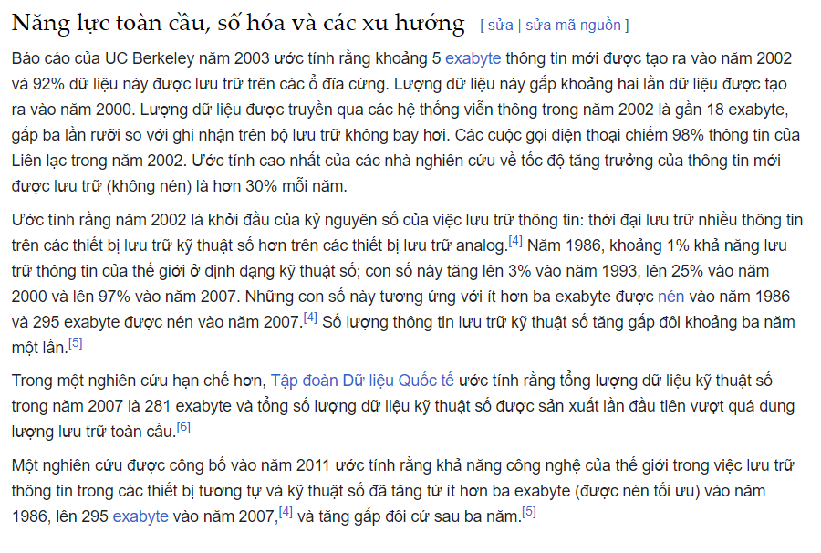

- Định nghĩa
	- Ngay trong chữ store đã mang ý nghĩa lưu trữ để sau này sử dụng
- ^^question: đố biết hình thức lưu trữ đầu tiên của con người là gì?^^
	- đáp án từ Phong: não chúng ta chứ không phải khắc lên cây, vẽ lên đá trong hang
	- mà đấy là của con người hay tự nhiên (DNA, RNA?), con người lưu trong não thì ngôn ngữ neuron là gì, sẽ ra sao nếu ta dùng ngôn ngữ neuron? tiện cho việc ghi nhớ, hiểu và làm với bản thân hiệu quả hơn
- Các hình thức lưu trữ con người gắn liền với những thời đại và các cuộc cách mạng?
	- không hẳn, đừng chém kiến thức nữa đmm
	- đọc tài liệu là thứ đơn giản nhất đấy
	- còn sợ tài liệu chưa đúng hay chưa đủ thì chịu
	- mày nghĩ mày đúng?
- [Lưu trữ dữ liệu - Wiki](https://vi.wikipedia.org/wiki/L%C6%B0u_tr%E1%BB%AF_d%E1%BB%AF_li%E1%BB%87u)
	- 
	- tại sao dữ liệu ngày càng nhiều thêm, phần lớn dữ liệu thuộc phạm trù gì?