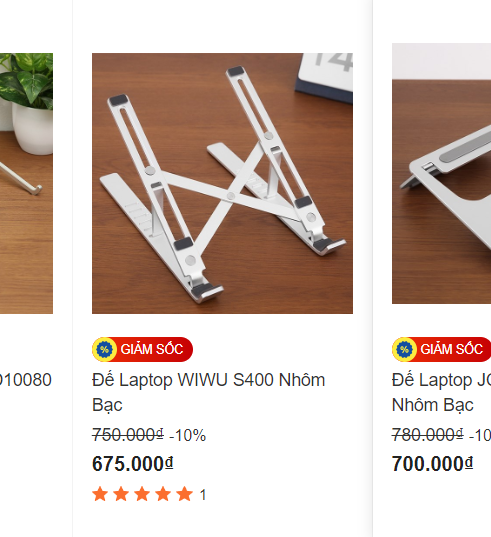

- Quà cho Nguyệt Minh Nam tiến
  collapsed:: true
	- multimedia thì chắc cần làm việc với nhiều loại dữ liệu, đầu nối nên là ưu tiên loại tích hợp?
	- cũng chưa rõ hạn chế tích hợp là gì
	- khó mua quá thì liên hệ shop miền Nam họ ship
- Tôi luôn tò mò về các công ty phát triển mấy phụ kiện. Chúng thiết kế như dành riêng cho Apple, Mac vậy nhưng lại không thuộc về Apple. Kì, đây là cộng sinh ư?
- iWalk
- FeelTEK
  collapsed:: true
	- [Viet Nam](https://feeltek.vn/)
- Ugreen
  collapsed:: true
	- Ugreen 60383
- Hyperdrive
- Mazer
- Rapoo
- Belkin
- Baseus
-
- 8-10h là chọn xong
- Mới đầu tự dưng thấy đề xuất [video này](https://www.youtube.com/watch?v=TM37YAXjq6g) trên youtube
- Bởi hôm trước đi lướt qua 1 vòng những phụ kiện Macbook và hỏi nó
- Trước đó nữa thì tìm thử xem Rmit student có đồ chơi gì đi kèm thú vị không.
  collapsed:: true
	- không gì nhiều lắm. check hết từ ins đến tiktok. Còn thực sự trong group ra sao thì tôi không rõ vì có được vào đâu
		- ờ hay đấy, đi hỏi Lã để kiếm quà cho nó luôn
	- nhưng tôi biết là sẽ liên quan nhiều công nghệ
	- xong chợt nhớ ra Nminh dùng Mac. Thế thì dễ vì tôi nghe nói Mac thiếu nhiều thứ lắm. Cộng đồng mạng than trời lên vì thế mà
	- Nhưng tôi nghĩ nó thiếu tính năng hoặc add-ins.
	- Có thể thế, vì mọi thứ yêu cầu bản quyền. Khổ nỗi là Rmit bao trọn cái đó rồi mà mua nó được 1,2 tháng thì làm ăn nỗi gì
- Trước đó tôi có nghĩ đến Tech vì dạo này tôi đam mê ổ cứng, mà mua ổ cứng cho nó thì có thể nó không dùng nhiều lắm, tôi nghĩ vậy, còn bọn nó thích thì tôi vẫn share cho 10TB được mà
- Chỉ còn mấy cái như kê máy tính và hub. Tôi nghĩ đến kê máy tính đầu tiên, tìm thêm các accessory thì thấy có cả hub. Ừ cổng chuyển đổi cũng hay vì nó làm truyền dữ liệu sẽ nhiều nếu làm truyền thông, thực ra cũng chẳng cần lắm đâu khi đi làm cho tiện nếu cần hoặc khoe bạn và cho bạn mượn là chsinh thôi
  collapsed:: true
	- nó mà học thêm nhiếp ảnh hoặc đang pts rồi thì sẽ cần nè
- Tìm ở Schannel đầu tiên vì Schannel đi sâu vào mấy cái phụ kiện hơn mấy hãng khác như thegioididong
  collapsed:: true
	- check lại thì cũng không khinh được vì bọn nó có mấy cái như win bản quyền ghê thật
- Lúc lướt tôi mới ngỡ
  collapsed:: true
	- có vô vàn thứ cùng giá mà mình chẳng biết nên mua cái nào
	- chỉ biết so giá chưa giảm và so các model trong cùng một hãng trước
	- khó chọn quá thì lên review vì chưa hình dung được nhu cầu của tương lai
	- có mấy cái rẻ bèo một hai chân, có những cái đa di năng hơn và những cái mấy triệu, chục triệu trở lên thì tôi không bao giờ tìm hiểu kĩ tới
	- lướt đồ công nghệ đỡ hơn lướt fb nhưng chỉ khi không quá mệt và muốn break việc chứ không thư giãn bằng cái đấy được lắm maybe vì sẽ bị tâm lý tư duy chọn đồ. Chứ nếu xem video review sẽ đỡ.
	- nhưng nhìn giá không chát như mình nghĩ cũng hay, sau này ước tính sẵn và nhắm xem mình nên chuẩn bị gì cho tương lai và hạnh phúc của mình.
		- rồi so sánh mấy thứ rẻ tiền hơn trên shoppee quảng cáo,...
	- lướt ở mấy chỗ to vui hơn lướt mấy cái chuyên dụng như hãng phụ kiện hay schannel
		- đế máy tính cũng không rẻ lắm hay bọn nó chém giá nhỉ
		- 
		- nhiều thứ thú vị như micro SD sang SD nhưng giá adapter - hub chát vãi
			- lúc nào đó phải so giá với mặt bằng và tìm lí do mới được, toàn hãng xịn chứ phải đùa đâu...
	- ở schannel thì thích hơn vì nó chuyên và nhiều đồ linh kiện hơn
	- còn ở mấy hãng thì bọn nó không chỉ quảng bá sản phẩm mà còn nhiều tính năng xung quanh, các đời sản phẩm giúp mình kích thích và căng thẳng trước trí tuệ chứ không chỉ nhìn thấy rõ giá và cái thẩm mĩ bên ngoài
- Như thường lệ tôi đã đi tìm thử giữa các hãng, các giá xem chất lượng cái nào hơn. Chẳng hạn như kim loại tốt hơn nhựa, tốc độ truyền tốt hơn, tiện hơn, dùng bền hơn
  collapsed:: true
	- chọn tầm giá 1 triệu đổ xuống, 8 hay 900 cũng được vì đồ công nghệ đã mua thì nên mua cho tốt dùng cho sướng chứ thời gian đâu mà đổi đi đổi lại. Mà dùng đồ lởm bất tiện rồi hỏng cả máy, đặc biệt là mac
- Thực ra cái tư duy đó đôi khi cũng tốt với mấy đồ như điện thoại để tránh tiền thương hiệu hoặc tiền thẩm mĩ nhưng đôi khi cũng chết dở với mấy món đồ hiếm độc sẵn như Hub hay Nas
- Cách tốt nhất là giờ back lại, không tìm hiểu so sánh giữa các ngọn mà so sánh các gốc là các brand, đằng nào cũng tiện tìm hiểu xem người ta làm gì, có gì nhưng tìm ở đó chỉ có những thứ tân tiên nhất thôi
  collapsed:: true
	- rồi hub cũng không phải main của người ta như thương hiệu bên nas nữa
		- chưa nghĩ ra làm hệ thống và tiêu chí so sánh kiểu gì vì quá đa dạng sản phẩm, chắc phải tìm hiểu, back lại về so sánh cả công ty và kèm những đánh giá ảo tưởng kiểu nhiều nhân viên hơn nên làm chất hơn, hoặc ít thì thương hiệu ít phổ biến thì tiền thương hiệu ít, hoặc hiếm thì hay?
	- may mà trước đó tôi đã lướt xem vài video so sánh và hên xui nghĩ ra, bắt gặp mấy video không so sánh từng sản phẩm mà tổng thể (từ những video review phát triển lên) là khi đi mua cần chú ý gì và những tranh cãi góp ý ở dưới.
- Làm xong và bắt đầu vào nếp úc đấy phải xem mình cần gì đầu tiên, xem giá rồi đẩy giá lên cái mức cao nhất mình mua được
- Tôi có đi tra so sánh các thương hiệu nhưng chẳng được gì mấy, mỗi cái nó hơi chung và cũng hơi riêng về từng khía cạnh, từng khu vực kinh doanh
- Và càng có ít review, ít so sánh chắc bởi Hub là thứ đơn giản nên không có quá nhiều khác biệt
- Thế trở về khác biệt duy nhất là giá (chênh 10 nghìn và tính năng)
  collapsed:: true
	- nhiều tính năng có bị ảnh hưởng gì không, như hiệu suất giảm để chia đều ra nếu đồng giá hay miễn không dùng 7 cái trên 7 cổng cùng lúc chẳng hạn thì đỡ hại
	- mà mình cũng đâu rõ họ làm như nào hay giá thành cấu tạo từ những phần nào nên khó biết
	- quan trọng là nó vẫn sẽ hơn thua nhau ở tính năng, ở các chỗ bán (ưu đãi) và mấy cái đó nằm ở tùy thương hiệu
- nên mình chỉ cần suy nghĩ xem những tính năng mình tưởng không bao giờ cần đến nhiều, khi nào sẽ tiện để mà dùng (ở đây đối tượng là Nguyệt Minh)
- Tôi so sánh cả những cái giác type C để truyền và sạc, nó có thể cắm điện thoại cùng vào để truyền dữ liệu nhưng nghĩ lại thì Mac của nó đâu nghèo nàn đến mức không đủ ổ
- Thế chỉ còn một thứ đã ghim đầu tôi khi đọc comment là HDMI 4K 60hz tốt hơn hẳn và hiếm con nào có với giá tầm trung. Ugreen 6 cổng có cái này thì quả là một lợi thế dù nó bỏ một số cái như ổ type C. Chẳng biết Nguyệt Minh cần đến mức đó không nhưng chắc là dây tốt thì nó sẽ góp cho hình chiếu tốt hơn (máy chiếu, dây và đầu truyền tải). Được 1/3 là tốt rồi, sau này nó thích nâng cấp lên máy bàn hay chiếu trên tivi cũng được
  collapsed:: true
	- Xét cái đó rồi cân nhắc với cả việc các ổ xếp thứ tự nào rồi cái thẩm mĩ của sản phẩm và tên thương hiệu nghe sang hợp. Ugreen của TQ, sợ nó hơi phèn với một đứa cho tôi cảm giác Tây hóa như Nguyệt Minh. nhưng nó đâu phải học sinh ams, nếu nó là học sinh ams chắc chắn tôi sẽ đi về thẩm mĩ mà tặng, còn là Chu thì mọi cái Á và đi sâu vào công năng vẫn hợp. Là sự hồn hậu chất phác không cần lòe loẹt.
- Tất nhiên có một thứ tôi quên check ngay từ đầu để dễ loại mà chọn là availability nhưng tôi bỏ qua được lần này vì nó ở Hà Nội tuần này tuần sau và vào Nam nữa nên nếu không có ở Hà Nội thì tôi đặt ở Nam ship cho. Chỉ mỗi cái ở nước ngoài thì chịu thôi mà nước ngoài web họ không show mấy thứ rẻ tiền tầm triệu.
- Tiện sao máy nó cũng support 4k HDMI 60hz nên mình chốt luôn, dù vẫn sợ vì nó có 3 ổ USB 3.0 vừa truyền vừa sạc được. Thừa quá không, cắm USB hay chuột, vv là cùng à... Tao không nghĩ được thêm gì.