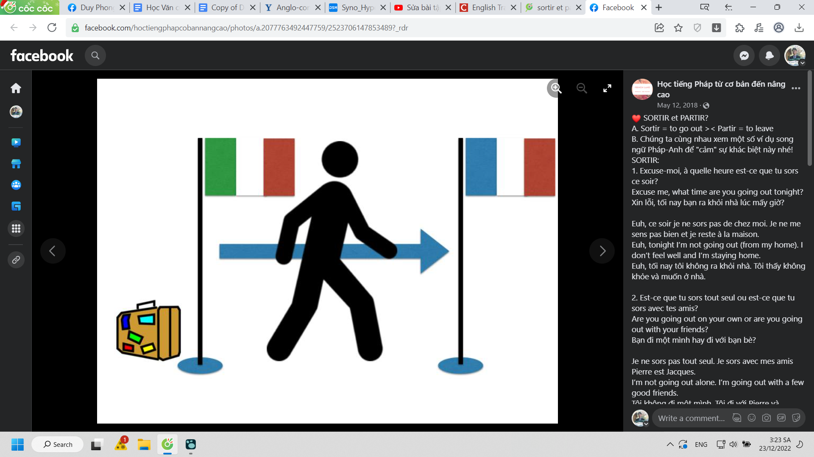

title:: Le Français/madame Thu/Leçon 12

- je** pars**
- tu** pars**
- il/elle** part**
- nous** partons**
- vous** partez**
- ils/elles** partent**
-
- je** prends**
- tu** prends**
- il/elle** prend**
- nous** prenons**
- vous** prenez**
- ils/elles** prennent**
- voudrais: want (politely)
-
- je** lève**
- tu** lèves**
- il/elle** lève**
- nous** levons**
- vous** levez**
- ils/elles** lèvent**
-
- donner (v): to give
- coucher (v): to sleep
	- je** couche**
	- tu** couches**
	- il/elle** couche**
	- nous** couchons**
	- vous** couchez**
	- ils/elles** couchent**
-
- temps (m): time
- prochain(e) (adj): next
- heure (f): hour
- simple (m): single
- désolé: sorry
- demain (adv): tomorrow
- matin (m): morning
- quart (n): quarter
- moins (adv): less
- demie (f): half past
- midi (m): midday
- soir (m): evening
-
- devoir: exercise
- exercice
- complet/complète (adj): complete
- 
	-  SORTIR et PARTIR?
	  A. Sortir = to go out >< Partir = to leave
	  B. Chúng ta cùng nhau xem một số ví dụ song ngữ Pháp-Anh để "cảm" sự khác biệt này nhé!
	  SORTIR:
	  1. Excuse-moi, à quelle heure est-ce que tu sors ce soir?
	  Excuse me, what time are you going out tonight?
	  Xin lỗi, tối nay bạn ra khỏi nhà lúc mấy giờ?
- Euh, ce soir je ne sors pas de chez moi. Je ne me sens pas bien et je reste à la maison.
  Euh, tonight I’m not going out (from my home). I don’t feel well and I’m staying home.
  Euh, tối nay tôi không ra khỏi nhà. Tôi thấy không khỏe và muốn ở nhà.
- 2. Est-ce que tu sors tout seul ou est-ce que tu sors avec tes amis?
  Are you going out on your own or are you going out with your friends?
  Bạn đi một mình hay đi với bạn bè?
- Je ne sors pas tout seul. Je sors avec mes amis Pierre est Jacques.
  I’m not going out alone. I’m going out with a few good friends.
  Tôi không đi một mình. Tôi đi với Pierre và Jacques.
- 3. Pourquoi est-ce qu’il ne sort pas ce soir? Pourquoi est-ce qu’il reste chez lui?
  Why isn’t he going out tonight? Why is he staying in?
  Tại sao tối nay anh ấy không đi chơi? Tại sao anh ấy lại ở nhà?
- Il ne sort pas ce soir parce qu’il va regarder un bon film à la télé.
  He’s not going out tonight because he’s going to watch a good movie on TV.
  Anh ấy không ra khỏi nhà vì anh ấy dự định sẽ xem một bộ phim hay trên TV.
- PARTIR:
  1. Pourquoi est-ce qu’il ne part pas? Pourquoi est-ce qu’il rest si longtemps?
  Why isn’t he leaving? Why is he staying for so long?
  Tại sao anh ấy không rời khỏi đây? Tại sao anh ấy ở lâu vậy?
- Il ne part pas parce qu’il s’amuse et il aime parler avec les gens ici.
  He’s not leaving because he’s having fun and he likes to talk to the people here.
  Anh ấy không rời đi vì anh ấy đang chơi vui vẻ và thích trò chuyện với những người ở đây.
- 2. Savez-vous s’ils partent aujourd’hui ou demain?
  Do you know if they’re leaving today or tomorrow?
  Bạn có biết họ sẽ đi khỏi đây hôm nay hay ngày mai không?
- Apparement ils ne partent pas aujourd’hui parce qu’il y a une tempête de neige.
  Apparently, they’re not leaving today because there’s a snowstorm.
  Hiển nhiên là họ sẽ không đi hôm nay vì đang có một trận bão tuyết.
- 3. Est-ce que tu pars à Paris cette semaine ou la semaine prochaine?
  Are you leaving for Paris this week or next week?
  Bạn dự định rời khỏi Paris tuần này hay tuần sau?
- Je pars cette semaine! Je suis déjà en vacances!
  I’m leaving this week! I’m already on vacation!
  Tôi định đi tuần này! Tôi đã được nghỉ lễ rồi!
- 4. Savez-vous à quelle heure le train part ce soir?
  Do you know when the train is leaving/departing tonight?
  Bạn có biết xe lửa sẽ khởi hành mấy giờ tối nay không?
- Je pense que le train pars à 23h00 mais je ne suis pas certain.
  I think the train is leaving at 11.00pm but I’m not sure.
  Tôi nghĩ xe lửa sẽ khởi hành lúc 23h nhưng tôi không chắc nữa
-