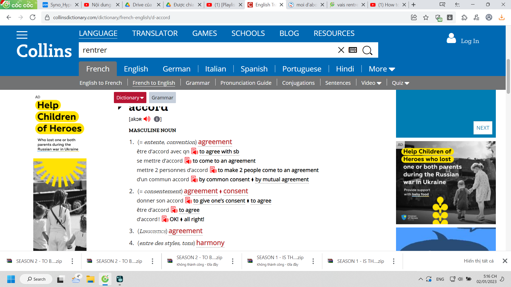
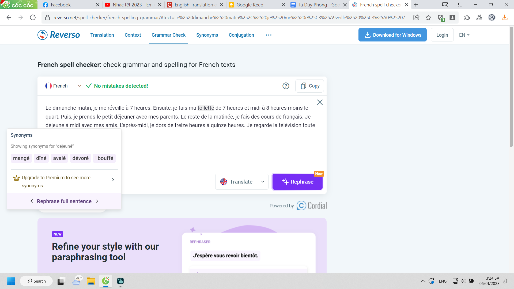

title:: Le Français/madame Thu/Leçon 15

- d'abord
	- *Why d'abord. Actually I don't know. But I found this, when i see abord go with d' after verb that's not conjungated*
		- 
		-
	- [French conjugation: When you should NOT conjugate verbs (3 easy TIPS)](https://www.youtube.com/watch?v=zh5P9yGW_tM&t)
	- thực ra mình có thể hỏi Phúc, hoặc thậm chí Nhi, Minh
- enfin
-
- jouer (v): chơi
	- je** joue**
	- tu** joues**
	- il/elle** joue**
	- nous** jouons**
	- vous** jouez**
	- ils/elles** jouent**
-
- jouer
	- à *sport**, game*
		- au foot (foot-ball), ping pong
	- de *instrument*
		- de la guitare
		- du piano
- footing
	- lúc đó mình với cô chẳng biết nó khác gì nhau nhưng... định dịch sang câu hỏi để hỏi Nhi, ồ mình còn có thể hỏi em Linh Moshi
	- OMG nghĩ mãi không ra what là gì, que?
	- qu'est ce que?
	- The right answer is: Quelle est la différence entre le footing et le jogging
-
- verbe démonstratif
-
- verbe pronominal ou verbe réfléchi
	- | **Je** | *me* | *m'* |
	  |  **Tu** |  *te* |  *t'* |
	  | **Il/Elle/On** |  *se* |  *s'* |
	  |  **Nous** |  *nous* | 
	  |  **Vous** |  *vous* | 
	  |  **Ils/Elles** |  *se* |
-
- lever (v)
- reposer (v)
- laver (v)
- habiller (v)
- courses
- cours
- préparer
-
- enfants
-
- à la campagne
- (à la) en ville
-
- fais le ménage
- ecouter de la musique
-
- lire
- écrire
- dormir
-
- vers
- tous
- jouer
- Bổ ngữ
	- [Tài liệu mạng](https://phapngubonjour.com/bo-ngu-trong-tieng-phap-complement-dobjet/)
	- jouer à
		- au tennis
		- foot-ball
		- volley-ball
		- à quoi joue tu?
		- các loại câu hỏi khác, cấu trúc một câu hỏi có thể được. Không hiểu sao có loại không được, nhưng đó là sự mở rộng cho một phần mình đã nghĩ trước đây.
		- [French question](https://www.frenchtoday.com/blog/french-grammar/french-questions-words/)
- téléphoner
- la natation
-
- le marché
-
- wao học qua paraphrase cũng ổn áp phết
	- 
	- [more](https://www.quora.com/Is-there-a-service-equivalent-to-Grammarly-but-for-French)
	-
-