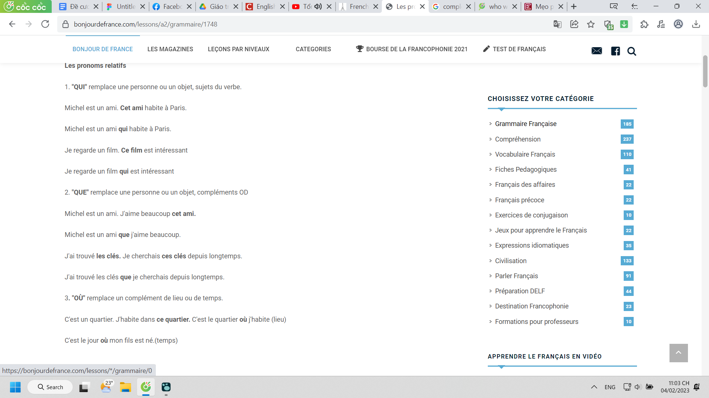
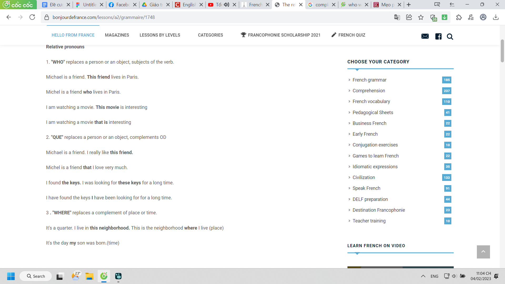
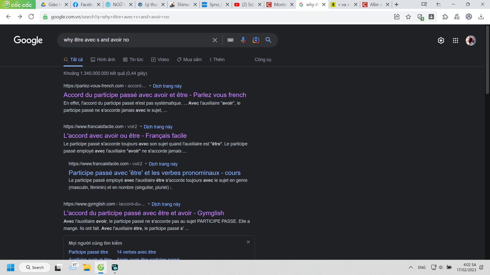
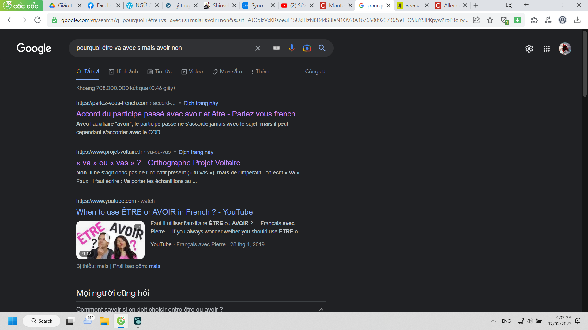

- Ở đây chắc tạm thời sắp xếp theo Alphabet thôi chứ cũng không cần chia theo 3 loại verb dù thế dễ nhìn và dễ cho người mới biết hơn
- Còn việc sắp xếp lung tung không phục vụ mục đích đọc lại thì chính lại phục vụ mục đích nghiên cứu lịch sử học: bao lâu ta tới được đâu, ta học được từ nào ở đâu, khi nào
  collapsed:: true
	- cái này hơi khó theo dõi, chắc ghi theo thời kì, kiểu có thờ đầu ta học những từ game từ Undecember, nhưng dù thế nào thì sớm muộn cũng quen mất điều đó khi ta sử dụng ngôn ngữ quá lâu thôi
	  collapsed:: true
		- còn lại thì track bằng history google
	- việc này góp công vào nghiên cứu xem có thể học ở đâu, với ai học từ nào từ đâu thì tiện chứ không chỉ có những cách học riêng cho từng người
	-
- ---
-
- Example
  heading:: true
  collapsed:: true
	- |  | Présent | Passé Composé | Imparfait | Futur Simple |
	  | --- | --- | --- | --- | --- | 
	  | **je** | | | | |
	  | **tu** | | | | |
	  | **il/elle/on** | | | | | 
	  | **nous** | | | | |  
	  | **vous** | | | | |  
	  | **ils/elles** | | | | |
	- | | Passé Antérieur | Passsé Simple | Plus-que-parfait | Futur Antérieur |
	  | --- | --- | --- | --- | --- |
	  | **je** | | | | |
	  | **tu** | | | | |
	  | **il/elle/on** | | | | 
	  | **nous** | | | | | 
	  | **vous** | | | | | 
	  | **ils/elles** | | | | |
- **être**
  collapsed:: true
	- |  | Présent | Passé Composé | Imparfait | Futur Simple | 
	  | ---- | ---- | ---- | ---- | ---- | --- |
	  | **je** | suis | ai été | étais | serai |
	  | **tu** | es | as été | étais | sera |
	  | **il/elle/on** | est | a été | était | sera |
	  | **nous** | sommes | avons été | étions | serons |
	  | **vous** | êtês | avez été | étiez | serez |
	  | **ils/elles** | sont | ont été | étaient | seront |
- **porter**
  collapsed:: true
	- |  | Présent | Passé Composé | Imparfect | Futur Simple | 
	  | ---- | ---- | ---- | ---- | ---- | 
	  | **je** | porte | ai porté | portais | porterai |
	  | **tu** | portes | as porrté | portais | porteras |
	  | **il/elle/on** | porte | a porté | portait | portera |
	  | **nous** | portons | avons porté | portions | porterons |
	  | **vous** | portez | avez porté | portiez | porterez |
	  | **ils/elles** | portent  | ont porté | portaient | porteront |
- **passer**
  collapsed:: true
	- |  | Présent | Passé Composé | Imparfect | Futur Simple | 
	  | ---- | ---- | ---- | ---- | ---- | --- |
	  | **je** | passe | ai passé | passais | passerai |
	  | **tu** | passes | as passé | passais | passeras |
	  | **il/elle/on** | passe | a passé | passait | passera |
	  | **nous** | passons | avons passé | passions | passerons |
	  | **vous** | passez | avez passé | passiez | passerez |
	  | **ils/elles** | passent | ont passé | passaient | passeront |
- **prendre**
  collapsed:: true
	- |  | Présent | Passé Composé | Imparfect | Futur Simple | 
	  | ---- | ---- | ---- | ---- | ---- | 
	  | **je** | prends | ai pris | prenais | prendrai |
	  | **tu** | prends | as pris | prenais | prendras |
	  | **il/elle/on** | prend | a pri | prenait | prendra |
	  | **nous** | prenons | avons pris | prenions | prendrons |
	  | **vous** | premez | avez pri | preniez| prendrez |
	  | **ils/elles** | prennent | ont pris | prenaient | prendront |
- **traverser**
  collapsed:: true
	- |  | [Présent] | [Passé Composé] | [Imparfect] | [Futur Simple] | 
	  | ---- | ---- | ---- | ---- | ---- | --- |
	  | **je** | traverse | ai traversé | traversais | traverserai |
	  | **tu** | traverses | as traversé | traversais | traverseras |
	  | **il/elle/on** | traverse | a traversé | traversait | traversera |
	  | **nous** | traversons | avons traversé | traversions| traverserons |
	  | **vous** | traversez | avez traversé | traversiez | traverserez |
	  | **ils/elles** | traversent | ont traversé | traversaient | traverseront |
- **tourner**
  collapsed:: true
	- |  | [Présent] | [Passé Composé] | [Imparfect] | [Futur Simple] | 
	  | ---- | ---- | ---- | ---- | ---- | --- |
	  | **je** | tourne | ai tourné | tournais | tournerai |
	  | **tu** | tournes | as tourané | tournais | tournerais |
	  | **il/elle/on** | tourne | a tourné | tournait | tournera |
	  | **nous** | tournons | avons tourné | tournions | tournerons |
	  | **vous** | tournez | avez tourné | tourniez | tournerez |
	  | **ils/elles** | tournent | ont tourné | tournaient | tourneront |
- **aller**
  collapsed:: true
	- |  | Présent | Passé Composé | Imparfait | Futur Simple | 
	  | ---- | ---- | ---- | ---- | ---- | 
	  | **je** | vais | suis allé | allais | irai |
	  | **tu** | vas | es allé | allais | iras |
	  | **il/elle/on** | va | est allé | allait | ira |
	  | **nous** | allons | sommes allés | allions | irons |
	  | **vous** | allez | êtês allés | alliez | irez |
	  | **ils/elles** | vont | sont allés| allaient | iront |
- entrer
  collapsed:: true
	- |  | [Présent] | [Passé Composé] | [Imparfect] | [Futur Simple] | 
	  | ---- | ---- | ---- | ---- | ---- | --- |
	  | **je** | entre | | | |
	  | **tu** | entres | | | |
	  | **il/elle/on** | entre | | | |
	  | **nous** | entrons | | | |
	  | **vous** | entrez| | | |
	  | **ils/elles** | | | | |
- arriver
- **avoir**
  collapsed:: true
	- |  | Présent | Passé Composé | Imparfait | Futur Simple |
	  | --- | --- | --- | --- | --- | 
	  | **je** | ai | ai eu | avais | aurai |
	  | **tu** | as | as eu | avais | auras |
	  | **il/elle/on** | a | a eu | avait | aura | 
	  | **nous** | avons | avons eu |  avions | aurons |  
	  | **vous** | avez | avez eu | aviez | aurez |  
	  | **ils/elles** | ont | ont eu | avaient | auront |
- continuer
- dire (v): to tell (dire quelque chose à quelqu’un), to say
  collapsed:: true
	- {{cloze vẫn chưa ra hình thức 1 trang từ điển siêu tốt, có lẽ phải có phần mềm edit được tốt hơn}}
	- je** dis**
	- tu** dis**
	- il/elle** dit**
	- nous** disons**
	- vous** dites**
	- ils/elles** disent**
- demander (v): to ask for, to require
  collapsed:: true
	- je** demande**
	- tu** demandes**
	- il/elle** demande**
	- nous** demandons**
	- vous** demandez**
	- ils/elles** demandent**
- entrainer (v): to lead, to involve, to train,
  collapsed:: true
	- j'**entraîne**
	- tu** entraînes**
	- il/elle** entraîne**
	- nous** entraînons**
	- vous** entraînez**
	- ils/elles** entraînent**
- saluer (v): to say hello to
  collapsed:: true
	- je** salue**
	- tu** salues**
	- il/elle** salue**
	- nous** saluons**
	- vous** saluez**
	- ils/elles** saluent**
- trouver (v): to find
  collapsed:: true
	- je** trouve**
	- tu** trouves**
	- il/elle** trouve**
	- nous** trouvons**
	- vous** trouvez**
	- ils/elles** trouvent**
- écouter (v): to listen to
  collapsed:: true
	- j'**écoute**
	- tu** écoutes**
	- il/elle** écoute**
	- nous** écoutons**
	- vous** écoutez**
	- ils/elles** écoutent**
- montrer
- prononcer
- compter
- exprimer
- compléter
- communiquer
- vouloir: want
  collapsed:: true
	- je** veux**
	- tu** veux**
	- il/elle** veut**
	- nous** voulons**
	- vous** voulez**
	- ils/elles** veulent**
- devenir: become
  collapsed:: true
	- je** deviens**
	- tu** deviens**
	- il/elle** devient**
	- nous** devenons**
	- vous** devenez**
	- ils/elles** deviennent**
- savoir: to know
  collapsed:: true
	- je** sais**
	- tu** sais**
	- il/elle** sait**
	- nous** savons**
	- vous** savez**
	- ils/elles** savent**
- devoir: have to, must
  collapsed:: true
	- je** dois**
	- tu** dois**
	- il/elle** doit**
	- nous** devons**
	- vous** devez**
	- ils/elles** doivent**
- **pouvoir**: can
  collapsed:: true
	- |  | Présent | Passé Composé | Imparfait | Futur Simple |
	  | --- | --- | --- | --- | --- | 
	  | **je** | peux| | | |
	  | **tu** | peux | | | |
	  | **il/elle/on** | | | | | 
	  | **nous** | | | | |  
	  | **vous** | | | | |  
	  | **ils/elles** | | | | |
- conjuguer: conjugate
  collapsed:: true
	- je** conjugue**
	- tu** conjugues**
	- il/elle** conjugue**
	- nous** conjuguons**
	- vous** conjuguez**
	- ils/elles** conjuguent**
- desinner
  collapsed:: true
	- je** dessine**
	- tu** dessines**
	- il/elle** dessine**
	- nous** dessinons**
	- vous** dessinez**
	- ils/elles** dessinent**
- situer
- indiquer
- deviner
- visiter
- faire: to make, to do, to play, to be
  collapsed:: true
	- je** fais**
	- tu** fais**
	- il/elle** fait**
	- nous** faisons**
	- vous** faites**
	- ils/elles** font**
- coûter (v): to cost
  collapsed:: true
	- je** coûte**
	- tu** coûtes**
	- il/elle** coûte**
	- nous** coûtons**
	- vous** coûtez**
	- ils/elles** coûtent**
- Article
  collapsed:: true
	- article indéfini
		- un
		- une
		- des
	- article défini
		- le
		- la
		- les
	- il y a
- Prépositions + noms de pays et de ville
  collapsed:: true
	- À
		- + ville
	- En
		- + pays féminin
		- + masculin commence par une voyelle
	- Au
		- + pays masculin
	- Aux
		- + plurial
	- Exceptions
		- Un certain nombre de noms de pays vont nécessiter l'emploi de la préposition 'à'
		  collapsed:: true
			- certaines îles : Madagascar, Cuba, Chypre...
			- les principautés-villes : Monaco, Hong-Kong, Singapour...
			- Djibouti.
- Question / L'interrogation
  collapsed:: true
	- qui: who
		- qui est-ce?
	- ça
	  collapsed:: true
		- ça va bien? **how are you**
	- que: what
		- qu'est-ce que c'est?
	- est-ce que: tobe (is hoặc sometime do)
	- combien: how much, how long, how many
	  collapsed:: true
		- *combien de purée est-ce que je vous sers ?** ***how much mashed potato shall I give you?**
		- *combien de personnes as-tu invitées ?** ***how many people have you invited?**
		- *combien de temps est-ce que tu seras absente ?*
	- comment
	- òu: where
	- phân biệt qui que
	  collapsed:: true
		- 
		- 
		- que như whom còn qui là who thôi, mà mình đang khó quel mà
		- 
		- 
- L'adjectif interrogatif
  collapsed:: true
	- quel: who, what, which
		- quel khác que ở chỗ nó là tính từ, nó sẽ đi với nom còn que đi các trường hợp còn lại
			- quel est votre nom?
			- NON: que est votre nom?
- L'adjectif possessif
  collapsed:: true
	- | **with masculine singular noun**  | **with feminine singular noun**  | **with plural noun (masculine or feminine)**  | **Meaning**  |
	  | **mon**  | **ma (mon)**  | **mes**  | my  |
	  | **ton**  | **ta (ton)**  | **tes**  | your  |
	  | **son**  | **sa (son)**  | **ses**  | his her its one’s  |
	  | **notre**  | **notre**  | **nos**  | our  |
	  | **votre**  | **votre**  | **vos**  | your  |
	  | **leur**  | **leur**  | **leurs**  | their  |
	- Note that you use **mon**, **ton** and **son** with feminine singular nouns in front of words that begin with a vowel and most words beginning with **h**. This makes them easier to say.
- L'adjectif démonstratif
  collapsed:: true
	- | | singulier | pluriel |
	  | masculin | ce | ces |
	  | féminin | cette | ces |
	- Devant une voyelle ou la lettre h, ce devient cet
- L'accent tonique
  collapsed:: true
	- 
- La négation
  collapsed:: true
	- ne ... pas
	- À la forme négative, un, une, des -> de
- L'accord des adjectifs avec le nome
  collapsed:: true
	- nhớ hợp giống số theo danh từ mà nó đấy liên kết, bổ nghĩa
	- Il porte un blouson noir et des chaussure**s** noir**es**
- Pronoms toniques
  collapsed:: true
	- | **Pronoms sujets** | **Pronoms toniques** |
	  | Je | **Moi** |
	  | Tu | **Toi** |
	  | Il | **Lui** |
	  | Elle | **Elle** |
	  | On | **Nous / Soi** |
	  | Nous | ** Nous** |
	  | Vous | **Vous** |
	  |  Ils | ** Eux** |
	  |  Elles | ** Elles** |
- L'adverbe/pronom
  collapsed:: true
	- y
- Preposition
  collapsed:: true
	- à
	- en
- C'est
  collapsed:: true
	- + lieu
	- + article + nom
	- + adjectif
- On
  collapsed:: true
	- = nous
	- = les gens
- Prendre/manger/ boire/ acheter/ vendre/ vouloir + article partitif + aliments/ boissons
- Les articles partitifs (mạo từ chỉ bộ phận): un, une, des, le, la, les
  collapsed:: true
	- Du + N au masculin : du lait, du café
	- De la + N au féminin : de la salade, de la confiture
	- De l’ + N qui commence par une voyelle ou « h » : de l’eau
	- Des + N au pluriel : des céréales, des crêpes,…
- phát hiện mới về à ở leçon 8: with {{cloze chết rùi quên ghi lại mình học được gì mới ở mỗi bài rồi, nhưng thực ra có thể mò được vì mình chỉ work on 2 page là grammar với vocab (hoặc xem lịch sử và đối chiếu với từng bài, sẽ khó ở đoạn đầu cuối thôi) vì ở nhà mình toàn tìm hiểu lung tung chứ không đào sách và xem kĩ lại vocab như mấy buổi nay, cái gì cô không dạy ở sách thì mình k có đọc thêm - về nhà chỉ đọc lại bài cô thôi - cả cô Thu và ở trường}}
  collapsed:: true
	- https://www.thoughtco.com/a-french-preposition-1368910
- phát hiện mới về past participle leçon 19
  collapsed:: true
	- l'accord va avec être còn avoir thì non
	- 
		- ghi nhảm nhí lai tạp và sai ngữ pháp thế này mà cũng ra
	- 
- ---
- s’empêcher: to stop
- récupérer: to take back
- enterrer: to bury
- souhaiter: wish
- rejendre:
	- (lieu) to get to
	- (famille) to go back to
	- rejoindre qn: (= rattraper) to catch sb up
- inviter
	- (à dîner, à séjourner chez qn) to invite
	- inviter qn à faire qch: to suggest that sb should do sth
- réfléchir: to think
	- (lumière) to reflect
- perdre: to lose
- disparaître: to disappear
- remettre: to put back
- croire: to believe
- mener
	- (enquête): to conduct
- débarrasse
	- se débarrasse de: to get rid of
- incinérer: to incinerate
- assurer: insure, assure, ensure
- brûler: to burn
- prévenir: to warn somebody
- concerner: to concern
- accompagner: to accompany
- requérir: to call for, to demand
- avoir besoin de quelque chose: to need something
- tenter: to try
- calmer: to soothe
- enquêter: investigate
- repaire: repair
- déplacer: to move
- suivre: to follow
-
- [LE POSSESSIF OU L'ARTICLE ?](https://grammaire.reverso.net/le-possessif-ou-larticle/)
-
- après être sorti de: after leaving
- après avoir mangé: after eating
-
- il faut nécessaire de
- c'est obligatoire de
-
- ca depend de
- Le Gérondif EN -ANT: Gerund
- griffer: to scratch
- brosser: brush
- serrer
  collapsed:: true
	- (= tenir) to grip tight, to hold tight
	- serrer qn dans ses bras: to hug sb
	- serrer la main de qn: to shake sb’s hand
	- serrer la main à qn: to shake hands with sb
- se plaindre: complain
- plaindre: pity
- promettre: promise
- prévenir: to warn
- asseoir: sit
- oublier: to forget
- rapporter: to bring back
- congeler: to freeze
- paraître: to seem
- s’agiter: to fidget
- oser: to dare
- consacrer: to devote (time)
- dédier
- en savoir: tìm hiểu thêm
- recrute