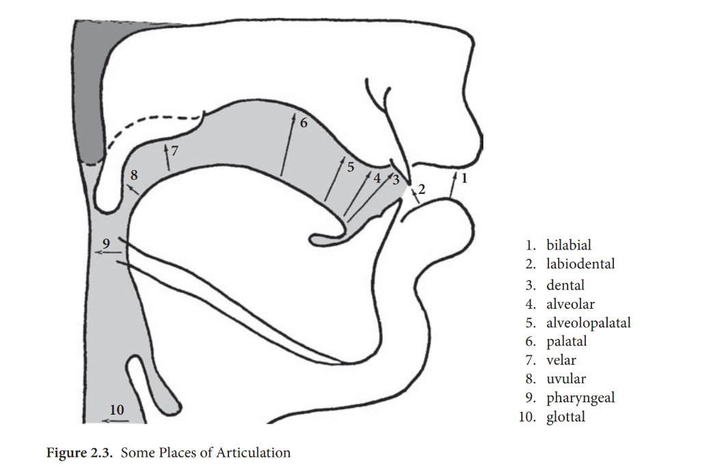

- The Vocal Tract with (a) Velum Raised and (b) Velum Lowered
	- 
	  id:: 65bacb8e-76f4-4a78-a2bd-fd5916192dab
- Configurations of the Larynx: (a) Voiceless (Exhalation), (b) Voiced, and (c) Whispered
	- 
	  id:: 65bacbcd-e063-4add-9d97-a74b4e01bc9e
- Some Places of Articulation
  id:: 65baccfe-c432-4dfa-9663-8206b4646b39
	- 
-
- Reference
	- Brinton, L. J. & Brinton, D. M. (2010a). The Linguistic Structure of Modern English.