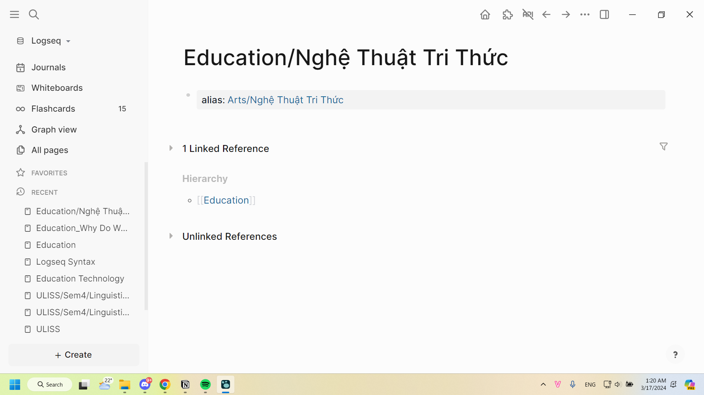

- `<comment>` để note ý của mình khi số hóa
	- đang phân vân với '/cloze'
	- à mà hình như comment còn không visable thì thấy kiểu gì, note thì hơi to
		- thế cứ dùng "/cloze", còn việc to thì tính ra cũng không hại lắm, khi data đã được tổng hợp lại thì cái source ở vở hay ở phiên bản số hóa của vở không có tác dụng xem lại lắm, mình lười có bao giờ xem lại cái lẻ tẻ đơn giản và rời rạc đấy đâu toàn xem phiên bản tổng hợp như cái Map Le Français cho tiện
		- còn nếu xem lại thì sẽ xem để tổng hợp đống ý tưởng, chính ra còn quan trọng hơn đống kiến thức vì nó độc nhất vô nhị nên nó to quá cũng chẳng pollute tầm nhìn lắm
- #+BEGIN_IMPORTANT
  Important là mức độ nghiêm trọng nhất (có thể hình dung qua nội dung từ, màu sắc hình nữa), một là sai chịu hậu quả lớn, hai là đã sai thê thảm (mang xu hướng tiêu cực)
  #+END_IMPORTANT
- #+BEGIN_WARNING
  Warning để nhắc những thứ quan trọng nhưng thường là mình nhớ rồi, biết rồi, cũng cảm tính thôi, viết có phải chỉ cho mình đâu (mang xu hướng tích cực)
  #+END_WARNING
- #+BEGIN_CAUTION
  Caution là mức độ nhẹ nhất của chú ý
  #+END_CAUTION
- #+BEGIN_TIP
  Tip dành cho những lời khuyên
  #+END_TIP
- #+BEGIN_NOTE
  Note để note những ý đã note của mình trong lúc ghi chép
  #+END_NOTE
- #+BEGIN_PINNED
  Pinned để ghim thông tin quan trọng 
  #+END_PINNED
- #+BEGIN_QUOTE
  Quote để quote
  #+END_QUOTE
- #+BEGIN_EXAMPLE
  Example để đôi khi lấy example, không thì mình toàn Example:, có nên đổi hết sang thế này không nhỉ, tại nó standout quá, mình không coi trọng example đến thế, chỉ coi đó là để hiểu
  #+END_EXAMPLE
- `code để ghi code`
- ---
- Evergreen Note: Loại note đẳng cấp nhất ngang trình giáo trình được nghiên cứu tổng hợp
- Note 3: ... chưa biết có nên chia 2 là lọc từ và tái cấu trúc không, vì tham khảo [[Jun 19th, 2023]] thấy còn đề cập "nhập suy nghĩ đánh giá sơ sài sau khi đọc" và sẽ search thêm từ khóa #data để tổng hợp các suy ngẫm về việc xử lý dữ liệu.
- Note 2: Có lọc từ không cần thiết và tái cấu trúc
- Note 1.5: là 1 nhưng có phân cấp ở cấp độ câu, đôi khi có những chỗ chối quá thì có chỗ phải 1.5, còn lại là 1, quan trọng là có cần và có cách nào để nhận biết không? lúc nào cũng tra lại bản gốc thì mệt
- Note 1: chép y nguyên câu chữ, chỉ phân cấp ở mức độ heading
- Note 0: raw ở định dạng riêng
-
- ---
- Mục đích indent outdent kiến thức và dùng những syntax:
	- Chép toàn bộ vào để máy đọc và theo cấu trúc thông tin xử lí nhanh hơn
	- Con người khi đọc lại hoặc đọc mới chỉ cần nhìn những syntax trên để tìm đúng cái mình cần, vị trí mình cần, chẳng hạn nếu đó là ví dụ dễ hơn
		- họ có thể đọc từ bullet ngoài, nếu chưa hiểu do không biết hay quên hay cần thêm thông tin thì hẵng mở bullet con nhỏ hơn
-
- 03:49 20/12/2023
	- Cách toogle number list để phân biệt hành phần mà không cần phải tạo mục lớn riêng gồm 2 chữ kiểu đặc điểm, bàn luận này đỉnh ghê
	- 
	-
- ---
- 09:30 13/1/2023 Kết hợp Easy and Simple Footnotes để tổng hợp thông tin trên mạng lại, làm một cái wikipedia phức tạp hơn và dành cho chuyên nghiên cứu với Archive Webpage để archive về máy và Waybackmachine, quá đỉnh dù trình bày chưa được đẹp mắt lắm, cũng chưa biết sửa kiểu gì, chắc sau này tự sửa bằng json
	- Có một cái vấn đề là ta phải đặt ký hiệu ở footnote, nó không nên theo thứ tự, mà theo chữ cái thể hiện độ đáng tin cậy của thông tin (thông tin có thể chính xác nhưng chất lượng không cao do người sản xuất ra nó thì cũng vô nghĩa), rồi ta phải index ở từng dòng thông tin à, hay cứ đính link vào 1 footnote theo từng dòng footnotes ở dưới (nếu 10 cái câu trích ra đều thuộc về một trang nội dung), ừ oke
	- cái khó bây giờ là có nên extract cái webpage kia thành một page riêng để link sang cho dễ không? vì một webpage nó sẽ có nhiều thứ nó đề cập, nếu ta dùng footnote thì chỉ link được trong nội bộ bài, ta biết nó thuộc về bài nào chứ ta không nhìn rõ được từng block link đến đâu, dù hiện tại nhìn qua graph cũng chẳng thấy, yeah cũng được, xong ta trích lại cái archive của nó vào là xong mà, hoặc để archive gốc ở đó? vì nhìn cái link dài với xấu vl.
- Về đẹp và tiện thì kết hợp TOC và Url Hyperlink hoặc Automatically Format Url Title
- 01:51 22/1/2023
	- Nếu 1 mẩu thông tin trong sách không chỉ có trong sách mà nó còn liên quan đến nhiều page, thì ta làm như nào, như trong [[ULISS/Sem4/General Geography Of The UK & The US/Unit 2: British Geography]], tốt nhất là đừng động đến nó, nếu có page về British Isles thì hãy link nhiều nguồn vào, mà thay vì số lượng, nguồn uy tín là đủ
	- 1 thông tin có thể có ở nhiều nguồn, mỗi nguồn lại có lượng thông tin khác nhau, ta nên để số ở footnote đại diện cho mỗi nguồn hay nó sẽ đại diện cho số thông tin trong bài, còn nếu đại diện cho số thông tin trong bài thì sao? ta note như nào?
- 06:39 [[Feb 27th, 2024]]
	- nay ngồi làm [[ULISS/Sem4/General Geography Of The UK & The US/Unit 5: Wales]] mình gặp trường hợp is, chẳng hạn the city (is), thì nên cho cái is đó xuống hay để trên. Xuống thì lặp chữ nhưng heading sạch, cho lên trên thì ngược lại, cắt đi thì vẫn hiểu, phân biệt qua Uppercase hay lowercase. Mình nghĩ nên cắt mẹ đi. Với to còn giữ lại được chữ đôi khi người ta nói cũng chẳng dùng is. Mà có lẽ là mình nên phân loại văn phong theo một tag nào đó, theo một trục nào đó, để ít nhất khi trích lại số hóa, mình sẽ code với quy tắc chung nhưng một số cái riêng để bảo đảm tính toàn vẹn của văn bản. Tất nhiên phải thống nhất syntax cho cả hệ thống trước đã (mấy cái evergreen notes). Trình bày như từ điển cũng được mà, từ gốc ở trên, không có is, nếu noun ở dưới để giải thích thì ghi trực tiếp luôn. Tự dưng nhớ ra thế.
- 01:01 [[Mar 17th, 2024]], nay đang viết bài này [[ULISS/Sem4/Linguistic 1/Week 8/Notes]]. Kiểu lâu lắm mình mới ghi lại note vào đây vì bình thường để ở vở cứ lười, lúc viết lại sẽ có những lúc đéo hiểu lúc đó mình viết gì thì thôi cái này scan ra nếu để ý kĩ, chắc không cần note là mình không hiểu chắc đúng ý mình đâu ha, vì ý chính vẫn nhớ, chỉ là cách diễn đạt không như mình nhớ. Anyway, ở đây thì lần đầu xuất hiện lần nữa vụ dùng tag. Lần trước mình cũng định dùng tag để link nó với tên người các thứ ở transcript meeting của MỞ HCH #2 (không hiệu quả lắm), nay tìm được cách hiệu quả hơn là `#[[   ]]` rồi, làm thế này thì nó link đến page luôn chứ không tạo tag riêng, vấn đề của mình là link như anh Long hay anh Nhật ở Trấn Kỳ làm thôi (mình tránh, lười viết một đoạn dẫn riêng rằng tạo sao nó liên quan như này và nó liên quan như nào, cái đó để ở page kia khi tổng hợp thì tốt hơn là để ở chỗ cứ liệu gốc). Thế # tag bình thường mình có bao giờ dùng không, vì có vẻ nó không thể viết cách chữ được, khá bất tiện cho việc đặt tên và viết hoa kề nhau dễ xấu, còn cách kia thì hạn chế được việc có ngoặc thu hút sự chú ý không cần thiết ở cuối bài mà không phải dùng plugin, setting giấu ngoặc hay viết plugin giấu cho từng trường hợp/page.
	- Có lẽ có lúc nào có thể nghĩ đến việc dùng kí hiệu riêng và chỉ mượn tính năng link của # chứ không nên nhìn # như cách mọi người hay nhìn: kiểu hashtag
- Có lẽ không nên để như này mà làm mẹ page Education & Arts đi? Nhưng thế sẽ phải ghi ở phần đầu bổ sung cho chắc là liên ngành Education and Art. Mà Education & Art hay dùng and hay Art & Education. Cái này thì để alias oke hơn? Thôi cứ đặt tên chính là cái nào nghe kêu, thì sẽ dễ nhớ nhé? Chứ không có thể theo alphabet, khác gì lắm đâu, lo gì đâu vì có alias rồi mà.
	- {:height 429, :width 748}
		- thôi để theo alphabet đi chứ có lúc giờ đọc lại lại thấy Arts and Education hay hơn, mà sau này liên nhiều ngành hơn thì tính sao... Và phải tạo alias cho cả page con nữa đó. Ầu...
- ((65f5e1e0-4277-4809-917f-c0b941c4ee48))