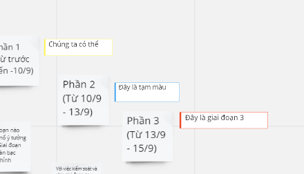
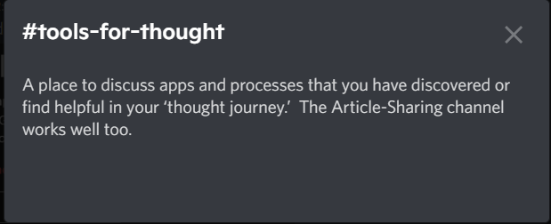

- Việc của mình
  heading:: true
  collapsed:: true
	- Ý tưởng
		- Tìm hiểu
			- Butter - MỞ
			- Notion
			- [[Discord - MỞ]]
		- Công việc với
			- NĐH
			- Faci
			- học viên
		- Figure cách xây dựng khóa học học Cách học
			- nó giống như tại sao chị chọn cái này cái kia rồi dần sang sao chị nghĩ vậy, bổ nhiệm ai, chọn mô hình nào, thử mô hình nào - phương pháp tư duy. Chắc tại chị đã nói kĩ và nó đơn giản, tất cả make sense [[HCH Faci Structure]]
		- Giờ thành figure out cách tổ chức này hoạt động
			- hừm đây chưa thành hình nhưng nó bắt đầu thú vị hơn và là một tầm cao hơn phương pháp, cách người ta làm rồi à. Đây là mình kết hợp và xây dựng một hệ thống mới từ những gì của người ta và đồng thời xây hệ thống cho mình rồi học mọi thứ theo cách của mình - việc đối chiếu với lối tư duy của người ta không quá quan trọng nữa
		- Nhiệm vụ mỗi ngày
		- Nhiệm vụ mỗi tuần
		- Nhiệm vụ phát sinh
	- Giai đoạn làm việc
		- Khi thuyết trình với một người cụ thể mình giải thích dễ hiểu và nghe đáng tin hơn là mình giải thích ở Miro, chắc cũng tại vẫn cảm giác như viết cho mình. Thế thì đơn giản là giải thích cho ai đó rồi note lại những lời đó và bổ sung vào thôi.
		- Tổng hợp và xây mô hình
			- 1.
			  
			  Sắp xếp các thứ theo quy trình thời gian, còn NĐH, học viên và Community Manager, Faci thì sắp theo thứ tự quy trình làm việc từ trên xuống (làm vậy vẫn có cảm giác không đẹp lắm và không hay lắm với tiêu chí tập trung vào học viên)
			- 2. 
			  
			  Sắp xếp các thứ theo hình thức thẩm mĩ và liên kết nhiều hơn với logic mạch hoạt động. Sau khi nói chuyện với chị Hà và có thêm nhiều mục như công việc, sẽ phải nằm bên trái vì Community và NĐH sẽ làm việc xây dựng nền móng và hệ thống khóa học nhiều hơn môi trường tương tác (live class, peer learning,... rồi kèm với cộng đồng Discord do Faci với học viên dùng nhiều hơn, còn Notion với NĐH dùng nhiều hơn nên phải sắp xếp lại, chia thành 2 phía)
				- Cái bo góc kia khá vui khi các Phần sâu hơn còn giai đoạn thì đi dần lên, tuy khó đọc nhưng nó thể hiện một cái càng bàn càng sâu, một cái càng làm càng phát triển :)))
				- Nếu có nhiều màu hơn để pha thì đẹp, nhưng ít thì quy định các loại màu nào cho mảng nào, và màu nào reflect, màu nào báo cáo
					- viết xong cái này thì ra ý tưởng này
					  
				- Nghĩ thêm được ứng dụng cho cái này khá hay nhưng có sợ nhiều chữ quá bị rối không hay nên insert link
				- 
				- Có up load thì up mấy ảnh này lên để show được thay vì phải link
				- còn template người ta và tag chưa biết dùng sao cho trọn vẹn, cả hình nữa. Nhưng dùng được hết rồi mà còn nhu cầu, nên thế, thì đỉnh. Cluster cũng hay để nhìn 1 cách dạng bảng: copy tất cả note và dàn trải ra để làm nhiệm vụ mới (còn nhiệm vụ cũ nhìn mô hình là đủ)
			- đọc và bổ sung thêm ở [[Sep 16th, 2022]]
		- Đi tham khảo những mô hình khác
			- [Avocado School](https://discord.gg/aavocadoschool)
			  id:: 632339c6-5608-467f-82fe-96190501edf5
				- Trò chuyện và giao lưu cuộc sống
				- 
				- Confession
					- 
					- hay nhưng hơi ít tương tác, sao cái này tách rời nhiều nhóm thế mà vẫn sống được nhỉ, vì có luật và phạt và duy trì dựa trên môi trường cho mọi người đến ở thôi sao?
					- cũng không có giới thiệu, cứ như một khu, như khu ổ chuột thì làm gì có tên
			- [Heptabase](https://discord.com/invite/KAkXjPX8Yn)
				- ourvision kênh để ở Discord cũng hay nhưng tốt hơn thì nên pin ở Notion để mọi người vào đó biết mình nên học như nào, học làm gì và đang làm gì
				- thực ra ở đây nó provide các role và các dạng thông tin wiki function cũng rất tuyệt
					- 
					- {:height 201, :width 474}
					- để biết nhanh mỗi phần làm nhiệm vụ gì mà cái tiêu đề không nói hết thì có phần này và ấn vào
						- ừ chẳng hiểu sao tôi cứ tưởng tôi bỏ qua ở ((632339c6-5608-467f-82fe-96190501edf5)) nhưng nah, bằng 1 cách nào đó nó có thì mình sẽ bị chú ý tới ngay
					- sẽ cần làm cả hướng dẫn discord cho mọi người
			- tech discord
- Ý tưởng ngoài lề ở các Sep.
	- {{embed ((632a00e8-503b-4439-8e91-2906807df5a4))}}
	-
- Nhật ký
	- 08:46 2/10
		- tôi thấy chị assign faci cho mem rồi, chắc là assign random
			- để hỏi lại
		- nên là vội lập phòng riêng cho mỗi người
		- 
		- để chị phải nhắc thế này thật k hay
			- cơ bản tại tôi không rõ mọi người vào được bao lâu rồi mà chưa tương tác nhiều. khóa này lại ít học viên
				- tôi không nắm được timeline...
			- nếu thật sự mọi người không tương tác thì chỉ còn cách đẩy về riêng từng faci chăm cho để tương tác dễ hơn
				- giải pháp cuối để cứu lấy sự tương tác thôi
					- tại sao không cố tương tác, cố cũng được nhưng dễ chết - thành overwhelm học viên quá
					- tôi lo, không dám chắc vì chưa có hệ thống nên chưa biết làm theo thứ tự nào, dù thực tế rằng lý thuyết hệ thống với thực tiễn có thể xảy ra những biến cố ngoài cái nền mình set cho hệ thống đó để nó hoạt động được (người này người kia tương tác bao nhiêu thời gian, tương tác với lí do gì,...)
				- mà tôi có bị lụy tương tác quá không, nên nhớ tương tác có thể hướng tới việc học chung tốt hơn hoặc giúp cho mọi người thân hơn rồi bao nhiêu khả thể có thể xảy ra
			-
		-