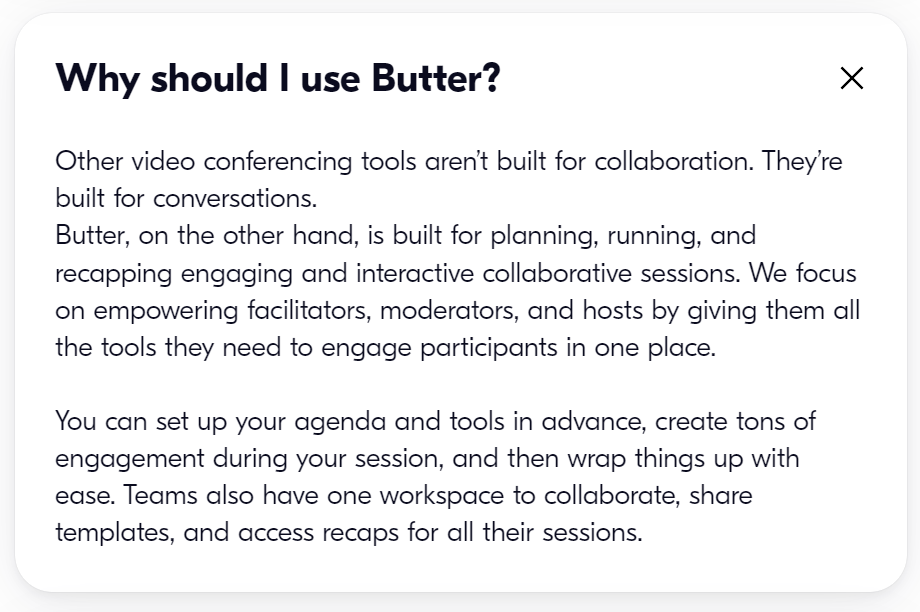
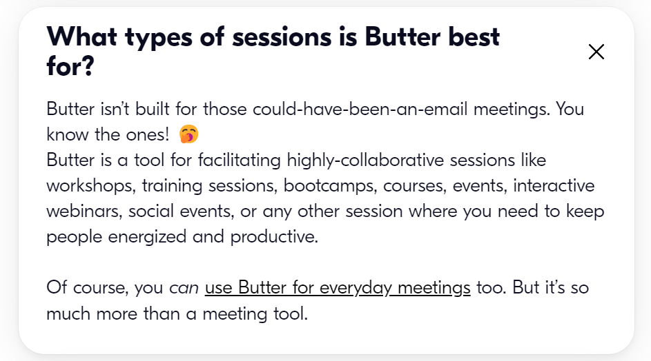
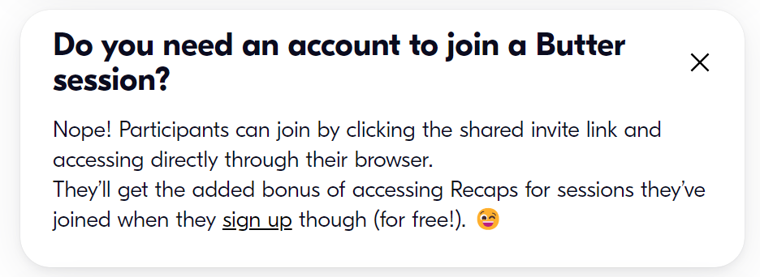

- Butter
  collapsed:: true
	- Tại sao dùng butter
		- Collaborating effectively {{cloze chưa tìm được từ tiếng anh hợp làm tiêu đề}}
			- Structure
			  collapsed:: true
				- Plan
					- run themselves
						- time-boxed agenda
						- pre-loaded tools
						- a reusable team library
					-
			- Energy and Joy
			  collapsed:: true
				- emoji reactions
				- sound effects
				- hand-raise queue
				- polls
				- flashcards
				- music
				- GIFs
			- Help to focus and no juggling
			  collapsed:: true
				- Integrations
					- Access polls
					- flashcards
					- videos
					- music
					- Miro
					- MURAL
					- Google Docs
				- One workspace for all
					- create rooms
					- share templates
					- access recaps
			- Recap
			  collapsed:: true
				- one dashboard
					- recordings
					- personal notes
					- chat logs
					- poll results
			- Templates {{cloze butter làm sẵn để mình "steal" vào library}}
			  collapsed:: true
				- agenda
				- activity
				- tool
		- So sánh với các app khác {{cloze sẽ biết được hiệu quả đến đâu, có như quảng cáo không}}
			- Vibe
				- Butter focus on tương tác và trẻ trung lí thú {{cloze đúng là hợp community, chị Fuong chọn tone sur tone đó}}
					- {:height 333, :width 487}
					- {:height 389, :width 495}
					- {:height 221, :width 500}
				- Teams mang lại không gian làm việc chuyên nghiệp
				- Zoom tạo cảm giác meeting truyền thống là nghe và xem
				- Google Meet thì rất formal và nhanh setup
				- Discord daily meeting khá tốt cho game và meeting chơi
				- Messenger tiện nhất vì người ta hay tương tác bằng mes kèm nhắn tin
	- Butter dùng cho
		- meetings
		- workshops
		- traning sessions
	- Câu hỏi giao lưu
	  collapsed:: true
		- Butter's suggestion {{cloze nghe tiếng anh sang hơn}}
			- Which super power would you want to have?
				- Poll
					- X-ray vision
					- Superman super strength
					- Teleportation
			- Tại sao những câu này hay nhỉ?
				- Người trả lời {{cloze thứ tự trên dưới là theo quy trình tiếp nhận thông tin}}
					- cũng ít nghĩ nên sẽ thấy thú
				- Người nghe
					- vì nó là những câu hỏi về cá nhân nhưng không quá tọc mạch
					- ít ai hỏi nên sẽ tạo được yếu tố bất ngờ
		- Để làm gì? Tại sao cần câu hỏi đó
			- break the ice {{cloze thứ tự trên dưới là khả năng cao hơn}}
			- biết thêm?
	- App trên quảng cáo Butter
	  collapsed:: true
		- webflow
		- Spryker
		- On Deck
		- NIVEA
		- miro
		- HYPER ISLAND
		- GONG
		- FARFETCH
		- EY
		- Canva
		- DreamWorks
		- accenture
		- pwc
		- PCEO
		-
		-
- Một lần nữa xem lại No Game No Life Zero
  collapsed:: true
	- giờ xem ảnh cũng không quá quan trọng bằng dịch chuẩn hoặc dịch hay, không chỉ không tối nghĩa mà rõ và thể hiện được chiều sâu câu nói
		- "Chỉ cần tưởng tượng thắng được thứ bất diệt"
			- tôi: tưởng tượng các bước thắng và tưởng tượng ngày thắng để có động lực
		- "Đấy không phải là chiến thắng"
			- Khi ai đó phải bỏ mạng nó cũng không phải hòa. Chẳng biết nó là gì nữa. Thắng với ai và thua với ai. Cũng là có chút thắng mà nhỉ. Vấn đề tư tưởng luôn nan giải. Trả lời được thì sẽ có động lực để làm tiếp, không thì phải cố và trăn trở thôi.
				- Vì tương lai?
	- Riku thao túng kiểu gì mà Schwi thắng những vẫn theo?
		- nghe giống những thao túng tình cảm của tôi với Thảo nhỉ
			- dù sao hai đứa cũng khá khớp hai nhân vật
		- riku nhận ra gì, tự dưng áp cái ý chí thắng cờ và đổi từ sinh tồn ra chinh phục thế giới sao
			- sinh tồn có thể là sống tách, sống chui lủi, sống riêng
				- giống tôi từng cố sống tách và tránh xa thế giới thực?
	- Phán đoán về cách làm ra bộ phim: Bộ phim kết hợp robot biết yêu, điển hình nghệ thuật mang tên trái tim là cảm xúc con người rồi còn bao nhiêu ý tưởng nữa cho việc nhân vật biết đau khổ,... (khi chưa xem hết phim)
		- cứ như liệt kê hết các tiêu chí, đặc điểm trong các hệ cấu trúc ra và muốn nhồi vào phim thì mới làm được ý chứ chẳng thể nào có một ý to nào bao phủ rồi mấy tính chất của nhân vật và phim (cả hình ảnh lúc đầu đẹp chết chóc rồi thành màu đẹp tình yêu) được nghĩ ra theo mạch suy nghĩ, phát triển cái hạt mầm ban đầu của một ý tưởng nhỏ bé được.
		- nhưng cái nhiệt huyết, mạch cảm xúc trong phim là theo một đường thẳng tuyến tính
			- nó không phải một câu hỏi như anh Long hay giải và chỉ việc lắp kiến thức vào sao cho vừa hoặc thật độc đáo
			- tôi cũng từng lắp nên bài Nhà văn là kẻ hào phóng
			- nhưng bài đó phải có mạch cảm xúc chảy từ rất lâu chứ không chỉ nhất thời cháy lên
	- Nhật có một từ rất hay là kiseki
	- Thao túng thuyết xác suất
		- mà xác suất vụ này là bao nhiêu
		- tôi đã chuyển trông chờ vào người - gái lớp thành trông chờ vào một thành quả chưa - thế giới mới
			- sau này thành trông chờ ở mình tôi à?
	- Có bản đẹp thì dịch như cứt - lý do mình nên tự dịch
		- "dù còn trinh thì liên quan gì đến đi quá trớn"
			- không còn trinh mới dám nghĩ đến kết hôn à
		- bản dịch khác ghi là trai tân thì còn giải thích được bằng sự ảo tưởng của thằng con trai
	- "Dù nghĩ theo hướng nào thì cũng thấy điều này là vô lý"
		- có bao nhiêu hướng nghĩ nhỉ, nếu tìm ra được hết thì mình sẽ hiểu được cái nỗi niềm lúc đó của Schwi
		- còn làm sao hiểu được Riku
			- không tò mò, không nghĩ, đừng cố nghĩ sẽ đi chệch cảm xúc của lúc đó
				- mà sự không nghĩ này là của ai? của cả Riku và người xem hay chỉ của người xem, còn Riku sẽ mơ tưởng đến tương lai đẹp hoặc chỉ đơn thuần lặng ngắm người yêu, tình trong tim đã thắm nồng tự sẵn?
					- mà không phân tích thì không tả được cái hay?
						- chắc chỉ còn cách cảm đã, để từng băn khoăn nảy nở ở trong lòng
							- rồi còn đâu sau này sẽ xem lại phân tích dựa trên những nảy nở trong tốc kí sau
								- sau này tức nên là sớm
	- Có những topic nào lớn ở trong này để nói về như là mấy buổi câu lạc bộ điện ảnh KHXHNV hay làm nhỉ
		- chắc phải nói mấy ý loáng thoáng, đào mà chưa sâu kia để rồi trao đổi tranh luận mới ra thêm vấn đề
		- bản chất cái talkshow góc nhìn chiến tranh cũng là thế
		- có vài ý, rồi đi nghe ngóng, đi trao đổi tranh luận
		- thế là ra một buổi nói chuyện rồi
		- vẫn phải bồi thêm câu đúng là kỳ tích vì chủ đề lần đó hay và rộng, hẹp mà có ngách để kết nối mọi nẻo đường và mọi con người với những hứng thú quan tâm khác nhau
	- Sau khi xem xong
		- tôi không nhớ xưa mình đã đau khổ ra sao khi nhìn hai con người đó chết đi
		- thứ tôi thấy trước mắt không phải hai lãnh đạo tài chết cho lí tưởng của họ
			- kì thực Riku hiểu chuyện nhưng không chìm vào trong những câu hỏi triết học của Schwi
			- cách anh ấy trả lời như cách bao người không hứng thú với việc đi sâu lý giải những điều đó trả lời
			- nhưng thôi đừng so sánh bới móc tìm đồng loại như vậy mày sẽ làm mất đi những giá trị bộ phim và thấy đây không phải một bộ dành cho mày
			- bởi nó giống việc một con ngu bị tình cảm mê muội mà quên con đường mình phải đi
			- vì nó như kiểu một kẻ muốn bóc tách thế giới như mày lại rơi vào tình ái
			- ồ, lạ thay, chẳng phải mày đó sao
		- mà hình như là những cái đẹp phải tan biến
		- và trước lúc tàn phai nó đã chống chọi rất quyết liệt
- Agenda
	- break the ice
		- thời gian qua sau khi chia tay mái trường thi có gì mới
		- nghĩ lại về 3 năm cấp ba và đánh giá
			- về học tập
			- bạn bè
			- môi trường
			- cảm xúc
			- sự trưởng thành
		- bắt đầu buổi thuyết trình về dự án bản thân
			- tao thấy 3 năm qua cũng đẹp
- Ý tưởng thêm
	- sau này mình có thể làm một trang notion về buổi đó gồm các poll, đính kèm video recap nhưng có cắt
		- video thì chắc sẽ quay bằng điện thoại vì quay bằng máy tính sẽ ảnh hưởng đến performance
		- và video sẽ cắt để giải thích những phần chính lại cho những đứa không xem
		- còn toàn bộ, ai thích nghe thì nghe
			- cũng có thể tôi cân nhắc edit những đoạn hay
		- giống edit video chơi game hả {{cloze mệt đấy. ừm }}
		- kèm cả video hướng dẫn bọn nó dùng trang đó và bảo tao dùng tạm cái cấu trúc này vì chưa có thời gian nghĩ cấu trúc {{cloze chết tiệt, lại chưa có thời gian}}
			- {{cloze cũng chẳng biết làm sao, chẳng lẽ cầu xin bọn nó mà không đề ra cách, hay đưa bọn nó làm hộ, bọn nó làm được không, mày tính đi, hay mày định tạo ra cái tổ chức này để giúp bọn nó nửa chừng rồi bỏ rời bọn nó, nhưng không thì tôi sẽ bỏ rơi mình và thế tức bỏ tất cả nếu không ai dẫn dắt tôi đi tiếp...}}
- Lời thoại
	- You know me
	- For the past 3 years I have made bull-shit things for fun, for some romantic moment
	- The way i randomly come up with new ideas is still the same
	- but this may not
		- có lẽ nó hùng tráng hơn thì may ra
	- i wish it was
		- nhưng mà sự lãng mạn chỉ có trong những cảm hứng, đôi lúc là tráng ca
		- không thì thường bi sầu lắm, nhất là lúc làm
-