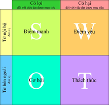

# Theories & Concepts
	- ## Market Analysis
		- Micro: domestic
		- Macro: global
		- ### Purpose
			- Vì phải hướng đến thị trường
		- ### Framework
			- SWOT
				- 
				- Opportunities
					- cách xác định là nắm được xu hướng thị trường, nó ảnh hưởng thế nào đến con người
					- một số thứ nổi trên thế giới thì sau một thời gian sẽ đi về Việt Nam
				- Challenges
					- cách xác định là đi phân tích đối thủ của mình
					- đối thủ mình có mà mình chưa có thì có thể học từ nó
			- PESTEL (bản hoàn chỉnh của SWOT)
			- P&L
			- ROI
		- STDP
		  collapsed:: true
			- làm lại thương hiệu
			- Segmentation
			- Target
			- Differentation
				- ví dụ
					- Viettel "Nói theo cách của bạn"
						- làm viễn thông
						- thoải mái nói
						- bảo mật tốt
			- Positioning
		- Trạng thái thị trường
			- Monopoly
			- Ologipoly
			- Market
- # Sharing & Question
	- Cách kiếm tiền của chị Aki
		- Không chen vào những brand lớn
			- cạnh tranh nhiều
				- chị Aki mệt, lười
				- "lắm cá thì con cá nào béo lên được"
			- khó có cơ hội chuyển mình
				- bạn chị Aki phải đi in và xem người khác làm cả tháng
		- Đi start up tuy không có job lớn, chuyên nghiệp nhưng người ta có tinh thần cải thiện, mình được thực chiến
			- cũng dễ được trọng dụng
	- Điều kiện nhận việc của chị Aki
		- Sản phẩm phải có chất lượng tốt
		- Khách phải hiểu những gì chị làm (tin tưởng)
	- Cách khảo sát của chị Aki
		- Nói chuyện với nhiều người
		- Đi đường thì quan sát, lưu trong đầu, khi nào cần mọi thứ tự nhảy ra
	- Tư tưởng làm việc của chị Aki
		- Cái để thu hút được khách hàng là uy tín
	- Có module trong học về event là cách làm bảng báo giá
	- Tính cá nhân hóa
	  collapsed:: true
		- Ai cũng thích một sự kiện ấn tượng về mặt nội dung, cảm xúc, đặc biệt là ở những thứ chỉ một lần trong đời
	- Ai giỏi cái gì chỉ nên làm cái đó
	  collapsed:: true
		- Agency
			- sáng tạo
			- kết nối khách hàng với vender
		- Account
			- nói chuyện với khách hàng
			- truyền thông tin tới tất cả các bộ phận còn lại
			- => vị trí có thể học lỏm được nhiều nhất
		- Wedding Planner
			- lo từ A -> Z
	- Thái độ đi làm thực tập
	  collapsed:: true
		- Không gì là không biết, chỉ là chưa học thôi
			- Dù chưa có kinh nghiệm nhiều, làm có thể chưa đủ tốt nhưng phải biết
	- Ở các công ty làm event họ chấm rồi thăng chức như nào?
		- Event thành công thì sẽ có buổi review lại
		- Người ta chấm theo quá trình
	- Đi làm thì nên để ý kĩ mọi người để học hỏi
	- Làm sao biết được phân tích của mình đúng hay sai
		- Không biết
		- Dựa trên số đông thôi
		- Luôn đón nhận ý kiến khác góp ý
	- Tư duy sáng tạo nên là cởi mở, tận dụng những cái sẵn có và cứ thế phát triển lên
		- không nên gắn mãi với tư tưởng nếu sao chép là đạo nhái, mà nó là cách học
- # Cấu trúc
	- ## Mẫu
		- [Smartcom-IMC-brief-template-VN.docx](../assets/Smartcom-IMC-brief-template-VN_1700229372083_0.docx)
	- ## Bài làm
		- [Bai cua Phong SWOT.docx](../assets/Bai_cua_Phong_SWOT_1700229365619_0.docx)
	- ## Bài chữa
		- [Bai-cua-Phong-SWOT-fixed.docx](../assets/Bai-cua-Phong-SWOT-fixed_1700229350142_0.docx)
		- ### Mục đích
			- Bổ sung việc đứng cạnh nhau thì khách hàng có thể so sánh giá
- # Chú ý
	- Phải giải thích kĩ, không tư duy nhảy bước
		- vì 10 người đọc có thể diễn giải theo 10 ý
		- viết chi tiết ra cũng là một ý để tư duy dựa trên mà nghĩ ra ý khác
			- dựa trên câu hỏi tại sao hoặc bộ câu hỏi 5W1H
		-
- # Video
	- {{video https://youtu.be/rZgrjj8Moz0}}
-