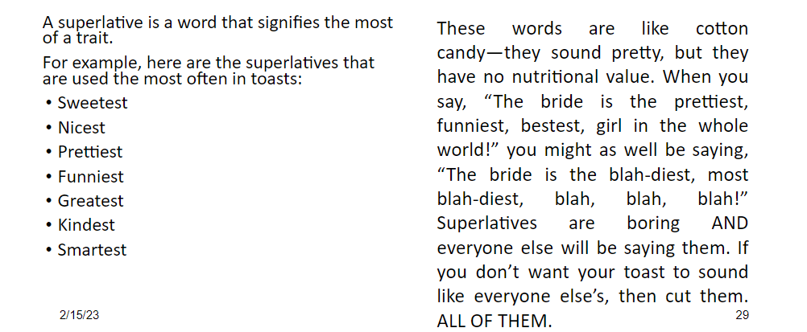

title:: ULISS/Sem2/Public Speaking/Week 5/Toast Speech
meta:: Week 5-Toasts.pptx

- ## Mindset
  collapsed:: true
	- ### A Toast
	  collapsed:: true
		- a kind of brief tribute to a particular person or a specific event
		- designed to appreciate and congratulate the people being toasted
		- allows the speaker to recognize the person’s achievements
		- give the best wishes for the future
	- ### Speaker Goal
		- make that person feel special and to allow others in the room to be included in the celebration.
	- ### Key points
		- Keep it brief and specific to the event.
		- Focus attention on the person being toasted
		- Avoid any inside joke which is not accessible to all of the audience as toasts are public.
		- End the toast by praising the person being toasted
- ## Structure
  collapsed:: true
	- The trio
		- Identification
		  collapsed:: true
			- When thinking about your toast, don’t just think about the person you are toasting but about everyone in the room and think about how to bring them into your speech.  Saying “we” are here to honor the recipient and reminding the audience of shared values helps the audience to be a part of the process.  Say things that invite the audience in several times throughout the speech.
			- Wedding Toast
			  collapsed:: true
				- Instead of saying
					- Amy and I played Barbie as children and always made sure that Barbie found her perfect soulmate.
				- Say
					- As many of you know, Amy and I played Barbie for hours as children.  What you may not know is we always made sure that Barbie found her perfect soulmate.
			- Graduation Toast
			  collapsed:: true
				- Instead of saying
					- I wish you the best in your journey ahead as you graduate and start your new career.
				- Say
					- We here, your family and friends, all wish you the best in your journey ahead as you graduate and start your new career
		- Narration
		  collapsed:: true
			-
			- The use of story ***helps the audience to be drawn*** in and want to listen.
			- In short toasts, you can tell a series of one-sentence stories.
			- In larger toasts, you can tell one long story or numerous little stories. Tell your story in a way that the audience relives the moment with you.
		- Magnification
		  collapsed:: true
			- Take a trait of the individual and magnify it.
				- not superfluous embellishment but **honest elaboration**
			- Example:
				- Triumph over obstacles
				- Unusual accomplishment
				- Superior performance
				- Unselfish motive
				- Benefit to society
				- The greatness of a simple thing
- ## Type
  collapsed:: true
	- Graduation Toast - Patterns
		- Looking back, looking ahead
			- Tell a few stories about them before graduation and tell what you expect to see in the future.
		- We’ve come through a lot together, Here’s some advice for your next step
			- Tell stories of your relationship, how that relationship talks about character attributes that led them to graduate.
			- Give advice on how to navigate the next step
		- Let Us Not Forget
			- A series of memories that you and most of the group present share (Great for a group of friends)
			- Find some great meaning to it all. What did it all mean? what did you learn?
- ## Technique
  collapsed:: true
	- The Hook
		- People decide if they like your toast within the first seven seconds. If you don’t hook your audience immediately, you will lose them.
		- The hook is a one- to three-line description of the toastee.
			- It should be
				- juicy
				- funny
				- mysterious.
		- The biggest mistakes:
			- Starting with “I,” “me” or “my.”
			- I have known ___ for 5 years…
			- My name is ___.
			- Me and ___ met back in college.
		- Recommended first line of speech:
			- Spencer is ____.
			- Tonight you will learn why Spencer ____.
			- The best story I have about Spencer starts with ____.
		- Examples:
			- Spencer is the person you call when you have locked yourself out of your dorm bathroom without clothes. Not only will she bring you a towel and a spare key, she also will keep your secret until you spill it at her wedding.
			- Tonight you will learn why Spencer always was called “Mini-Mom.” She carries snacks in her purse, has a first aid kit on hand at all times, and is extremely good at letting you know when you broke a rule.
			- The best story I have about Spencer starts with an outdoor toilet. I knew we would be bestfriends when she was the only person waiting in line at the concert Porta Potties who would give me some of her extra toilet paper. THAT is the definition of true sharing—Mrs. Jones you taught her well.
	- The Background
		- | **DOs** | **DON’Ts** |
		  | Punch up the context  | Waste the opportunity for a good joke |
		  | Keep it short | Skim over the delicious details |
		  | Cue up a story to come later | Make it sound like everyone else’s |
		- Example
			- ~~“I met the groom as a freshman in college, and we were roommates for three years.” Or, “I’m the maid of honor and the bride’s little sister.”~~
			- **🡪** **The groom was the first friendly face I saw during freshman orientation at A University. Little did we know that we would end up rooming together for the next three years.**
	- The Clink
		- After your final story and your last audience tie-in, it’s time for the clink.
			- This is the part of the speech where you can get sappy.
		- It’s your opportunity to offer well wishes, thanks, and gratitude toward the toastee and anyone else in the room, especially
			- Thank the hosts.
			- Offer good wishes or congratulations.
			- Bring in the audience to make those thanks and wishes with you.
	- ### Other notes
		- 