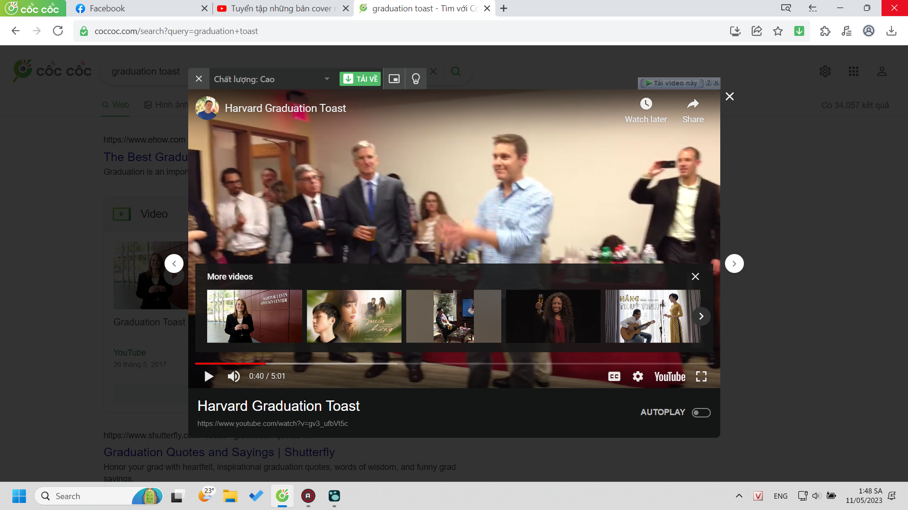
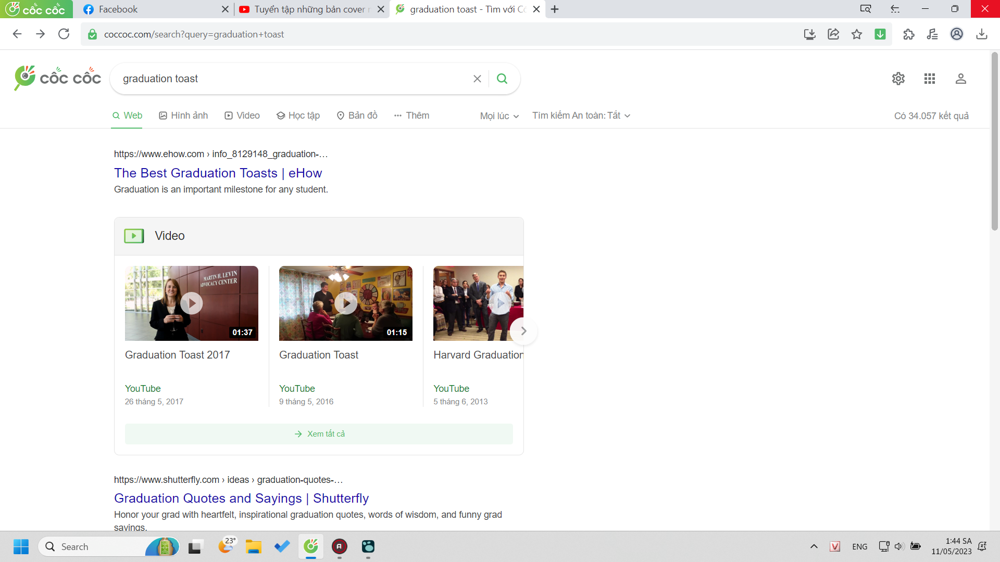
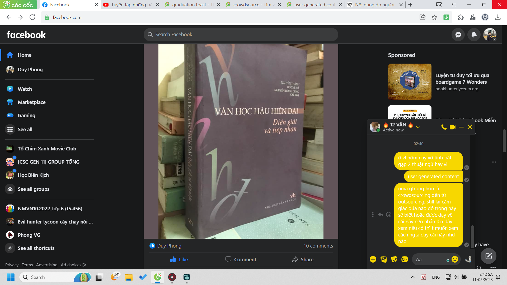

title:: ULISS/Sem2/Public Speaking/Week 5/Toast

- {{cloze cái / này hay ghê, mình bổ sung ULIS_Subjects mà nó tự thêm cho mình luôn, vậy mới nhận ra mình đã không tính trước cho tất cả, cho sự học cả đời. Để ULISS chắc hay hơn, sau này chúng ta xem lại sẽ có CVAS chẳng hạn. Yeah kí hiệu chung, mà các cái kí hiệu này cũng chưa tối ưu quá là vì thế, may là chỉnh sửa dễ dàng được, tìm lại để chỉnh cũng không phải quá khó}}
- 01:39 bây giờ mới xem graduation toast sau khi đọc truyện, lười quá chắc tí đi ngủ. nhưng thật xấu hổ khi mình viết một bài xả stress về sự học, đáng ra phải thúc mình học hơn chứ chẳng phải viết xong bỏ đó chấp nhận như thể là mình không muốn học nữa, chỉ muốn chơi mà vẫn giỏi... không, nó không phải chấp nhận thất bại để cho phép mình dừng lại
- Dù sao mình cũng có vài tưởng tượng trong đầu như một khả năng, thiên chức cho phép mình sáng tạo tự động rồi chứ không phải ngồi vào làm theo cái mô hình rồi vật lộn nghĩ ra. mình tin ý tưởng đầu luôn tốt hơn cái sự cố gắng, kể cả sau này có cố rèn dũa đến mấy. kì lạ, nó là thiên chức của nghệ sĩ đấy, cảm hứng là mạnh nhất
- Nên dù sao nay cũng chỉ ngồi tìm xem trên mạng có gì, không phải là để tham khảo học hỏi bắt chước mà để biết người ta đã có gì mà tổng hợp, cấu trúc nên một cái tốt hơn cả người ta. Tự nghĩ không có bàn đạp thì phần trên đúng, còn nếu đã có thứ để đạp lên thì tư duy lại hay hơn cảm xúc với bản năng, dù xét riêng lẻ kết hợp cả hai tốt nhất, vì tư duy chỉ giúp sắp xếp hệ thống và cung cấp mục đích cho sản phẩm thôi. Cái mục đích của cảm xúc đôi khi đơn giản mơ hồ hơn: hay, chứ nó không để làm hại ai hay gì cả
  collapsed:: true
	- Chợt nhìn thấy cái này mang một vibe khác hẳn, mấy cái toast phần recommendation và cả cái web ghi the best...
		- 
	- mình nghĩ nếu xem đủ nhiều có thể tự tổng hợp nên một danh sách những gì tốt nhất, chia thể loại như chia bảng ra và vẫn có thể có bảng xếp hạng chung (phân tích rõ đặc trưng của từng loại, từng cái)
- ---
- ### Sources
	- 
		- Đúng là của bọn nước ngoài bọn nó làm tốt thật, có lẽ thể loại này từ bọn nó mà ra cái việc mình dùng tiếng Anh nghe nó trang trọng và giàu cảm xúc hơn trong cái thể loại này... trong đầu mình đọc tiếng Anh với giọng trầm ấm. Lần này thử tìm trên này xem thế nào
		- Bọn nó nói cũng tốt, khả năng huy động từ ngữ bọn nó khả đỉnh, nói rất trơn. Không phải chủ động mò từ như mò từ một bể ngôn ngữ khác mà chỉ cần tìm cách diễn đạt ý mình sao cho hay, rồi biểu đạt nó ra sao bằng stress các thứ. Đầu tự đọc cho nói hoặc nghĩ đến cái gì là nó tự bật ra. Con người như cái máy ở chỗ đó. Còn muốn kiểm soát nó và biến tấu tốt hơn thì bạn trở thành nhà văn nhà thơ, nghệ sĩ ngôn từ,... thậm chí ca sĩ? không. Nhạc sĩ thì may ra
	- {{video https://www.youtube.com/watch?v=-9CzMBoXlWc}}
	- {{video https://youtu.be/gv3_ufbVt5c}}
	  collapsed:: true
		- cái video này nhảm vl nhưng thôi cũng là của harvard, cũng sáng tạo và nhiều kiến thức
		  collapsed:: true
			- [Crowdsourcing](https://en.wikipedia.org/wiki/Crowdsourcing)
			  collapsed:: true
				- Một gợi ý hay: thay vì một máy chủ chạy mọi lệnh theo thứ tự thật nhanh, chi bằng có nhiều máy được lập trình như nhiều nhân cách tranh cãi nhau, tất nhiên phải kiểm soát và đo xem có cái nào liên tục thống trị hay có năng suất cao hơn không (trường hợp mọi máy thiết kế khác tư duy nhưng cùng trình, còn nếu thêm cả mấy thằng ngu vào cũng hay, mình có khi vỡ ra giá trị của nó)
					- bọn nó đối thoại phủ nhận nhau như cách thường xuyên lấy ví dụ, tổng hợp kiến thức, ta xây nó như người với những góc nhìn, hệ tư tưởng để nó tự chạy như phát triển tư duy, kiểu cái máy tự động biết chơi cờ.
				- Và các mô hình của mình cần nhiều nhân lực ngoài làm cùng cũng như cần data từ họ nữa. Mình tin họ sẽ cho... giờ có niềm tin hơn
			- Mà đấy mới chỉ là cái mình nghĩ nó có giá trị thôi, bọn harvard nói cách đó tức chúng được học về cách tận dụng nguồn lực, lợi hại của nó rồi. Tra cũng được nhưng cứ hỏi bạn mình xem bọn nó được dạy như nào, tìm hiểu hướng tiếp cận và tận dụng của người khác cũng hay
			  collapsed:: true
				- 
				- thực ra nghĩ lại nó đã được dùng khắp mọi nơi, blog hay kênh trao đổi thông tin thuộc sở hữu chính một tổ chức nào đó hoặc không nhưng hoạt động vì mục đích gì đó đều thế
					- nó là một cách nhìn khác của hội nhóm, và Việt Nam từng dùng: cái chiêu trò nhân dân ấy
		- Nhại theo bọn nó có lẽ là một cách học cực đỉnh mà mình đã quên hơn là tìm cách sửa phát âm từng từ rồi từ đọc nghĩ tự chỉnh và sử dụng sao cho mình thấy nhuần nhuyễn chính xác nhất. Kì lạ là vẫn không tự nhiên hay mang chất ngôn ngữ anh như người ta. Cách nói tiếng Anh thực sự :))
		  collapsed:: true
			- mình vừa chơi vừa nghe vừa nhại theo sao cho cảm giác giống nhất đã, sau này đau đầu record lại chỉnh âm thực của mình sau
				- ngại và lười record luôn, implement kiểu này cũng hay
				- nhưng ngoài tưởng tượng có lẽ mình cũng nên tập duyệt
		- trong lúc đó có thể call nói chuyện với ai, bình luận và nghĩ và nói ra để nghĩ thêm về điều mình học
			- một lần sắp xếp từ là bao nhiêu thứ tự dưng vỡ ra nhờ sự gợi ý của từ ngữ
		- xem xong thì cũng thấy meaningful, rất có nội dung và nội dung muốn được truyền tải được minh họa rõ, lật đi lật lại vấn đề để đa dạng thêm sâu - dù mình chưa nắm được mạch lắm, 2p30 đầu tiên chỉ đề establish a context? well cũng được nhưng nó rất lí tưởng, cái context đó. Kì lạ sao ta biết nó lí tưởng, như utopia chứ không phải ảo không nên làm và ta biết không được. Sao ta biết nó hay nó tốt và khó thực hiện. Định kiến nào trong ta?
		- Cách người ta nói nhanh âm mà không bị sai như path nó là th chứ đừng đọc là s, và constellation không đọc e mà ơ vì thế nó mới trôi
	- {{video https://www.youtube.com/watch?v=F0iclm2Gdqw}}
	- {{video https://www.youtube.com/watch?v=GHxCScOdKxs}}